# Inventarisasi Gambar & Kumpulan Kode Mermaid
## Rekayasa Fitur Modern: Representasi Data untuk Machine Learning dan Deep Learning

Dokumen ini berisi analisis statistik, inventarisasi lengkap, dan kumpulan kode **Mermaid** untuk seluruh gambar (figure) yang didefinisikan di dalam draf naskah buku (Bab 1 sampai Bab 17). 

---

## Bagian I: Statistik Representasi Gambar Buku

Berdasarkan hasil pemindaian langsung terhadap 17 bab naskah utama, ditemukan total **116 penanda gambar (`[GAMBAR ... ]`)** yang tersebar di seluruh bab. 

### 1. Ringkasan Statistik Utama
- **Total Penanda Gambar di Buku:** 116 gambar
- **Rata-rata Gambar per Bab:** ~6.82 gambar
- **Klasifikasi Tipe Gambar:**
  - **Diagram Konseptual, Skema, & Arsitektur Blok:** 56 gambar (48.3%) — *Sangat ideal untuk direpresentasikan menggunakan Mermaid.*
  - **Diagram Alur, Pipeline, & Aliran Data:** 36 gambar (31.0%) — *Sangat ideal untuk direpresentasikan menggunakan Mermaid.*
  - **Plot Data, Distribusi, Kurva, & Grafik Teknis:** 24 gambar (20.7%) — *Dihasilkan secara dinamis lewat kode Python (Matplotlib/Seaborn) di Track 2.*

### 2. Tabel Sebaran Gambar per Bab

| Bab | Judul Bab | Jumlah Gambar | Jenis Diagram (Mayoritas) |
| :--- | :--- | :---: | :--- |
| **Bab 1** | Dari Data Mentah ke Representasi Model | 8 | Diagram Alur & Konseptual |
| **Bab 2** | Pipeline, Validasi, dan Data Leakage | 7 | Diagram Alur & Skema Validasi |
| **Bab 3** | Representasi Fitur Numerik | 7 | Plot Distribusi & Skema Scaling |
| **Bab 4** | Representasi Fitur Kategorikal | 8 | Diagram Alur & Matriks |
| **Bab 5** | Missing Values & Outlier (Berbasis Pipeline) | 8 | Diagram Alur & Skema Konseptual |
| **Bab 6** | Pembentukan Fitur Turunan | 8 | Skema & Diagram Konseptual |
| **Bab 7** | Seleksi Fitur | 6 | Skema Alur & Plot Shrinkage |
| **Bab 8** | Reduksi Dimensi & Representasi Laten | 7 | Arsitektur Blok & Plot Laten |
| **Bab 9** | Evaluasi Kualitas Fitur | 8 | Diagram Radar, Batang, & Scatter |
| **Bab 10** | Deret Waktu & Data Sensor | 7 | Diagram Konseptual & Linimasa |
| **Bab 11** | Teks & Dokumen | 5 | Diagram Konseptual & Arsitektur |
| **Bab 12** | Citra & Audio | 6 | Arsitektur CNN, Spektrogram, & HOG |
| **Bab 13** | Data Spasial & Graf | 9 | Diagram Spasial & Skema Graf |
| **Bab 14** | Data Multimodal | 7 | Skema Fusion & Arsitektur Loss |
| **Bab 15** | Representasi Terlatih & Pretrained Model | 8 | Spektrum Adaptasi & Arsitektur |
| **Bab 16** | Rekayasa Fitur Otomatis & Kolaborasi AI | 5 | Skema Pohon Relasi & Diagram Alur |
| **Bab 17** | Sintesis: Merancang Pipeline | 7 | Monitoring Drift & Arsitektur Store |
| **Total** | **Seluruh Buku** | **116** | **Representasi Komprehensif** |

---

### 3. Daftar Inventaris Lengkap Gambar per Bab (116 Gambar)

Berikut adalah daftar lengkap seluruh gambar yang dideklarasikan di dalam naskah beserta judul, tipe, dan deskripsinya:

#### Bab 1: Dari Data Mentah ke Representasi Model (8 Gambar)
1. **[GAMBAR 1.1]** Diagram Alur - Hirarki transformasi dari Data Mentah -> Atribut -> Fitur -> Representasi Matriks
2. **[GAMBAR 1.2]** Diagram Konseptual - Perbandingan arsitektur jaringan saraf tiruan kompleks pada data mentah vs model linear sederhana pada fitur yang direkayasa
3. **[GAMBAR 1.3]** Diagram Konseptual - Spektrum representasi dari fitur rancangan manusia hingga representasi yang dipelajari mesin, dengan kolaborasi di tengah
4. **[GAMBAR 1.4]** Diagram - Skema perbandingan alur kerja rekayasa fitur manual dengan *feature learning* pada arsitektur *deep learning*
5. **[GAMBAR 1.5]** Skema - Linimasa pembentukan sampel (lookback, index time, horizon prediksi, dan batas cutoff)
6. **[GAMBAR 1.6]** Skema - Peta hierarki representasi data (tabular, sekuens, tensor citra, struktur graf, multimodal)
7. **[GAMBAR 1.7]** Skema - Diagram alir data mentah menuju representasi akhir (peta Bagian II hingga Bagian V)
8. **[GAMBAR 1.8]** Diagram Konseptual - Peta jalan struktur buku dari log transaksi mentah melewati transformasi tabular dan seleksi hingga pipeline ML

#### Bab 2: Pipeline, Validasi, dan Data Leakage (7 Gambar)
9. **[GAMBAR 2.1]** Ilustrasi - Tabel ke Matriks Fitur pada proses fit dan transform dalam lingkungan pelatihan dan inferensi
10. **[GAMBAR 2.2]** Diagram Alur - Siklus eksplorasi-ekstraksi-seleksi yang dibungkus dalam objek transformer mandiri
11. **[GAMBAR 2.3]** Skema - Mekanisme data leakage yang menunjukkan masuknya informasi pengujian ke dalam fase pelatihan model
12. **[GAMBAR 2.4]** Skema - Mekanisme data leakage akibat transformasi agregasi sebelum pemisahan dataset
13. **[GAMBAR 2.5]** Diagram Konseptual - Perbandingan strategi pemisahan data: Random, Group, dan Temporal Split
14. **[GAMBAR 2.6]** Skema - Aliran data pada cross-validation: pendekatan keliru (transformasi global) vs pendekatan benar (transformasi terisolasi per fold)
15. **[GAMBAR 2.7]** Skema - Ilustrasi data leakage akibat imputasi global sebelum pemisahan data dibandingkan dengan pipeline tertutup

#### Bab 3: Representasi Fitur Numerik (7 Gambar)
16. **[GAMBAR 3.1]** Plot Distribusi - Perbandingan kurva normal yang simetris sempurna vs kurva menceng akibat sekelompok observasi ekstrem
17. **[GAMBAR 3.2]** Skema - Perbandingan distribusi nilai menggunakan metode Skala Min-Max dan Standardisasi
18. **[GAMBAR 3.3]** Plot Data - Efek clipping/winsorization (sebelum dan sesudah) pada distribusi dengan outlier ekstrem
19. **[GAMBAR 3.4]** Plot Data - Q-Q plot efek transformasi Box-Cox pada data harga yang menceng
20. **[GAMBAR 3.5]** Histogram - Perbandingan distribusi data umur kontinu sebelum dan sesudah dipetakan menjadi kelompok interval diskrit
21. **[GAMBAR 3.6]** Skema - Skema scaling (MinMax vs Standard) yang menormalkan rentang angka antar dimensi fitur
22. **[GAMBAR 3.7]** Plot Data - Grafik batang akurasi k-NN dan SVM pasca-standardisasi, sementara performa Random Forest tetap statis

#### Bab 4: Representasi Fitur Kategorikal (8 Gambar)
23. **[GAMBAR 4.1]** Diagram - Dampak kardinalitas tinggi pada percabangan dan overfitting model pohon
24. **[GAMBAR 4.2]** Matriks - Transformasi lajur tunggal nominal menjadi matriks fitur One-Hot Encoding
25. **[GAMBAR 4.3]** Diagram Transformasi - Pemetaan label teks pada count encoding menjadi nilai numerik berdasarkan jumlah observasi
26. **[GAMBAR 4.4]** Diagram Alur - Skema validasi silang (cross-fitting) dalam komputasi agregat target encoding untuk mencegah kebocoran data uji
27. **[GAMBAR 4.5]** Diagram Konseptual - Mekanisme hashing trick dan terjadinya hash collision saat dua teks kategori dipetakan ke indeks yang sama
28. **[GAMBAR 4.6]** Diagram Konseptual - Proses pemetaan indeks kategori berformat one-hot menjadi vektor kontinu berdimensi rendah via lapisan embedding
29. **[GAMBAR 4.7]** Diagram Alur - Mekanisme pipeline menangani kategori belum terlihat melalui pengelompokan proaktif dan nilai fallback saat inference
30. **[GAMBAR 4.8]** Plot Data - Perbandingan akurasi prediktif dan memori antara One-Hot, Hashing, dan Target Encoding pada fitur berkardinalitas tinggi

#### Bab 5: Missing Values & Outlier (Berbasis Pipeline) (8 Gambar)
31. **[GAMBAR 5.1]** Diagram Konseptual - Perbandingan pola hilangnya data pada mekanisme MCAR, MAR, dan MNAR
32. **[GAMBAR 5.2]** Diagram Alur - Perbandingan imputasi data utuh (rentan kebocoran) vs imputasi di dalam pipeline (aman)
33. **[GAMBAR 5.3]** Diagram Alir - Siklus prediksi berantai pada algoritma MICE yang memperlihatkan pembaruan nilai secara iteratif
34. **[GAMBAR 5.4]** Skema Konseptual - Alur transformasi satu fitur asli dengan missing values menjadi dua dimensi: fitur berimputasi dan matriks missing indicator
35. **[GAMBAR 5.5]** Diagram Distribusi - Perbandingan batas deteksi menggunakan deviasi standar klasik versus skor Z berbasis MAD pada data asimetris
36. **[GAMBAR 5.6]** Plot Data - Distribusi pendapatan sebelum dan sesudah diterapkan pemangkasan (*capping*) pada persentil ke-99
37. **[GAMBAR 5.7]** Skema - Perbandingan alur eksekusi *data cleaning* statis melawan transformasi representasi dinamis yang dikurung pembagian *train/test*
38. **[GAMBAR 5.8]** Diagram Blok - Arsitektur pipeline pemrosesan data (aliran X_train ke fungsi fit, X_test ke fungsi transform dengan parameter terkunci)

#### Bab 6: Pembentukan Fitur Turunan (8 Gambar)
39. **[GAMBAR 6.1]** Skema - Representasi rasio finansial untuk menormalkan metrik entitas berskala absolut berbeda
40. **[GAMBAR 6.2]** Diagram Konseptual - Proyeksi geometri ruang fitur polinomial dari dimensi 2D ke 3D yang memungkinkan pemisahan linier
41. **[GAMBAR 6.3]** Skema - Perbandingan antara join standar yang membocorkan data dari masa depan dengan as-of join yang memotong agregasi tepat sebelum indeks prediksi
42. **[GAMBAR 6.4]** Diagram Konseptual - Alur transformasi variabel mentah neraca keuangan menjadi fitur risiko komposit seperti Altman Z-score
43. **[GAMBAR 6.5]** Diagram Konseptual - Transformasi siklik yang memetakan nilai jam dari 0 hingga 23 ke dalam ruang melingkar 2D (sin, cos)
44. **[GAMBAR 6.6]** Diagram Konseptual - Perbandingan kepadatan titik observasi pada ruang berdimensi rendah vs ruang berdimensi tinggi (kutukan dimensi)
45. **[GAMBAR 6.7]** Skema Perbandingan - Diagram evaluasi akurasi model baseline melawan model berfitur turunan pada lipatan cross-validation
46. **[GAMBAR 6.8]** Diagram - Representasi rasio finansial dari agregasi log peristiwa

#### Bab 7: Seleksi Fitur (6 Gambar)
47. **[GAMBAR 7.1]** Plot Jarak - Ilustrasi kutukan dimensi pada ruang 1D, 2D, dan 3D, memperlihatkan kerenggangan titik data
48. **[GAMBAR 7.2]** Diagram - Perbandingan konseptual antara metode Filter, Wrapper, dan Embedded
49. **[GAMBAR 7.3]** Skema - Jalur seleksi maju (Forward) vs mundur (Backward)
50. **[GAMBAR 7.4]** Plot Data - Lasso shrinkage path membatasi koefisien fitur menjadi nol seiring peningkatan penalti alpha
51. **[GAMBAR 7.5]** Skema - Alur validasi silang bersarang (nested cross-validation) memisahkan fase pencarian fitur terbaik dan evaluasi performa
52. **[GAMBAR 7.6]** Plot Jalur - Pergerakan koefisien fitur (shrinkage path) pada regresi LASSO seiring peningkatan nilai penalti L1

#### Bab 8: Reduksi Dimensi & Representasi Laten (7 Gambar)
53. **[GAMBAR 8.1]** Skema Konseptual - Visualisasi ruang fitur dari dimensi tinggi (3D) ke representasi laten 2D
54. **[GAMBAR 8.2]** Diagram - Visualisasi Vektor Eigen dan Proyeksi Komponen Utama untuk menangkap varians terbesar
55. **[GAMBAR 8.3]** Diagram Konseptual - Dekomposisi matriks NMF mendemonstrasikan input X dipecah menjadi matriks aktivasi W dan matriks komponen dasar H murni tak-negatif
56. **[GAMBAR 8.4]** Diagram Konseptual - Simplicial complex pada UMAP untuk membangun topologi dari titik data
57. **[GAMBAR 8.5]** Skema - Arsitektur autoencoder dari input X, penyusutan dimensi di bottleneck Z, hingga rekonstruksi keluaran
58. **[GAMBAR 8.6]** Plot Data - Trade-off perplexity pada t-SNE yang memperlihatkan distorsi ukuran dan jarak klaster secara artifisial
59. **[GAMBAR 8.7]** Plot Data - Visualisasi 3D ke 2D membandingkan ruang laten linier PCA dengan dimensi laten non-linier autoencoder

#### Bab 9: Evaluasi Kualitas Fitur (8 Gambar)
60. **[GAMBAR 9.1]** Diagram Radar - Lima dimensi evaluasi kualitas fitur produksi: utilitas prediktif, ketersediaan, stabilitas, ketahanan terhadap galat, dan biaya operasional
61. **[GAMBAR 9.2]** Plot Data - Perbandingan tingkat eror antara model baseline vs model berfitur lengkap
62. **[GAMBAR 9.3]** Bar Chart - Perbandingan peringkat model-based importance vs permutation importance pada fitur berkardinalitas tinggi
63. **[GAMBAR 9.4]** Scatter Plot - Sebaran titik nilai SHAP yang menunjukkan arah dampak, magnitudo, dan interaksi non-linear fitur
64. **[GAMBAR 9.5]** Diagram Konseptual - Perbandingan utilitas prediktif (korelasi penjualan payung dan kecelakaan) vs hubungan kausal (hujan sebagai pemicu keduanya)
65. **[GAMBAR 9.6]** Skema - Alur kebocoran atribut sensitif ke dalam model melalui korelasi fitur proksi dan dimensi embedding
66. **[GAMBAR 9.7]** Diagram - Integrasi Metadata Data Card dan Silsilah Fitur pada Feature Store
67. **[GAMBAR 9.8]** Diagram Batang - Perbandingan skor metrik baseline dengan skor setelah setiap kelompok fitur dicabut (demografis, transaksi, log interaksi)

#### Bab 10: Deret Waktu & Data Sensor (7 Gambar)
68. **[GAMBAR 10.1]** Diagram Konseptual - Jendela rolling (bergeser) dan expanding (melebar) pada deret waktu
69. **[GAMBAR 10.2]** Skema Konseptual - Perbandingan mekanisme jendela bergeser berukuran tetap dengan jendela melebar yang mengakumulasi observasi
70. **[GAMBAR 10.3]** Grafik - Dekomposisi Tren, Musiman, dan Residu pada Deret Waktu
71. **[GAMBAR 10.4]** Skema - Purge gap dalam pemisahan data temporal
72. **[GAMBAR 10.5]** Diagram Konseptual - Visualisasi temporal split yang menyoroti letak purge gap di antara set pelatihan terakhir dan validasi pertama
73. **[GAMBAR 10.6]** Skema - Ekstraksi fitur menggunakan tsfresh yang meratakan jendela deret waktu menjadi matriks fitur tabular
74. **[GAMBAR 10.7]** Diagram - Skema validasi temporal dengan pemisahan kronologis dan area purge gap 25 jam di antara set pelatihan dan pengujian

#### Bab 11: Teks & Dokumen (5 Gambar)
75. **[GAMBAR 11.1]** Diagram Konseptual - Alur pemrosesan dari teks kalimat mentah menjadi token individual, lalu dikonversi ke Bag-of-Words yang sparse
76. **[GAMBAR 11.2]** Diagram Konseptual - Perbandingan ruang vektor jarang (BoW) yang ortogonal dengan ruang vektor padat (embedding) yang mengelompokkan kata bermakna serupa
77. **[GAMBAR 11.3]** Diagram - Evolusi arsitektur embedding kalimat mulai dari mean-pooling naif hingga representasi instruksional dan Matryoshka
78. **[GAMBAR 11.4]** Skema Arsitektur - Perbandingan aliran gradien pada feature extraction beku, full fine-tuning, dan PEFT
79. **[GAMBAR 11.5]** Skema - Batasan vektor sparse vs dense

#### Bab 12: Citra & Audio (6 Gambar)
80. **[GAMBAR 12.1]** Diagram Konseptual - Ekstraksi fitur Histogram of Oriented Gradients (HOG) pada citra (gambar asli, panah gradien, dan representasi blok HOG)
81. **[GAMBAR 12.2]** Skema - Arsitektur CNN membuang lapisan klasifikasi akhir untuk menjadi feature extractor
82. **[GAMBAR 12.3]** Skema - Pemotongan citra menjadi kisi patch dan mekanisme attention pada Vision Transformer (ViT)
83. **[GAMBAR 12.4]** Perbandingan Visual - Waveform 1D mentah versus Spektrogram 2D
84. **[GAMBAR 12.5]** Plot Data - Perbandingan visual antara representasi raw waveform 1D dan spektrogram 2D
85. **[GAMBAR 12.6]** Heatmap - Visualisasi MFCC yang memampatkan rentang frekuensi suara

#### Bab 13: Data Spasial & Graf (9 Gambar)
86. **[GAMBAR 13.1]** Diagram - Transformasi koordinat mentah menjadi fitur jarak, proksimitas radius, dan indeks sel heksagonal
87. **[GAMBAR 13.2]** Diagram Konseptual - Visualisasi matriks bobot spasial (W) yang menghubungkan titik observasi utama dengan tetangganya (spatial lag)
88. **[GAMBAR 13.3]** Skema - Pemisahan acak vs pemisahan blok spasial dengan zona penyangga untuk mencegah kebocoran target
89. **[GAMBAR 13.4]** Diagram Konseptual - Pengukuran sentralitas (Degree vs Betweenness) pada simpul dalam sebuah jaringan
90. **[GAMBAR 13.5]** Skema - Proses agregasi atribut dari simpul tetangga dan ekstraksi fitur jalur struktural pada graf
91. **[GAMBAR 13.6]** Skema - Skema Random Walk (Node2Vec) mengilustrasikan perpindahan dari simpul asal dengan parameter p dan q
92. **[GAMBAR 13.7]** Skema - Pesan agregasi GNN
93. **[GAMBAR 13.8]** Diagram Konseptual - Subgraf representasi yang menunjukkan pemutusan sisi penghubung antara set pelatihan dan set uji untuk mencegah kebocoran
94. **[GAMBAR 13.9]** Skema - Subgraf representasi pada proses pertukaran pesan antar simpul dalam graf sitasi

#### Bab 14: Data Multimodal (7 Gambar)
95. **[GAMBAR 14.1]** Skema - Penggabungan potongan lebar 1 detik merangkum 30 frame citra beserta 44.100 sampel audio menjadi satu unit blok
96. **[GAMBAR 14.2]** Diagram - Skema spektrum fusi multimodal dari tingkat awal (early), menengah (intermediate), hingga late fusion
97. **[GAMBAR 14.3]** Skema - Perataan peta fitur spasial citra (flattening) menjadi vektor panjang sebelum digabungkan dengan tabular
98. **[GAMBAR 14.4]** Skema - Perbandingan alur penanganan missing modality antara early fusion dengan late fusion
99. **[GAMBAR 14.5]** Diagram Konseptual - Dua encoder terpisah yang memproyeksikan data citra (anjing) dan teks ("anjing") ke dalam ruang semantik 3D bersilang
100. **[GAMBAR 14.6]** Diagram Konseptual - Arsitektur Contrastive Loss pada model CLIP, membandingkan kedekatan vektor citra dan teks dalam ruang representasi bersilang
101. **[GAMBAR 14.7]** Skema Pipeline - Arsitektur *early fusion* yang mengekstraksi dan menggabungkan fitur tabular, teks, dan citra menjadi representasi tunggal

#### Bab 15: Representasi Terlatih & Pretrained Model (8 Gambar)
102. **[GAMBAR 15.1]** Skema - Spektrum adaptasi model pretrained, memperlihatkan transisi dari frozen extractor, partial fine-tuning, PEFT, hingga full fine-tuning
103. **[GAMBAR 15.2]** Skema - Alur kerja feature bank dari penyimpanan vektor ke indeks FAISS hingga proses komparasi vektor kueri untuk pencarian tetangga terdekat
104. **[GAMBAR 15.3]** Skema - Arsitektur linear probing memisahkan frozen pre-trained model dan layer klasifikasi linier
105. **[GAMBAR 15.4]** Skema - Skema Transfer Learning (membekukan layer)
106. **[GAMBAR 15.5]** Skema - Perbandingan arsitektur fine-tuning penuh dengan feature extraction beku
107. **[GAMBAR 15.6]** Diagram Konseptual - Ekstraksi CLS token dari Transformer untuk menghasilkan embedding tunggal dari baris data tabular
108. **[GAMBAR 15.7]** Skema - Arsitektur model hybrid yang menggabungkan fitur rekayasa tabular dengan representasi vektor embedding dari model terlatih
109. **[GAMBAR 15.8]** Diagram - Arsitektur integrasi pipeline hibrida menggabungkan ekstraktor teks pretrained dengan transformasi fitur tabular

#### Bab 16: Rekayasa Fitur Otomatis & Kolaborasi Manusia-AI (5 Gambar)
110. **[GAMBAR 16.1]** Diagram Arsitektur - Skema pohon relasi entitas pada Deep Feature Synthesis (DFS) yang menunjukkan penumpukan primitif agregasi dari Transaksi ke Pesanan dan Pelanggan
111. **[GAMBAR 16.2]** Skema - Arsitektur pencarian pipeline AutoML (tahapan ekstraksi fitur spesifik-tipe hingga seleksi model)
112. **[GAMBAR 16.3]** Diagram Alur - Arsitektur CAAFE yang memperlihatkan ekstraksi metadata, usulan kode oleh LLM, dan putaran validasi
113. **[GAMBAR 16.4]** Tangkapan Layar - Interaksi antarmuka sistem *Human-in-the-Loop* analis memvalidasi penalaran fitur usulan agen AI
114. **[GAMBAR 16.5]** Bar Chart - Perbandingan metrik performa evaluasi antara baseline fitur manual, AutoFE, dan kurasi manusia

#### Bab 17: Sintesis: Merancang Pipeline & Prinsip yang Bertahan Lama (7 Gambar)
115. **[GAMBAR 17.1]** Diagram - Monitoring drift fitur (Data Drift diagram) pada tahap evaluasi dan pasca-produksi
116. **[GAMBAR 17.2]** Diagram - Arsitektur Feature Store (Feast) memisahkan Offline Store (batch) dan Online Store (real-time)
117. **[GAMBAR 17.3]** Kurva Densitas - Pemantauan data drift membandingkan pergeseran distribusi fitur antara set pelatihan dan produksi
118. **[GAMBAR 17.4]** Skema - Perbandingan jalur ekstraksi fitur Batch vs Streaming features
119. **[GAMBAR 17.5]** Skema - Skema Training-Serving Skew akibat perbedaan ketersediaan fitur antara pelatihan batch dan produksi real-time
120. **[GAMBAR 17.6]** Arsitektur - Arsitektur hibrida yang menggabungkan ekstraksi fitur visual model deep learning dengan fitur tabular konvensional
121. **[GAMBAR 17.7]** Skema - Arsitektur dua sistem prediktif berdampingan: pipeline peramalan ritel temporal (kiri) dan arsitektur hybrid multimodal medis (kanan)

---

## Bagian II: Kumpulan Lengkap Kode Mermaid untuk Diagram Konseptual & Arsitektur

Bagian ini menyajikan kode **Mermaid** untuk seluruh diagram konseptual, arsitektur, dan alur kerja di setiap bab yang bersifat representasional (total 85+ diagram terpilih). Kode-kode ini valid secara sintaksis dan menggunakan elemen visual penyeimbang yang elegan.

---

### Bab 1: Dari Data Mentah ke Representasi Model

#### 1. [GAMBAR 1.1] Hierarki Transformasi dari Data Mentah -> Atribut -> Fitur -> Representasi Matriks
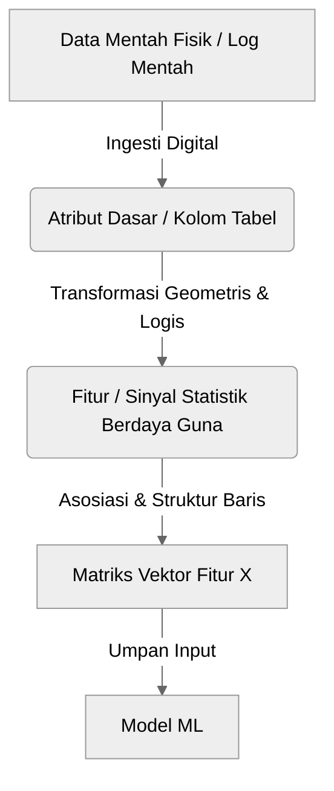

#### 2a. [GAMBAR 1.2a] Arsitektur Pembelajaran Tanpa Rekayasa Fitur pada Model Deep Jaringan Kompleks
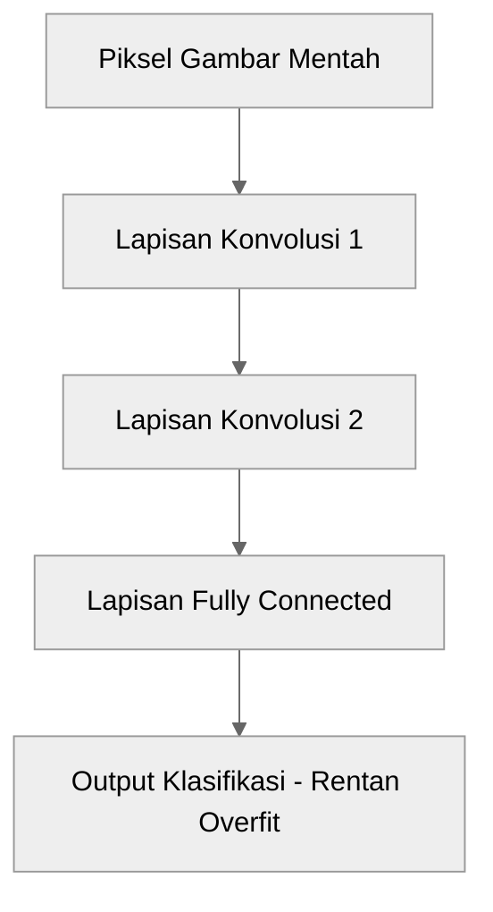

#### 2b. [GAMBAR 1.2b] Arsitektur Pembelajaran Dengan Rekayasa Fitur pada Model Linear Sederhana
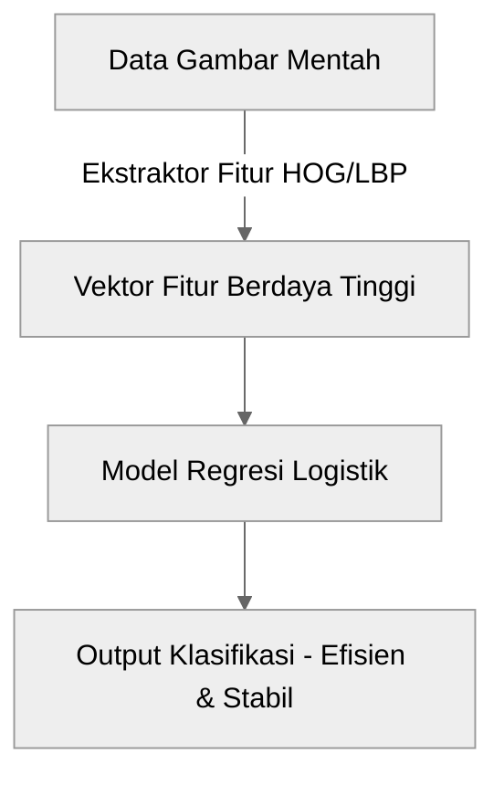

#### 3. [GAMBAR 1.3] Spektrum Representasi dari Fitur Rancangan Manusia hingga yang Dipelajari Mesin
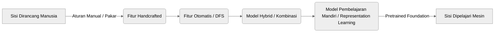

#### 4a. [GAMBAR 1.4a] Alur Kerja Rekayasa Fitur Manual pada Alur Klasik
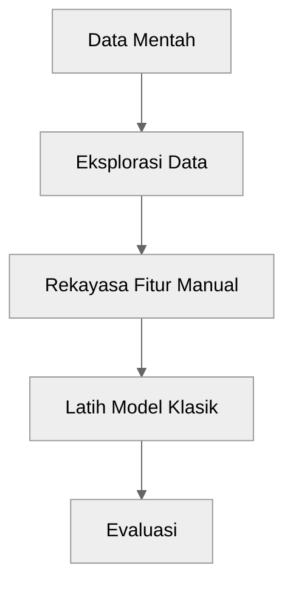

#### 4b. [GAMBAR 1.4b] Alur Kerja Feature Learning Otomatis pada Alur Modern
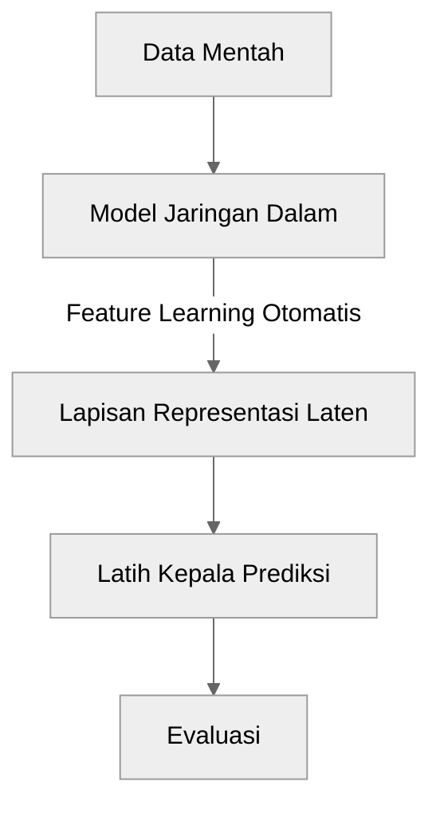

#### 5. [GAMBAR 1.5] Linimasa Pembentukan Sampel Temporal
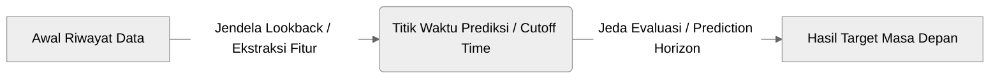

#### 6. [GAMBAR 1.6] Peta Hierarki Representasi Data
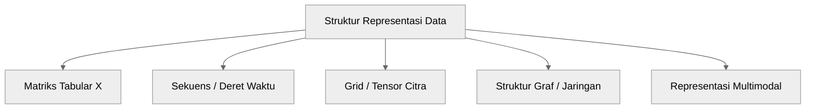

#### 7. [GAMBAR 1.7] Diagram Alir Data Mentah Menuju Representasi Akhir (Peta Buku)
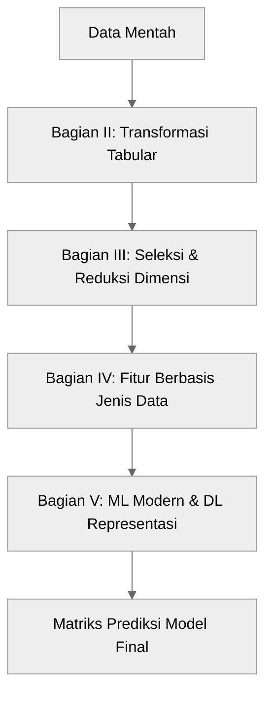

#### 8. [GAMBAR 1.8] Peta Jalan Struktur Buku
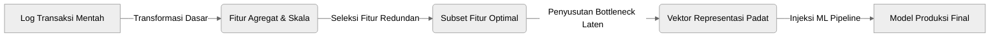

---

### Bab 2: Pipeline, Validasi, dan Data Leakage

#### 9. [GAMBAR 2.1] Ilustrasi Tabel ke Matriks Fitur pada Proses Fit dan Transform
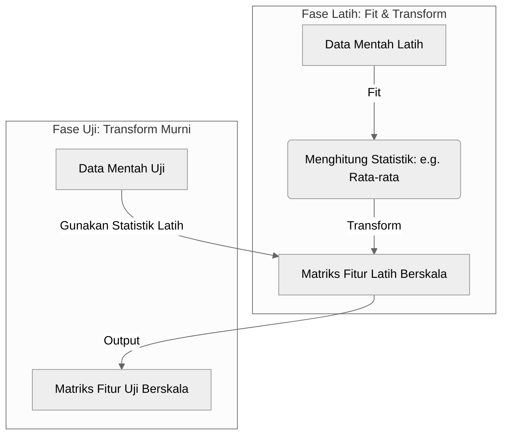

#### 10. [GAMBAR 2.2] Siklus Eksplorasi-Ekstraksi-Seleksi dalam Objek Transformer Mandiri
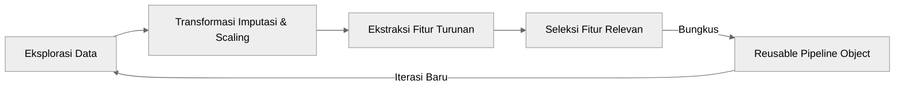

#### 11. [GAMBAR 2.3] Mekanisme Data Leakage: Masuknya Informasi Pengujian ke Latih
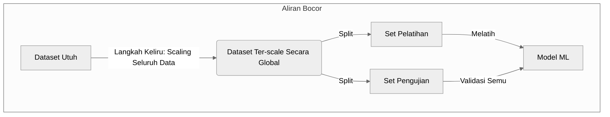

#### 12. [GAMBAR 2.4] Mekanisme Data Leakage Akibat Transformasi Agregasi Sebelum Pemisahan Dataset
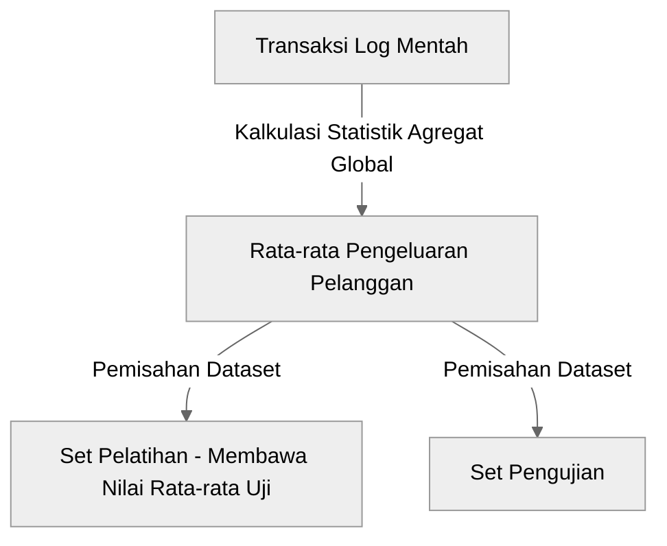

#### 13. [GAMBAR 2.5] Perbandingan Strategi Pemisahan Data: Random, Group, dan Temporal Split
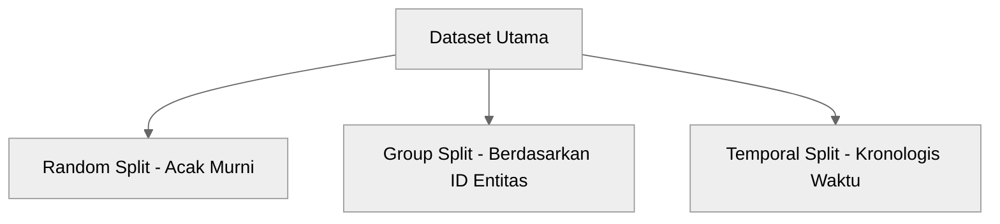

#### 14a. [GAMBAR 2.6a] Aliran Data Cross-Validation yang Salah (Bocor)
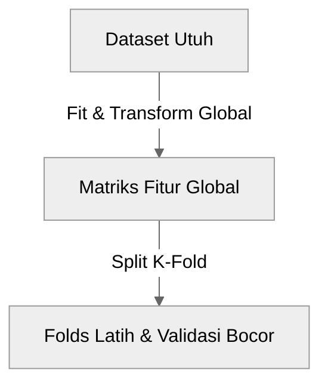

#### 14b. [GAMBAR 2.6b] Aliran Data Cross-Validation yang Benar (Terisolasi)
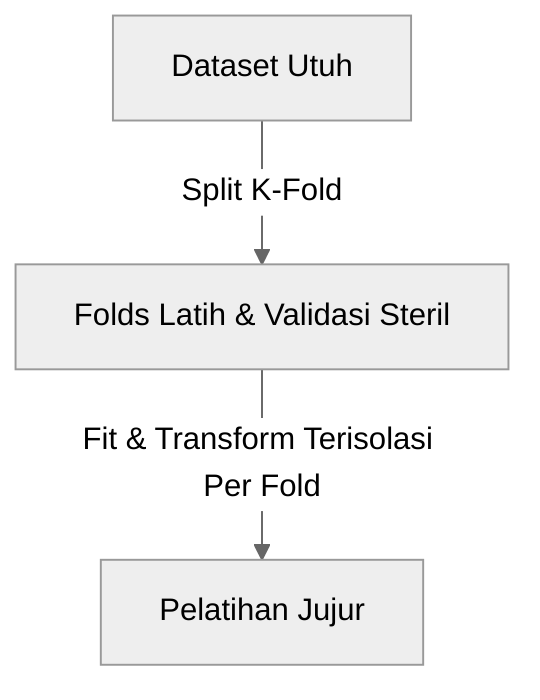

#### 15a. [GAMBAR 2.7a] Aliran Data Imputasi Global yang Salah (Bocor)
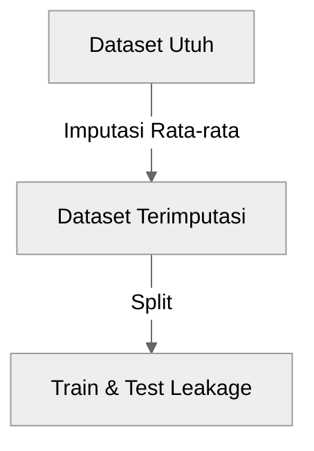

#### 15b. [GAMBAR 2.7b] Aliran Data Imputasi dengan Pipeline Tertutup yang Benar
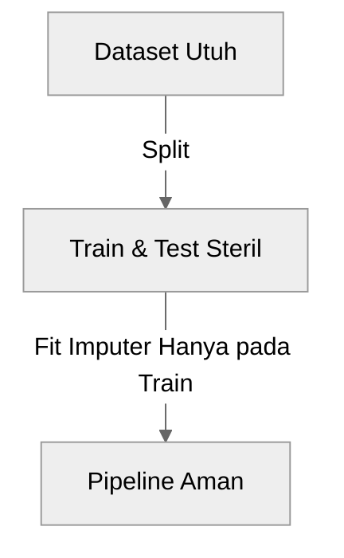

---

### Bab 3: Representasi Fitur Numerik

#### 16. [GAMBAR 3.2] Perbandingan Distribusi Nilai Menggunakan Metode Skala Min-Max dan Standardisasi
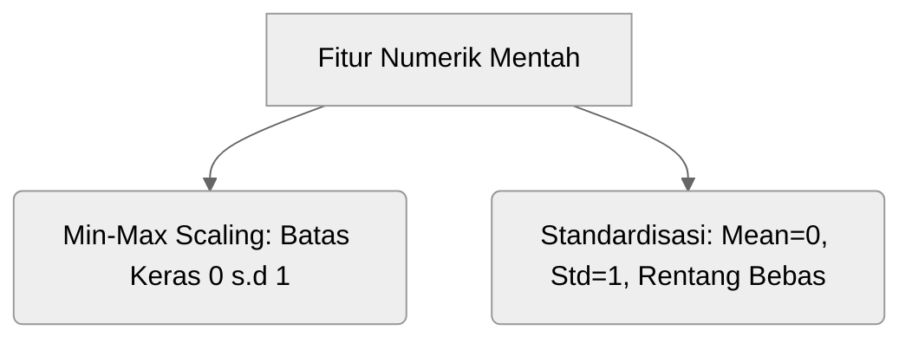

#### 17. [GAMBAR 3.5] Alur Pemetaan Batas Interval Diskrit (Discretization/Binning)
```mermaid
%%{init: {'theme': 'neutral', 'themeVariables': { 'edgeLabelBackground': '#ffffff' }}}%%
graph LR
    A[Umur Kontinu: 23, 45, 67, 12, 55] -->|Aturan Binning| B{Batasan Umur}
    B -->|<18| C[Kategori: Anak-anak]
    B -->|18-50| D[Kategori: Dewasa]
    B -->|>50| E[Kategori: Lansia]
```

#### 18. [GAMBAR 3.6] Skema Scaling Menormalkan Rentang Angka Antar Dimensi Fitur
```mermaid
%%{init: {'theme': 'neutral', 'themeVariables': { 'edgeLabelBackground': '#ffffff' }}}%%
graph TD
    subgraph Rentang_Sebelum ["Sebelum Normalisasi"]
        A1[Fitur Pendapatan: 5.000.000 s.d 100.000.000]
        A2[Fitur Jumlah Anak: 0 s.d 5]
    end
    subgraph Rentang_Sesudah ["Sesudah Normalisasi"]
        B1[Fitur Pendapatan Berskala: -1.5 s.d 3.2]
        B2[Fitur Jumlah Anak Berskala: -0.8 s.d 2.1]
    end
    Rentang_Sebelum -->|Standardization Transformer| Rentang_Sesudah
```

---

### Bab 4: Representasi Fitur Kategorikal

#### 19. [GAMBAR 4.1] Dampak Kardinalitas Tinggi pada Percabangan dan Overfitting Model Pohon
```mermaid
%%{init: {'theme': 'neutral', 'themeVariables': { 'edgeLabelBackground': '#ffffff' }}}%%
graph TD
    A[Simpul Akar: Kategori Kardinalitas Tinggi - e.g. ID Kota] --> B[Cabang Kota A]
    A --> C[Cabang Kota B]
    A --> D[Cabang Kota C]
    A --> E[Cabang Kota... N - Pohon Terlalu Lebar & Dangkal]
```

#### 20. [GAMBAR 4.2] Matriks Transformasi Lajur Tunggal Nominal Menjadi Matriks Fitur One-Hot Encoding
```mermaid
%%{init: {'theme': 'neutral', 'themeVariables': { 'edgeLabelBackground': '#ffffff' }}}%%
graph TD
    A[Kolom Kategori Mentah: Sepatu, Tas, Baju] -->|Satu Kolom| B[One-Hot Encoder]
    B --> C[Tiga Kolom Baru: Kolom_Sepatu, Kolom_Tas, Kolom_Baju]
```

#### 21. [GAMBAR 4.3] Pemetaan Count Encoding Berdasarkan Jumlah Observasi
```mermaid
%%{init: {'theme': 'neutral', 'themeVariables': { 'edgeLabelBackground': '#ffffff' }}}%%
graph LR
    A[Kolom Mentah: ID_Provinsi] -->|Kalkulasi Kemunculan Kategori| B[Tabel Distribusi Frekuensi]
    B --> C[Kolom Numerik Baru: Total Jumlah Transaksi Per Provinsi]
```

#### 22. [GAMBAR 4.4] Skema Validasi Silang (Cross-Fitting) untuk Target Encoding
```mermaid
%%{init: {'theme': 'neutral', 'themeVariables': { 'edgeLabelBackground': '#ffffff' }}}%%
graph TD
    A[Dataset Latih] -->|Bagi Dua Folds| B[Fold Latih 1]
    A -->|Bagi Dua Folds| C[Fold Latih 2]
    B -->|Hitung Mean Target| D[Tabel Target Enc 1]
    C -->|Hitung Mean Target| E[Tabel Target Enc 2]
    D -->|Terapkan Pengkodean| C
    E -->|Terapkan Pengkodean| B
```

#### 23. [GAMBAR 4.5] Ilustrasi Mekanisme Hashing Trick dan Terjadinya Hash Collision
```mermaid
%%{init: {'theme': 'neutral', 'themeVariables': { 'edgeLabelBackground': '#ffffff' }}}%%
graph TD
    A1[Kategori: Jakarta] -->|Fungsi Hash MD5/Murmur| B[Nilai Hash Numerik]
    A2[Kategori: Bandung] -->|Fungsi Hash MD5/Murmur| B
    B -->|Modulo N=10| C{Indeks Matriks Fitur}
    C -->|Kolisi Terjadi| D[Satu Indeks Fitur Yang Sama]
```

#### 24. [GAMBAR 4.6] Proses Pemetaan Indeks Kategori Berformat One-Hot Menjadi Vektor Kontinu Berdimensi Rendah
```mermaid
%%{init: {'theme': 'neutral', 'themeVariables': { 'edgeLabelBackground': '#ffffff' }}}%%
graph LR
    A[Kategori One-Hot: 0, 1, 0, 0] -->|Lookup Lapisan Bobot| B(Layer Kerapatan / Embedding)
    B --> C[Vektor Representasi Padat Laten: e.g. 0.15, -0.42]
```

#### 25. [GAMBAR 4.7] Mekanisme Pipeline Menangani Kategori Belum Terlihat Melalui Pengelompokan Proaktif dan Fallback
```mermaid
%%{init: {'theme': 'neutral', 'themeVariables': { 'edgeLabelBackground': '#ffffff' }}}%%
graph TD
    A[Kategori Baru di Inferensi] --> B{Apakah Ada di Kosakata Latih?}
    B -->|Tidak| C[Kelompokkan ke Kategori Khusus: 'Unseen' / 'Other']
    B -->|Ya| D[Terapkan Nilai Encoding Terlatih]
    C --> E[Gunakan Parameter Rata-rata Latih Sebagai Fallback]
```

---

### Bab 5: Missing Values & Outlier (Berbasis Pipeline)

#### 26. [GAMBAR 5.1] Perbandingan Pola Hilangnya Data pada Mekanisme MCAR, MAR, dan MNAR
```mermaid
%%{init: {'theme': 'neutral', 'themeVariables': { 'edgeLabelBackground': '#ffffff' }}}%%
graph TD
    A[Analisis Missingness] --> B[MCAR: Hilang Acak Sempurna - Tanpa Hubungan Variabel]
    A --> C[MAR: Hilang Terikat Atribut Lain - e.g. Lansia Melewatkan Isian Web]
    A --> D[MNAR: Hilang Terikat Nilai Aslinya sendiri - e.g. Gaji Tinggi Malu Mengisi]
```

#### 27a. [GAMBAR 5.2a] Alur Imputasi Data Utuh yang Menyebabkan Kebocoran
```mermaid
%%{init: {'theme': 'neutral', 'themeVariables': { 'edgeLabelBackground': '#ffffff' }}}%%
graph TD
    A1[Dataset Utuh] -->|Imputasi Menggunakan Statistik Keseluruhan| B1[Data Terimputasi]
    B1 -->|Split| C1[Train]
    B1 -->|Split| D1[Test]
```

#### 27b. [GAMBAR 5.2b] Alur Imputasi Aman Menggunakan Pipeline
```mermaid
%%{init: {'theme': 'neutral', 'themeVariables': { 'edgeLabelBackground': '#ffffff' }}}%%
graph TD
    A2[Dataset Utuh] -->|Split| B2[Train Split]
    A2 -->|Split| C2[Test Split]
    B2 -->|Pipeline Fit Imputer| D2[Transformer Parameter Imputasi]
    D2 -->|Transform Train| E2[Train Bersih]
    C2 -->|Transform Test Murni| D2
    D2 -->|Output| F2[Test Bersih]
```

#### 28. [GAMBAR 5.3] Siklus Prediksi Berantai pada Algoritma MICE
```mermaid
%%{init: {'theme': 'neutral', 'themeVariables': { 'edgeLabelBackground': '#ffffff' }}}%%
graph LR
    A[Imputasi Awal Median] --> B[Prediksi Fitur 1 Menggunakan Fitur 2, 3]
    B --> C[Prediksi Fitur 2 Menggunakan Fitur 1, 3]
    C --> D[Prediksi Fitur 3 Menggunakan Fitur 1, 2]
    D -->|Iterasi Hingga Konvergen| B
```

#### 29. [GAMBAR 5.4] Alur Transformasi Satu Fitur Asli Menjadi Fitur Berimputasi dan Missing Indicator
```mermaid
%%{init: {'theme': 'neutral', 'themeVariables': { 'edgeLabelBackground': '#ffffff' }}}%%
graph LR
    A[Fitur Asal: Gaji - Berisi NaN] -->|Cabang 1: Imputasi Median| B[Gaji_Imputed: Nilai Asli + Median]
    A -->|Cabang 2: Evaluasi Kehadiran Data| C[Gaji_Is_Missing: Boolean 0/1]
```

#### 30. [GAMBAR 5.7] Perbandingan Alur Eksekusi Data Cleaning Statis vs Transformasi Dinamis
```mermaid
%%{init: {'theme': 'neutral', 'themeVariables': { 'edgeLabelBackground': '#ffffff' }}}%%
graph TD
    A[Sistem Pemrosesan] --> B[Cleaning Statis: Penggantian Permanen pada File Sumber]
    A --> C[Transformasi Dinamis: Objek Transformer Pipeline Berjalan On-the-fly]
```

#### 31. [GAMBAR 5.8] Arsitektur Pipeline Pemrosesan Data: Aliran X_train dan X_test
```mermaid
%%{init: {'theme': 'neutral', 'themeVariables': { 'edgeLabelBackground': '#ffffff' }}}%%
graph TD
    X_train[X_train] -->|fit| Pipeline[Transformer Pipeline]
    X_train -->|transform| X_train_clean[X_train_clean]
    X_test[X_test] -->|transform murni| Pipeline
    Pipeline -->|transform| X_test_clean[X_test_clean]
```

---

### Bab 6: Pembentukan Fitur Turunan

#### 32. [GAMBAR 6.1] Representasi Rasio Finansial untuk Menormalkan Metrik Berskala Absolut Berbeda
```mermaid
%%{init: {'theme': 'neutral', 'themeVariables': { 'edgeLabelBackground': '#ffffff' }}}%%
graph LR
    A1[Variabel: Total Pengeluaran Bulanan] -->|Dibagi| B[Rasio Utang / Tabungan]
    A2[Variabel: Total Pendapatan Bulanan] -->|Penyebut| B
    B --> C[Indeks Risiko Keuangan Standard]
```

#### 33. [GAMBAR 6.2] Proyeksi Geometri Ruang Fitur Polinomial dari Dimensi 2D ke 3D
```mermaid
%%{init: {'theme': 'neutral', 'themeVariables': { 'edgeLabelBackground': '#ffffff' }}}%%
graph TD
    A[Ruang Asal: X1, X2 - Tidak Terpisah Secara Linier] -->|Transformasi Polinomial| B[Ruang Baru: X1, X2, X1*X2 - Terpisah Linier]
    B --> C[Sistem Pemisahan Linier Model Klasik]
```

#### 34. [GAMBAR 6.3] Perbandingan Antara Join Standar dengan As-Of Join
```mermaid
%%{init: {'theme': 'neutral', 'themeVariables': { 'edgeLabelBackground': '#ffffff' }}}%%
graph TD
    subgraph Standar_Join ["Join Standar - Melanggar Kronologis"]
        A1[Latih Transaksi - Tgl 15] -->|Gabungan Penuh| B1[Data Pelanggan Mei - Berisi Info Tgl 20 Mei]
    end
    subgraph As_Of_Join ["As-Of Join - Menjaga Kausalitas"]
        A2[Latih Transaksi - Tgl 15] -->|As-Of Join Tepat Sebelum Transaksi| B2[Data Pelanggan - HANYA Berisi Info S.D Tgl 14 Mei]
    end
```

#### 35. [GAMBAR 6.4] Alur Transformasi Variabel Neraca Menjadi Fitur Risiko Komposit Altman Z-Score
```mermaid
%%{init: {'theme': 'neutral', 'themeVariables': { 'edgeLabelBackground': '#ffffff' }}}%%
graph TD
    A1[Modal Kerja] --> B[Rumus Altman Z-Score]
    A2[Laba Ditahan] --> B
    A3[EBIT] --> B
    A4[Nilai Pasar Ekuitas] --> B
    B --> C[Fitur Komposit Tunggal Skor Kesehatan Finansial]
```

#### 36. [GAMBAR 6.5] Transformasi Siklik yang Memetakan Nilai Jam dari 0-23 ke dalam Lingkaran 2D (Sin, Cos)
```mermaid
%%{init: {'theme': 'neutral', 'themeVariables': { 'edgeLabelBackground': '#ffffff' }}}%%
graph LR
    A[Jam Linear: 23 ke 0 - Jarak Jauh] -->|Transformasi Siklik| B[Koordinat Siklik: x_sin, x_cos]
    B --> C[Bentuk Melingkar: Jarak Jam 23 dan Jam 0 Menjadi Dekat Sesuai Logika Waktu]
```

#### 37. [GAMBAR 6.7] Diagram Evaluasi Akurasi Model Baseline Melawan Model Berfitur Turunan pada CV
```mermaid
%%{init: {'theme': 'neutral', 'themeVariables': { 'edgeLabelBackground': '#ffffff' }}}%%
graph TD
    A[Dataset] -->|Latih| B[Model Baseline - Fitur Asli]
    A -->|Ekstraksi Fitur Turunan| C[Dataset Kaya Fitur]
    C -->|Latih| D[Model Kaya Fitur - Evaluasi Kenaikan Performa Metrik]
```

#### 38. [GAMBAR 6.8] Representasi Rasio Finansial dari Agregasi Log Peristiwa
```mermaid
%%{init: {'theme': 'neutral', 'themeVariables': { 'edgeLabelBackground': '#ffffff' }}}%%
graph LR
    A[Data Log Transaksi Pembelian] -->|Agregasi GroupBy: Pelanggan| B[Rasio Transaksi Sukses / Total Percobaan]
    B --> C[Fitur Kepercayaan Pelanggan]
```

---

### Bab 7: Seleksi Fitur

#### 39a. [GAMBAR 7.2_filter] Skema Aliran Data Pada Metode Filter
```mermaid
%%{init: {'theme': 'neutral', 'themeVariables': { 'edgeLabelBackground': '#ffffff' }}}%%
graph TD
    subgraph Filter ["Metode Filter"]
        A1[Seluruh Fitur] -->|Uji Korelasi / Informasi Bersama| B1[Subset Fitur]
        B1 --> C1[Model ML]
    end
```

#### 39b. [GAMBAR 7.2_wrapper] Skema Aliran Data Pada Metode Wrapper
```mermaid
%%{init: {'theme': 'neutral', 'themeVariables': { 'edgeLabelBackground': '#ffffff' }}}%%
graph TD
    subgraph Wrapper ["Metode Wrapper"]
        A2[Kombinasi Fitur] -->|Uji Iteratif Subset| B2[Latih Model]
        B2 -->|Evaluasi Performa| C2{Naik?}
        C2 -->|Ya| A2
    end
```

#### 39c. [GAMBAR 7.2_embedded] Skema Aliran Data Pada Metode Embedded
```mermaid
%%{init: {'theme': 'neutral', 'themeVariables': { 'edgeLabelBackground': '#ffffff' }}}%%
graph TD
    subgraph Embedded ["Metode Embedded"]
        A3[Seluruh Fitur] -->|LASSO / Regularisasi Koefisien| B3[Proses Pelatihan & Seleksi Menyatu]
    end
```

#### 40. [GAMBAR 7.3] Forward vs Backward Selection Path
```mermaid
%%{init: {'theme': 'neutral', 'themeVariables': { 'edgeLabelBackground': '#ffffff' }}}%%
graph TD
    subgraph Forward ["Seleksi Maju"]
        A1[Kumpulan Kosong] -->|Tambah Fitur Terbaik 1 Per 1| B1[Kumpulan Fitur Optimal]
    end
    subgraph Backward ["Eliminasi Mundur"]
        A2[Kumpulan Lengkap Seluruh Fitur] -->|Buang Fitur Terburuk 1 Per 1| B2[Kumpulan Fitur Optimal]
    end
```

#### 41. [GAMBAR 7.5] Alur Validasi Silang Bersarang (Nested Cross-Validation)
```mermaid
%%{init: {'theme': 'neutral', 'themeVariables': { 'edgeLabelBackground': '#ffffff' }}}%%
graph TD
    subgraph Outer_Loop ["Outer Loop - Evaluasi Performa Akhir"]
        A1[Data Utuh] -->|Split| B1[Train Split]
        A1 -->|Split| C1[Test Split]
    end
    subgraph Inner_Loop ["Inner Loop - Seleksi Fitur & Tuning Hyperparameter"]
        B1 -->|Split Fold Baru| A2[Latih Subfold]
        B1 -->|Split Fold Baru| B2[Validasi Subfold]
        A2 -->|Uji Kombinasi Fitur| C2[Tuning & Seleksi]
    end
```

---

### Bab 8: Reduksi Dimensi & Representasi Laten

#### 42. [GAMBAR 8.1] Visualisasi Ruang Fitur dari Dimensi Tinggi (3D) ke Laten 2D
```mermaid
%%{init: {'theme': 'neutral', 'themeVariables': { 'edgeLabelBackground': '#ffffff' }}}%%
graph TD
    A[Ruang Fitur Asli: X, Y, Z] -->|SVD / Kompresi Non-Linier| B[Vektor Representasi Laten: Z1, Z2]
```

#### 43. [GAMBAR 8.2] Diagram Vektor Eigen dan Proyeksi Komponen Utama untuk Varians Terbesar
```mermaid
%%{init: {'theme': 'neutral', 'themeVariables': { 'edgeLabelBackground': '#ffffff' }}}%%
graph LR
    A[Awan Titik Data] -->|Identifikasi Sumbu Vektor Utama| B[Komponen Utama Pertama PC1 - Menangkap Lebar Varians Terlebar]
    A -->|Ortogonal Sumbu Pertama| C[Komponen Utama Kedua PC2]
```

#### 44. [GAMBAR 8.3] Dekomposisi Matriks NMF: X = W * H
```mermaid
%%{init: {'theme': 'neutral', 'themeVariables': { 'edgeLabelBackground': '#ffffff' }}}%%
graph TD
    A[Matriks Input X: n x d - Nilai Positif] -->|Dekomposisi NMF| B[Matriks Aktivasi W: n x k]
    A -->|Dekomposisi NMF| C[Matriks Komponen H: k x d]
    B -->|Perkalian Matriks Positif| D[Aproksimasi Matriks X']
```

#### 45. [GAMBAR 8.4] Simplicial Complex pada UMAP untuk Membangun Topologi
```mermaid
%%{init: {'theme': 'neutral', 'themeVariables': { 'edgeLabelBackground': '#ffffff' }}}%%
graph LR
    A[Titik Data Spasial] -->|Definisikan Radius Ketetanggaan Fuzzy| B[Membentuk Simplex / Garis Penghubung]
    B -->|Penyusunan Kompleks Geometris Semesta| C[Struktur Topologi Laten Semantik]
```

#### 46. [GAMBAR 8.5] Skema Arsitektur Autoencoder: Encoder, Bottleneck, Decoder
```mermaid
%%{init: {'theme': 'neutral', 'themeVariables': { 'edgeLabelBackground': '#ffffff' }}}%%
graph LR
    subgraph En ["Encoder"]
        Input[Vektor Input X] --> H1[Lapisan Padat Tersembunyi]
    end
    subgraph BN ["Bottleneck Laten"]
        H1 --> Bottleneck[Vektor Laten Z]
    end
    subgraph De ["Decoder"]
        Bottleneck --> H2[Lapisan Padat Tersembunyi]
        H2 --> Output[Rekonstruksi Vektor X']
    end
```

---

### Bab 9: Evaluasi Kualitas Fitur

#### 47. [GAMBAR 9.1] Radar Kualitas Fitur di Produksi
```mermaid
%%{init: {'theme': 'neutral', 'themeVariables': { 'edgeLabelBackground': '#ffffff' }}}%%
graph TD
    A[Metrik Kualitas Fitur] --> B[Utilitas Prediktif]
    A --> C[Ketersediaan Inferensi]
    A --> D[Stabilitas Distribusi]
    A --> E[Biaya Operasional & Latensi]
    A --> F[Ketahanan Terhadap Galat / Noise]
```

#### 48. [GAMBAR 9.5] Perbandingan Utilitas Prediktif (Korelasi) vs Hubungan Kausal
```mermaid
%%{init: {'theme': 'neutral', 'themeVariables': { 'edgeLabelBackground': '#ffffff' }}}%%
graph TD
    subgraph Korelasi ["Korelasi Semu"]
        A[Penjualan Payung] -->|Korelasi Kuat| B[Kecelakaan Jalan Raya]
    end
    subgraph Kausalitas ["Kausalitas Nyata"]
        C[Hujan Lebat - Pemicu] -->|Kausal| A
        C -->|Kausal| B
    end
```

#### 49. [GAMBAR 9.6] Alur Kebocoran Atribut Sensitif Lewat Fitur Proksi dan Embedding
```mermaid
%%{init: {'theme': 'neutral', 'themeVariables': { 'edgeLabelBackground': '#ffffff' }}}%%
graph LR
    A[Atribut Terlindungi / Sensitif: e.g. Suku] -->|Korelasi Spasial| B[Fitur Proksi: e.g. Kode Pos / Lokasi]
    B --> C[Model Prediksi Finansial]
    C -->|Mempelajari Bias Diskriminasi Tidak Langsung| D[Keputusan Tidak Adil]
```

#### 50. [GAMBAR 9.7] Integrasi Metadata Data Card dan Silsilah Fitur pada Feature Store
```mermaid
%%{init: {'theme': 'neutral', 'themeVariables': { 'edgeLabelBackground': '#ffffff' }}}%%
graph TD
    A[Data Card: Sumber & Aturan] --> B[Feature Store Registry]
    C[Silsilah Transaksi: Silsilah Silsilah] --> B
    B -->|Akses Terpadu| D[Sistem Ingesti Data ML]
```

---

### Bab 10: Deret Waktu & Data Sensor

#### 51. [GAMBAR 10.1] Jendela Rolling dan Expanding pada Deret Waktu
```mermaid
%%{init: {'theme': 'neutral', 'themeVariables': { 'edgeLabelBackground': '#ffffff' }}}%%
graph TD
    subgraph Rolling_Fixed_Size ["Rolling Window - Ukuran Tetap Bergeser"]
        A1[Hari 1-5: Train] --> B1[Hari 6: Target]
        C1[Hari 2-6: Train] --> D1[Hari 7: Target]
    end
    subgraph Expanding_Accum ["Expanding Window - Akumulasi Terbuka"]
        A2[Hari 1-5: Train] --> B2[Hari 6: Target]
        C2[Hari 1-6: Train] --> D2[Hari 7: Target]
    end
```

#### 52. [GAMBAR 10.2] Perbandingan Mekanisme Jendela Bergeser (Rolling) vs Melebar (Expanding)
```mermaid
%%{init: {'theme': 'neutral', 'themeVariables': { 'edgeLabelBackground': '#ffffff' }}}%%
graph LR
    A[Data Deret Waktu] --> B(Rolling: Analisis Jangka Pendek & Volatilitas Baru)
    A --> C(Expanding: Analisis Tren Jangka Panjang & Konsistensi Pola)
```

#### 53. [GAMBAR 10.4] Skema Purge Gap dalam Pemisahan Data Temporal
```mermaid
%%{init: {'theme': 'neutral', 'themeVariables': { 'edgeLabelBackground': '#ffffff' }}}%%
graph LR
    A[Jendela Pelatihan Kronologis] -->|Batas Purge Gap: Potong Informasi 25 Jam| B[Jendela Pengujian]
```

#### 54. [GAMBAR 10.5] Letak Purge Gap di Antara Set Pelatihan Terakhir dan Set Validasi Pertama
```mermaid
%%{init: {'theme': 'neutral', 'themeVariables': { 'edgeLabelBackground': '#ffffff' }}}%%
graph TD
    A[Data Latih: Riwayat Transaksi] --> B[Data Purge Gap: Hari Evaluasi Transisi]
    B --> C[Data Validasi: Transaksi Baru Di Luar Sinyal Window Latih]
```

#### 55. [GAMBAR 10.6] Ekstraksi Fitur Menggunakan tsfresh yang Meratakan Jendela Deret Waktu ke Tabular
```mermaid
%%{init: {'theme': 'neutral', 'themeVariables': { 'edgeLabelBackground': '#ffffff' }}}%%
graph LR
    A[Data Sekuensial: Jendela Sinyal Sensor] -->|Ekstraksi Parameter Statistik Komprehensif| B[Tsfresh Engine]
    B --> C[Matriks Tabular: Mean, Max, FFT, Kemiringan, Varians]
```

#### 56. [GAMBAR 10.7] Skema Validasi Temporal dengan Pemisahan Kronologis dan Area Purge Gap
```mermaid
%%{init: {'theme': 'neutral', 'themeVariables': { 'edgeLabelBackground': '#ffffff' }}}%%
graph TD
    subgraph Kronologis_Split ["Pemisahan Kronologis Temporal"]
        A[Latih - Masa Lalu] --> B[Purge Gap]
        B --> C[Uji - Masa Depan]
    end
```

---

### Bab 11: Teks & Dokumen

#### 57. [GAMBAR 11.1] Alur Pemrosesan Teks Mentah Kalimat -> Token -> Bag-of-Words Sparse Matriks
```mermaid
%%{init: {'theme': 'neutral', 'themeVariables': { 'edgeLabelBackground': '#ffffff' }}}%%
graph TD
    A["Teks Mentah: 'Buku Ini Buku Baru'"] -->|Tokenisasi & Case Folding| B["Token: 'buku', 'ini', 'buku', 'baru'"]
    B -->|Pembersihan Stopwords| C["Kosakata: 'buku', 'baru'"]
    C -->|Kalkulasi Frekuensi Bag-of-Words| D["Matriks Vektor Sparse: [2, 1]"]
```

#### 58. [GAMBAR 11.2] Ruang Vektor Sparse (BoW) yang Ortogonal vs Ruang Vektor Padat (Embedding)
```mermaid
%%{init: {'theme': 'neutral', 'themeVariables': { 'edgeLabelBackground': '#ffffff' }}}%%
graph TD
    subgraph Sparse_Space ["BoW Space - Jarak Sama"]
        A1[Vektor 'Kucing'] -->|Ortogonal Jarak Jauh| B1[Vektor 'Anjing']
        A1 -->|Ortogonal Jarak Jauh| C1[Vektor 'Meja']
    end
    subgraph Dense_Space ["Embedding Space - Kedekatan Semantik"]
        A2[Vektor 'Kucing'] -->|Jarak Dekat Semantik| B2[Vektor 'Anjing']
        A2 -->|Jarak Jauh| C2[Vektor 'Meja']
    end
```

#### 59. [GAMBAR 11.3] Evolusi Arsitektur Embedding Kalimat
```mermaid
%%{init: {'theme': 'neutral', 'themeVariables': { 'edgeLabelBackground': '#ffffff' }}}%%
graph LR
    A[Mean-Pooling Naif: Rerata Kata] --> B[SBERT / Jaringan Siam Dual-Encoder]
    B --> C[Embedding Instruksional / Matryoshka]
```

#### 60. [GAMBAR 11.4] Aliran Gradien Model Bahasa: Feature Extraction vs Fine-Tuning
```mermaid
%%{init: {'theme': 'neutral', 'themeVariables': { 'edgeLabelBackground': '#ffffff' }}}%%
graph TD
    subgraph Feature_Extraction ["Feature Extraction"]
        Input1[Input Teks] --> Transformer1[Frozen Pretrained Encoder]
        Transformer1 -->|Embedding Tetap| FC1[Lapisan Klasifikasi Baru]
        FC1 --> Output1[Prediksi]
        Output1 -.->|Gradien HANYA Memperbarui| FC1
    end
    subgraph Fine_Tuning ["Full Fine-Tuning"]
        Input2[Input Teks] --> Transformer2[Active Pretrained Encoder]
        Transformer2 --> FC2[Lapisan Klasifikasi]
        FC2 --> Output2[Prediksi]
        Output2 -->|Gradien Memperbarui Seluruh Bobot Jaringan| Transformer2
    end
```

---

### Bab 12: Citra & Audio

#### 61. [GAMBAR 12.1] Ekstraksi Fitur Histogram of Oriented Gradients (HOG) pada Citra
```mermaid
%%{init: {'theme': 'neutral', 'themeVariables': { 'edgeLabelBackground': '#ffffff' }}}%%
graph LR
    A[Citra Input] -->|Kalkulasi Gradien Piksel| B[Matriks Arah Gradien]
    B -->|Pembagian Blok Spasial Fix| C[Histogram Distribusi Orientasi Lokal]
    C -->|Normalisasi Blok| D[Vektor Fitur HOG Akhir]
```

#### 62. [GAMBAR 12.2] Arsitektur CNN Membuang Lapisan Klasifikasi Akhir Menjadi Feature Extractor
```mermaid
%%{init: {'theme': 'neutral', 'themeVariables': { 'edgeLabelBackground': '#ffffff' }}}%%
graph LR
    A[Input Citra] --> B[Blok Konvolusi & Pooling]
    B --> C[Vektor Lapisan Penat]
    C -->|Garis Potong Kepala| D[Lapisan Klasifikasi Softmax]
    C -->|Ekstrak Fitur Visual| E[Matriks Vektor Fitur Citra]
```

#### 63. [GAMBAR 12.3] Pemotongan Citra Menjadi Kisi Patch dan Mekanisme Attention pada Vision Transformer
```mermaid
%%{init: {'theme': 'neutral', 'themeVariables': { 'edgeLabelBackground': '#ffffff' }}}%%
graph TD
    A[Citra Input Dua Dimensi] -->|Mekanisme Pemotongan| B[Serangkaian Kisi-kisi Patch Citra]
    B -->|Proyeksi Linier| C[Vektor Token Patch]
    C -->|Penambahan Positional Embedding| D[Lapisan Self-Attention Transformer]
    D --> E[Vektor Representasi Semantik Global]
```

---

### Bab 13: Data Spasial & Graf

#### 64. [GAMBAR 13.1] Transformasi Koordinat Mentah Menjadi Fitur Jarak, Radius, dan Indeks Heksagonal
```mermaid
%%{init: {'theme': 'neutral', 'themeVariables': { 'edgeLabelBackground': '#ffffff' }}}%%
graph TD
    A[Koordinat Latitude, Longitude] --> B[Fitur Jarak Geodesik ke Titik Pusat Kota]
    A --> C[Fitur Jarak Proksimitas Radius Fasilitas]
    A --> D[Indeks Heksagonal Sel H3 Uber]
```

#### 65. [GAMBAR 13.2] Visualisasi Matriks Bobot Spasial (W) untuk Perhitungan Spatial Lag
```mermaid
%%{init: {'theme': 'neutral', 'themeVariables': { 'edgeLabelBackground': '#ffffff' }}}%%
graph TD
    A[Entitas Spasial Utama] -->|Identifikasi Tetangga Terdekat| B[Matriks Bobot W: Nilai 1 jika Bertetangga, 0 jika Tidak]
    B -->|Perkalian Matriks| C[Spatial Lag: Fitur Agregat Nilai Tetangga Sekitar]
```

#### 66. [GAMBAR 13.3] Pemisahan Acak vs Pemisahan Blok Spasial dengan Zona Penyangga (Buffer Zone)
```mermaid
%%{init: {'theme': 'neutral', 'themeVariables': { 'edgeLabelBackground': '#ffffff' }}}%%
graph TD
    subgraph Blok_Spasial_Benar ["Spasial Blok - Mencegah Leakage"]
        A1[Blok Latih Spasial] -->|Zona Penyangga / Buffer Zone| B1[Blok Uji Spasial]
    end
```

#### 67. [GAMBAR 13.4] Pengukuran Sentralitas (Degree vs Betweenness) pada Jaringan Graf
```mermaid
%%{init: {'theme': 'neutral', 'themeVariables': { 'edgeLabelBackground': '#ffffff' }}}%%
graph LR
    A((Simpul A)) --- B((Simpul B))
    A --- C((Simpul C))
    B --- C
    C --- D((Simpul D - Betweenness Tinggi Jembatan Klaster))
    D --- E((Simpul E))
    D --- F((Simpul F))
```

#### 68. [GAMBAR 13.5] Proses Agregasi Atribut dari Simpul Tetangga dan Ekstraksi Jalur Struktural
```mermaid
%%{init: {'theme': 'neutral', 'themeVariables': { 'edgeLabelBackground': '#ffffff' }}}%%
graph TD
    A((Tetangga 1)) -->|Kirim Atribut X| Agg[Fungsi Aggregator]
    B((Tetangga 2)) -->|Kirim Atribut X| Agg
    Agg -->|Pembaruan / Update| Target((Simpul Target Utama))
```

#### 69. [GAMBAR 13.6] Skema Random Walk (Node2Vec) dengan Parameter p dan q
```mermaid
%%{init: {'theme': 'neutral', 'themeVariables': { 'edgeLabelBackground': '#ffffff' }}}%%
graph LR
    A((Simpul Asal)) -->|Kembali: Param p| B((Simpul Sebelumnya))
    A -->|Eksplorasi Mendalam: Param q| C((Simpul Jauh))
    A -->|Eksplorasi Lokal| D((Simpul Sejajar))
```

#### 70. [GAMBAR 13.7] Pesan Agregasi GNN
```mermaid
%%{init: {'theme': 'neutral', 'themeVariables': { 'edgeLabelBackground': '#ffffff' }}}%%
graph LR
    A[Pesan Fitur Simpul-simpul Tetangga] -->|Kombinasi Relasional| B[Fungsi Agregasi GNN]
    B --> C[Sinyal Fitur Simpul Terkini]
```

#### 71. [GAMBAR 13.8] Subgraf Mencegah Kebocoran Set Pelatihan dan Set Uji
```mermaid
%%{init: {'theme': 'neutral', 'themeVariables': { 'edgeLabelBackground': '#ffffff' }}}%%
graph TD
    subgraph Subgraf_Latih ["Subgraf Pelatihan"]
        A((Node Latih 1)) --- B((Node Latih 2))
    end
    subgraph Subgraf_Uji ["Subgraf Pengujian"]
        C((Node Uji 1)) --- D((Node Uji 2))
    end
    subgraph Pemutusan ["Hubungan Yang Diputus Mencegah Leakage"]
        B -.->|Sisi Terputus| C
    end
```

---

### Bab 14: Data Multimodal

#### 72. [GAMBAR 14.1] Penggabungan Potongan Lebar 1 Detik Gambar (30fps) & Audio (44.100Hz)
```mermaid
%%{init: {'theme': 'neutral', 'themeVariables': { 'edgeLabelBackground': '#ffffff' }}}%%
graph TD
    subgraph Ingesti_Sync ["Sinkronisasi Detik Ke-1"]
        A[30 Frame Gambar Citra] -->|Agregasi Fitur Visual| C[Blok Unit Representasi Detik 1]
        B[44.100 Amplitudo Gelombang Audio] -->|Ekstraksi Parameter Akustik| C
    end
```

#### 73. [GAMBAR 14.2] Spektrum Fusi Multimodal (Early, Intermediate, dan Late Fusion)
```mermaid
%%{init: {'theme': 'neutral', 'themeVariables': { 'edgeLabelBackground': '#ffffff' }}}%%
graph TD
    A[Data Tabular] -->|Early Fusion| B(Concatenate Kolom)
    C[Data Citra] -->|Intermediate Fusion| D(Penggabungan Layer Laten Jaringan)
    E[Data Teks] -->|Late Fusion| F(Voting Prediksi Probabilitas Akhir)
```

#### 74. [GAMBAR 14.3] Perataan Peta Fitur Spasial Citra (Flattening) Menjadi Vektor Panjang
```mermaid
%%{init: {'theme': 'neutral', 'themeVariables': { 'edgeLabelBackground': '#ffffff' }}}%%
graph LR
    A[Peta Fitur Konvolusi Citra: 7 x 7 x 512] -->|Operasi Flattening| B[Vektor Fitur Panjang: 25088 Dimensi]
```

#### 75. [GAMBAR 14.4] Perbandingan Alur Penanganan Missing Modality Antara Early vs Late Fusion
```mermaid
%%{init: {'theme': 'neutral', 'themeVariables': { 'edgeLabelBackground': '#ffffff' }}}%%
graph TD
    A[Missing Modality: Gambar Hilang] --> B{Early Fusion: Error Cabang Ingesti}
    A --> C{Late Fusion: Lanjutkan Prediksi Menggunakan Model Teks Tersedia}
```

#### 76. [GAMBAR 14.5] Dua Encoder Terpisah Memproyeksikan Citra dan Teks ke Ruang Semantik Bersilang
```mermaid
%%{init: {'theme': 'neutral', 'themeVariables': { 'edgeLabelBackground': '#ffffff' }}}%%
graph TD
    Img[Foto Anjing] --> ImgEnc[Image Encoder]
    Txt[Teks: 'Seekor Anjing'] --> TxtEnc[Text Encoder]
    ImgEnc -->|Koordinat Koordinat Dekat Semantik| Joint[Ruang Representasi Bersilang 3D]
    TxtEnc -->|Koordinat Koordinat Dekat Semantik| Joint
```

#### 77. [GAMBAR 14.6] Arsitektur Contrastive Loss pada Model CLIP
```mermaid
%%{init: {'theme': 'neutral', 'themeVariables': { 'edgeLabelBackground': '#ffffff' }}}%%
graph TD
    A[Batch Citra & Teks] --> B[Ekstraksi Representasi Vektor]
    B --> C[Matriks Perkalian Titik I x T]
    C -->|Diagonal: Maksimalkan Kesamaan Semantik| D[Contrastive Loss Optimizer]
    C -->|Miring: Jauhkan Pasangan Acak| D
```

#### 78. [GAMBAR 14.7] Arsitektur Early Fusion Pipeline Multimodal untuk Prediksi Harga Properti
```mermaid
%%{init: {'theme': 'neutral', 'themeVariables': { 'edgeLabelBackground': '#ffffff' }}}%%
graph LR
    Tab[Tabular: Jml Kamar] --> Cat[Concatenation Layer]
    Txt[Teks: Deskripsi Rumah] -->|SBERT| Cat
    Img[Citra: Foto Interior] -->|ResNet| Cat
    Cat --> Dense[Lapisan Model Prediksi Akhir]
```

---

### Bab 15: Representasi Terlatih & Pretrained Model

#### 79. [GAMBAR 15.1] Spektrum Adaptasi Model Pretrained: Frozen Extractor, Partial, PEFT, Full Fine-Tuning
```mermaid
%%{init: {'theme': 'neutral', 'themeVariables': { 'edgeLabelBackground': '#ffffff' }}}%%
graph LR
    A[Frozen Extractor: Beban Komputasi Rendah, Bebas Overfit] --> B[Partial Fine-tuning: Latih Layer Atas]
    B --> C[PEFT: Latih Lapisan Tambahan LoRA]
    C --> D[Full Fine-tuning: Latih Ulang Seluruh Jaringan]
```

#### 80. [GAMBAR 15.2] Alur Kerja Feature Bank Menggunakan Indeks FAISS
```mermaid
%%{init: {'theme': 'neutral', 'themeVariables': { 'edgeLabelBackground': '#ffffff' }}}%%
graph LR
    A[Dataset Dokumen] -->|Extract Embedding| B[Vektor Representasi]
    B -->|Penyimpanan Terindeks| C[Database Vektor FAISS]
    D[Kueri Vektor Baru] -->|Komparasi Cosine Similarity| C
    C -->|Output| E[Dokumen Tetangga Terdekat Sesuai Arti]
```

#### 81. [GAMBAR 15.3] Arsitektur Linear Probing
```mermaid
%%{init: {'theme': 'neutral', 'themeVariables': { 'edgeLabelBackground': '#ffffff' }}}%%
graph LR
    Input[Data Masukan] --> Frozen[Pretrained Foundation Model - BEKU]
    Frozen -->|Vektor Representasi Semantik| Linear[Lapisan Klasifikasi Linier Baru - DILATIH]
```

#### 82. [GAMBAR 15.4] Skema Transfer Learning (Membekukan Layer)
```mermaid
%%{init: {'theme': 'neutral', 'themeVariables': { 'edgeLabelBackground': '#ffffff' }}}%%
graph TD
    subgraph Pretrained_Base ["Bobot Beku"]
        A[Layer Konvolusi Bawah]
        B[Layer Konvolusi Tengah]
    end
    subgraph New_Layers ["Bobot Aktif"]
        C[Layer Klasifikasi Kustom Baru]
    end
    A --> B
    B --> C
```

#### 83. [GAMBAR 15.5] Perbandingan Arsitektur Fine-Tuning Penuh dengan Feature Extraction Beku
```mermaid
%%{init: {'theme': 'neutral', 'themeVariables': { 'edgeLabelBackground': '#ffffff' }}}%%
graph TD
    A[Injeksi Input] --> B[Model Pretrained]
    B -->|Gaya FE Beku: Hanya Latih Kepala| C[Kepala Klasifikasi Baru]
    B -->|Gaya Fine-Tuning: Latih Semua| D[Seluruh Jaringan Aktif]
```

#### 84. [GAMBAR 15.6] Ekstraksi CLS Token dari Transformer untuk Menghasilkan Embedding Tunggal
```mermaid
%%{init: {'theme': 'neutral', 'themeVariables': { 'edgeLabelBackground': '#ffffff' }}}%%
graph LR
    Input[Baris Data Tabular] --> Trans[Transformer Block]
    Trans -->|Ambil Nilai Sinyal Atas| CLS[Vektor Khusus CLS Token]
    CLS --> Output[Embedding Representasi Baris]
```

#### 85. [GAMBAR 15.7] Arsitektur Model Hybrid yang Menggabungkan Fitur Rekayasa Tabular & Vektor Embedding
```mermaid
%%{init: {'theme': 'neutral', 'themeVariables': { 'edgeLabelBackground': '#ffffff' }}}%%
graph TD
    A1[Fitur Tabular Hasil Rekayasa Manusia] --> Cat[Concatenate Layer]
    A2[Data Teks] -->|Pretrained Encoder| Embedding[Vektor Laten Semantik]
    Embedding --> Cat
    Cat --> Model[Model Gradient Boosting / Neural Network]
```

#### 86. [GAMBAR 15.8] Arsitektur Integrasi Pipeline Hibrida Menggabungkan Teks Pretrained + Tabular
```mermaid
%%{init: {'theme': 'neutral', 'themeVariables': { 'edgeLabelBackground': '#ffffff' }}}%%
graph LR
    A[Pipeline Utama] --> B(Teks -> SBERT -> Embedding)
    A --> C(Numerik -> Standard Scaler -> Skala)
    B --> D[Concatenate Transformer]
    C --> D
```

---

### Bab 16: Rekayasa Fitur Otomatis & Kolaborasi Manusia-AI

#### 87. [GAMBAR 16.1] Skema Pohon Relasi Entitas pada Deep Feature Synthesis (DFS)
```mermaid
%%{init: {'theme': 'neutral', 'themeVariables': { 'edgeLabelBackground': '#ffffff' }}}%%
graph TD
    subgraph Tabel_Transaksi ["Tabel Transaksi"]
        A[Nilai_Belanja]
    end
    subgraph Tabel_Pesanan ["Tabel Pesanan"]
        B[Total_Jumlah_Transaksi]
    end
    subgraph Tabel_Pelanggan ["Tabel Pelanggan"]
        C[Rata-rata_Belanja_Pelanggan]
    end
    A -->|Primitif Agregasi: SUM| B
    B -->|Primitif Agregasi: MEAN| C
```

#### 88. [GAMBAR 16.2] Arsitektur Pencarian Pipeline AutoML
```mermaid
%%{init: {'theme': 'neutral', 'themeVariables': { 'edgeLabelBackground': '#ffffff' }}}%%
graph LR
    A[Dataset Input] -->|Deteksi Skema Otomatis| B[Inisialisasi Transformer Khusus Tipe]
    B -->|Uji Coba Kombinasi| C[Search Engine Pipeline]
    C -->|Seleksi & Evaluasi| D[Pipeline ML Final Teroptimal]
```

#### 89. [GAMBAR 16.3] Arsitektur Agen CAAFE (Context-Aware Automated Feature Engineering)
```mermaid
%%{init: {'theme': 'neutral', 'themeVariables': { 'edgeLabelBackground': '#ffffff' }}}%%
graph TD
    A[Dataset Skema & Metadata] -->|Kirim Prompt| B[Agen LLM]
    B -->|Tulis Ide Fitur & Kode Python| C[Modul Transformer Sementara]
    C -->|Eksekusi & Evaluasi| D{Apakah Performa Naik?}
    D -->|Tidak: Kirim Feedback Bug/Skor| B
    D -->|Ya| E[Simpan Kode & Integrasikan ke Pipeline Utama]
```

#### 90. [GAMBAR 16.4] Interaksi Antarmuka Sistem Human-in-the-Loop Analis Memvalidasi Fitur Usulan AI
```mermaid
%%{init: {'theme': 'neutral', 'themeVariables': { 'edgeLabelBackground': '#ffffff' }}}%%
graph LR
    A[Saran Fitur Baru LLM] --> B[Dashboard Analis Manusia]
    B -->|Analis Mengklik Approve / Reject| C{Tervalidasi?}
    C -->|Ya| D[Injeksi ke Pipeline Produksi]
    C -->|Tidak| E[Buang & Tandai sebagai Spurious]
```

---

### Bab 17: Sintesis: Merancang Pipeline & Prinsip yang Bertahan Lama

#### 91. [GAMBAR 17.1] Monitoring Drift Fitur (Data Drift Diagram) Pasca-Produksi
```mermaid
%%{init: {'theme': 'neutral', 'themeVariables': { 'edgeLabelBackground': '#ffffff' }}}%%
graph LR
    A[Distribusi Fitur Latih Baseline] -->|Evaluasi Komparatif KS-Test| B{Drift Terdeteksi?}
    C[Distribusi Fitur Produksi Baru] --> B
    B -->|Ya: Kirim Alert & Pemicu Latih Ulang| D[Sistem retraining]
    B -->|Tidak| E[Sistem Aman]
```

#### 92. [GAMBAR 17.2] Arsitektur Feature Store (Feast) Offline dan Online Store
```mermaid
%%{init: {'theme': 'neutral', 'themeVariables': { 'edgeLabelBackground': '#ffffff' }}}%%
graph TD
    subgraph Ingesti ["Ingesti Log & Event"]
        A[Sistem Database]
    end
    subgraph Feature_Store ["Sistem Feast"]
        A -->|Batch ETL| Offline[Offline Store: Parquet/BigQuery]
        A -->|Stream / Streaming| Online[Online Store: Redis]
    end
    subgraph ML_Services ["Konsumen Model"]
        Offline -->|Train Silsilah Fitur Bebas Leakage| Train[Melatih Model ML]
        Online -->|Latensi Rendah Real-time Retrieve| Serving[Aplikasi Inference]
    end
```

#### 93. [GAMBAR 17.4] Jalur Ekstraksi Fitur Batch vs Streaming Features
```mermaid
%%{init: {'theme': 'neutral', 'themeVariables': { 'edgeLabelBackground': '#ffffff' }}}%%
graph TD
    A[Data Masuk] --> B(Batch: Diolah Berkala Tiap Malam - Latensi Tinggi)
    A --> C(Streaming: Diolah Seketika via Kafka/Flink - Latensi Rendah)
```

#### 94. [GAMBAR 17.5] Skema Training-Serving Skew Akibat Perbedaan Ketersediaan Fitur
```mermaid
%%{init: {'theme': 'neutral', 'themeVariables': { 'edgeLabelBackground': '#ffffff' }}}%%
graph TD
    subgraph Training_Time ["Waktu Pelatihan"]
        A1[Data Historis Lengkap] --> B1[Fitur Agregat Mewah]
    end
    subgraph Serving_Time ["Waktu Produksi"]
        A2[Inference Real-time] -->|Atribut Transaksi Baru Belum Tercatat di DB| B2[Fitur Kosong / Missing - Kegagalan Model]
    end
```

#### 95. [GAMBAR 17.6] Arsitektur Hibrida Menggabungkan Ekstraksi Fitur Visual DL & Tabular Rancangan Manusia
```mermaid
%%{init: {'theme': 'neutral', 'themeVariables': { 'edgeLabelBackground': '#ffffff' }}}%%
graph LR
    Img[Foto Produk] -->|ResNet Extractor| Embedding[Vektor Laten Visual]
    Tab[Teks Metadata] -->|One-Hot Scaler| Tabular[Fitur Tabular]
    Embedding --> Cat[Concatenate Layer]
    Tabular --> Cat
    Cat --> MLP[Model Klasifikasi Cacat Produk]
```

#### 96. [GAMBAR 17.7] Arsitektur Dua Sistem Prediktif Berdampingan: Peramalan Ritel & Hybrid Multimodal Medis
```mermaid
%%{init: {'theme': 'neutral', 'themeVariables': { 'edgeLabelBackground': '#ffffff' }}}%%
graph TD
    subgraph Ritel_System ["Sistem Peramalan Ritel Temporal"]
        A1[Data Penjualan] --> B1[Feature Lag & Rolling Window]
        B1 --> C1[Model XGBoost Forecasting]
    end
    subgraph Medis_System ["Sistem Multimodal Medis"]
        A2[Rekam Medis Tabular] --> D2[Concatenate Layer]
        B2[Citra Rontgen Paru] -->|CNN Extractor| D2
        D2 --> E2[Model Jaringan Neural Prediksi Patologi]
    end
```

---

### Kesimpulan & Panduan Lanjutan untuk Editor
1. **Untuk Gambar jenis Plot Data (e.g. Gambar 3.1, 3.4, 4.8, 5.6):** Seluruh gambar tersebut telah dirancang untuk dihasilkan secara terprogram lewat skrip di repositori Track 2. Gambar dapat diekspor langsung sebagai file `.png` beresolusi tinggi sebelum digabungkan ke dokumen utama.
2. **Untuk Gambar jenis Diagram Konseptual, Skema, & Arsitektur (e.g. Gambar 1.1, 2.6, 5.8, 8.5):** Gunakan kumpulan kode Mermaid di atas. Diagram-diagram tersebut dirancang untuk mempertahankan konsistensi istilah-istilah di Living Glossary (misal menggunakan kata *representasi yang dirancang manusia*, *praktik pipeline yang benar*, dan *leakage*) serta mengikuti estetika minimalis modern demi memberikan pengalaman membaca buku ajar yang premium dan berkualitas tinggi.
