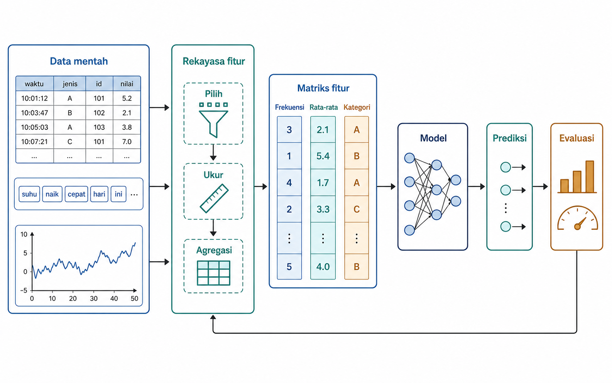
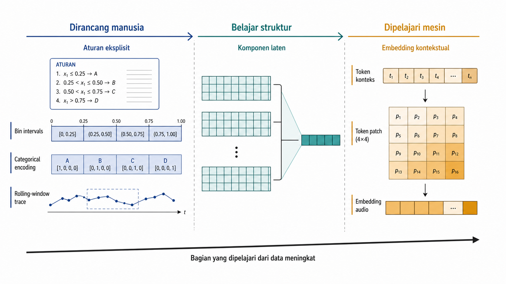
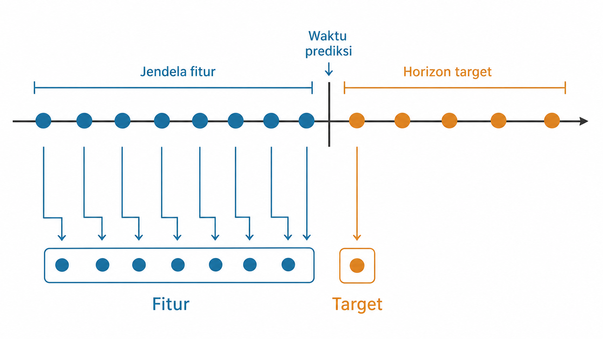
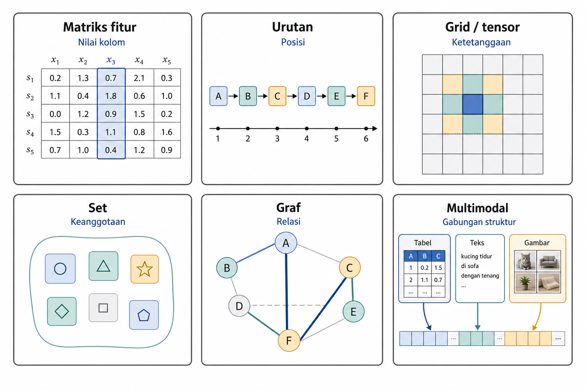

# Dari Data Mentah ke Representasi Model

Kehidupan kita saat ini menghasilkan jejak data yang tidak terhitung jumlahnya. Mulai dari riwayat belanja di pasar swalayan, hasil pemeriksaan medis pasien di rumah sakit, catatan transaksi kartu kredit, hingga pantauan sensor pada mesin industri, semuanya tersimpan sebagai rekaman peristiwa mentah. Dari tumpukan catatan keseharian inilah kita berusaha menggali informasi dan membuat keputusan. Kita ingin mengetahui pelanggan mana yang berpeluang besar berbelanja kembali, transaksi mana yang mencurigakan sebagai tindak penipuan, atau mesin mana yang mulai menunjukkan anomali sebelum benar-benar rusak.

Sebagai manusia, kita mungkin dengan mudah membaca dan mengira-ngira pola dari selembar struk belanja atau sebaris laporan medis. Namun, algoritma pembelajaran mesin (*machine learning*) tidak berinteraksi dengan dunia nyata secara langsung. Komputer tidak mengerti konsep "pelanggan", "waktu luang", atau "niat membeli". Agar algoritma dapat bekerja, seluruh rekaman peristiwa mentah tersebut harus diterjemahkan ke dalam wujud matematika yang terstruktur (misalnya matriks atau vektor) yang merangkum atribut setiap entitas ke dalam satu kesatuan observasi.

Proses menerjemahkan rekaman mentah menjadi wujud terstruktur inilah yang melahirkan konsep rekayasa fitur. Data mentah sering kali tidak siap pakai. Formatnya beragam, rentang nilainya bervariasi, dan banyak memuat informasi masa depan yang seharusnya belum diketahui pada saat prediksi dilakukan. Transformasi yang cermat mutlak diperlukan agar informasi yang diekstrak sah dan relevan bagi algoritma.

Sebagai pengantar untuk keseluruhan buku, bab pertama ini meletakkan landasan konseptual bagi pemahaman aliran pemrosesan data. Pembahasan diawali dengan mendefinisikan batasan rekayasa fitur, beserta proses transisi dari sebuah pertanyaan prediksi menjadi bentuk tabel data untuk model. Bab ini juga menyajikan peta komprehensif mengenai struktur representasi. Sebagai penutup, bab ini menguraikan sekilas kerangka jalur pemrosesan (*pipeline*) yang sekaligus berfungsi sebagai panduan sistematis untuk membaca buku ini.

## Dari Log Mentah ke Satu Baris Data untuk Model

Contoh kerja pada Bagian ini memakai catatan transaksi sebuah toko *online*. Setiap baris mencatat satu item pada sebuah *invoice*, termasuk barang yang dibeli, waktu transaksi, jumlah barang, harga unit, dan pelanggan yang melakukan transaksi. Sistem tidak menyimpan satu objek bernama "pelanggan yang akan membeli lagi". Baris seperti ini disebut data mentah, bukan karena datanya buruk, melainkan karena bentuknya masih mengikuti kebutuhan pencatatan transaksi.

Agar bisa menjawab pertanyaan prediksi, catatan tersebut harus diubah. `InvoiceDate`, `StockCode`, `Quantity`, `UnitPrice`, `CustomerID`, dan `Country` merupakan atribut, yaitu properti yang dicatat dari suatu kejadian atau objek. Dari atribut tersebut kita membentuk fitur, yaitu representasi yang menjadi *input* model. Satu atribut dapat melahirkan beberapa fitur. `InvoiceDate`, sebagai contoh, dapat diubah menjadi hari dalam minggu, bulan, atau jumlah hari sejak transaksi terakhir. Sebaliknya, beberapa atribut dapat digabung menjadi satu fitur, seperti nilai transaksi dari `Quantity` dikali `UnitPrice`.

Tabel 1.1 memperlihatkan perubahan tersebut melalui ilustrasi semi-sintetis yang mengikuti skema kolom UCI Online Retail, bukan cuplikan baris mentah yang persis dari sumber. Bagian atas berisi beberapa baris transaksi contoh untuk pelanggan `17850`. Bagian bawah meringkasnya menjadi satu baris pelanggan-bulan. Waktu prediksi $t_p$ ditetapkan pada 1 Februari 2011. Jendela fiturnya adalah $[t_p-30\ \text{hari}, t_p)$, yaitu sejak 2 Januari sampai sebelum 1 Februari 2011, sedangkan jendela target adalah $[t_p, t_p+30\ \text{hari})$.

**Tabel 1.1 --- Ilustrasi semi-sintetis dari baris *invoice* ke satu baris pelanggan-bulan**

Bagian atas menampilkan baris transaksi contoh untuk pelanggan `CustomerID` 17850 pada Januari 2011.

*Tabel lengkap tersedia pada edisi cetak.*

Bagian bawah menampilkan satu baris pelanggan-bulan dengan $t_p$ = 2011-02-01.

*Tabel lengkap tersedia pada edisi cetak.*

Baris bawah tersebut mempunyai unit analisis pelanggan-bulan, yaitu pelanggan `17850` pada Januari 2011. Nilai `total_belanja_30h` diperoleh dari penjumlahan `Quantity` dikali `UnitPrice` hanya untuk transaksi di dalam jendela $[t_p-30\ \text{hari},t_p)$, bukan dari seluruh riwayat sebelum $t_p$. Hasilnya adalah 15.30 + 20.34 + 22.00 + 10.20 + 15.30 = 83.14. Nilai `jumlah_invoice` adalah banyaknya `InvoiceNo` unik, yaitu 3. Nilai `ragam_produk` adalah banyaknya `StockCode` unik, yaitu 4, karena `85123A` muncul dua kali tetapi dihitung sebagai satu jenis produk. Nilai `hari_sejak_transaksi_terakhir` adalah jarak tanggal kalender dari 27 Januari 2011 ke 1 Februari 2011, yaitu 5 hari.

Kolom paling kanan bukan fitur, melainkan target. Target menyatakan hal yang ingin diprediksi, dan nilainya dibaca dari jendela $[t_p,t_p+30\ \text{hari})$. Dalam contoh ini, transaksi yang terjadi tepat pada $t_p$ masuk ke jendela target, bukan jendela fitur. Aturan waktu ini akan diperjelas pada Bagian 1.6.

Dari contoh kecil tersebut terlihat bahwa fitur tidak sama dengan kolom mentah. `StockCode` dapat dipakai untuk menghitung ragam produk, dikodekan sebagai kategori, digabung ke kelompok produk, atau tidak dipakai jika tidak relevan. `InvoiceDate` dapat menghasilkan beberapa fitur waktu. Satu kolom mentah dapat melahirkan banyak fitur, hanya satu fitur, atau tidak dipakai sama sekali. Sebaliknya, satu fitur dapat berasal dari beberapa atribut. Keputusan-keputusan inilah yang membentuk representasi.

## Rekayasa Fitur, Apa dan Apa yang Bukan

Pekerjaan pada Tabel 1.1 disebut rekayasa fitur. Rekayasa fitur mengatur bentuk *input* yang akan dipelajari model, termasuk unit yang diwakili satu baris, cara nilai dibentuk, dan informasi yang layak digunakan. Pilihan tersebut juga menentukan pertanyaan yang disampaikan kepada model.

Istilah ini sering berdekatan dengan *preprocessing*. Dalam praktik sehari-hari, *preprocessing* mencakup pembersihan nilai, penskalaan angka, pengkodean kategori, atau imputasi nilai hilang. Semua langkah tersebut penting, tetapi rekayasa fitur mencakup wilayah yang lebih luas. Keputusan tentang unit analisis, target, batas waktu, jendela agregasi, struktur representasi, dan kelayakan suatu fitur juga termasuk di dalamnya. Praproses merupakan bagian dari rekayasa fitur, bukan sebaliknya.

Pembersihan data berfokus pada ketepatan, konsistensi, dan kewajaran nilai yang tercatat. `Quantity` negatif perlu diperiksa, tanggal transaksi tidak boleh berada di masa depan, dan kode negara harus valid. Setelah nilai tersebut cukup dipercaya, rekayasa fitur menentukan bentuk representasi yang paling membantu tugas prediksi.

Pemodelan berada pada tahap setelah itu. Algoritma dipilih, parameter disesuaikan, lalu model belajar memberi bobot, memisahkan, membandingkan, atau menemukan pola dalam *input*. Rekayasa fitur berada di hulu dari proses tersebut. Model memang belajar dari data, tetapi bentuk data yang diberikan kepadanya tidak pernah netral.

Gambar 1.1 menempatkan rekayasa fitur di antara data mentah dan pemodelan. Posisi tersebut menegaskan bahwa catatan mentah perlu dibentuk lebih dahulu sebelum masuk ke model. Dalam praktik, alurnya juga tidak selalu bergerak satu arah. Hasil evaluasi sering mengarahkan pemeriksaan ulang terhadap unit, target, jendela waktu, atau transformasi yang dipakai.

Perubahan dari data mentah ke fitur dapat ditulis secara ringkas dengan rumus berikut.

$$\mathbf{x} = \phi(x_{\text{raw}})$$

Dengan $x_{\text{raw}}$ adalah satu catatan mentah atau kumpulan catatan yang menjadi dasar satu sampel, simbol $\phi$ melambangkan keputusan representasi yang mencakup pembersihan, agregasi, pengkodean, transformasi, pemilihan batas waktu, dan keputusan lain yang diperlukan. Hasilnya adalah $\mathbf{x}$, yaitu representasi yang masuk ke model.

Pada data tabular, $\mathbf{x}$ biasanya berupa vektor fitur dalam $\mathbb{R}^d$. Namun, tidak semua masalah berakhir sebagai tabel sederhana. Teks dapat berupa urutan token, citra berupa *grid* atau *tensor*, jejaring berupa graf, dan sistem multimodal berupa gabungan beberapa struktur. Peta bentuk-bentuk tersebut dibahas pada Bagian 1.7. Untuk sementara, cukup pegang satu gagasan utama bahwa $\phi$ dapat menghasilkan representasi yang dirancang manusia, representasi yang dipelajari mesin, atau gabungan keduanya.

## Mengapa Representasi Menentukan Hasil

Model hanya dapat belajar dari informasi yang sampai kepadanya. Jika suatu informasi penting tidak masuk ke dalam representasi, algoritma yang lebih kuat tidak otomatis dapat memulihkannya. Sebaliknya, ketika pola penting sudah dinyatakan dengan jelas, model yang lebih sederhana pun dapat bekerja baik pada kondisi tertentu. Hasil model bergantung pada algoritma, tetapi juga pada apa yang dibuat tampak oleh representasi.

Tabel pelanggan-bulan pada Bagian 1.1 memberi contoh langsung. Tanggal transaksi mentah memang menyimpan informasi waktu, tetapi hubungannya dengan pembelian ulang lebih mudah ditangkap setelah dihitung menjadi `hari_sejak_transaksi_terakhir`. Fitur semacam ini sering disebut *recency*. Setelah selisih hari tersedia sebagai angka, kedekatan 27 Januari terhadap 1 Februari tidak lagi tersembunyi di dalam teks tanggal.

Keterbatasan tersebut mudah dilihat pada skor linear untuk target biner berikut.

$$s = \mathbf{w}^{\top}\mathbf{x} + b, \qquad
\hat{p}(y=1\mid\mathbf{x}) = \sigma(s) = \frac{1}{1+e^{-s}}$$

Dengan $s$ sebagai skor linear, $\mathbf{x}$ sebagai representasi *input*, $\mathbf{w}$ sebagai bobot yang dipelajari, dan $b$ sebagai konstanta atau bias, fungsi sigmoid $\sigma$ mengubah skor menjadi probabilitas kelas positif. Model hanya dapat memberi bobot pada komponen yang ada di dalam $\mathbf{x}$. Jika informasi penting tidak pernah masuk ke $\mathbf{x}$, pengaturan bobot sebaik apa pun tidak dapat memakai informasi tersebut.

Representasi juga membentuk cara model memperlakukan jarak, urutan, skala, kerapatan, lokalitas, dan kemiripan. `StockCode` pada Tabel 1.1, misalnya, tampak seperti kode angka-huruf. Akan tetapi, jarak antara `85123A` dan `71053` tidak mempunyai makna numerik seperti jarak antara dua harga barang. Dua produk bisa mirip karena sering dibeli bersama, bukan karena kodenya berdekatan. Karena itu, `StockCode` lebih tepat diperlakukan sebagai kategori, kelompok produk, atau *embedding* yang dipelajari mesin dari pola pembelian.

Skala mempunyai pengaruh yang sama nyata. Jika satu fitur bernilai antara 0 dan 1, sedangkan fitur lain bernilai sampai jutaan, beberapa model akan lebih sensitif pada fitur berskala besar. Pada teks, urutan kata dapat membawa makna. Pada citra, ketetanggaan piksel penting. Pada graf, relasi antar-*node* membawa sinyal. Setiap pilihan representasi berarti ada struktur yang dipertahankan, dan ada pula struktur yang hilang sebelum proses belajar dimulai.

Perspektif *data-centric AI* menempatkan perbaikan data dan representasi sebagai tuas utama, sering kali sebelum pergantian arsitektur model. Ini bukan hukum umum. Pada data, target, dan model tertentu, representasi yang baik dapat membuat model sederhana menyaingi model kompleks dengan representasi buruk. Pada kasus lain, model kompleks tetap diperlukan. Pemeriksaan awalnya tetap sama, yaitu apakah *input* model sudah menyatakan masalah dengan tepat.

Kemampuan prediksi pada data pelatihan belum cukup untuk menjadikan sebuah fitur layak dipakai. Fitur tersebut juga harus tersedia pada waktu prediksi, stabil, sesuai dengan batas biaya dan privasi, serta tidak menambah risiko bias yang tidak dapat diterima. Pertimbangan ini menentukan bagian representasi yang perlu dirancang manusia dan bagian yang dapat dipelajari mesin.

## Dirancang Manusia dan Dipelajari Mesin

Dalam buku ini, dua istilah dipakai secara sengaja, yaitu representasi yang dirancang manusia dan representasi yang dipelajari mesin. Representasi yang dirancang manusia adalah fitur yang sengaja dibuat dari pengetahuan domain, statistik, transformasi, atau aturan eksplisit. Total belanja 30 hari terakhir, jumlah *invoice*, ragam produk, penanda akhir pekan, dan hari sejak transaksi terakhir merupakan contoh yang umum.

Di sisi lain, representasi yang dipelajari mesin dibentuk oleh model dari data. Bentuknya dapat berupa *embedding*, vektor laten, atau aktivasi tersembunyi pada jaringan neural. Dimensinya sering tidak mempunyai nama yang mudah dijelaskan satu per satu, tetapi dapat memuat pola yang sulit dirumuskan langsung oleh manusia, terutama pada teks, citra, audio, dan graf berskala besar.

Kedua bentuk representasi sering digunakan bersama. Model pembelian ulang dapat memakai agregat transaksi yang dirancang manusia bersama *embedding* produk yang dipelajari mesin. Sistem pencarian dokumen dapat memakai metadata eksplisit, seperti tanggal dan sumber dokumen, sekaligus memakai *embedding* teks dari model bahasa. Letak yang tepat pada spektrum ini bergantung pada tugas, volume dan bentuk data, kebutuhan interpretabilitas, biaya komputasi, cara *deployment*, serta risiko yang perlu dikendalikan.

Indeks massa tubuh memberi contoh sederhana representasi yang dirancang manusia.

$$\text{BMI} = \dfrac{w}{h^2}$$

Dengan $w$ sebagai berat badan dalam kilogram dan $h$ sebagai tinggi badan dalam meter, rumus tersebut menggabungkan dua atribut mentah menjadi satu fitur yang bermakna dalam domain kesehatan. Model dapat saja menerima berat dan tinggi secara terpisah, tetapi BMI menyatakan hubungan yang sudah dikenali manusia. Dalam hal ini, manusia tidak hanya mengubah format data. Manusia memasukkan struktur pengetahuan ke dalam representasi.

Perbedaan dua ujung spektrum tersebut diringkas pada Tabel 1.2. Kolom kiri tidak selalu lebih baik daripada kolom kanan, dan sebaliknya. Tabel ini membantu menentukan apakah suatu sinyal perlu dinyatakan secara eksplisit, dipelajari mesin dari data, atau digabungkan.

**Tabel 1.2 --- Perbandingan representasi yang dirancang manusia dan representasi yang dipelajari mesin**

*Tabel lengkap tersedia pada edisi cetak.*

Contoh pada tabel tersebut dapat ditempatkan pada satu garis spektrum. Sisi kiri Gambar 1.2 berisi fitur yang sangat eksplisit. Bagian tengah berisi metode yang mulai belajar struktur dari data, tetapi masih sering dipakai sebagai transformasi yang terkontrol. Sisi kanan berisi representasi dari model besar yang dilatih pada data berukuran besar.

Spektrum tersebut juga memberi urutan bagi pembahasan buku ini. Pembahasan dimulai dari perancangan fitur eksplisit pada data tabular, lalu bergerak ke seleksi dan reduksi, representasi menurut tipe data, representasi yang dipelajari mesin dan model *pretrained*, otomatisasi, serta sintesis. Urutan ini memperluas cara memandang representasi dari bentuk yang paling eksplisit sampai bentuk yang banyak dipelajari dari data.

Pada *self-supervised learning*, manusia tidak menulis rumus fitur satu per satu. Kontribusi manusia bergeser ke perancangan tugas belajar, yang sering disebut *pretext task*. Pada SimCLR (Chen et al. 2020), model belajar dari pasangan augmentasi yang seharusnya dipandang mirip. Pada Masked Autoencoders (He et al. 2022), model belajar merekonstruksi bagian *input* yang disembunyikan. Dalam kedua contoh tersebut, representasi dipelajari mesin, tetapi lingkungan belajarnya tetap dirancang manusia. Posisi ini berada di sisi kanan spektrum, sekaligus memperlihatkan bahwa *deep learning* tidak menghapus keputusan representasi. Bab 15 akan kembali ke tema ini ketika membahas representasi yang dipelajari mesin secara lebih luas.

## Peran Rekayasa Fitur dalam *Deep Learning*

Keberhasilan *deep learning* sering membuat rekayasa fitur terdengar seperti pekerjaan lama. Pada citra, model dapat belajar pola langsung dari piksel. Pada teks, model bahasa dapat menghasilkan *embedding* kontekstual tanpa daftar fitur kata yang ditulis satu per satu. Pada audio dan data sekuensial, model juga dapat belajar struktur yang dahulu memerlukan banyak aturan khusus.

Perubahan itu nyata, tetapi keputusan rekayasa fitur tetap ada. *Deep learning* memindahkan sebagian pekerjaan representasi dari aturan yang dirumuskan manusia ke proses belajar mesin. Manusia masih menentukan unit sampel dan target, menetapkan jendela waktu, serta merancang tokenisasi, normalisasi *input*, augmentasi, arsitektur, fungsi *loss*, metadata, dan konteks yang tersedia bagi model.

Keputusan tersebut harus mengikuti keadaan saat model dipakai. Pada data berurutan waktu, misalnya, manusia tetap menetapkan unit analisis, horizon prediksi, dan batas informasi yang tersedia. Pada model fondasi, manusia menentukan dokumen atau konteks yang boleh diberikan. Karena itu, tabel pelanggan-bulan pada Bagian 1.1 harus jelas menyatakan apa yang diwakili satu baris dan informasi apa yang sah dipakai, sekalipun representasi berikutnya dipelajari oleh jaringan yang jauh lebih rumit.

Pada sistem berbasis LLM, penyusunan konteks berperan mirip dengan rekayasa fitur pada *machine learning* klasik. Dalam *retrieval-augmented generation* (Lewis et al. 2020), sistem memilih dokumen yang diberikan kepada model sebelum jawaban dihasilkan. Secara ringkas, konteks dapat ditulis sebagai $C = q \oplus f_{\text{retrieve}}(q, \mathcal{D})$. Dalam rumus tersebut, $q$ adalah pertanyaan atau instruksi pengguna, $\mathcal{D}$ adalah korpus dokumen, $f_{\text{retrieve}}$ adalah fungsi pencarian, dan $\oplus$ adalah operasi penggabungan. Rumus itu menunjukkan bahwa *query* dipadukan dengan materi yang diambil. Manusia tidak menulis fitur numerik satu per satu, tetapi tetap menentukan informasi yang sampai ke model.

## Dari Pertanyaan Prediksi ke Tabel Data untuk Model

Tabel pelanggan-bulan pada Bagian 1.1 baru sah dipakai jika aturan waktunya jelas. Tanpa aturan tersebut, fitur yang tampak wajar dapat berubah menjadi sumber *leakage*, yaitu masuknya informasi yang belum tersedia pada saat prediksi. Pertanyaan bisnis seperti "siapa pelanggan yang akan aktif lagi?" perlu dipertajam menjadi pertanyaan prediksi tentang siapa yang diprediksi, kapan model diminta menjawab, dan periode mana yang dipakai untuk melihat jawabannya.

Beberapa istilah perlu dibuat jelas sejak awal:

- unit analisis adalah benda atau kejadian yang menjadi satu sampel, misalnya pelanggan-bulan, kunjungan pasien, perangkat-jam, transaksi, siswa-tahun ajaran, atau dokumen.

- target adalah nilai atau kejadian yang ingin diprediksi untuk unit tersebut.

- horizon prediksi adalah rentang waktu setelah prediksi dibuat, misalnya pembelian ulang dalam 30 hari, masuk ulang rumah sakit dalam 7 hari, atau kegagalan sensor dalam 24 jam.

Waktu prediksi ditetapkan sebagai *cutoff* $t_p$, yang pada beberapa domain juga disebut *index time*. Pada Tabel 1.1, $t_p$ adalah 1 Februari 2011. Waktu kejadian menyatakan kapan transaksi berlangsung, sedangkan waktu ketersediaan menyatakan kapan catatannya sudah dapat diketahui sistem. Keduanya dapat berbeda jika data terlambat masuk atau direvisi. Contoh ini mengasumsikan catatan langsung tersedia. Fitur hanya memakai transaksi dengan waktu kejadian di $[t_p-30\ \text{hari},t_p)$ yang sudah tersedia pada $t_p$, sedangkan target memakai kejadian di $[t_p,t_p+30\ \text{hari})$.

Pada Gambar 1.3, peristiwa historis berada sebelum *index time*, sedangkan zona target dimulai pada titik tersebut. Pemisahan ini menjelaskan mengapa banyak kesalahan rekayasa fitur sebenarnya merupakan kesalahan membangun tabel data untuk model. Jika total belanja dihitung dengan memasukkan transaksi pada atau setelah 1 Februari 2011, model diberi informasi dari jendela target. Evaluasi dapat terlihat baik, tetapi bukan karena model belajar memprediksi masa depan. Jawaban sudah bocor ke dalam *input*.

Aturan batas waktu dapat ditulis langsung di dalam rumus agregasi. Misalkan $v_{i,t}$ adalah nilai transaksi unit $i$ pada waktu kejadian $t$, $T_i$ adalah himpunan waktu transaksi untuk unit tersebut, $a_{i,t}$ adalah waktu ketika catatan transaksi tersedia, dan $t_p$ adalah *cutoff*. Total nilai transaksi 30 hari yang boleh dipakai sebagai fitur ditulis sebagai berikut.

$$x_{i,\text{total,30h}} = \sum_{\substack{t \in T_i,\; t_p-30\ \text{hari} \le t < t_p \\ a_{i,t} \le t_p}} v_{i,t}$$

Syarat $t_p-30\ \text{hari} \le t < t_p$ membatasi waktu kejadian ke jendela fitur, sedangkan $a_{i,t} \le t_p$ memastikan catatan tersebut sudah diketahui pada saat prediksi. Jika definisi *cutoff* atau waktu ketersediaan kabur, kesalahan dapat masuk melalui agregasi transaksi, status pelanggan, riwayat sensor, log klik, atau tabel referensi yang tampak tidak berbahaya.

Karena itu, unit analisis, target, waktu prediksi, horizon prediksi, dan batas informasi perlu ditetapkan sebelum fitur dihitung. Bab 2 menjadikan aturan ini bagian dari validasi dan praktik *pipeline* yang benar.

Di sistem produksi, aturan *cutoff* sering diformalkan sebagai *point-in-time correctness*. Artinya, setiap nilai fitur pada data pelatihan harus direkonstruksi persis seperti nilai yang diketahui pada *index time*. *Feature store* seperti Feast mendukung kebutuhan ini melalui *point-in-time joins*, sehingga pengambilan fitur historis pada data pelatihan mengikuti keadaan yang diketahui pada waktu tersebut. Kesamaan pelatihan dan produksi tetap menuntut definisi fitur dan jalur komputasi yang konsisten. Bab 6 kembali ke persoalan ini saat membahas *as-of join* pada *event log*, sedangkan Bab 17 membahasnya dari sisi infrastruktur.

## Peta Struktur Representasi

Contoh utama sejauh ini berbentuk tabel. Pada *machine learning* tabular, data sering disusun sebagai *feature matrix* $X \in \mathbb{R}^{n \times d}$, dengan $n$ sampel dan $d$ fitur. Dalam bentuk ini, sinyal terutama berada pada nilai kolom. Urutan kolom biasanya tidak bermakna secara domain, selama nama dan posisinya konsisten.

Namun, banyak data tidak hidup secara alami sebagai baris dan kolom. Pada *sequence*, seperti *time series*, riwayat klik, atau token teks, sinyal berada pada urutan. Kata atau kejadian yang sama dapat bermakna berbeda ketika posisinya berubah. Pada *grid* atau *tensor*, seperti citra, spektrogram, atau raster spasial, sinyal berada pada ketetanggaan. Piksel yang berdekatan biasanya lebih terkait daripada piksel yang jauh.

Pada set, seperti produk dalam keranjang belanja, sinyal berada pada keanggotaan dan kombinasi item, bukan pada urutan pencatatan. Pada graf, sinyal berada pada relasi tentang siapa terhubung dengan siapa, seberapa kuat hubungannya, dan pola jaringan apa yang terbentuk. Pada data multimodal, sinyal berasal dari gabungan struktur, misalnya tabel pelanggan, teks keluhan, dan gambar dokumen.

Enam panel pada Gambar 1.4 memberi peta awal, bukan taksonomi yang harus dihafal. Setiap struktur memberi petunjuk tentang strategi rekayasa fitur. Jika sinyal berada pada urutan, informasi urutan perlu dijaga. Jika sinyal berada pada relasi, fitur graf perlu dipertimbangkan. Jika sinyal berada pada gabungan modalitas, beberapa representasi harus dipertemukan tanpa menghapus struktur pentingnya. Bagian IV buku ini kembali ke peta tersebut ketika membahas data waktu, teks, citra, audio, spasial, graf, dan multimodal.

## Sekilas *Pipeline* dan Cara Membaca Buku

Keputusan tentang unit, target, waktu, dan struktur representasi tidak cukup dibuat sekali di awal eksperimen. Keputusan tersebut harus dijalankan dengan cara yang sama ketika data dibagi, transformasi dipasang pada data pelatihan, validasi dan *test* ditransformasi, model dilatih, hasil dievaluasi, lalu sistem dipakai untuk inferensi. Rangkaian inilah yang disebut *pipeline*.

Sebagai komposisi fungsi, sebuah *pipeline* dapat dinyatakan dengan rumus berikut.

$$\mathbf{X}_{\text{out}} = f_k(f_{k-1}(\cdots f_1(\mathbf{X}_{\text{raw}})))$$

Dengan $\mathbf{X}_{\text{raw}}$ sebagai data *input*, $f_1$ sampai $f_k$ sebagai urutan transformasi, dan $\mathbf{X}_{\text{out}}$ sebagai representasi akhir yang masuk ke model, rumus tersebut menekankan bahwa *pipeline* merupakan satu objek berurutan. Jika transformasi di-*fit* pada seluruh data sebelum pemisahan, atau jika urutannya berubah saat inferensi, maka evaluasi tidak lagi menggambarkan penggunaan nyata.

Transformasi yang belajar dari data harus di-*fit* pada data pelatihan, lalu diterapkan secara konsisten pada validasi, *test*, dan inferensi. Inilah inti praktik *pipeline* yang benar. Bab 2 membahas *leakage*, validasi, dan kontrak `fit`/`transform` secara lebih rinci. Untuk saat ini, cukup ditekankan bahwa setiap teknik fitur berada di dalam alur tersebut.

Bagian II buku ini membahas transformasi tabular, mulai dari fitur numerik, kategorikal, nilai hilang, *outlier*, sampai agregasi. Bagian III membahas seleksi, reduksi, dan evaluasi fitur. Bagian IV berpindah ke representasi menurut struktur data. Bagian V membahas representasi yang dipelajari mesin dan model *pretrained* pada Bab 15, otomatisasi pada Bab 16, lalu sintesis dalam *pipeline* produksi pada Bab 17.

Untuk membaca secara selektif, Bab 1 dan Bab 2 sebaiknya dibaca terlebih dahulu karena keduanya membentuk bahasa bersama tentang representasi dan validasi. Sebelum melaporkan hasil eksperimen, baca Bab 9. Setelah itu, pembaca dapat langsung menuju bab yang sesuai dengan tipe data, misalnya tabular, waktu, teks, citra, audio, spasial, graf, atau multimodal.

Spektrum pada Bagian 1.4 tetap menjadi peta keputusan. Pada data kecil, domain yang diatur ketat, atau model yang harus dijelaskan, representasi yang dirancang manusia sering menjadi titik awal yang kuat. Pada data tak terstruktur berskala besar dengan pola kompleks, representasi yang dipelajari mesin sering lebih sesuai. Dalam sistem produksi, jawaban yang banyak muncul adalah bentuk hibrid tempat fitur eksplisit, *embedding*, aturan waktu, dan transformasi *pipeline* hidup bersama.

Fitur terbentuk dari keputusan representasi. Penyusunannya menetapkan unit yang diprediksi, target yang dikejar, waktu prediksi, informasi yang sah dipakai, dan struktur data yang perlu dipertahankan. Satu atribut dapat menjadi beberapa fitur, satu fitur gabungan, atau tidak dipakai sama sekali.

Di sepanjang spektrum representasi, manusia dan mesin berbagi pekerjaan. Representasi yang dirancang manusia memberi interpretabilitas, efisiensi data, dan kontrol domain. Representasi yang dipelajari mesin memberi fleksibilitas besar, terutama pada modalitas kompleks dan data berskala besar, tetapi menuntut data, komputasi, dan pemeriksaan risiko yang lebih serius. Pada setiap masalah, bagian dari $\phi$ perlu dipilih secara sadar, baik untuk dinyatakan manusia, dipelajari mesin, maupun digabungkan.

Setiap teknik pada bab-bab berikutnya, dari *scaling* sampai *embedding*, merupakan cara memilih $\phi$ yang mengubah data mentah menjadi *input* model. Model mengolah representasi yang dibangun untuk tugasnya.

- Chip Huyen, "Building a Generative AI Platform" --- <https://huyenchip.com/2024/07/25/genai-platform.html>. Menyamakan konstruksi konteks (RAG, tool use) dengan rekayasa fitur pada era model fondasi.

- Eugene Yan, "Feature Stores: A Hierarchy of Needs" --- <https://eugeneyan.com/writing/feature-stores/>. Memandang fitur sebagai aset terkelola, termasuk *point-in-time correctness* dan konsistensi latih--saji.

- Tecton, "What Is a Feature Platform?" --- <https://www.tecton.ai/blog/what-is-a-feature-platform/>. Arsitektur platform fitur di lingkungan produksi.

- Feast, dokumentasi *feature store* --- <https://docs.feast.dev/>. Realisasi *as-of join* dan *point-in-time correctness*.

- Google, Machine Learning Crash Course --- <https://developers.google.com/machine-learning/crash-course>. Pengantar praktis representasi dan fitur.

- Data-Centric AI Resource Hub --- <https://datacentricai.org/>. Gerakan yang menempatkan perbaikan data sebagai tuas utama performa model.

Chen, Ting, Simon Kornblith, Mohammad Norouzi, and Geoffrey Hinton. 2020. "A Simple Framework for Contrastive Learning of Visual Representations." *Proceedings of the 37th International Conference on Machine Learning (ICML)*. <https://arxiv.org/abs/2002.05709>.

He, Kaiming, Xinlei Chen, Saining Xie, Yanghao Li, Piotr Dollár, and Ross Girshick. 2022. "Masked Autoencoders Are Scalable Vision Learners." *Proceedings of the IEEE/CVF Conference on Computer Vision and Pattern Recognition (CVPR)*. <https://arxiv.org/abs/2111.06377>.

Lewis, Patrick, Ethan Perez, Aleksandra Piktus, et al. 2020. "Retrieval-Augmented Generation for Knowledge-Intensive NLP Tasks." *Advances in Neural Information Processing Systems (NeurIPS)*. <https://arxiv.org/abs/2005.11401>.
