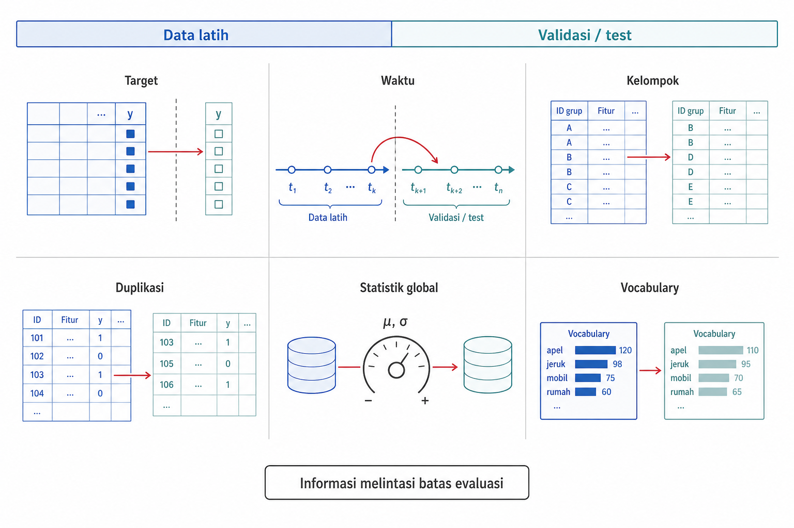
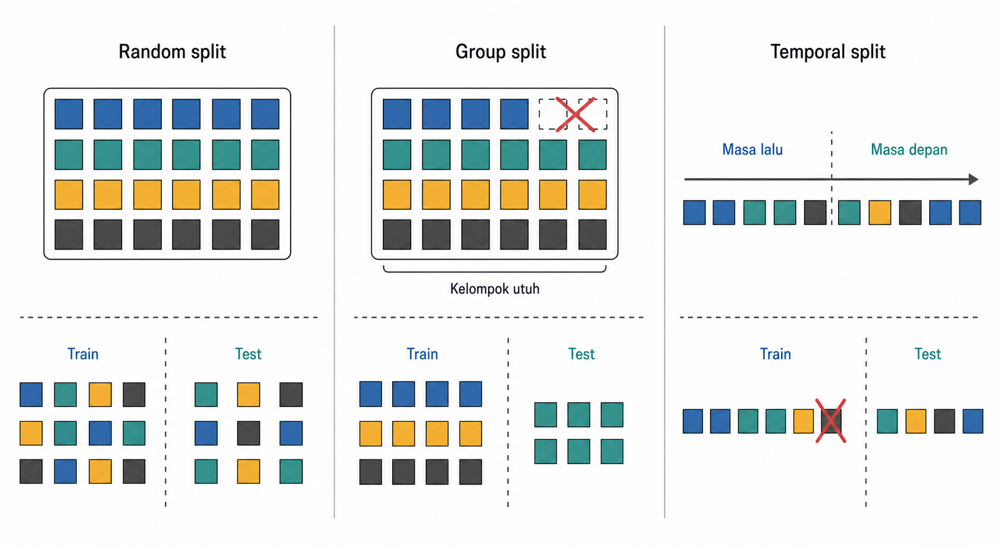
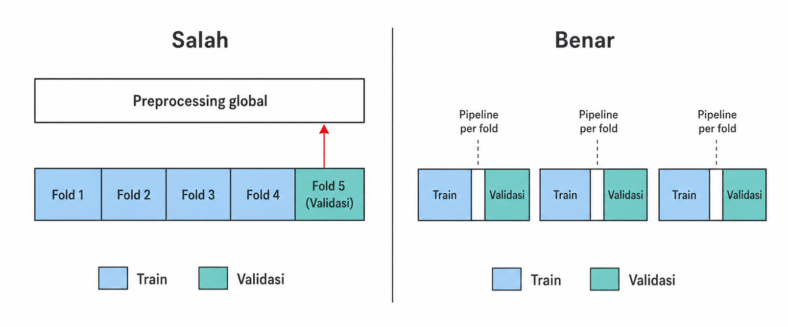

# *Pipeline*, Validasi, dan *Data Leakage*

Setelah fitur dan target disusun, pekerjaan selanjutnya mencakup pengisian nilai hilang, penskalaan fitur, pengodean kategori, seleksi fitur, pelatihan model, dan pengukuran performa. Pekerjaan tersebut tampak teknis, tetapi di sinilah banyak eksperimen menjadi tidak sah. Jika statistik dihitung dari seluruh data sebelum pemisahan train dan test, data test sudah ikut memengaruhi representasi. Jika kategori dari data test ikut membentuk kolom encoder, evaluasi tidak lagi menggambarkan keadaan saat model menghadapi data baru.

Prinsip dasarnya sederhana. Setiap langkah yang belajar dari data harus menjadi bagian dari proses pelatihan, bukan pembersihan umum yang dilakukan sekali pada seluruh dataset. Aturan ini berlaku untuk imputasi, penskalaan, pengodean, seleksi fitur, reduksi dimensi, dan penyeimbangan kelas. Bab ini membahas kontrak fit dan transform, jenis-jenis kebocoran informasi (data leakage), strategi pemisahan data, penempatan pipeline di dalam validasi silang, dan anti-pola umum yang melanggar prinsip yang sama.

## `fit` dan `transform` sebagai Kontrak Pelatihan dan Inferensi

Kesalahan dapat muncul bahkan sebelum model dilatih. Banyak transformasi terlihat seperti operasi aritmetika biasa, padahal transformasi tersebut menyimpan sesuatu dari data. Standardisasi menyimpan rata-rata dan standar deviasi. *Imputation* menyimpan median atau kategori pengisi. *One-hot encoding* menyimpan daftar negara atau kode produk yang akan menjadi kolom. Seleksi fitur menyimpan keputusan tentang fitur mana yang dianggap cukup informatif. Semua nilai dan keputusan yang dipelajari ini merupakan parameter transformasi.

Dalam bahasa *pipeline*, `fit` berarti mempelajari parameter dari data pelatihan. `transform` berarti menerapkan parameter yang sudah dipelajari tersebut pada data lain tanpa mempelajarinya ulang. Perbedaan kecil ini menjadi kontrak dasar antara pelatihan dan inferensi, dan menjadi konvensi API yang dipakai luas pada pustaka seperti scikit-learn (Pedregosa et al. 2011).

Kontrak tersebut dapat ditulis sebagai rumus berikut.

$$X' = T(X;\ \theta_{\text{train}})$$

Dengan $X$ sebagai data yang akan diubah, $T$ sebagai transformasi, dan $\theta_{\text{train}}$ sebagai parameter transformasi yang dipelajari dari data *train*, hasilnya adalah $X'$, yaitu representasi setelah transformasi. Data *train*, validasi, *test*, dan data live semuanya melewati transformasi $T$ dengan parameter $\theta_{\text{train}}$ yang sama.

Contoh kecil membuat aturan ini lebih jelas. Misalkan sebuah scaler dipelajari dari data *train* dan memperoleh rata-rata 5,0 serta standar deviasi 2,0. Angka 5,0 dan 2,0 harus tetap dipakai untuk mengubah data validasi, *test*, dan data baru beberapa bulan kemudian. Jika data live kemudian memiliki rata-rata 7,0, scaler tidak boleh diam-diam belajar ulang saat inferensi. Perubahan tersebut mungkin menandakan *drift*, tetapi kerangka acuan model tetap berasal dari pelatihan.

Pada Gambar 2.1, data *train* masuk ke `fit` untuk menghasilkan $\theta_{\text{train}}$. Setelah itu, semua data lain hanya melewati `transform`. Panah dari data *test* ke `fit` dicoret karena jalur tersebut membuat *leakage*.

{#fig-ch02-fig-1}

Jika *preprocessing* saat inferensi berbeda dari *preprocessing* saat pelatihan, kegagalan ini disebut *training-serving skew*. Model dilatih pada satu representasi, tetapi dipakai pada representasi lain. Akibatnya, evaluasi eksperimen tidak lagi menjamin perilaku produksi. *Pipeline* menjaga validitas eksperimen sekaligus keandalan *deployment*. Kontrak ini juga menjelaskan mengapa transformer perlu disimpan sebagai bagian dari sistem, bukan sebagai langkah sementara.

## Transformer yang Dapat Dipakai Ulang, Serialisasi, dan *Random State*

Kontrak `fit` dan `transform` hanya dapat dijaga jika transformasi disimpan dengan rapi. Karena menyimpan parameter, transformasi tersebut perlu diperlakukan sebagai objek atau konfigurasi yang dapat dipakai ulang. Imputer menyimpan nilai pengisi. Encoder menyimpan daftar kategori. Scaler menyimpan rata-rata, standar deviasi, minimum, atau maksimum. Jika semua ini dilakukan lewat edit manual pada spreadsheet, sulit memastikan bahwa data baru diproses dengan cara yang sama.

*Pipeline* menyusun transformer secara berurutan. Pada data tabular, kolom numerik, kategorikal, teks, dan tanggal sering membutuhkan perlakuan berbeda. `ColumnTransformer` berguna karena dapat mengirim kelompok kolom ke transformasi yang sesuai, lalu menyambungkan kembali kolom-kolom hasil transformasi secara horizontal. Ketika *preprocessing* dan model berada dalam satu *pipeline*, artefak yang disimpan tidak hanya berisi model, tetapi juga cara membentuk fitur untuk model tersebut.

Serialisasi diperlukan agar *pipeline* yang sudah di-*fit* dapat dipakai kembali untuk inferensi, audit, atau reproduksi. Dalam ekosistem Python, joblib dan pickle lazim dipakai, tetapi keduanya membawa dua catatan penting. Versi pustaka sebaiknya dicatat, dan file pickle hanya boleh dimuat jika sumbernya dipercaya. ONNX dapat menjadi pilihan ketika model atau transformasi perlu dijalankan di luar Python, misalnya pada lingkungan produksi lintas bahasa. ONNX adalah opsi, bukan kewajiban.

Komponen acak juga perlu dikendalikan. Split data, proyeksi acak, inisialisasi model, atau pencarian hiperparameter dapat memberi hasil berbeda jika sumber acaknya berubah. Pada eksperimen yang membandingkan beberapa model, splitter sebaiknya menerima `random_state` yang tetap agar lipatan datanya sama. Pada sistem yang lebih besar, lebih aman mendokumentasikan sumber acak yang penting daripada mengandalkan seed global yang mudah berubah tanpa disadari.

Beberapa utilitas membantu keterbacaan dan efisiensi. `set_output(transform="pandas")` dapat mempertahankan nama kolom setelah transformasi tertentu. `Pipeline(memory=...)` dapat menyimpan transformer yang sudah di-*fit* dalam cache, sehingga langkah yang sama tidak perlu dipelajari ulang ketika pencarian model mengulang konfigurasi serupa. Fasilitas ini bukan inti konsep, tetapi membuat *pipeline* lebih mudah diperiksa.

Transformer yang menyimpan parameter memperlihatkan sumber *leakage* dengan lebih jelas. Masalah muncul ketika parameter, kolom, atau ruang representasi terbentuk dari informasi yang seharusnya berada di luar batas evaluasi.

::: {.pendalaman}

Pendalaman

### *Pipeline* untuk *resampling* data tidak seimbang {.pendalaman-title .unnumbered .unlisted}

*Resampling* seperti SMOTE berbeda dari transformer biasa karena mengubah jumlah baris. Pada kontrak transformer standar, jumlah baris sebelum dan sesudah transformasi biasanya tetap. Karena itu, *resampling* harus ditempatkan dengan hati-hati. *Pipeline* dari imbalanced-learn menyediakan langkah `fit_resample` yang aktif pada data pelatihan, tetapi dilewati saat prediksi. Jika *resampling* dilakukan sebelum pemisahan data, atau diterapkan pada lipatan validasi, sampel sintetis dapat membawa informasi melintasi batas evaluasi. Skor yang diperoleh menjadi terlalu optimistis. *Resampling* adalah keputusan pemodelan, bukan kebiasaan *preprocessing* yang boleh diterapkan ke semua data.
:::

## Taksonomi *Leakage*

Contoh-contoh pada bagian ini kembali memakai catatan transaksi toko *online* dari Bab 1. Setiap baris mencatat sebuah item pada *invoice*, sedangkan pelanggan dapat muncul pada banyak *invoice* dan transaksi dapat diberi tanda pembatalan. Struktur ini membuat batas waktu, batas pelanggan, dan definisi target perlu dijaga ketika data dipisahkan untuk evaluasi.

Setelah kontrak *pipeline* jelas, kegagalan yang melanggarnya dapat diberi nama (Kaufman et al. 2012). *Leakage* terjadi ketika informasi yang seharusnya tidak tersedia pada saat pelatihan, validasi, atau inferensi masuk ke representasi yang dipakai model. Bentuknya tidak selalu sejelas memasukkan target sebagai fitur. Banyak kebocoran datang melalui statistik, waktu, kelompok, duplikasi, atau proses representasi.

Jenis pertama adalah *target leakage*. Sebuah fitur mengandung jawaban, proksi jawaban, atau informasi yang baru dibuat setelah kejadian target. Pada model yang memprediksi pembatalan *invoice*, penanda bahwa `InvoiceNo` diawali huruf `C` atau `Quantity` bernilai negatif tidak boleh menjadi fitur karena keduanya merupakan bagian dari definisi pembatalan. Model yang memakai fitur seperti ini tampak sangat akurat, tetapi sinyalnya berasal dari akibat, bukan tanda awal.

Jenis kedua adalah kontaminasi *train-test*. Ini terjadi ketika data validasi atau *test* ikut dipakai saat mempelajari *preprocessing*, memilih fitur, atau menetapkan parameter representasi. Menghitung median global sebelum split adalah contoh sederhana.

Jenis ketiga adalah *temporal leakage*. Informasi masa depan masuk ke prediksi masa lalu. Kesalahan ini umum pada agregasi transaksi, jendela waktu, atau split acak untuk data yang sebenarnya berurutan. Jika total belanja pelanggan dihitung menggunakan transaksi setelah *index time*, fitur tersebut tidak sah.

Jenis keempat adalah *between-group leakage*. Sampel yang saling terkait masuk ke partisi berbeda. Pada data ritel, banyak *invoice* dari pelanggan yang sama tidak boleh tersebar antara *train* dan *test* jika tujuan evaluasi adalah generalisasi ke pelanggan baru. Model dapat belajar ciri pelanggan, bukan pola yang berlaku pada pelanggan lain.

Jenis kelima adalah kebocoran duplikat atau hampir duplikat. Jika catatan yang sama muncul di *train* dan *test*, model tampak mampu memprediksi padahal hanya mengenali ulang contoh yang sudah pernah dilihat.

Jenis keenam adalah *representation leakage*. Representasi dipelajari dari seluruh korpus sebelum split. Contohnya adalah kosakata TF-IDF, *embedding*, atau reduksi dimensi yang di-*fit* pada semua data. Statistik dari data *test* ikut membentuk ruang fitur. Bab 8 dan Bab 11 akan kembali ke kasus ini pada reduksi dimensi dan representasi teks.

Gambar 2.2 menyatukan keenam jenis tersebut. Intinya sama, yaitu informasi menyeberangi batas evaluasi. Batas itu dapat berupa target, waktu, kelompok, partisi, atau proses representasi.

{#fig-ch02-fig-2}

Pembedaan nama tersebut membantu diagnosis. Dalam praktik, keenam jalur sering bertemu pada proses pembuatan fitur sebelum batas evaluasinya dikunci.

::: {.pendalaman}

Pendalaman

### Mendeteksi *target leakage* lewat *feature importance* {.pendalaman-title .unnumbered .unlisted}

Fitur yang sendirian mendominasi kualitas model dapat menjadi tanda bahaya. Pendekatan ini hanya bermakna jika model yang dilatih sudah memiliki performa di atas tebakan acak. Model yang buruk tidak dapat memberi tahu fitur mana yang penting. *Permutation importance* mengukur kenaikan error ketika nilai satu fitur diacak.
:::

$$I_j = \text{Error}\big(f(X_{\pi(j)})\big) - \text{Error}\big(f(X)\big)$$

Dengan $X_{\pi(j)}$ sebagai data dengan fitur $j$ dipermutasi, sedangkan fitur lain dibiarkan, nilai $I_j$ menyatakan kenaikan error akibat pengacakan fitur tersebut. Jika sebuah fitur yang seharusnya biasa saja menghasilkan $I_j$ sangat besar dan performa hampir sempurna saat dipakai sendiri, *target leakage* perlu dicurigai. Akan tetapi, ini hanya sinyal heuristik. Fitur yang sah dapat benar-benar kuat, dan *leakage* juga dapat tersembunyi dalam kombinasi beberapa fitur.

## Mengapa *Leakage* Sering Lahir pada Rekayasa Fitur

Pola pada taksonomi tadi sama. Kebocoran biasanya lahir ketika representasi dibangun. Model jarang menjadi sumber pertama *leakage*. Model hanya mengoptimalkan sinyal yang ada di dalam representasi. Kebocoran masuk ketika statistik dihitung, jendela waktu dibentuk, target diringkas, fitur dipilih, atau data dari banyak entitas digabung.

Misalkan median `UnitPrice` dihitung dari seluruh *dataset*, lalu dipakai untuk mengisi nilai hilang sebelum split. Langkah ini tampak seperti pembersihan data, tetapi median tersebut sudah memakai informasi dari data *test*. Contoh lain adalah fitur total belanja seumur hidup pelanggan. Jika total itu dihitung sampai akhir database, padahal prediksi dibuat pada awal bulan tertentu, transaksi masa depan ikut masuk ke fitur.

Seleksi fitur juga mudah bocor. Jika fitur dipilih berdasarkan hubungannya dengan target pada seluruh *dataset*, lalu model dievaluasi dengan *cross-validation*, setiap lipatan validasi sebenarnya sudah ikut memengaruhi daftar fitur. Hasilnya dapat jauh lebih baik daripada performa pada data baru.

Kebiasaan paling aman adalah menentukan split atau protokol validasi sebelum setiap transformasi yang bergantung pada data. Setelah batas evaluasi jelas, semua proses yang belajar dari data harus hidup di dalam batas tersebut. *Scaling*, *imputation*, *encoding*, *target encoding*, seleksi fitur, reduksi dimensi, *text vectorizer*, dan *learned embedding* mengikuti prinsip yang sama.

Batas tersebut perlu dibedakan dari batas waktu pada agregasi historis. Pemetaan dan statistik yang di-*fit*, seperti median, kosakata, atau rata-rata target per kategori, harus dipelajari hanya dari bagian pelatihan setiap lipatan. Sebaliknya, satu baris yang ditahan untuk validasi boleh memakai riwayat mentah yang memang sudah tersedia sebelum *cutoff* baris itu sendiri. Agregasi seperti ini ditentukan oleh ketersediaan informasi pada waktu prediksi, bukan oleh keanggotaan baris mentah dalam partisi sampel belajar.

Sistem produksi sering memformalkan aturan waktu melalui *feature store* dan *point-in-time joins*. Bab 1 sudah memperkenalkan konsep ini, dan Bab 6 serta Bab 17 akan membahasnya lagi. Untuk saat ini, pegang aturan dasar bahwa representasi tidak boleh memuat informasi yang belum tersedia pada saat prediksi, dan batas itu harus diterjemahkan ke strategi pemisahan data sebelum eksperimen dimulai.

## Memilih Strategi Pemisahan Data

Setelah sumber kebocoran dikenali, batas evaluasi harus dipilih sesuai cara data dihasilkan dan cara model akan dipakai. *Random split* wajar jika baris-baris data dapat dianggap cukup independen dan berasal dari distribusi yang serupa. Tabel pelanggan yang sudah diringkas menjadi satu baris per pelanggan, misalnya, sering dapat dibagi secara acak. Jika label langka, stratifikasi membantu menjaga proporsi kelas pada *train* dan *test*. Rasio seperti 80 banding 20 atau 70 banding 30 bisa menjadi awal, tetapi yang lebih penting adalah protokol validasi mengikuti struktur data, bukan mengejar rasio tertentu.

Stratifikasi tidak menyelesaikan ketidakcocokan kelompok atau waktu. Pelanggan yang sama muncul di *train* dan *test* bukan otomatis *leakage*. Jika model akan dipakai untuk pelanggan yang belum pernah terlihat, *random split* dapat membiarkan model memanfaatkan ciri identitas pelanggan sehingga *group split* diperlukan. Jika model justru memprediksi masa depan untuk pelanggan yang sudah dikenal, pelanggan yang sama boleh muncul pada kedua sisi selama evaluasinya temporal dan setiap fitur dibangun secara *point-in-time* dari informasi yang tersedia sebelum *cutoff* masing-masing baris. Pada data berurutan waktu, *random split* tetap bermasalah jika menaruh masa depan di *train* dan masa lalu di *test*.

Ketika tujuan *deployment* adalah generalisasi ke kelompok yang belum pernah terlihat, *group split* menjaga agar identitas yang sama tidak muncul di dua sisi evaluasi. Secara ringkas, aturannya dapat ditulis seperti berikut.

$$G_{\text{train}} \cap G_{\text{test}} = \emptyset$$

Artinya, himpunan identitas kelompok pada *train* dan *test* tidak boleh beririsan. Kelompok tersebut dapat berupa pelanggan, *invoice* induk, pasien, sekolah, perangkat, dokumen induk, atau institusi.

Pada data temporal, split harus meniru prediksi masa depan dari masa lalu. `TimeSeriesSplit` adalah salah satu pola umum, tetapi pemisah ini bekerja berdasarkan indeks baris, bukan stempel waktu. Karena itu, data harus diurutkan secara kronologis sebelum `TimeSeriesSplit` diterapkan. Parameter `gap` menghitung jumlah baris atau sampel, bukan lama waktu. Pada stempel waktu yang tidak teratur, `gap=500` tidak selalu berarti jeda waktu yang sama antarlipatan. Jika protokol memerlukan jeda durasi tertentu atau perlu mengeluarkan sampel karena jendela target bertumpang tindih, gunakan pemisah khusus berbasis stempel waktu atau logika *purged split* yang mengikuti ketersediaan label dan jendela target.

Tabel 2.1 menyusun pilihan split sebagai keputusan, bukan sebagai katalog alat. Kolom situasi data menjadi titik awal karena bentuk data menentukan risiko, lalu risiko menentukan strategi.

::: {.tabel-buku}

| Situasi data | Risiko jika salah | Strategi | Contoh |
| --- | --- | --- | --- |
| Baris independen | Rendah, *random split* cukup | *Random split*, dengan stratifikasi bila label langka | Tabel pelanggan yang sudah diringkas satu baris per pelanggan |
| *Deployment* ke entitas baru dengan baris berulang | Model memanfaatkan ciri identitas entitas yang sudah terlihat | *Group split* (`GroupKFold`) | Generalisasi ke pelanggan baru dari banyak *invoice* per pelanggan |
| *Deployment* ke entitas baru dan label langka | Ciri identitas berulang atau kelas timpang | `StratifiedGroupKFold` | Pelanggan baru, pembatalan langka |
| *Deployment* memprediksi masa depan | *Temporal leakage* | *Temporal split* (`TimeSeriesSplit`, dengan `gap` bila buffer berbasis jumlah baris sesuai) | Pembelian ulang, *forecasting*, sensor |
| *Deployment* ke institusi atau kelompok besar yang baru | Model menghafal kelompok besar yang sudah terlihat | *Group split* di level kelompok besar | Generalisasi ke negara atau cabang baru |

: Memilih strategi pemisahan data {#tbl-ch02-8}

:::

Pada Gambar 2.3, tiga pola tersebut ditempatkan pada sketsa *dataset* kecil. *Random split* memecah baris tanpa memperhatikan identitas atau waktu. *Group split* menjaga entitas tetap utuh. *Temporal split* menjaga arah masa lalu ke masa depan.

{#fig-ch02-fig-3}

Jika generalisasi ke kelompok baru, *group integrity*, dan keseimbangan kelas sama-sama penting, `StratifiedGroupKFold` dapat dipertimbangkan, meskipun stratifikasi mungkin hanya bersifat aproksimasi jika kelompok-kelompok mempunyai distribusi kelas yang sangat berbeda. Jika data benar-benar temporal, stratifikasi label tidak boleh mengalahkan urutan waktu. Pilihan split yang nyaman tetapi tidak sesuai proses data biasanya menghasilkan evaluasi yang nyaman juga, tetapi salah. Setelah batasnya dipilih, batas yang sama harus bertahan di dalam setiap pengulangan validasi, bukan hanya pada satu pemisahan awal.

## *Pipeline* di Dalam *Cross-Validation*

Setelah strategi split dipilih, aturan yang sama harus berlaku di dalam *cross-validation* (Kohavi 1995). *Cross-validation* mengulang proses pelatihan dan validasi pada beberapa lipatan data. Pada setiap lipatan, sebagian data menjadi bagian pelatihan dan sebagian lainnya ditahan sebagai validasi. Karena setiap lipatan mensimulasikan data baru, *preprocessing* harus dipelajari hanya dari bagian pelatihan lipatan tersebut.

Siklus satu lipatan berjalan dengan urutan yang sama. *Pipeline* di-*fit* pada bagian pelatihan, bagian validasi diubah memakai parameter dari pelatihan tersebut, skor dihitung, lalu *pipeline* dibuang. Pada lipatan berikutnya, proses yang sama diulang dari awal. Perulangan ini terasa mahal, tetapi itulah harga evaluasi yang jujur.

Jika transformer diletakkan di luar *cross-validation*, prosesnya bocor. Contohnya, scaler di-*fit* sekali pada semua data, lalu hanya model yang divalidasi silang. Dalam keadaan ini, setiap lipatan validasi sudah ikut menentukan rata-rata dan standar deviasi. Kesalahannya mungkin kecil pada *dataset* besar dan stabil, tetapi prinsip evaluasinya tetap rusak.

Rumus rata-rata K-fold dapat ditulis sebagai berikut.

$$CV_{(K)} = \frac{1}{K}\sum_{k=1}^{K} E_k$$

Dengan $K$ sebagai jumlah lipatan dan $E_k$ sebagai error pada lipatan ke-$k$, nilai rata-rata ini bermakna hanya jika setiap $E_k$ diperoleh dari *pipeline* yang di-*fit* tanpa melihat lipatan validasinya.

Gambar 2.4 membandingkan pola yang salah dan benar. Pada jalur yang salah, *preprocessing* dilakukan sekali pada seluruh data, lalu *cross-validation* hanya mengelilingi model. Pada jalur yang benar, seluruh *pipeline* berada di dalam setiap lipatan.

{#fig-ch02-fig-4}

Aturan ini berlaku untuk *scaling*, *imputation*, *encoding*, seleksi fitur, reduksi dimensi, dan *target encoding*. Semua langkah yang mempelajari sesuatu dari data harus berada dalam *pipeline* yang divalidasi. Logika ini tidak bergantung pada scikit-learn. Dalam R, SQL, Spark, atau *workflow* *deep learning*, batasnya tetap sama, yaitu lipatan validasi tidak boleh ikut membentuk representasi yang menilainya.

Biaya komputasi memang bertambah karena transformer di-*fit* berulang. Dalam pencarian model yang mengulang konfigurasi serupa, caching seperti `Pipeline(memory=...)` dapat membantu. Akan tetapi, caching hanya mempercepat perhitungan. Aturan validasi tetap sama.

::: {.pendalaman}

Pendalaman

### *Nested cross-validation* {.pendalaman-title .unnumbered .unlisted}

Ketika hiperparameter dipilih dan performa dilaporkan dari lipatan yang sama, estimasi performa dapat terlalu optimistis. Pilihan hiperparameter sudah terpengaruh oleh lipatan tersebut melalui proses tuning. *Nested cross-validation* memisahkan dua pekerjaan. *Inner loop* memilih hiperparameter, termasuk ambang seleksi fitur atau kekuatan regularisasi. *Outer loop* mengukur generalisasi pada data yang tidak dipakai untuk tuning. Biayanya lebih besar karena jumlah pelatihan berlipat, tetapi pemisahan ini penting pada *dataset* kecil, pencarian agresif, atau laporan eksperimen yang harus dipercaya.
:::

## Anti-Pola Umum

Setelah kontrak, taksonomi, split, dan *cross-validation* ditempatkan dalam satu alur, beberapa kesalahan berulang tampak sebagai pelanggaran prinsip yang sama. Ada yang melakukan *scaling* atau imputasi pada seluruh *dataset* sebelum split. Ada yang memilih fitur dengan seluruh data sebelum *cross-validation*. Ada pula yang memanggil `fit_transform` pada data *test*, padahal data *test* seharusnya hanya menerima parameter dari data *train*.

Untuk standardisasi, transformasi data *test* yang benar ditulis sebagai berikut.

$$x'_{\text{test}} = \frac{x_{\text{test}} - \mu_{\text{train}}}{\sigma_{\text{train}}}$$

Dengan $x_{\text{test}}$ sebagai nilai mentah pada data *test*, sedangkan $\mu_{\text{train}}$ dan $\sigma_{\text{train}}$ sebagai rata-rata dan standar deviasi dari data *train*, data *test* hanya ditempatkan pada kerangka acuan yang sudah dipelajari dari pelatihan. Jika data *test* menghitung rata-rata dan standar deviasinya sendiri, kontrak pada Bagian 2.1 dilanggar.

Anti-pola lain berkaitan dengan waktu dan kelompok. Membuat jendela *time series* yang saling tumpang tindih, lalu membaginya secara acak, dapat menaruh potongan hampir sama di *train* dan *test*. Tumpang tindih riwayat tidak otomatis menjadi *leakage*, tetapi split menjadi tidak sah jika jendela target atau ketersediaan label melintasi batas evaluasi dan protokol *deployment* tidak lagi ditiru. Agregat pelanggan juga baru bocor jika memakai kejadian yang belum tersedia pada *cutoff* baris tersebut atau pemetaan yang dipelajari dari bagian tertahan. Baris tertahan tetap boleh memakai riwayat mentah yang tersedia sebelum *cutoff*-nya. Memakai field turunan target seperti "days until next purchase" atau penanda pembatalan *invoice* sebagai prediktor adalah *target leakage* yang terang-terangan.

Ada pula kesalahan eksperimental seperti melaporkan hanya fold terbaik, atau mencoba banyak variasi lalu melaporkan yang paling menguntungkan tanpa prosedur validasi yang jelas. Praktik seperti ini tidak selalu disebut *leakage*, tetapi menghasilkan estimasi yang sama-sama terlalu optimistis.

Tabel 2.2 menyatukan anti-pola yang perlu dihindari. Isinya dapat dipakai sebagai daftar periksa sebelum mempercayai hasil eksperimen.

::: {.tabel-buku}

| Anti-pola | Mengapa berbahaya | Perbaikan |
| --- | --- | --- |
| *Scaling* atau imputasi seluruh *dataset* sebelum split | Statistik *test* masuk ke transformasi | Fit transformer hanya pada data *train* |
| Seleksi fitur pada semua data sebelum *cross-validation* | Lipatan validasi ikut memilih fitur | Letakkan seleksi fitur di dalam *pipeline* CV |
| Split acak ketika jendela target atau ketersediaan label melintasi batas | Evaluasi memakai sampel yang belum semestinya tersedia | Gunakan *temporal split* atau *purged split* sesuai jendela target. Pakai *group split* hanya untuk generalisasi ke unit baru |
| Encoding kategori dengan mapping dari data *test* | Kategori *test* ikut membentuk ruang fitur | Pelajari mapping dari *train*, tangani kategori baru secara eksplisit (strategi kategori baru dibahas di Bab 4) |
| Agregat memasukkan kejadian setelah *cutoff* baris | Informasi yang belum tersedia masuk ke fitur | Hitung agregat *point-in-time* dari riwayat mentah yang tersedia sebelum *cutoff* setiap baris |
| Field turunan target dipakai sebagai prediktor | Fitur sudah memuat jawaban atau akibat target | Hapus field pascatarget dari fitur |
| `fit_transform` dipanggil pada data *test* | Parameter transformasi dipelajari ulang dari *test* | Gunakan `transform` dengan parameter *train* |
| Hanya fold atau eksperimen terbaik yang dilaporkan | Estimasi performa bias optimistis | Laporkan protokol lengkap dan hasil agregat |

: Anti-pola umum dan perbaikannya {#tbl-ch02-9}

:::

Daftar tersebut menyatukan satu prinsip yang sama bahwa data yang dipakai untuk menilai model tidak boleh ikut membentuk representasi yang sedang dinilai.

::: {.sintesis-bab}

## Sintesis Bab {.unnumbered .unlisted}

*Pipeline* menjaga batas pengetahuan antara pelatihan, validasi, dan inferensi. Setiap transformasi yang belajar dari data memiliki parameter. Parameter tersebut dipelajari dari data pelatihan sesuai batas evaluasi, lalu dipakai kembali untuk validasi, *test*, dan data baru.

*Leakage* muncul ketika batas itu dilanggar. Bentuknya dapat berupa *target leakage*, kontaminasi *train-test*, *temporal leakage*, *between-group leakage*, duplikasi, atau *representation leakage*. Nama-nama tersebut berbeda, tetapi pelajarannya sama. Representasi yang sedang dinilai tidak boleh dibentuk oleh data yang seharusnya menjadi penguji. Karena rekayasa fitur sering menghitung statistik lintas baris, waktu, entitas, atau target, bab-bab berikutnya akan terus merujuk pada prinsip ini.

Strategi split menerjemahkan batas evaluasi ke bentuk data. *Random split* cocok ketika sampel cukup independen, *group split* diperlukan ketika model harus melakukan generalisasi ke kelompok yang belum terlihat, dan *temporal split* diperlukan ketika model akan memprediksi masa depan. Dalam *cross-validation*, seluruh *pipeline* harus berada di dalam setiap lipatan.

Praktik pipeline yang benar memang menambah disiplin dan kadang biaya komputasi. Akan tetapi, tanpa disiplin tersebut, angka evaluasi dapat tampak tinggi tetapi tidak bermakna. Buku ini memperlakukan validasi dan representasi sebagai dua sisi dari pekerjaan yang sama. Fitur hanya berguna jika cara membuatnya sah pada saat model benar-benar dipakai.
:::

## Bacaan Lanjutan {.bacaan-lanjutan .unnumbered .unlisted}

- scikit-learn --- Common Pitfalls --- <https://scikit-learn.org/stable/common_pitfalls.html>. Anti-pola umum dan kebocoran data saat praproses.

- scikit-learn --- Pipelines & composite estimators --- <https://scikit-learn.org/stable/modules/compose.html>. Merangkai transformasi dan model tanpa bocor lintas split.

- scikit-learn --- Cross-validation --- <https://scikit-learn.org/stable/modules/cross_validation.html>. Strategi validasi silang, termasuk untuk data terkelompok dan berurutan.

- scikit-learn --- Model persistence --- <https://scikit-learn.org/stable/model_persistence.html>. Menyimpan dan memuat kembali pipeline terlatih.

- Google --- Rules of Machine Learning --- <https://developers.google.com/machine-learning/guides/rules-of-ml>. Praktik rekayasa ML, termasuk training--serving skew.

- Kaufman dkk. (2012), "Leakage in Data Mining" (ACM TKDD) --- <https://doi.org/10.1145/2382577.2382579>. Taksonomi formal kebocoran data.

## Rujukan {.rujukan .unnumbered .unlisted}

::: {.references}

Kaufman, Shachar, Saharon Rosset, Claudia Perlich, and Ori Stitelman. 2012. "Leakage in Data Mining: Formulation, Detection, and Avoidance." *ACM Transactions on Knowledge Discovery from Data* 6 (4): 1--21. <https://doi.org/10.1145/2382577.2382579>.

Kohavi, Ron. 1995. "A Study of Cross-Validation and Bootstrap for Accuracy Estimation and Model Selection." *Proceedings of the 14th International Joint Conference on Artificial Intelligence (IJCAI)*.

Pedregosa, Fabian, Gaël Varoquaux, Alexandre Gramfort, et al. 2011. "Scikit-Learn: Machine Learning in Python." *Journal of Machine Learning Research* 12: 2825--30.

:::
