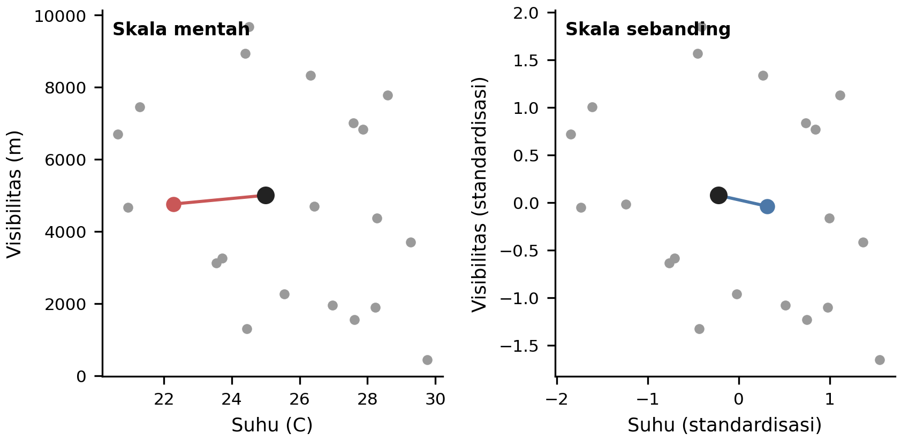
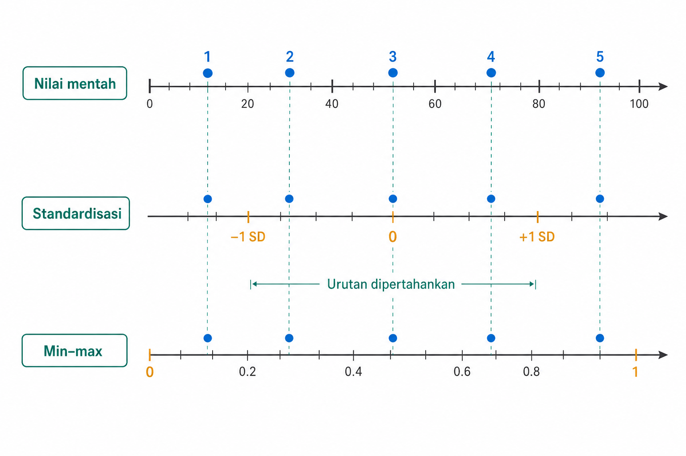
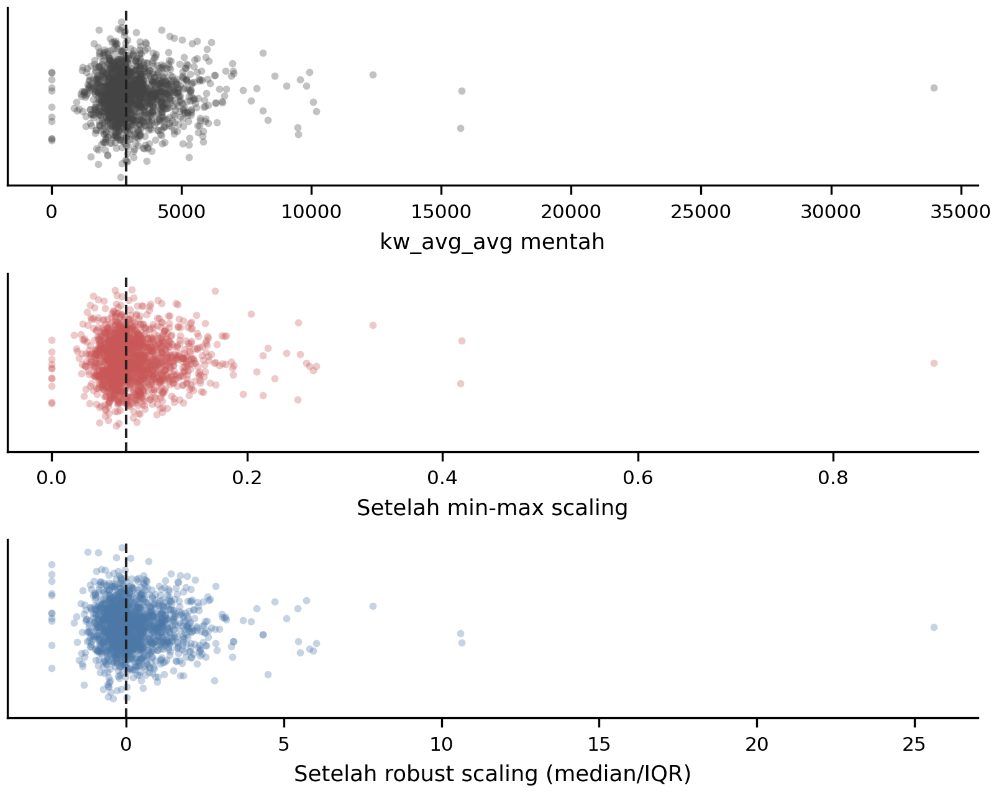
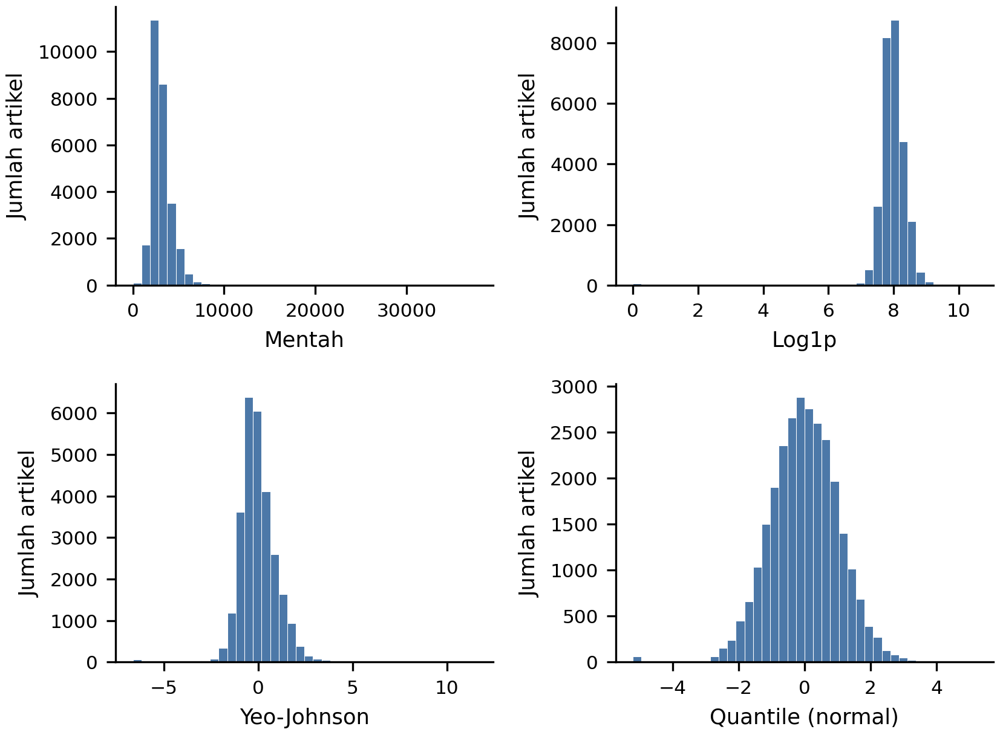
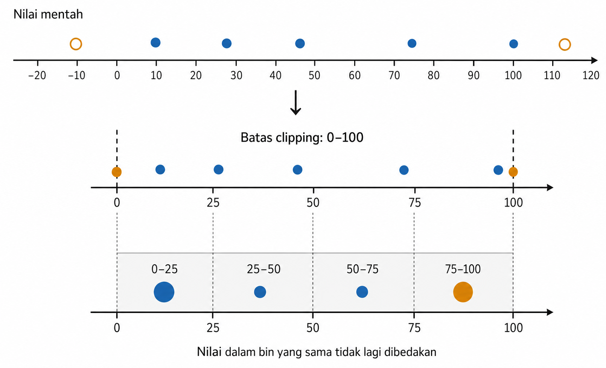
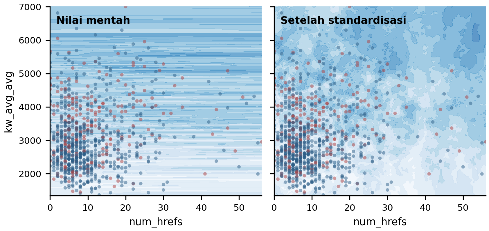

# Representasi Fitur Numerik

Fitur numerik sering dianggap lebih siap masuk ke model dibandingkan teks atau gambar, tetapi angka mentah tidak otomatis menjadi representasi yang baik. Fitur yang berbeda hidup pada rentang yang berbeda. Beberapa nilai ekstrem mungkin sah dan penting, sedangkan yang lain dapat mendominasi skala seluruh fitur. Distribusi yang menjulur (skewed) dapat membuat model linear kesulitan membaca pola, sedangkan model berbasis jarak dapat terlalu mengikuti fitur yang satuannya besar.

Bab ini membahas cara membentuk ulang fitur numerik agar lebih sesuai dengan model yang digunakan. Persoalan skala dan bentuk distribusi perlu dibedakan karena keduanya menuntut penanganan yang berbeda. Standardisasi, penskalaan min-max, penskalaan tangguh (robust scaling), transformasi pangkat (power transform), transformasi kuantil, pemotongan nilai (clipping), dan pengelompokan nilai (binning) dibahas bersama risikonya masing-masing. Bab ini menguraikan pemilihan transformasi berdasarkan cara keluarga model membaca fitur, baik melalui jarak, gradien, maupun pemisahan (split).

## Skala dan Bentuk Distribusi

Contoh kerja pada bagian ini menggunakan dataset Online News Popularity. Setiap baris merekam satu artikel berita *online* dengan metadata numerik, termasuk jumlah tautan (`num_hrefs`), statistik historis kata kunci (`kw_avg_avg`), dan jumlah pembagian artikel (`shares`). Dua fitur dapat sama-sama sah tetapi hidup pada dunia ukuran yang berbeda. Jumlah tautan biasanya berupa cacahan kecil, sedangkan statistik historis kata kunci dapat mencapai puluhan ribu. Jika fitur-fitur seperti ini dipakai bersama dalam model berbasis jarak, satu fitur dapat mendominasi perhitungan, bukan karena fitur tersebut selalu lebih penting, melainkan karena rentang angkanya lebih besar.

Inilah masalah skala. Skala menyangkut besar nilai, rentang, dan variasi yang ditempuh sebuah fitur. Fitur dengan rentang 0 sampai 1, 0 sampai 100, dan 0 sampai 10.000.000 tidak memberi pengaruh numerik yang sama pada model yang menghitung jarak, *dot product*, margin, atau penalti koefisien. Dalam keadaan seperti itu, transformasi seperti *standardization*, *min-max scaling*, atau *robust scaling* dapat membuat beberapa fitur menjadi lebih sebanding.

Skala berbeda dari bentuk distribusi. Fitur `kw_avg_avg`, misalnya, dapat berisi banyak artikel dengan nilai sedang dan sedikit artikel dengan nilai sangat tinggi. Distribusi seperti ini disebut *skewed* atau berekor berat. Mengubah skalanya saja tidak otomatis membuat distribusi tersebut menjadi simetris. Nilai ekstrem masih berada di ekor, dan sebagian besar observasi masih menumpuk di daerah kecil. Untuk masalah seperti ini, kita sering membutuhkan *log transform*, *power transform*, *quantile transform*, atau penanganan nilai ekstrem yang lebih eksplisit.

Contoh suhu dan visibilitas pada Gambar 3.1 memperlihatkan bagaimana skala mentah dapat meregangkan ruang fitur. Titik-titiknya sama, tetapi lingkungan yang tampak dekat atau jauh berubah ketika kedua sumbu dibuat lebih sebanding.

{#fig-ch03-fig-1}

Transformasi numerik membentuk kembali representasi agar angka mentah lebih sesuai dengan asumsi dan mekanisme model. Jika transformasi memiliki parameter yang dipelajari, seperti rata-rata, standar deviasi, nilai minimum, maksimum, kuantil, atau batas interval, parameter tersebut harus berasal dari data *train* dan dipakai ulang pada validasi, *test*, serta data baru.

## Standardisasi dan *Min-Max Scaling*

Setelah skala dipisahkan dari bentuk distribusi, transformasi pertama yang perlu dikuasai adalah standardisasi. Dalam standardisasi, setiap nilai dikurangi dengan rata-rata fitur, lalu dibagi dengan standar deviasi. Jika $x$ adalah nilai mentah, maka bentuk sederhananya ditulis sebagai berikut.

$$x' = \frac{x - \mu}{\sigma}$$

Dengan $\mu$ sebagai rata-rata fitur pada data *train* dan $\sigma$ sebagai standar deviasi fitur pada data *train*, hasil transformasi berpusat di sekitar nol pada data *train* dan mempunyai skala variasi yang lebih sebanding dengan fitur lain. Itulah sebabnya standardisasi sering menjadi pilihan awal untuk *k-NN*, SVM dengan *RBF kernel*, regresi linear atau logistik dengan *regularization*, PCA, dan banyak metode berbasis optimisasi gradien.

Standardisasi tidak membatasi nilai ke interval tertentu. Nilai yang jauh dari rata-rata tetap dapat berubah menjadi angka besar, misalnya 4, 6, atau -5 dalam satuan standar deviasi. Ini bukan kesalahan. Standardisasi memang membuat skala variasi lebih sebanding, bukan memotong nilai ekstrem.

Pilihan lain adalah *min-max scaling*. Transformasi ini memetakan fitur secara linear ke rentang tertentu, biasanya $[0, 1]$.

$$x' = \frac{x - x_{\min}}{x_{\max} - x_{\min}}$$

Nilai $x_{\min}$ dan $x_{\max}$ juga dihitung dari data *train*. Jika rentang targetnya $[0, 1]$, nilai minimum *train* menjadi 0 dan nilai maksimum *train* menjadi 1. Transformasi ini berguna ketika komponen hilir memang mengharapkan *input* dalam rentang tetap, misalnya intensitas piksel 0 sampai 255 yang dipetakan ke $[0, 1]$, atau fitur numerik yang ingin dijaga tetap berada dalam batas tertentu.

Kedua transformasi tersebut bersifat linear dan monoton untuk setiap fitur. Artinya, dalam satu fitur, urutan nilai dipertahankan. Jika 30 lebih besar dari 20 sebelum transformasi, maka hasil transformasinya juga lebih besar. Jarak relatif di dalam fitur berubah secara linear. Namun, semua jarak multivariat tidak dipertahankan. Justru tujuan *scaling* adalah mengubah bobot relatif antar fitur, sehingga jarak gabungan pada beberapa dimensi memang dapat berubah.

Gambar 3.2 menunjukkan perbedaan cara membaca standardisasi dan *min-max scaling*. Standardisasi memakai rata-rata dan standar deviasi sebagai jangkar, sedangkan *min-max scaling* memakai minimum dan maksimum.

{#fig-ch03-fig-2}

Kelemahan utama *min-max scaling* adalah ketergantungannya pada nilai ekstrem. Jika satu artikel dengan statistik kata kunci sangat tinggi menetapkan batas maksimum, sebagian besar artikel biasa dapat terdesak ke bagian kecil dekat nol. Karena itu, *min-max scaling* tidak mengurangi pengaruh *outlier*. Metode ini hanya memasukkan *outlier* ke dalam rentang yang dipilih.

Ada juga `MaxAbsScaler`, yang membagi nilai dengan nilai absolut terbesar sehingga hasilnya berada pada rentang sekitar $[-1, 1]$ tanpa menggeser nol. Catatan ini berguna terutama untuk data jarang (*sparse*) atau fitur yang memang berpusat di sekitar nol. Untuk sebagian besar pembahasan dasar, standardisasi dan *min-max scaling* sudah cukup sebagai dua pola utama.

Scaler harus berada di dalam *pipeline* pemodelan. Proses *fit* dilakukan pada data *train*, lalu parameter yang sama dipakai untuk mengubah data *train*, validasi, *test*, dan data inferensi. Jika scaler dihitung dari seluruh data sebelum pemisahan, evaluasi menjadi terlalu optimistis karena informasi dari data *test* telah masuk ke proses representasi. Dua scaler linear ini tetap memakai rata-rata, standar deviasi, minimum, atau maksimum sebagai jangkar. Ketika nilai ekstrem menarik jangkar tersebut, masalah skala belum selesai.

## *Robust Scaling*

Nilai ekstrem dapat sah, tetapi tidak selalu pantas menentukan skala semua observasi lain. Standardisasi memakai rata-rata dan standar deviasi, dua statistik yang dapat tertarik oleh *outlier*. *Min-max scaling* bahkan lebih langsung terpengaruh karena satu nilai minimum atau maksimum dapat menentukan seluruh rentang. Pada data popularitas berita, artikel dengan kata kunci yang pernah sangat populer bisa saja sah, walaupun nilainya terlalu jauh untuk menjadi jangkar skala semua artikel lain.

*Robust scaling* menjawab masalah tersebut dengan memakai statistik yang lebih tahan terhadap *outlier* (Huber 1981), yaitu median dan rentang interkuartil. Median adalah nilai tengah setelah data diurutkan. Rentang interkuartil, atau IQR, adalah selisih antara kuartil ketiga dan kuartil pertama.

$$\text{IQR} = Q_3 - Q_1$$

Bentuk transformasinya dapat ditulis sebagai berikut.

$$x' = \frac{x - \operatorname{median}(X_{\text{train}})}{\operatorname{IQR}(X_{\text{train}})}$$

Dengan cara ini, pusat fitur ditentukan oleh median, bukan rata-rata. Skala penyebutnya ditentukan oleh sebaran bagian tengah data, bukan oleh standar deviasi yang mudah membesar ketika ada nilai ekstrem. Pada `RobustScaler`, rentang kuantil bawaan adalah persentil 25 sampai 75, yaitu IQR.

Pada contoh popularitas berita, satu artikel dengan statistik kata kunci sangat tinggi dapat menentukan nilai maksimum. *Min-max scaling* kemudian menekan mayoritas artikel biasa ke rentang yang sempit. *Robust scaling* tidak menghilangkan nilai ekstrem tersebut, tetapi membuat sebaran kelompok utama lebih terbaca karena skala tidak ditetapkan oleh nilai paling jauh. Median dan IQR masih mewakili kelompok utama observasi dengan lebih stabil.

Gambar 3.3 membandingkan efek ini pada satu distribusi. Titik ekstrem masih ada setelah *robust scaling*, tetapi kelompok utama tidak lagi terlalu terkompresi oleh batas minimum dan maksimum.

{#fig-ch03-fig-3}

*Robust scaling* tidak menghapus *outlier*. Nilai ekstrem tetap ekstrem setelah transformasi, bahkan kadang terlihat semakin jelas karena pusat data lebih stabil. Keadaan ini menguntungkan jika artikel yang sangat populer membawa sinyal yang memang penting. Jika nilai ekstrem perlu ditahan agar model tidak bereaksi berlebihan, *clipping* atau *capping* dapat digunakan seperti yang dibahas pada Bagian 3.5. Analisis mengenai kesalahan, variasi sah, atau sinyal khusus pada nilai ekstrem dibahas lebih lengkap pada Bab 5.

Seperti scaler lain, median dan IQR dihitung dari data *train*, lalu nilai yang sama dipakai untuk validasi, *test*, dan data baru. Jadi, representasi yang dipakai saat evaluasi tetap mengikuti kondisi pelatihan. Setelah skala dibuat lebih tahan terhadap nilai ekstrem, masih ada kasus ketika yang bermasalah bukan pusat atau penyebutnya, melainkan bentuk distribusi itu sendiri.

## *Power Transform* dan *Quantile Transform*

Jika scaler, termasuk *robust scaling*, terutama mengatur pusat dan satuan, transformasi berikutnya menyasar bentuk distribusi. Ada fitur numerik yang sangat *skewed*, berekor berat, atau variansnya membesar ketika nilai fitur makin tinggi. Dalam situasi seperti ini, mengurangi rata-rata dan membagi standar deviasi tidak cukup. Kita perlu mengubah bentuk distribusi secara monoton per fitur.

Transformasi paling mudah dipahami adalah *log transform*. Untuk fitur non-negatif seperti `kw_avg_avg`, `num_hrefs`, atau `shares`, bentuk yang sering dipakai ditulis sebagai berikut.

$$x' = \ln(1 + x)$$

Tambahan 1 membuat nilai nol tetap dapat diproses. Intuisi log sederhana. Perbedaan dari 10 ke 100 sering terasa lebih besar secara relatif daripada perbedaan dari 10.010 ke 10.100, walaupun keduanya sama-sama berbeda 90 pada skala mentah. Log menekan bagian ekor kanan lebih kuat daripada bagian dekat nol, sehingga fitur yang sangat *skewed* dapat menjadi lebih mudah digunakan.

*Power transform* memperluas gagasan ini. Alih-alih memilih bentuk tetap seperti log, metode ini mencari parameter pangkat $\lambda$ dari data *train*. Salah satu keluarga klasiknya adalah *Box-Cox* (Box and Cox 1964), yang berlaku untuk nilai positif.

$$x^{(\lambda)} = \begin{cases} \dfrac{x^{\lambda} - 1}{\lambda} & \lambda \neq 0 \\[4pt] \ln(x) & \lambda = 0 \end{cases}$$

Syaratnya $x > 0$. Parameter $\lambda$ diestimasi dari data *train* dengan *maximum likelihood*, yaitu dipilih agar data hasil transformasi paling sesuai dengan tujuan stabilisasi varians dan pengurangan *skew*. Di pustaka seperti scikit-learn, hasil transformasi ini sering distandardisasi ulang secara otomatis, sedangkan parameter `standardize` mengendalikan langkah tambahan tersebut. Rumus ini juga menunjukkan bahwa log bukan trik terpisah. Log adalah kasus khusus *Box-Cox* ketika $\lambda = 0$.

Di sisi lain, *quantile transform* memakai peta yang lebih kuat. Transformasi ini mengestimasi fungsi distribusi empiris dari sebuah fitur, lalu memetakan nilai ke distribusi target, misalnya uniform atau normal. Karena peta ini dipelajari dari kuantil data, fitur yang awalnya sangat *skewed* dapat dipaksa memiliki bentuk marginal yang jauh lebih rapi.

Kekuatan ini datang bersama risiko. *Quantile transform* bersifat nonlinear. Transformasi ini dapat mengubah jarak antar nilai dan struktur korelasi antar fitur, terutama jika hubungan linear semula penting bagi model. Nilai baru di luar rentang yang dipelajari juga dapat terdorong ke batas distribusi target. Log memberi intervensi paling ringan karena bentuknya tetap. *Power transform* mempelajari satu parameter bentuk, sedangkan *quantile transform* mempelajari peta distribusi yang jauh lebih *data-driven*. Karena itu, keandalan peta ini bergantung pada jumlah sampel pelatihan. Pada *dataset* kecil, log atau *power transform* sering lebih sesuai.

Gambar 3.4 menempatkan perbedaan ini secara visual. *Scaling* hanya mengubah satuan pada sumbu. Log, *power transform*, dan *quantile transform* mengubah bentuk sebaran nilai. Ekor kanan dapat memendek, nilai yang semula bertumpuk dapat menyebar, dan model yang peka terhadap bentuk distribusi mendapat representasi yang lebih mudah dipakai.

{#fig-ch03-fig-4}

Secara implementasi konseptual, *power transform* dan *quantile transform* adalah transformer yang di-*fit* pada data *train*. *Log transform* dapat bersifat stateless, misalnya melalui `FunctionTransformer` untuk `log1p`, tetapi sebaiknya tetap diletakkan di *pipeline* yang sama agar perlakuan data *train*, validasi, *test*, dan inferensi tetap konsisten.

::: {.pendalaman}

Pendalaman

### Yeo-Johnson dan batas praktis quantile transform {.pendalaman-title .unnumbered .unlisted}

*Yeo-Johnson* memperluas ide *Box-Cox* agar dapat menerima nilai nol dan negatif.
:::

$$\psi(x, \lambda) = \begin{cases} \dfrac{(x + 1)^{\lambda} - 1}{\lambda} & \lambda \neq 0,\ x \geq 0 \\[4pt] \ln(x + 1) & \lambda = 0,\ x \geq 0 \\[4pt] -\dfrac{(1 - x)^{2 - \lambda} - 1}{2 - \lambda} & \lambda \neq 2,\ x < 0 \\[4pt] -\ln(1 - x) & \lambda = 2,\ x < 0 \end{cases}$$

Dengan $x$ sebagai nilai fitur dan $\lambda$ sebagai parameter transformasi yang diestimasi dari data *train*, sisi positif rumus ini mirip *Box-Cox* dengan pergeseran $x + 1$. Pada sisi negatif, rumusnya dicerminkan melalui $1 - x$, sehingga seluruh bilangan real dapat diproses. Untuk *quantile transform*, batas praktisnya adalah jumlah sampel. Peta kuantil empiris tidak dapat mempunyai titik jangkar lebih banyak daripada sampel *train*. Jika `n_quantiles` yang diminta lebih besar daripada jumlah sampel, scikit-learn membatasi nilai efektifnya ke jumlah sampel. Pada *dataset* kecil, peta ini dapat menjadi kasar dan mudah mengikuti *noise* sampel. Dalam keadaan seperti itu, log atau *power transform* sering lebih sesuai sebagai langkah awal.

## *Clipping* dan *Binning*

Log, *power transform*, dan *quantile transform* mengubah bentuk distribusi, tetapi tetap mempertahankan setiap observasi sebagai nilai kontinu. Ada kasus ketika transformasi halus masih belum cukup karena masalahnya terletak pada pengaruh nilai yang terlalu jauh. *Clipping* atau *capping* mengganti nilai di bawah atau di atas batas tertentu dengan nilai batas tersebut. Jika $\theta_{\min}$ adalah batas bawah dan $\theta_{\max}$ adalah batas atas, aturannya dapat ditulis sebagai berikut.

$$x_{\text{clip}} = \begin{cases} \theta_{\min} & x < \theta_{\min} \\ x & \theta_{\min} \leq x \leq \theta_{\max} \\ \theta_{\max} & x > \theta_{\max} \end{cases}$$

Berbeda dari penghapusan *outlier*, *clipping* tetap mempertahankan observasi. Yang diubah adalah besar pengaruh numeriknya setelah melewati ambang tertentu. Misalnya, model popularitas mungkin tidak perlu membedakan dua artikel yang sama-sama berada pada rezim sangat viral secara linear jika keduanya sudah jauh di atas mayoritas artikel. Untuk fitur dengan batas domain jelas, batas tersebut juga dapat lebih bermakna daripada membiarkan satu nilai jauh menetapkan skala.

Batas *clipping* harus memiliki alasan. Ada batas domain yang ditentukan sebelum melihat data, seperti rentang sensor atau batas fisik. Ada juga batas statistik yang dipelajari dari data *train*, misalnya persentil, IQR, atau MAD. Batas domain tidak perlu melalui *pipeline* pelatihan karena ditetapkan sebelum data dibagi. Batas statistik harus dipelajari hanya dari data *train*. Tabel 3.1 merangkum beberapa aturan umum. Kolom pertama menyebut metode, kolom kedua menyebut bentuk batas, dan kolom ketiga memberi petunjuk kapan metode itu wajar dipakai.

::: {.tabel-buku}

| Metode | Aturan batas | Kapan cocok |
| --- | --- | --- |
| Batas domain | Batas tetap dari pengetahuan bisnis atau fisik sebelum melihat data | Batasnya bermakna dan stabil, misalnya suhu, kelembapan, atau rentang sensor |
| Persentil | Batas di bawah danatau di atas persentil tertentu dari data *train*, misalnya persentil 1 dan 99 | Menahan dua ekor distribusi secara sederhana tanpa asumsi bentuk distribusi |
| IQR fences | $ Q_1 - k IQR $ dan $ Q_3 + k IQR $ dari data *train* | *Outlier* moderat dan konvensi yang selaras dengan boxplot |
| MAD | Median $ c MAD $ dari data *train* | Kontaminasi *outlier* berat, ketika meanstd dan bahkan IQR kurang stabil |

: Aturan penetapan batas untuk *clipping* atau *winsorization* {#tbl-ch03-8}

:::

Untuk IQR, nilai $k$ yang sering dipakai adalah 1.5 atau 3.

$$[\,Q_1 - k \cdot \text{IQR},\ Q_3 + k \cdot \text{IQR}\,]$$

MAD, atau median absolute deviation, mengukur median dari jarak absolut setiap nilai terhadap median. Karena pusat dan ukuran sebarannya sama-sama berbasis median, aturan ini dapat lebih tahan ketika nilai ekstrem cukup banyak. Paket seperti Feature-engine menyediakan `Winsorizer` dengan pilihan Gaussian, IQR, MAD, dan kuantil. Dalam semua pilihan statistik ini, batas dipelajari pada data *train* lalu diterapkan pada data berikutnya.

`MinMaxScaler(clip=True)` dapat menahan nilai data baru agar tetap berada dalam rentang fitur yang dikonfigurasi. Opsi ini mengatur perilaku batas pada data yang datang setelah *fit*, tetapi tidak menggantikan penanganan *outlier* dan tetap dapat mengubah distribusi data *test*.

Intervensi lain adalah *binning* atau *discretization*, yaitu mengubah fitur kontinu menjadi interval. Jumlah tautan dapat dibagi menjadi sedikit, sedang, dan banyak. Panjang konten dapat dibagi menjadi pendek, sedang, dan panjang. Popularitas historis kata kunci dapat dibagi ke dalam kuantil. Interval dapat dipilih dengan lebar sama (*uniform*), frekuensi sama (*quantile*), kedekatan ke pusat klaster satu-dimensi (*kmeans*), atau secara *supervised* memakai target.

Gambar 3.5 memperlihatkan hubungan antara nilai mentah, nilai yang di-*clip*, dan interval *binning*. Nilai di dalam satu bin tidak lagi dibedakan, sehingga informasi halus di dalam interval hilang.

{#fig-ch03-fig-5}

*Binning* dapat membantu model linear menangkap efek ambang. Jika peluang artikel populer berubah setelah jumlah tautan atau panjang konten melewati zona tertentu, indikator bin dapat membuat model sederhana membaca pola yang tidak linear. Namun, *binning* juga mengorbankan detail karena dua nilai yang berada dalam interval sama diperlakukan identik. Jika hasil *binning* di-*one-hot*, jumlah fitur juga bertambah, sehingga isu seleksi fitur pada Bab 7 menjadi relevan.

Untuk model pohon, manfaat *binning* eksternal biasanya lebih kecil karena pohon dapat belajar ambang pada fitur kontinu. Yang perlu lebih diwaspadai adalah *supervised discretization*. Pada pendekatan ini, misalnya dengan `DecisionTreeDiscretiser`, sebuah pohon dangkal dilatih untuk tiap fitur dengan target, lalu daun atau batas daunnya dipakai sebagai bin. Karena target ikut menentukan batas, metode ini sangat mudah memberi kesan performa tinggi jika dilakukan sebelum pemisahan data. Praktik pipeline yang benar wajib diterapkan dengan menempatkan pemilihan batas di dalam lipatan *train*, bukan pada seluruh *dataset*.

::: {.pendalaman}

Pendalaman

### Spline, alternatif mulus untuk binning {.pendalaman-title .unnumbered .unlisted}

*Binning* keras membuat representasi berbentuk tangga. Setiap batas bin menimbulkan lompatan, sementara variasi di dalam bin tidak terlihat. `SplineTransformer` menawarkan jalan lain dengan membentuk fitur basis B-spline, yaitu polinomial potongan yang tersambung mulus pada titik *knot*. Untuk model linear yang membutuhkan non-linearitas, *spline* sering lebih halus daripada bin *one-hot* karena tidak ada tebing tajam di batas interval. Penempatan *knot* dapat mengikuti pola yang mirip dengan batas bin, misalnya *uniform* atau *quantile*. Meski demikian, *binning* tetap menarik ketika interpretabilitas interval lebih penting atau ketika domain memang memiliki ambang diskret yang nyata.
:::

## Memilih Transformasi Berdasarkan Keluarga Model

Daftar transformasi tadi belum menentukan pilihan akhir, karena gangguan yang sama dapat penting atau hampir tidak terlihat bergantung pada mekanisme model dalam mengolah fitur. Model yang memakai jarak, *dot product*, margin, gradien, atau penalti koefisien cenderung sensitif terhadap skala. Model yang membuat keputusan melalui ambang pada satu fitur, seperti pohon keputusan, cenderung lebih tahan terhadap *scaling* linear.

Tabel 3.2 memberi peta awal. Kolom "kebutuhan *scaling*" menunjukkan seberapa sering transformasi skala menjadi langkah penting sebelum pemodelan, sedangkan kolom alasan menjelaskan mekanisme teknisnya. Tabel ini memberi panduan keputusan, bukan aturan mutlak.

::: {.tabel-buku}

| Keluarga model | Kebutuhan *scaling* | Alasan singkat |
| --- | --- | --- |
| k-NN k-means | Tinggi | Jarak berubah ketika satu fitur memiliki satuan jauh lebih besar |
| SVM RBF | Tinggi | Perilaku jarak pada *kernel* bergantung pada skala |
| Linearlogistik + *regularization* | Sedang-tinggi | Penalti koefisien mengasumsikan skala fitur relatif sebanding |
| PCA pada fitur numerik dengan satuan atau skala tak sebanding | Tinggi jika bobot relatif antarfitur ingin disetarakan | Varians mentah yang besar dapat mendominasi komponen. *Scaling* mengubah tujuan PCA |
| `TruncatedSVD` pada matriks *sparse* | Bergantung pada makna bobot fitur, umumnya tanpa *centering* | Tidak melakukan *centering* menjaga *sparsity*, sedangkan *scaling* hanya dipakai jika pembobotan relatifnya memang diinginkan |
| Neural network SGD | Sering tinggi | Optimisasi lebih mudah ketika skala *input* sebanding |
| Tree random forest GBDT | Rendah untuk *scaling* linear | Split ambang bergantung terutama pada urutan, bukan besar satuan |

: Peta kepekaan keluarga model terhadap transformasi numerik {#tbl-ch03-9}

:::

Pada *k-NN*, dua observasi dianggap dekat atau jauh berdasarkan jarak. Jika satu fitur memakai statistik historis kata kunci yang bisa mencapai puluhan ribu dan fitur lain memakai skor sentimen yang berada di sekitar -1 sampai 1, fitur berentang besar dapat menguasai jarak total. Pada *k-means*, pusat klaster juga ditarik oleh skala fitur. Pada SVM dengan *RBF kernel*, skala mengubah perilaku jarak dalam *kernel*. Pada PCA untuk fitur numerik dengan satuan yang tidak sebanding, varians mentah dapat membuat satu fitur mendominasi hanya karena satuannya. Standardisasi tepat ketika bobot relatif yang sebanding memang menjadi tujuan, tetapi juga mengubah objektif PCA. Pengecualian pentingnya adalah `TruncatedSVD` pada matriks *sparse*, yang lazim dipakai tanpa *centering* agar *sparsity* terjaga. Kebutuhan *scaling*-nya bergantung pada makna pembobotan fitur, bukan aturan tinggi yang universal.

Contoh Online News Popularity pada Gambar 3.6 membuat hal ini lebih konkret. Dua fitur, `num_hrefs` dan `kw_avg_avg`, memiliki rentang dan satuan yang berbeda. Pada ruang mentah, batas keputusan *k-NN* mudah mengikuti geometri yang dibentuk oleh skala awal. Setelah standardisasi, kedua sumbu menjadi lebih sebanding, sehingga bentuk batas keputusan dapat berubah.

{#fig-ch03-fig-6}

Model pohon berbeda. Pohon dapat membuat aturan seperti "suhu \<= ambang" atau "energi lampu \<= ambang". Jika satuan fitur diubah secara linear, urutan observasi tidak berubah. Ambangnya berubah angka, tetapi pemisahan yang sama masih tersedia. Inilah intuisi mengapa decision tree, random forest, dan banyak GBDT relatif rendah sensitivitasnya terhadap *scaling* linear.

Kepekaan yang rendah tidak berarti pengaruh transformasi hilang sama sekali. Transformasi yang mengubah urutan, menggabungkan nilai, atau membuang informasi tetap dapat mengubah perilaku pohon. *Binning* yang terlalu kasar, misalnya, dapat menghilangkan ambang yang sebenarnya bisa dipelajari pohon dari nilai kontinu. Detail implementasi seperti penanganan nilai hilang, presisi numerik, dan *histogram-based binning* juga dapat membuat representasi tetap berpengaruh.

Transformasi numerik sebaiknya dipilih sebagai bagian dari *pipeline* dan dibandingkan secara empiris. Standardisasi adalah *baseline* yang kuat untuk banyak model sensitif skala. *Robust scaling* sesuai ketika nilai ekstrem sah tetapi tidak boleh menentukan skala. Transformasi log, *power*, atau *quantile* dipilih ketika bentuk distribusi menjadi masalah. *Clipping* dan *binning* dipakai ketika ada alasan domain atau alasan pemodelan yang jelas.

::: {.pendalaman}

Pendalaman

### Binning internal pada gradient boosting modern {.pendalaman-title .unnumbered .unlisted}

Implementasi GBDT modern seperti LightGBM memakai algoritma berbasis histogram. Nilai kontinu dibucketkan ke sejumlah bin diskret sebelum pencarian split. Model kemudian menilai batas bin, bukan setiap nilai mentah satu per satu. Bagi praktisi, ada dua akibat. Pertama, *scaling* linear eksternal biasanya redundan untuk model seperti ini. Kedua, *pre-binning* yang terlalu kasar dari luar dapat berinteraksi buruk dengan binning internal model, bahkan membuang informasi yang seharusnya masih dapat dimanfaatkan. Karena itu, tabel utama menyebut sensitivitasnya "rendah", bukan "nol".
:::

::: {.sintesis-bab}

## Sintesis Bab {.unnumbered .unlisted}

Benang merah bab ini adalah diagnosis, bukan mencari satu scaler baku untuk semua angka. Jika fitur hanya berbeda satuan atau rentang, standardisasi atau *min-max scaling* mungkin cukup. Jika nilai ekstrem sah tetapi tidak boleh mengatur skala seluruh fitur, *robust scaling* lebih sesuai. Jika bentuk distribusi yang menjadi masalah, terutama *skew* atau ekor berat, log, *power transform*, atau *quantile transform* dapat dipertimbangkan. Jika pengaruh nilai ekstrem perlu dibatasi atau pola ambang perlu diekspresikan, *clipping* dan *binning* menjadi pilihan yang lebih langsung.

Kompromi utamanya adalah antara kesederhanaan, informasi yang dipertahankan, dan kecocokan dengan model. Transformasi linear menjaga urutan dalam fitur tetapi mengubah geometri antar fitur. Transformasi bentuk distribusi dapat membantu, tetapi juga dapat mengubah jarak dan korelasi. *Clipping* menahan pengaruh ekstrem, tetapi dapat menyembunyikan variasi yang masih berguna. *Binning* membuat ambang lebih mudah dibaca, tetapi menghapus detail di dalam interval.

Keputusan akhir perlu dimulai dari diagnosis atas representasi mentah dan keluarga model yang akan memakai fitur tersebut. Parameter transformasi harus dipelajari hanya dari data *train*, lalu hasilnya diperiksa melalui evaluasi yang sah. Dengan cara ini, fitur numerik menjadi representasi yang sengaja dirancang untuk tujuan pemodelan.
:::

## Bacaan Lanjutan {.bacaan-lanjutan .unnumbered .unlisted}

- scikit-learn --- Preprocessing data --- <https://scikit-learn.org/stable/modules/preprocessing.html>. Penskalaan, transformasi, dan diskretisasi fitur numerik.

- scikit-learn --- Importance of Feature Scaling --- <https://scikit-learn.org/stable/auto_examples/preprocessing/plot_scaling_importance.html>. Contoh dampak penskalaan pada model berbasis jarak.

- Feature-engine --- Winsorizer --- <https://feature-engine.trainindata.com/en/latest/api_doc/outliers/Winsorizer.html>. Pemotongan (clipping) nilai ekstrem sebagai transformer.

- LightGBM --- Features (histogram binning) --- <https://lightgbm.readthedocs.io/en/latest/Features.html>. Binning berbasis histogram di dalam model pohon.

- Box & Cox (1964), JRSS-B --- <https://doi.org/10.1111/j.2517-6161.1964.tb00553.x>. Asal transformasi Box--Cox.

- Yeo & Johnson (2000), Biometrika --- <https://doi.org/10.1093/biomet/87.4.954>. Transformasi daya untuk nilai nol/negatif.

## Rujukan {.rujukan .unnumbered .unlisted}

::: {.references}

Box, George E. P., and David R. Cox. 1964. "An Analysis of Transformations." *Journal of the Royal Statistical Society, Series B* 26 (2): 211--52.

Huber, Peter J. 1981. *Robust Statistics*. Wiley.

:::
