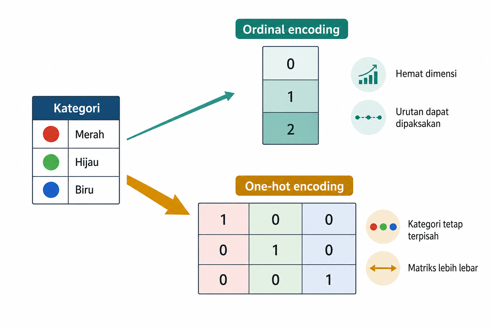
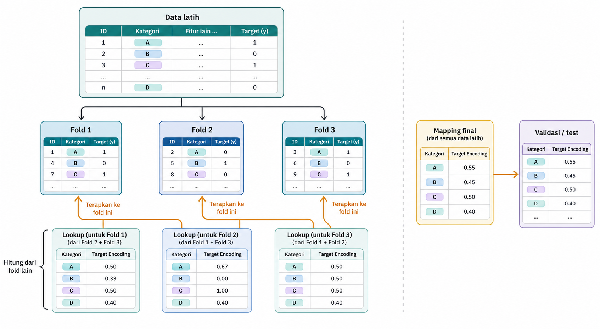
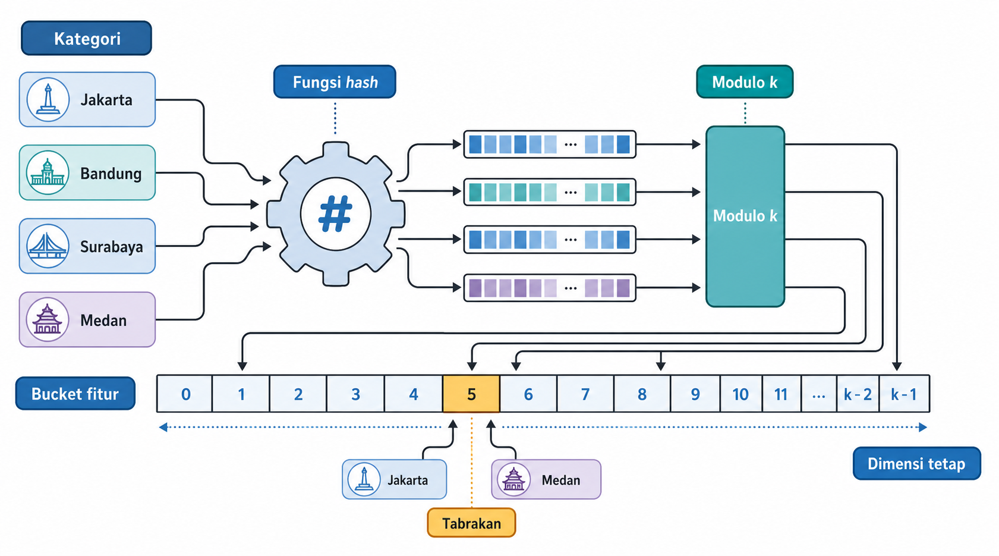
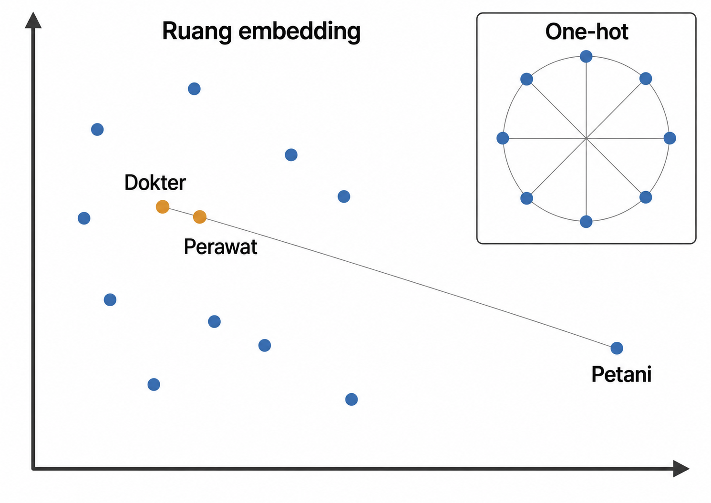

# Representasi Fitur Kategorikal

Banyak tabel tidak hanya berisi angka. Di dalamnya terdapat pekerjaan, wilayah, status rumah tangga, negara lahir, jenis kelamin, atau tingkat pendidikan. Sebagian kolom hanya memberi nama kelompok. Sebagian mempunyai urutan. Sebagian lain mempunyai banyak level, seperti negara lahir atau kode pekerjaan rinci. Bagi model, label harus diubah menjadi angka tanpa merusak maknanya. Jika kategori diberi angka secara sembarang, angka itu mudah disalahpahami sebagai urutan atau jarak. Jika setiap kombinasi dibuat menjadi kolom sendiri, matriks fitur dapat menjadi sangat lebar dan jarang.

Pengodean fitur kategorikal bukan pekerjaan mekanis. Encoder yang baik menjawab makna apa yang dipertahankan, seberapa besar dimensi keluarannya, apa yang terjadi ketika kategori baru muncul, dan risiko bagi validasi. Bab ini membahas one-hot encoding, ordinal encoding, pengodean berbasis frekuensi, pengodean berbasis target (target encoding) beserta risiko kebocorannya, hashing untuk kardinalitas tinggi, entity embedding, dan penanganan kategori tak dikenal saat inferensi.

## Jenis Variabel Kategorikal

Variabel kategorikal berisi nilai yang menyatakan kelompok, jenis, label, atau identitas. Arti kategori berasal dari domain, bukan hanya dari tipe data di komputer.

Contoh kerja pada bab ini menggunakan dataset Census-Income, yang berisi catatan individu dari survei penduduk Amerika Serikat. Setiap baris memuat informasi seperti pendidikan, status perkawinan, negara lahir, jenis pekerjaan, dan kode industri. Kolom-kolom tersebut digunakan untuk memperkirakan kelompok pendapatan. Contoh ini mempertemukan kategori nominal, ordinal, dan kategori dengan kardinalitas yang berbeda dalam satu tabel.

Dalam dataset ini, kode industri atau pekerjaan dapat tersimpan sebagai angka, tetapi tetap kategorikal. Sebaliknya, tingkat pendidikan tersimpan sebagai teks, tetapi mempunyai urutan yang jelas.

Kategori nominal tidak memiliki urutan alami. Negara lahir, ras, jenis pekerjaan, industri, dan status rumah tangga adalah contoh umum. Kita tidak dapat mengatakan bahwa satu negara lahir "lebih besar" daripada negara lain hanya karena diberi kode angka lebih tinggi. Kategori ordinal mempunyai urutan yang bermakna, misalnya tingkat pendidikan dari sekolah dasar sampai doktoral, kelas risiko rendah \< sedang \< tinggi, atau rating kepuasan 1 sampai 5. Kategori biner adalah kasus khusus dengan dua nilai, misalnya ya/tidak atau perempuan/laki-laki, tetapi tetap harus dikodekan secara konsisten.

Kardinalitas adalah jumlah nilai kategori yang berbeda. Kolom jenis kelamin memiliki kardinalitas rendah. Kolom pendidikan memiliki belasan level. Kolom negara lahir, status rumah tangga, kode industri, dan kode pekerjaan dapat memiliki puluhan level. Jika beberapa kolom digabung menjadi satu kategori turunan, jumlah level dapat melonjak jauh lebih besar. Kardinalitas menentukan biaya representasi. Encoder yang cocok untuk lima kategori belum tentu cocok untuk ribuan kombinasi kategori.

Secara umum, encoder dapat dilihat sebagai pemetaan dari kosakata kategori ke ruang numerik.

$$f_{\text{encode}} : \mathcal{V} \rightarrow \mathbb{R}^d$$

Dengan $\mathcal{V}$ sebagai himpunan nilai kategori yang dikenal dari data *train* dan $d$ sebagai dimensi keluaran, setiap encoder membuat kompromi yang berbeda. Pada ordinal encoding, biasanya $d = 1$. Pada *one-hot encoding*, $d = |\mathcal{V}|$, yaitu satu kolom untuk setiap kategori. Pada hashing dan *embedding*, $d$ dipilih sebagai ukuran representasi yang tetap.

Kerangka ini membantu membandingkan seluruh metode dalam bab ini. Perbandingan dapat dilihat dari informasi kategori yang dipertahankan, informasi yang dikompresi, perlakuan terhadap kategori baru, serta risiko bagi model dan *pipeline*. Pertimbangan tersebut lebih penting daripada menghafal nama encoder.

## *One-Hot* dan Ordinal Encoding

Kasus paling dasar adalah memilih apakah kategori harus tetap terpisah atau boleh diberi urutan. Dua encoder yang sering muncul adalah *one-hot encoding* dan ordinal encoding. Keduanya sama-sama mengubah kategori menjadi angka, tetapi asumsi yang dibawa berbeda.

*One-hot encoding* membuat satu kolom indikator untuk setiap kategori. Jika kolom status perkawinan pada Census-Income memiliki tiga kategori contoh, "Never married", "Married-civ-spouse", dan "Divorced", maka nilai "Never married" dapat ditulis sebagai berikut.

$$\mathbf{x} = [x_1, \dots, x_K] \in \{0,1\}^K$$

dengan tepat satu $x_i = 1$. Untuk contoh tadi, "Never married" pada urutan {Never married, Married-civ-spouse, Divorced} menjadi $[1, 0, 0]$. Representasi ini tidak memaksakan urutan. Ketiga status perkawinan tersebut diperlakukan sebagai kategori terpisah.

*One-hot encoding* cocok untuk kardinalitas rendah sampai menengah. Kelemahannya muncul ketika jumlah kategori besar. Jika kode pekerjaan rinci, negara lahir, dan status rumah tangga digabung menjadi satu kategori turunan, *one-hot* dapat menghasilkan ribuan kolom biner, sebagian besar bernilai nol. Matriks menjadi lebar, jarang, dan dapat membebani memori serta model.

Ordinal encoding memetakan kategori ke satu kolom integer. Untuk variabel yang benar-benar berurutan, cara ini wajar. Tingkat pendidikan dapat diberi kode berurutan karena relasi urutnya memang bermakna. Namun, untuk kategori nominal seperti negara lahir atau kode pekerjaan, kode 1, 2, 3 dapat menyesatkan. Model linear atau berbasis jarak dapat membaca kode yang lebih besar sebagai kategori yang lebih tinggi atau lebih jauh, padahal angka itu hanya label buatan.

Gambar 4.1 memperlihatkan perbedaan ini. Ordinal encoding hemat dimensi, tetapi membawa asumsi urutan. *One-hot encoding* lebih lebar, tetapi menjaga kategori tetap terpisah.

Baik *one-hot* maupun ordinal encoder mempelajari pemetaan dari data *train*. Pada data baru, kategori harus mengikuti pemetaan yang sama. Pada `OneHotEncoder`, parameter `handle_unknown` seperti `'error'`, `'ignore'`, `'infrequent_if_exist'`, atau `'warn'`, serta `min_frequency` dan `max_categories`, menentukan perilaku terhadap kategori baru dan kategori jarang. Pada `OrdinalEncoder`, `handle_unknown`, misalnya `'error'` atau `'use_encoded_value'`, bersama `unknown_value` dan `encoded_missing_value` memainkan peran serupa.

Untuk model linear tanpa *regularization*, `drop='first'` atau `drop='if_binary'` dapat dipakai untuk menghindari kolinearitas sempurna antarkolom *one-hot*, meskipun penghapusan ini membuat representasi kehilangan simetri antarkategori. Jika `handle_unknown='ignore'` menghasilkan baris *all-zero*, kategori tak dikenal tidak dapat dibedakan dari kategori referensi yang dibuang oleh `drop='first'`, karena keduanya mempunyai kode yang sama. Ketika pembedaan tersebut penting, siapkan bucket eksplisit untuk kategori tak dikenal atau jarang saat *fit*, atau pantau laju kategori baru, bukan hanya mengandalkan kode *all-zero*. `OrdinalEncoder` juga berbeda dari `LabelEncoder`. Yang pertama didesain untuk kolom fitur dan menerima *input* 2-D, sedangkan yang kedua dimaksudkan untuk label target. Setelah makna dasar kategori dijaga, persoalan berikutnya adalah skala karena beberapa kolom terlalu besar untuk diperlakukan dengan *one-hot* biasa.

Nilai kosong pada fitur kategorikal tidak selalu harus dihapus atau diimputasi menjadi kategori paling sering. Pada beberapa encoder, nilai kosong dapat diperlakukan sebagai kategori tersendiri. `OrdinalEncoder(encoded_missing_value=...)`, misalnya, dapat memetakan NaN ke integer khusus secara deterministik. Sementara itu, `handle_unknown` menentukan apa yang terjadi ketika kategori baru muncul saat inferensi, mulai dari error, baris all-zero, kode khusus, sampai masuk ke bucket infrequent. Semua ini adalah kebijakan desain yang harus diputuskan saat *fit*, bukan perilaku default yang baru ditemukan ketika sistem sudah berjalan. Bagian 4.7 membahas kategori baru lebih lengkap, sedangkan Bab 5 membahas kebijakan nilai kosong.

## Count Encoding dan Frequency Encoding

Ketika kategori sangat banyak, *one-hot encoding* dapat menjadi terlalu lebar. Count encoding dan frequency encoding menawarkan kompresi sederhana. Count encoding mengganti setiap kategori dengan jumlah kemunculannya pada data *train*. Frequency encoding menggantinya dengan proporsi kemunculan.

$$f(c) = \frac{N(c)}{N_{\text{train}}}$$

Dengan $N(c)$ sebagai jumlah baris *train* dengan kategori $c$ dan $N_{\text{train}}$ sebagai jumlah baris *train*, kategori yang sering muncul mendapat nilai lebih besar. Jika sebuah kode pekerjaan muncul pada 2.000 dari 100.000 baris pelatihan, frequency encoding memberi nilai 0,02 untuk kode tersebut.

Metode ini terutama menjawab masalah dimensi keluaran. Kode pekerjaan, negara lahir, atau kategori rumah tangga yang jumlah levelnya besar dapat diringkas tanpa menambah banyak kolom. Nilai frekuensi juga kadang membawa sinyal. Kategori yang sering muncul mungkin berbeda perilakunya dari kategori yang sangat jarang.

Namun, kompresi tersebut kehilangan banyak informasi. Dua negara lahir atau dua kode pekerjaan yang sama-sama muncul 150 kali akan mendapat nilai yang sama, meskipun maknanya berbeda. Bagi model, keduanya menjadi tidak dapat dibedakan melalui fitur ini. Count dan frequency encoding menyatakan seberapa umum sebuah kategori, bukan apa makna kategori tersebut.

Seperti encoder lain, pemetaan count atau frekuensi dipelajari dari data *train*. Jika kategori baru muncul pada inferensi, tidak ada count yang tersimpan untuk kategori itu. Perilakunya bergantung pada konfigurasi encoder dan dapat berupa error, isian nol, nilai default, atau kebijakan khusus, misalnya lewat parameter seperti `unseen` pada `CountFrequencyEncoder` dari feature-engine. Karena itu, jangan menganggap kategori baru otomatis aman hanya karena keluarannya satu kolom.

Count dan frequency encoding paling berguna sebagai *baseline* kompak untuk kardinalitas tinggi. Metode ini juga dapat digabung dengan pendekatan lain, misalnya *rare category grouping* atau *target encoding*. Jika hubungan kategori dengan target bergantung pada identitas spesifik kategori, kompresi berbasis frekuensi saja mungkin terlalu kasar. Dalam keadaan seperti itu, sebagian informasi target dapat dipakai sebagai ringkasan kategori, tetapi pengendalian *leakage* harus ketat.

## *Target Encoding* dan Risiko *Leakage*

Jika kompresi berbasis frekuensi terlalu kasar, informasi yang paling menggoda adalah hubungan kategori dengan target. *Target encoding* melangkah ke arah itu dengan mengganti kategori menggunakan statistik target pada kategori tersebut. Pada klasifikasi pendapatan, misalnya, kode pekerjaan atau kategori pendidikan dapat diganti dengan rata-rata label `income_gt_50k` pada kategori itu. Untuk kategori berkardinalitas tinggi, satu angka seperti ini dapat menangkap asosiasi kategori dengan target tanpa membuat ribuan kolom.

Kekuatannya sekaligus menjadi bahayanya. *Target encoding* memakai target untuk membuat fitur. Jika dilakukan secara naif pada seluruh data, label yang seharusnya diprediksi ikut masuk ke representasi. Model kemudian tampak sangat baik karena sebagian jawaban sudah tertanam di dalam fitur.

Ada dua pengaman utama, yaitu smoothing dan cross-fitting. Smoothing menahan kategori langka agar tidak terlalu percaya pada rata-rata targetnya sendiri. Salah satu bentuknya (Micci-Barreca 2001) ditulis sebagai berikut.

$$S_i = \lambda_i\, \bar{y}_i + (1 - \lambda_i)\, \bar{y}_{\text{global}}, \qquad \lambda_i = \frac{n_i}{n_i + m}$$

Dengan $\bar{y}_i$ sebagai rata-rata target kategori $i$ pada data *train*, $\bar{y}_{\text{global}}$ sebagai rata-rata target keseluruhan data *train*, $n_i$ sebagai jumlah contoh pada kategori $i$, dan $m$ sebagai kekuatan smoothing, nilai $S_i$ menjadi campuran antara rata-rata kategori dan rata-rata global. Jika kategori sering muncul, $n_i$ besar dan $\lambda_i$ mendekati 1, sehingga rata-rata kategori lebih dipercaya. Jika kategori jarang muncul, $\lambda_i$ mendekati 0, sehingga nilainya menyusut ke rata-rata global. Pada `TargetEncoder` scikit-learn, `smooth='auto'` menggunakan estimasi *empirical Bayes* untuk memilih kekuatan smoothing secara otomatis. Nilai `smooth` numerik tertentu menetapkan kekuatan smoothing secara eksplisit.

Cross-fitting menghindari encoding yang melihat label barisnya sendiri. Data *train* dibagi menjadi beberapa fold internal. Untuk setiap fold, encoding baris-baris di fold tersebut dihitung dari target pada fold lain. Dengan begitu, satu baris tidak pernah dikodekan memakai targetnya sendiri. Pada scikit-learn, `TargetEncoder.fit_transform(X_train, y_train)` melakukan cross-fitting internal, sedangkan `fit(X_train, y_train).transform(X_train)` tidak. *Pipeline* yang di-*fit* harus menghasilkan encoding pelatihan melalui jalur cross-fitted tersebut, kemudian memakai pemetaan yang dipelajari dari data *train* untuk validasi, *test*, dan inferensi. Kategori yang belum pernah terlihat biasanya diarahkan ke rata-rata global.

Gambar 4.2 memperlihatkan mekanisme itu. Perhatikan bahwa target dari fold yang sedang dienkode tidak masuk ke perhitungan encoding fold tersebut. Inilah hubungan langsung *target encoding* dengan praktik *pipeline* yang benar.

*Target encoding* sangat berguna, tetapi sebaiknya diperlakukan sebagai encoder berisiko tinggi. Encoder ini cocok untuk kategori banyak, tetapi harus selalu dipasang di dalam *pipeline* validasi. Untuk kategori sangat jarang, grouping atau smoothing tambahan sering diperlukan agar nilai target mean tidak menjadi *noise* yang diperlakukan terlalu serius oleh model. Ketika kosakata kategori sangat dinamis atau tidak ingin disimpan secara eksplisit, pendekatan berikutnya memilih kompresi yang lebih mekanis melalui hashing.

CatBoost mengendalikan *target leakage* dengan mekanisme berbeda. Alih-alih membuat fold internal seperti cross-fitting, CatBoost memberi urutan acak pada baris pelatihan. Encoding untuk satu baris dihitung hanya dari baris-baris yang muncul lebih awal dalam urutan itu. Jadi, label baris tersebut tidak ikut membentuk encoding-nya sendiri. Tujuannya sama dengan cross-fitting, yaitu menghindari encoding yang self-referential, tetapi mekanismenya tertanam di dalam model. Inilah salah satu alasan CatBoost dapat menangani kolom kategorikal mentah secara native.

## Hashing untuk Fitur Berkardinalitas Tinggi

Pada beberapa sistem, jumlah kategori bukan hanya besar, tetapi terus tumbuh. Kode wilayah, kode pekerjaan, atau kategori administratif baru dapat muncul setelah model dilatih. Menyimpan kosakata lengkap menjadi mahal, dan memperbarui encoder setiap kali kategori baru muncul tidak selalu praktis. Hashing memberi jalan lain.

Hashing memetakan string kategori ke sejumlah kolom tetap. Mekanisme ini menjawab dua kebutuhan sekaligus. Dimensi keluaran dibatasi sejak awal, dan kategori baru tetap dapat diproses tanpa memperluas kosakata. Rumus indeksnya dapat ditulis sebagai berikut.

$$\text{indeks}(c) = \operatorname{hash}(c) \bmod k$$

Dengan $c$ sebagai kategori, fungsi $\operatorname{hash}$ mengubah string kategori menjadi bilangan, dan $k$ sebagai jumlah bucket atau kolom keluaran, hasil modulo menentukan kategori masuk ke kolom mana. Implementasi umum memakai MurmurHash3. Karena tidak ada kosakata yang disimpan, kategori baru dapat langsung diproses. String baru tetap dapat di-hash ke salah satu bucket.

Kelemahan hashing adalah collision. Dua kategori berbeda dapat masuk ke bucket yang sama. Collision bukan bug, melainkan harga dari ukuran keluaran yang tetap. Jika $k$ diperbesar, collision berkurang, tetapi memori bertambah. Jika $k$ terlalu kecil, terlalu banyak kategori saling menumpuk dan sinyalnya bercampur.

Gambar 4.3 menunjukkan ide ini. Beberapa string kategori masuk ke fungsi hash, lalu mengisi baris bucket berukuran tetap. Satu bucket menerima dua kategori berbeda untuk memperlihatkan collision.

Hashing berguna ketika kosakata kategori tidak stabil atau terlalu besar untuk disimpan sebagai daftar eksplisit. Pendekatan ini juga memudahkan produksi karena konfigurasi yang perlu dijaga terutama adalah fungsi hash dan ukuran $k$. Namun, interpretabilitas berkurang. Kolom hasil hashing tidak lagi memiliki arti kategori yang jelas. Dalam lingkungan yang membutuhkan audit rinci, kompromi ini perlu dipertimbangkan sebelum hashing dipilih. Jika hashing menekankan ukuran tetap, *entity embedding* menekankan kedekatan antar kategori yang mirip.

`FeatureHasher` dapat memakai tanda berbasis hash untuk memberi tanda +1 atau -1 pada kontribusi kategori. Ketika beberapa kategori bertabrakan di bucket yang sama, kontribusinya tidak selalu menumpuk searah. Sebagian dapat saling mengurangi. Dengan cara ini, *noise* collision cenderung lebih netral secara harapan. Namun, alternate sign tidak menghapus collision. Pengungkit utama tetap ukuran $k$. Menaikkan $k$ mengurangi peluang kategori berbeda masuk ke bucket yang sama, dengan biaya memori yang lebih besar.

## *Entity Embedding*

Hashing menjaga ukuran representasi, tetapi membuat identitas kategori bercampur ketika collision terjadi. *One-hot* menjaga identitas kategori tetap terpisah, tetapi tidak menyatakan kemiripan. Dalam ruang *one-hot*, Sabtu dan Minggu sama jauhnya dengan Senin dan Jumat. Padahal pada banyak tugas, akhir pekan mungkin memiliki pola target yang mirip. *Entity embedding* mencoba mempelajari kemiripan seperti itu dari data.

Sebuah *entity embedding* memetakan ID kategori ke vektor padat berdimensi kecil. Vektor ini dipelajari selama pelatihan model berdasarkan tujuan prediksi. Jika dua kategori membantu model dengan cara serupa, vektornya dapat bergerak berdekatan dalam ruang *embedding*. Metode ini umum untuk user ID, item ID, kategori produk, lokasi, atau variabel berkardinalitas tinggi lain.

Secara konseptual, embedding lookup dapat ditulis sebagai berikut.

$$\mathbf{e}_i = \mathbf{W}\, \mathbf{x}_i$$

Dengan $\mathbf{x}_i \in \{0,1\}^{|\mathcal{V}|}$ sebagai vektor *one-hot* untuk kategori $i$ dan $\mathbf{W} \in \mathbb{R}^{d \times |\mathcal{V}|}$ sebagai matriks *embedding*, hasilnya $\mathbf{e}_i$ adalah vektor *embedding* berdimensi $d$. Dalam implementasi, operasi ini biasanya berupa lookup tabel, bukan perkalian matriks penuh.

Representasi ini berada lebih dekat ke representasi yang dipelajari mesin. Namun, keputusan manusia tetap banyak, mulai dari kolom kategori mana yang diberi *embedding*, berapa dimensinya, apa tujuan pelatihannya, bagaimana validasinya, sampai bagaimana kategori langka ditangani. *Embedding* dapat *overfit* pada kategori jarang, dan dapat menyerap informasi sensitif atau proksi yang tidak disadari.

Gambar 4.4 memperlihatkan *embedding* kategori pekerjaan atau industri. Jika dua kode pekerjaan menghasilkan pola target pendapatan yang mirip, keduanya dapat berada dekat. Inset *one-hot* menunjukkan kontrasnya karena semua kategori saling berjarak sama.

*Embedding* yang sudah dilatih tidak selalu harus dipakai hanya dalam jaringan neural. Vektor *embedding* dapat diekspor sebagai fitur numerik statis untuk model lain, misalnya gradient boosting. Dalam pola ini, jaringan neural dipakai sebagai pembangun fitur, sedangkan model inferensi akhir dapat berupa model non-neural. Jika *embedding* dilatih secara *supervised* dengan label tugas lalu diekspor, pelatihannya harus diulang di dalam setiap lipatan *train* terluar atau representasi untuk model hilir harus dihasilkan secara *out-of-fold*. Aturan ini berbeda dari *embedding* eksternal *pretrained* yang dibekukan dan tidak dilatih dengan label evaluasi tugas tersebut. Pilihan ini berguna jika *embedding* memberi sinyal yang baik tetapi sistem produksi menginginkan model hilir yang berbeda. Namun, apa pun encodernya, model produksi tetap menghadapi pertanyaan yang sama tentang cara memperlakukan kategori yang belum pernah muncul saat pelatihan.

## Menangani Kategori Baru Saat Inferensi

Semua pilihan encoding perlu menetapkan perilaku ketika kategori yang tidak ada saat pelatihan muncul setelah model dipakai. Kode wilayah dapat berubah, kategori pekerjaan dapat diperbarui, atau negara lahir yang jarang baru terlihat pada data berikutnya. Encoder yang baik bekerja pada data *train* sekaligus mendefinisikan perlakuan bagi kategori yang belum pernah dilihat.

Setiap metode memiliki kebijakan sendiri. *One-hot encoding* dapat menghasilkan baris *all-zero* untuk kategori tak dikenal, atau mengarahkannya ke bucket kategori jarang jika bucket itu dibuat saat *fit*. Dengan `drop='first'`, kode *all-zero* tersebut juga mewakili kategori referensi yang dibuang, sehingga bucket eksplisit atau pemantauan diperlukan jika keduanya harus dibedakan. Ordinal encoding dapat memakai kode khusus seperti -1. Pada model pohon, kode khusus ini dapat dipisahkan dalam split tersendiri, tetapi pada model linear atau berbasis jarak tetap perlu hati-hati. Count atau frequency encoding membutuhkan nilai isian yang dikonfigurasi. *Target encoding* biasanya memakai rata-rata global. Hashing menangani kategori baru secara bawaan karena string apa pun dapat di-hash. *Embedding* membutuhkan indeks "unknown" yang memang dilatih atau diinisialisasi dengan sadar.

*Rare category grouping* dapat mengurangi kerapuhan. Jika kategori yang sangat jarang digabung sejak pelatihan, model belajar perilaku bucket "lainnya" atau "infrequent" sebelum menghadapi kategori baru. Pendekatan ini memberi kebijakan yang sudah tersedia saat inferensi.

Tabel 4.1 mengembalikan seluruh bab ke sumbu keputusan yang sama. Kolom dimensi keluaran menunjukkan biaya representasi. Kolom kardinalitas membantu memilih skala masalah. Kolom kategori baru dan risiko utama perlu dibaca sebagai bagian dari desain produksi, bukan catatan tambahan. Dalam contoh Census-Income di awal bab, tabel ini membantu membedakan perlakuan untuk pendidikan, negara lahir, kode pekerjaan, dan status rumah tangga tanpa memaksa semuanya mengikuti encoder yang sama.

**Tabel 4.1 --- Peta keputusan encoding kategorikal**

*Tabel lengkap tersedia pada edisi cetak.*

Perilaku kategori baru sebaiknya diuji dengan sengaja. Jangan mengandalkan data *test* yang kebetulan hanya berisi kategori yang sudah dikenal. Dalam produksi, distribusi kategori dapat bergeser. Memantau jumlah kategori baru, kategori jarang, dan perubahan frekuensi kategori adalah bagian dari menjaga kualitas fitur.

Pengodean kategorikal adalah keputusan representasi, bukan sekadar pekerjaan mengubah label menjadi angka. Nominal, ordinal, biner, dan kategori berkardinalitas tinggi memerlukan perlakuan yang berbeda karena maknanya berbeda. Encoder yang baik mempertahankan makna yang dibutuhkan model, mengendalikan dimensi keluaran, memiliki perilaku jelas untuk kategori baru, dan tidak merusak validasi. Tabel 4.1 dapat dipakai sebagai peta keputusan ringkas ketika satu *dataset* memuat beberapa jenis kategori sekaligus.

*One-hot encoding* aman untuk kategori nominal dengan kardinalitas rendah sampai menengah, tetapi dapat membuat matriks sangat lebar. Ordinal encoding hemat, tetapi hanya wajar ketika urutan memang bermakna atau model dapat menoleransi kode arbitrer. Count dan frequency encoding mengompresi kategori banyak, tetapi kehilangan identitas semantik. *Target encoding* kuat tetapi berisiko *leakage*. Hashing cocok untuk kategori tak terbatas dengan harga collision dan interpretabilitas. *Embedding* belajar kemiripan kategori, tetapi membutuhkan data, validasi, dan pengendalian *overfit*.

Keputusan encoding juga perlu mempertimbangkan *pipeline*, kategori baru, *rare category*, interpretabilitas, dan keluarga model yang akan memakai fitur. Dengan pertimbangan tersebut, kategori dapat diubah menjadi representasi yang sesuai dengan makna dan risiko pemodelannya.

- scikit-learn --- Comparing Target Encoder --- <https://scikit-learn.org/stable/auto_examples/preprocessing/plot_target_encoder.html>. Perbandingan target encoding dengan encoder lain.

- scikit-learn --- Target Encoder Internal Cross Fitting --- <https://scikit-learn.org/stable/auto_examples/preprocessing/plot_target_encoder_cross_val.html>. Mengapa cross-fitting mencegah kebocoran target.

- Guo & Berkhahn (2016), Entity Embeddings --- <https://arxiv.org/abs/1604.06737>. Embedding kategori dari jaringan neural.

- Prokhorenkova dkk. (2018), CatBoost --- <https://arxiv.org/abs/1706.09516>. Ordered target statistics untuk kategori.

- Feature-engine --- Categorical encoding --- <https://feature-engine.trainindata.com/en/latest/api_doc/encoding/index.html>. Count/frequency dan rare-label encoder.

- Weinberger dkk. (2009), Feature Hashing (ICML) --- <https://arxiv.org/abs/0902.2206>. Hashing trick untuk kardinalitas sangat tinggi.

Micci-Barreca, Daniele. 2001. "A Preprocessing Scheme for High-Cardinality Categorical Attributes in Classification and Prediction Problems." *ACM SIGKDD Explorations Newsletter* 3 (1): 27--32.
