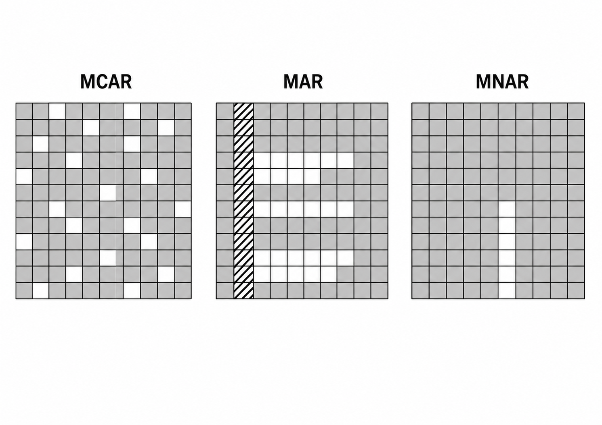
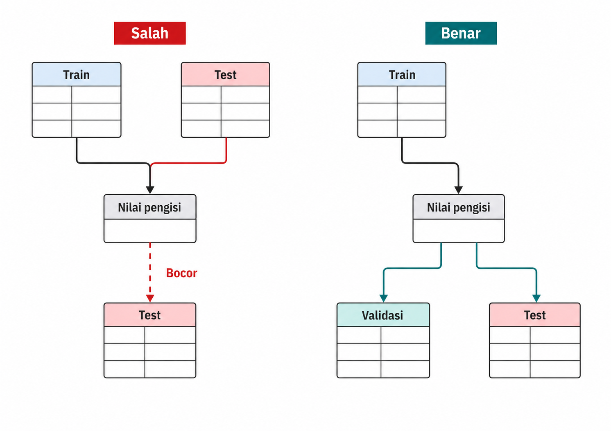
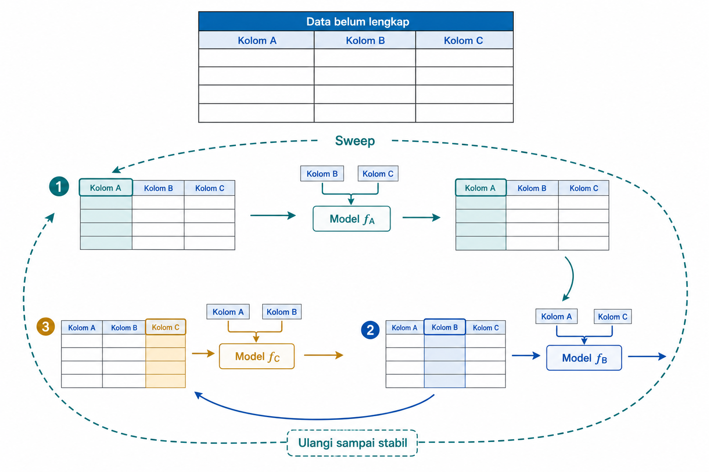
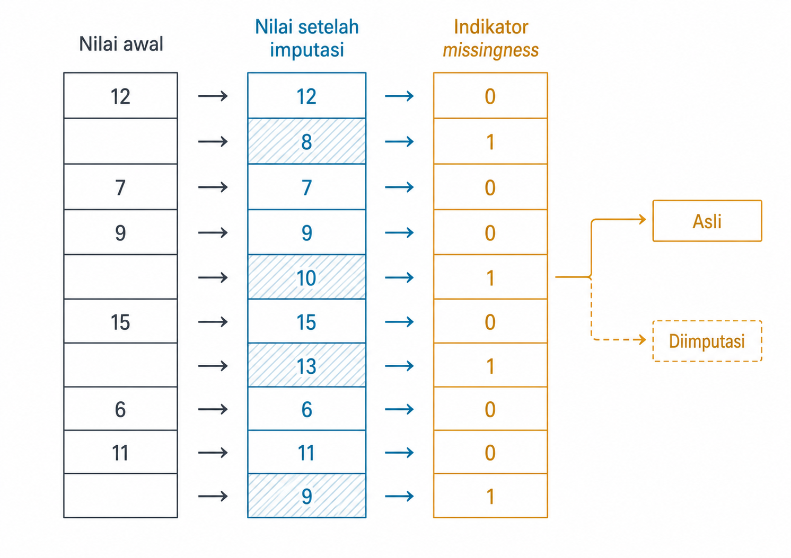
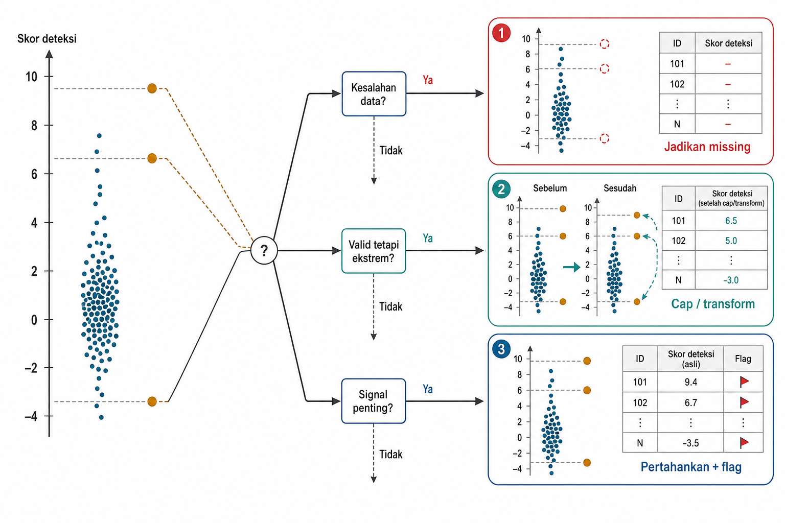

# *Missing Values* dan *Outlier*

Nilai kosong dan nilai ekstrem jarang muncul sebagai masalah abstrak. Keduanya baru terasa ketika tabel nyata dibuka dan terlihat kolom yang kosong berkelompok, angka yang jauh dari mayoritas data, serta target yang ekornya panjang. Namun, nilai kosong dan nilai ekstrem sering diperlakukan terlalu cepat. Baris dihapus, rata-rata diisikan, atau nilai ekstrem dipotong tanpa memeriksa alasannya. Pada pembelajaran mesin, tindakan seperti ini mengubah representasi yang diterima model. Jika dilakukan sebelum pemisahan data atau tanpa aturan yang dapat diulang, tindakan itu dapat menimbulkan kebocoran dan mengubah populasi belajar.

Bab ini membahas nilai kosong dan *outlier*, yaitu nilai yang jauh dari pola utama data, sebagai bagian dari rekayasa fitur yang harus diperiksa, dirancang, dan dipasang dalam *pipeline*. Mekanisme hilangnya data, yaitu MCAR, MAR, dan MNAR, dipakai sebagai kerangka asumsi dan diagnosis, bukan resep langsung untuk memilih imputer. Imputasi sederhana dan berbasis model, fitur indikator ketiadaan nilai (*missingness indicator*), serta deteksi dan penanganan *outlier* dibahas bersama risikonya. Bab ini menguraikan batas antara pembersihan data dan rekayasa fitur, dengan prinsip bahwa inspeksi mendahului otomatisasi.

## Mekanisme *Missingness* MCAR, MAR, MNAR

Nilai kosong tidak selalu berarti hal yang sama. Kadang nilai hilang karena kesalahan acak saat data dikumpulkan. Kadang nilai hilang karena cakupan survei atau desain administrasi membuat kelompok tertentu lebih sering tidak memiliki isian. Kadang nilai hilang justru berkaitan dengan nilai yang tidak terlihat itu sendiri, misalnya ketika sebuah ukuran sensitif lebih mungkin tidak dilaporkan pada kondisi ekstrem.

Contoh kerja bab ini menggunakan UCI Communities and Crime. Setiap baris mewakili satu komunitas dengan fitur sensus dan sosial-ekonomi, sedangkan target `ViolentCrimesPerPop` menyatakan tingkat kejahatan kekerasan per penduduk pada skala yang sudah dinormalisasi sumber. Sejumlah kolom dalam blok LEMAS/police, yaitu kelompok variabel tentang administrasi dan sumber daya kepolisian, hilang bersama pada banyak komunitas karena cakupan pengumpulan data. Pola blok yang terlihat tidak dengan sendirinya membuktikan apakah mekanismenya MCAR, MAR, atau MNAR.

Analisis data hilang membedakan tiga mekanisme (Little and Rubin 2019). Misalkan data lengkap $Y$ terdiri atas bagian teramati $Y_{\text{obs}}$ dan bagian hilang $Y_{\text{miss}}$. Misalkan pula $R$ adalah matriks indikator kekosongan, dengan nilai 1 berarti sebuah entri hilang. Mekanisme *missingness* dinyatakan sebagai probabilitas berikut.

$$P(R \mid Y_{\text{obs}}, Y_{\text{miss}}, \phi)$$

Dengan $\phi$ sebagai parameter yang mengatur proses kekosongan, rumus tersebut menyatakan bahwa pola hilangnya data dapat bergantung pada bagian yang terlihat, bagian yang hilang, atau mekanisme lain yang mengatur keduanya.

Pada MCAR, *missing completely at random*, kekosongan tidak bergantung pada nilai dalam data.

$$P(R \mid Y_{\text{obs}}, Y_{\text{miss}}, \phi) = P(R \mid \phi)$$

Contohnya adalah satu berkas administrasi yang gagal terbaca secara acak. Pada MAR, *missing at random*, kekosongan dapat dijelaskan oleh variabel yang teramati.

$$P(R \mid Y_{\text{obs}}, Y_{\text{miss}}, \phi) = P(R \mid Y_{\text{obs}}, \phi)$$

Misalnya, kolom tertentu lebih sering kosong pada komunitas dengan cakupan administrasi yang berbeda, dan cakupan itu terwakili oleh variabel lain yang teramati. Pada MNAR, *missing not at random*, tidak ada penyederhanaan seperti itu. Kekosongan berkaitan dengan nilai yang hilang sendiri atau faktor yang tidak teramati. Ukuran sensitif yang lebih mungkin tidak dilaporkan ketika nilainya ekstrem adalah contoh yang masuk akal.

Perbedaan ini penting karena strategi imputasi membawa asumsi. Mengisi mean pada data MNAR dapat meratakan kelompok yang justru penting. Jika nilai yang tidak tersedia berkaitan dengan kondisi ekstrem yang tidak teramati, imputasi mean menyembunyikan sinyal nonresponse tersebut. Inilah sebabnya indikator *missingness* pada Bagian 5.4 kadang diperlukan.

Gambar 5.1 memperlihatkan pola yang berbeda. MCAR tampak seperti lubang acak. MAR terkonsentrasi pada baris yang memiliki nilai tertentu pada kolom teramati. MNAR terkonsentrasi pada nilai yang hilang itu sendiri, sehingga mekanismenya sulit dibuktikan dari data yang terlihat.

{#fig-ch05-fig-1}

Dalam praktik, mekanisme ini jarang dapat dipastikan sempurna. Diagnostik dan pengetahuan domain harus dibaca bersama. MCAR, MAR, dan MNAR merupakan kerangka asumsi, bukan label teramati yang otomatis menunjuk satu metode. Asumsi MAR tidak menjamin iterative imputation valid atau paling baik, sedangkan dugaan MNAR memerlukan analisis sensitivitas, pengetahuan domain, atau informasi eksternal tentang proses kekosongan. Setelah alasan kekosongan dipertimbangkan, langkah berikutnya adalah memastikan cara pengisiannya tidak belajar dari data yang seharusnya belum terlihat.

::: {.pendalaman}

Pendalaman

### Diagnostik pola kekosongan {.pendalaman-title .unnumbered .unlisted}

Visualisasi seperti missingness matrix dan nullity-correlation plot dapat menunjukkan apakah beberapa kolom sering kosong bersama-sama. Pustaka seperti missingno menyediakan cara cepat untuk melihat pola seperti itu. Little's MCAR test memberi pemeriksaan formal terhadap asumsi MCAR. Namun, hasilnya harus dibaca hati-hati. Tes dapat menolak MCAR, tetapi tidak membuktikan mekanisme tertentu. MNAR pada dasarnya tidak dapat dibuktikan hanya dari data yang teramati, karena alasan kekosongannya terkait bagian yang tidak terlihat. Diagnostik seperti ini dilakukan pada tahap eksplorasi, sebelum kebijakan imputasi masuk ke *pipeline*.
:::

## Imputasi sebagai Komponen *Pipeline*

Imputasi adalah proses mengisi nilai kosong dengan aturan atau model. Aturannya dapat sederhana, misalnya rata-rata, median, modus, atau konstanta. Aturannya juga dapat berbasis model, misalnya dengan memprediksi nilai kosong dari fitur lain. Apa pun metodenya, jika nilai pengisi dipelajari dari data, imputer adalah transformer yang harus mengikuti kontrak `fit` dan `transform`. Penetapan nilai pengisi selalu berkaitan dengan sumber data yang dipakai untuk mempelajarinya.

Kebocoran pada imputasi dapat dilihat langsung dari rumus. Misalkan nilai kosong diisi dengan rata-rata. Cara yang salah adalah menghitung rata-rata dari gabungan data *train* dan *test*.

$$\mu_{\text{bocor}} = \frac{1}{|X_{\text{train}}| + |X_{\text{test}}|}\left(\sum_{x \in X_{\text{train}}} x + \sum_{x \in X_{\text{test}}} x\right)$$

Suku kedua, yaitu jumlah dari $X_{\text{test}}$, menunjukkan bahwa data *test* ikut menentukan nilai pengisi. Cara yang benar ditulis sebagai berikut.

$$\mu_{\text{benar}} = \frac{1}{|X_{\text{train}}|}\sum_{x \in X_{\text{train}}} x$$

Nilai pengisi dipelajari hanya dari data *train*, lalu dipakai ulang untuk validasi, *test*, dan inferensi. Prinsip yang sama berlaku untuk median, modus, kategori pengisi, atau model imputasi. Di dalam *cross-validation*, imputer hanya di-`fit` pada fold pelatihan, lalu di-`transform` pada fold validasi, bukan di-`fit` pada seluruh *dataset* sebelum CV.

Gambar 5.2 membandingkan dua jalur. Jalur pertama melakukan imputasi global sebelum split, sehingga baris *test* ikut masuk ke nilai pengisi. Jalur kedua menempatkan imputer di dalam *pipeline*, di-*fit* hanya pada bagian *train*.

{#fig-ch05-fig-2}

Kolom yang berbeda dapat membutuhkan strategi berbeda. Fitur numerik sensus dapat memakai median *train* sebagai *baseline*. Pada contoh Communities and Crime, kolom LEMAS/police yang hilang bersama layak diuji dengan indikator karena kekosongannya dapat membawa informasi tentang cakupan data. Beberapa kolom sebaiknya tidak diimputasi sebelum ada pemeriksaan domain. Dalam semua kasus, praktik *pipeline* yang benar lebih penting daripada kenyamanan satu kali pembersihan. Setelah aturan `fit` aman, barulah metode imputasi dapat dibandingkan menurut struktur data yang ingin dipertahankan.

## Imputasi Sederhana dan Berbasis Model

Setelah imputer ditempatkan di dalam *pipeline*, metode pengisian dapat dibandingkan menurut asumsi yang masuk akal, struktur data yang hendak dipertahankan, dan hasil validasi tugas.

Imputasi sederhana adalah *baseline* yang kuat. Mean, median, modus, atau konstanta mudah dipahami, cepat, dan stabil. Kelayakannya tidak ditentukan hanya dengan memberi label MCAR pada data, melainkan perlu diperiksa terhadap pola kekosongan dan evaluasi tugas. Metode ini tetap membawa distorsi. Jika banyak nilai numerik diisi dengan mean atau median yang sama, sebaran fitur menjadi lebih sempit. Varians menyusut karena banyak observasi ditarik ke pusat. Selain itu, hubungan antar fitur dapat rusak karena tiap kolom diisi sendiri-sendiri.

KNN imputation memakai baris yang mirip untuk mengisi nilai kosong. Jika beberapa komunitas memiliki profil sosial-ekonomi, kepadatan, dan struktur rumah tangga yang mirip, nilai pada kolom yang hilang dapat diperkirakan dari komunitas terdekat dalam ruang fitur. Metode ini bergantung pada definisi jarak, skala fitur, dan ketersediaan fitur lain yang berkorelasi. Pada data besar, biaya pencarian tetangga juga dapat menjadi masalah.

Iterative imputation, atau gaya MICE (Buuren and Groothuis-Oudshoorn 2011), memprediksi tiap kolom yang hilang dari kolom lain secara bergiliran. Untuk kolom $j$, pembaruan pada iterasi $t$ dapat ditulis sebagai berikut.

$$\hat{x}_{i,j}^{(t)} = f_j\big(x_{i,1}^{(t)}, \dots, x_{i,j-1}^{(t)},\ x_{i,j+1}^{(t-1)}, \dots, x_{i,p}^{(t-1)}\big)$$

Dengan $\hat{x}_{i,j}^{(t)}$ sebagai nilai imputasi untuk baris $i$ dan kolom $j$ pada sweep ke-$t$, model $f_j$ memprediksi kolom $j$ dari kolom lain. Kolom yang sudah diperbarui pada sweep yang sama memakai nilai bertanda $(t)$, sedangkan kolom yang belum diperbarui masih memakai nilai dari sweep sebelumnya, yaitu $(t-1)$, dengan $p$ menyatakan banyaknya fitur. Proses ini berputar dari satu kolom ke kolom lain.

`IterativeImputer` bergaya MICE, tetapi secara default menghasilkan satu *dataset* imputasi. Ini cocok untuk *pipeline* prediksi yang membutuhkan satu tabel final, tetapi ketidakpastian imputasi tidak tampak. *Multiple imputation* membuat beberapa versi *dataset* terisi untuk mencerminkan ketidakpastian tersebut. Pendekatan ini lebih berat dan biasanya lebih dekat ke analisis statistik inferensial daripada *pipeline* prediksi sehari-hari.

Tabel 5.1 merangkum keluarga imputasi. Tabel ini berguna sebagai peta keputusan yang menghubungkan kondisi data, struktur yang ingin dijaga, dan biaya yang siap dibayar.

::: {.tabel-buku}

| Metode | Cocok saat | Menjaga apa | Biayarisiko |
| --- | --- | --- | --- |
| Meanmedianmodus | *Baseline* cepat dengan aturan sederhana yang dapat diuji | Kesederhanaan, transparansi | Variance shrinkage dan korelasi antar fitur rusak |
| Konstanta + kategori ``missing'' | Kategorikal dengan kekosongan bermakna | Status kosong tetap terlihat | Menambah kategori artifisial |
| KNN | Fitur berkorelasi, skala terkendali | Struktur lokal antar baris | Sensitif skalajarak dan mahal di data besar |
| Iterative (MICE-style) | Dependensi multivariat cukup kuat dan model imputasi dapat divalidasi | Struktur multivariat | Kompleks, asumsi hubungan dapat salah, default single-imputation menyembunyikan ketidakpastian |
| Generatif (VAEdiffusion) | Data kompleksderet waktu, skala besar | Dependensi non-linear | Komputasi berat, keunggulan tidak otomatis |

: Peta keputusan imputasi {#tbl-ch05-8}

:::

Gambar 5.3 memperlihatkan siklus iterative imputation. Setiap kolom yang tidak lengkap diprediksi dari kolom lain, lalu hasilnya dipakai untuk memprediksi kolom berikutnya.

{#fig-ch05-fig-3}

Metode yang lebih kompleks tidak otomatis lebih baik. Keputusan perlu mempertimbangkan tingkat *missingness*, relasi antar fitur, ukuran data, *latency*, interpretabilitas, dan performa validasi. Imputasi yang tampak canggih tetapi tidak memperbaiki evaluasi yang sah hanya menambah kompleksitas. Selain memilih nilai pengisi, fakta bahwa nilai semula tidak ada kadang perlu dipertahankan.

::: {.pendalaman}

Pendalaman

### Imputasi generatif dan kasus MNAR {.pendalaman-title .unnumbered .unlisted}

Imputer generatif modern memperlakukan nilai hilang sebagai target rekonstruksi bertopeng. MIWAE memakai kerangka variational autoencoder untuk imputasi, sedangkan CSDI memakai model difusi untuk deret waktu. Untuk kasus MNAR, pendekatan seperti not-MIWAE mencoba memodelkan mekanisme missingness itu sendiri, bukan mengasumsikan MAR. Metode-metode ini relevan ketika dependensi data sangat non-linear dan jumlah data cukup besar. Namun, *baseline* klasik yang kuat, misalnya iterative imputation dengan model pohon, tetap harus dikalahkan pada validasi tugas sendiri sebelum imputer generatif layak diadopsi.
:::

## Fitur Indikator *Missingness*

Imputasi memilih nilai pengganti, tetapi proses tersebut dapat menyembunyikan fakta bahwa nilai semula tidak ada. Fitur indikator *missingness* menandai apakah nilai asli kosong. Jika $x_i^{(j)}$ adalah nilai baris $i$ pada fitur $j$, indikatornya dapat ditulis sebagai berikut.

$$m_i^{(j)} = \begin{cases} 1 & x_i^{(j)} \text{ kosong} \\ 0 & x_i^{(j)} \text{ terobservasi} \end{cases}$$

Pada Communities and Crime yang diperkenalkan di Bagian 5.1, indikator dapat dipakai untuk mempertahankan informasi bahwa variabel LEMAS/police semula tidak tersedia. Targetnya adalah tingkat kejahatan kekerasan per penduduk, sedangkan fitur prediktornya berasal dari kondisi sensus, sosial-ekonomi, dan informasi penegakan hukum yang tersedia.

Indikator ini membuat model dapat membedakan nilai asli dari nilai hasil imputasi. Dalam dataset ini, kolom LEMAS/police yang kosong bersama dapat berarti informasi penegakan hukum tidak tercakup untuk komunitas tersebut, bukan sekadar angka yang lupa diisi. Nilai hasil imputasi dan fakta bahwa nilainya semula kosong dapat membawa makna yang berbeda.

Gambar 5.4 memperlihatkan pola ini. Satu kolom awal yang berlubang diubah menjadi dua kolom, yaitu nilai yang sudah diimputasi dan indikator apakah nilai asalnya kosong.

{#fig-ch05-fig-4}

Indikator tidak selalu membantu. Jika *missingness* benar-benar acak, indikator menambah dimensi tanpa sinyal. Jika nilai kosong sangat jarang, indikator dapat menjadi fitur yang rapuh. Jika beberapa kolom selalu kosong bersama-sama, indikatornya menjadi sangat berkorelasi dan dapat mengganggu interpretasi koefisien pada model linear.

Indikator juga harus mengikuti *pipeline*. Pada `SimpleImputer(add_indicator=True)` atau `MissingIndicator`, kolom indikator didaftarkan saat *fit*. Jika sebuah kolom lengkap pada data *train* tetapi kosong saat produksi, *pipeline* tidak tiba-tiba membuat kolom baru. Lebar keluaran harus tetap sama agar model dapat menerima data. Karena itu, keputusan indikator perlu dibuat dengan memikirkan perilaku inferensi, bukan hanya data pelatihan.

Pada akhirnya, indikator *missingness* adalah fitur seperti fitur lain. Indikator tersebut dapat membawa sinyal, *noise*, atau proksi sensitif. Bab 9 akan membahas risiko kualitas fitur dan proksi semacam ini lebih sistematis. Prinsip yang sama berlaku ketika masalahnya bukan nilai yang hilang, melainkan nilai yang terlalu jauh dari pola umum.

## Deteksi dan Tindakan untuk *Outlier*

Setelah nilai yang tidak ada diperlakukan sebagai keputusan representasi, persoalan kebalikannya muncul. Nilai ada, tetapi terlalu jauh dari pola umum. Definisi "jauh" dapat berupa jarak dari pusat distribusi, posisi di ekor, kepadatan lokal, atau kombinasi beberapa fitur. Karena itu, *outlier* selalu relatif terhadap domain dan model. Nilai target `ViolentCrimesPerPop` yang tinggi dapat menjadi kondisi komunitas yang sah, artefak normalisasi, atau kandidat yang perlu diperiksa lebih lanjut. Seperti nilai kosong, nilai ekstrem perlu ditafsirkan sebelum diubah.

Deteksi dan tindakan adalah dua pekerjaan yang berbeda. Untuk prediktor $X$, deteksi dapat menghasilkan skor atau flag dari informasi yang tersedia saat inferensi, sedangkan tindakan menentukan apakah nilai diperbaiki, diubah menjadi *missing*, dipertahankan, di-*cap*, ditransformasi, atau diperiksa manual. Untuk target $y$, flag yang dibuat dari nilai target teramati hanya boleh menjadi diagnostik pelatihan dan tidak boleh dipakai sebagai fitur inferensi.

Deteksi univariat melihat satu fitur prediktor yang berada di atas persentil tinggi. Deteksi multivariat melihat kombinasi beberapa prediktor. Isolation Forest berangkat dari intuisi bahwa anomali lebih mudah diisolasi dengan sedikit split acak. Local Outlier Factor membandingkan kepadatan lokal suatu titik dengan kepadatan tetangganya. Titik di lingkungan yang jauh lebih jarang dapat dianggap anomali.

Diagnostik eksploratif dapat dipakai untuk memahami pola pada data pelatihan. Jika detektor memengaruhi fitur, penghapusan baris, atau ambang dalam evaluasi model, detektor tersebut harus di-*fit* di dalam setiap lipatan *train*, lalu diterapkan tanpa belajar ulang pada data yang ditahan. Aturan domain yang ditetapkan sebelum melihat data, seperti rentang fisik sensor, tidak perlu dipelajari per lipatan.

Tabel 5.2 menghubungkan diagnosis dengan tindakan. Baris-barisnya menunjukkan bahwa tindakan wajar berbeda-beda, tergantung apakah nilai ekstrem merupakan kesalahan, nilai sah yang terlalu berpengaruh, sinyal penting, atau kasus yang belum jelas.

::: {.tabel-buku}

| Diagnosis | Contoh | Tindakan wajar |
| --- | --- | --- |
| Kesalahan data | Nilai ter-normalisasi di luar rentang yang mungkin | Perlakukan sebagai nilai kosong perbaiki di cleaning |
| Nilai prediktor sah tapi terlalu berpengaruh | Fitur komunitas dengan nilai tinggi yang masih valid | Cappingwinsorization atau transformasi bentuk pada $ X $ |
| Sinyal penting | Pola prediktor komunitas yang langka dan relevan | Pertahankan, tambah flag dari $ X $, jangan diredam |
| Tidak jelas | Satu fitur administratif melonjak sendiri | Inspeksi domain dulu, jangan otomatis |

: Dari diagnosis ke tindakan *outlier* {#tbl-ch05-9}

:::

Target `ViolentCrimesPerPop` mempunyai ekor kanan dengan nilai tinggi yang belum tentu salah. Transformasi atau *capping* pada $y$ merupakan pilihan tujuan pelatihan, bukan pembuatan fitur, sehingga parameternya dipelajari hanya dari bagian *train*. Alternatifnya adalah memakai fungsi *loss* yang *robust*. Jika target ditransformasi, prediksi perlu dikembalikan ke skala asal dan dievaluasi pada skala tersebut bila metrik tugas memang didefinisikan di sana. Dalam semua pilihan ini, flag yang berasal dari $y$ tidak menjadi *input* saat inferensi.

Untuk prediktor $X$, Gambar 5.5 memvisualisasikan alur yang sama. Deteksi menghasilkan flag atau skor. Setelah itu, keputusan domain menentukan apakah nilai diperlakukan sebagai missing, di-*cap*, ditransformasi, dipertahankan, atau diberi flag.

{#fig-ch05-fig-5}

Diagnostik sebaiknya dilakukan sebelum penanganan otomatis. Membuang setiap nilai ekstrem secara otomatis adalah kebiasaan berbahaya. Dalam banyak aplikasi, observasi yang jarang justru merupakan bagian paling penting dari tugas prediksi.

::: {.pendalaman}

Pendalaman

### *Outlier detection* vs *novelty detection*, dan deteksi tanpa banyak parameter {.pendalaman-title .unnumbered .unlisted}

Dalam pustaka *machine learning*, *outlier detection* dan *novelty detection* dibedakan. Pada *outlier detection*, data pelatihan dianggap sudah terkontaminasi sehingga model mendeteksi anomali di data yang sama. Pada *novelty detection*, model membangun profil dari data yang dianggap bersih, lalu menilai observasi baru. Local Outlier Factor, misalnya, memiliki mode `novelty=True` untuk penggunaan seperti ini. Memilih mode yang salah mengubah arti skor. Untuk penyaringan berdimensi tinggi dengan sedikit parameter, metode berbasis ECDF seperti ECOD menilai observasi dari probabilitas ekor empiris tanpa harus memilih metrik jarak atau asumsi klaster. Namun, keluaran deteksi tetap merupakan sinyal diagnostik, bukan daftar otomatis untuk dihapus.
:::

## Transformasi Robust untuk *Outlier*

Jika nilai ekstrem pada prediktor $X$ sah tetapi terlalu berpengaruh, baris tersebut tidak harus dihapus. Pengaruhnya dapat ditahan dengan transformasi yang lebih *robust*. Ini merupakan tindak lanjut langsung dari Tabel 5.2. Setelah diagnosis menyatakan nilai ekstrem masih valid, langkah berikutnya adalah memilih cara membatasi pengaruhnya. Bab 3 sudah membahas beberapa pilihan, seperti *scaling* median/IQR, log atau *power transform*, *clipping*, *winsorization*, dan *binning*. Bagian ini menegaskan kaitannya dengan *outlier*.

Winsorization mengganti nilai di luar batas dengan nilai batas tersebut. Batas dapat ditetapkan dari domain, kuantil, IQR, atau statistik robust lain. Karena dipelajari dari data, batas tersebut harus di-*fit* pada data *train* saja dan diterapkan ulang pada validasi, *test*, serta inferensi.

Salah satu ukuran robust untuk menyusun batas adalah median absolute deviation.

$$\text{MAD} = \operatorname{median}\big(|x_i - \tilde{x}|\big)$$

Dengan $\tilde{x}$ sebagai median, MAD mengukur jarak absolut tipikal dari nilai terhadap median. Berbeda dari standar deviasi, MAD tidak mudah terseret oleh nilai ekstrem yang sedang dinilai. Modified z-score (Iglewicz and Hoaglin 1993) kemudian dapat ditulis sebagai berikut.

$$M_i = \frac{0{,}6745\,(x_i - \tilde{x})}{\text{MAD}}$$

Secara konvensional, observasi dengan $|M_i| > 3{,}5$ sering ditandai sebagai kandidat *outlier*. Konstanta 0,6745 mengkalibrasi MAD agar sebanding dengan standar deviasi di bawah asumsi normalitas, sedangkan 3,5 adalah konvensi, bukan hukum universal. Jika $\text{MAD}=0$, modified z-score tidak terdefinisi. Ambang 3,5 tidak boleh dipakai. Gunakan aturan domain atau ukuran sebaran lain yang telah ditetapkan dan divalidasi.

Pilihan transformasi prediktor bergantung pada makna ekstrem. Jika satu fitur komunitas sangat tinggi tetapi masih sah dan membuat model linear terlalu sensitif, *capping* pada persentil 99 dapat dipertimbangkan, mungkin disertai flag yang dihitung dari $X$. Jika distribusi fitur sangat *skewed*, log transform bisa lebih tepat daripada menghapus komunitas berekor kanan. Jika nilai ekstrem adalah sinyal utama bagi tugas prediksi, meredamnya justru dapat menghilangkan informasi utama. Perlakuan target mengikuti pilihan tujuan pelatihan yang dijelaskan pada Bagian 5.5, bukan jalur fitur ini.

Urutan *pipeline* juga merupakan keputusan desain. Pada *pipeline* Communities and Crime, misalnya, indikator *missingness* untuk blok LEMAS/police dapat dibuat lebih dulu, kemudian diikuti imputasi berbasis model, *winsorization*, dan akhirnya *robust scaling*. Setiap langkah di-*fit* pada data *train* di dalam satu *pipeline*. Urutan yang berbeda dapat menghasilkan representasi berbeda, sehingga perlu divalidasi. Rangkaian tindakan ini memperlihatkan mengapa batas antara memperbaiki data dan membentuk fitur perlu dibuat eksplisit.

## Batas antara *Data Cleaning* dan Rekayasa Fitur

Perbedaan antara *data cleaning* dan rekayasa fitur perlu dibuat jelas. *Data cleaning* memperbaiki atau menghapus catatan yang tidak valid, seperti tanggal mustahil, ID duplikat, satuan rusak, nilai korup, atau format angka yang rusak. Rekayasa fitur mengubah data yang valid atau sudah diterima menjadi representasi yang siap dipakai model. Keduanya sering bersentuhan, terutama pada nilai ekstrem, nilai kosong, kategori tidak konsisten, dan konversi satuan. Karena bab ini banyak membahas tindakan di batas tersebut, pemisah operasionalnya perlu dibuat eksplisit.

Tes operasionalnya adalah apakah suatu aturan sudah tetap sebelum data dilihat atau justru mempelajari parameter. Aturan skema dan domain yang tetap, seperti parsing "1,200.50" menjadi angka atau konversi meter ke sentimeter, boleh diterapkan seragam pada seluruh catatan. Akan tetapi, ambang pembersihan yang dipelajari dari distribusi, termasuk kuantil untuk membuang atau membatasi nilai, harus di-*fit* hanya pada bagian *train*. Nama "cleaning" tidak membebaskannya dari batas evaluasi. *Scaling*, imputasi median, winsorization, dan seleksi fitur mengikuti aturan train-only yang sama.

Untuk aturan cleaning yang tetap, perbedaan itu dapat ditulis sebagai berikut.

$$X_{\text{bersih}} = C(X_{\text{mentah}})$$

dan

$$X_{\text{fitur}} = T_{\theta}(X_{\text{bersih}})$$

Fungsi $C$ pada rumus tersebut hanya mencakup aturan tetap yang tidak dipelajari dari split. Fungsi $T_{\theta}$ mengubah data bersih menjadi fitur dengan parameter $\theta$ yang dipelajari dari data *train*. Jika langkah yang disebut cleaning mempelajari ambang, parameternya juga harus diperlakukan seperti $\theta$ dan dipasang di dalam lipatan pelatihan. Jika parameter tersebut dihitung memakai data *test*, *leakage* mulai terjadi.

Contohnya, nilai normalisasi di bawah 0 atau di atas 1 pada kolom yang seharusnya berada dalam rentang itu adalah masalah kualitas data. Nilai itu tidak mungkin dan perlu diperbaiki, dihapus, atau diperlakukan sebagai nilai kosong berdasarkan aturan domain. Sebaliknya, nilai 1.0 pada kolom tertentu belum tentu salah. Nilai tersebut bisa valid, langka, atau berasal dari cara sumber menormalisasi nilai ekstrem. Pemeriksaan domain harus mendahului keputusan apakah nilai itu dibersihkan, dipertahankan, atau diperlakukan sebagai *outlier* dalam representasi.

Keputusan cleaning juga tidak boleh diam-diam mengubah populasi target. Menghapus semua baris dengan nilai sulit dapat membuat model hanya belajar dari kasus yang rapi, padahal produksi akan menghadapi kasus yang tidak rapi. Buku ini berfokus pada transformasi yang dapat direproduksi untuk pemodelan. Masalah kualitas data yang serius tetap membutuhkan tata kelola data dan tinjauan domain.

::: {.sintesis-bab}

## Sintesis Bab {.unnumbered .unlisted}

Nilai kosong dan *outlier* perlu diperlakukan sebagai keputusan representasi. Keduanya dapat berupa *noise*, kesalahan pencatatan, sinyal operasional, atau bagian utama dari masalah prediksi. Inspeksi harus mendahului otomatisasi.

Untuk nilai kosong, mekanisme MCAR, MAR, dan MNAR membantu menyusun asumsi dan diagnosis, bukan memilih metode secara otomatis. Imputasi sederhana memberi *baseline* yang jelas, sedangkan KNN, iterative imputation, dan metode generatif mencoba menjaga struktur yang lebih kaya dengan biaya lebih tinggi. Indikator *missingness* dapat membantu ketika kekosongan itu sendiri membawa sinyal, tetapi dapat menambah *noise* atau proksi sensitif.

Untuk *outlier*, deteksi dan tindakan harus dipisahkan. Pada prediktor $X$, nilai ekstrem dapat diperbaiki sebagai cleaning, ditransformasi secara robust, di-*cap*, dipertahankan, atau diberi flag dari informasi yang tersedia saat inferensi. Pada target $y$, transformasi atau *capping* merupakan pilihan tujuan pelatihan dan flag yang diturunkan dari target tidak boleh menjadi fitur inferensi. Keputusan itu bergantung pada domain, model, dan evaluasi yang sah.

Benang merah bab ini sama dengan Bab 2. Semua transformasi yang belajar dari data harus hidup di dalam *pipeline*. Imputer, indikator, batas *winsorization*, dan *robust scaler* merupakan bagian dari representasi model, sehingga harus dapat direproduksi pada validasi, *test*, dan inferensi. Dengan disiplin tersebut, pembersihan data tetap menjaga sinyal dan rekayasa fitur tidak memasukkan informasi yang belum tersedia saat prediksi.
:::

## Bacaan Lanjutan {.bacaan-lanjutan .unnumbered .unlisted}

- scikit-learn --- Imputation of missing values --- <https://scikit-learn.org/stable/modules/impute.html>. SimpleImputer, KNNImputer, dan IterativeImputer.

- scikit-learn --- Novelty and Outlier Detection --- <https://scikit-learn.org/stable/modules/outlier_detection.html>. Metode deteksi outlier di scikit-learn.

- Mattei & Frellsen (2019), MIWAE --- <https://arxiv.org/abs/1812.02633>. Imputasi generatif berbasis deep latent variable.

- Ipsen dkk. (2021), not-MIWAE --- <https://arxiv.org/abs/2006.12871>. Pemodelan data hilang MNAR.

- Li dkk. (2022), ECOD (IEEE TKDE) --- <https://arxiv.org/abs/2201.00382>. Deteksi outlier tanpa parameter via ECDF.

- missingno --- <https://github.com/ResidentMario/missingno>. Visualisasi pola kekosongan data.

## Rujukan {.rujukan .unnumbered .unlisted}

::: {.references}

Buuren, Stef van, and Karin Groothuis-Oudshoorn. 2011. "mice: Multivariate Imputation by Chained Equations in R." *Journal of Statistical Software* 45 (3): 1--67.

Iglewicz, Boris, and David C. Hoaglin. 1993. *How to Detect and Handle Outliers*. ASQC Quality Press.

Little, Roderick J. A., and Donald B. Rubin. 2019. *Statistical Analysis with Missing Data*. 3rd ed. Wiley.

:::
