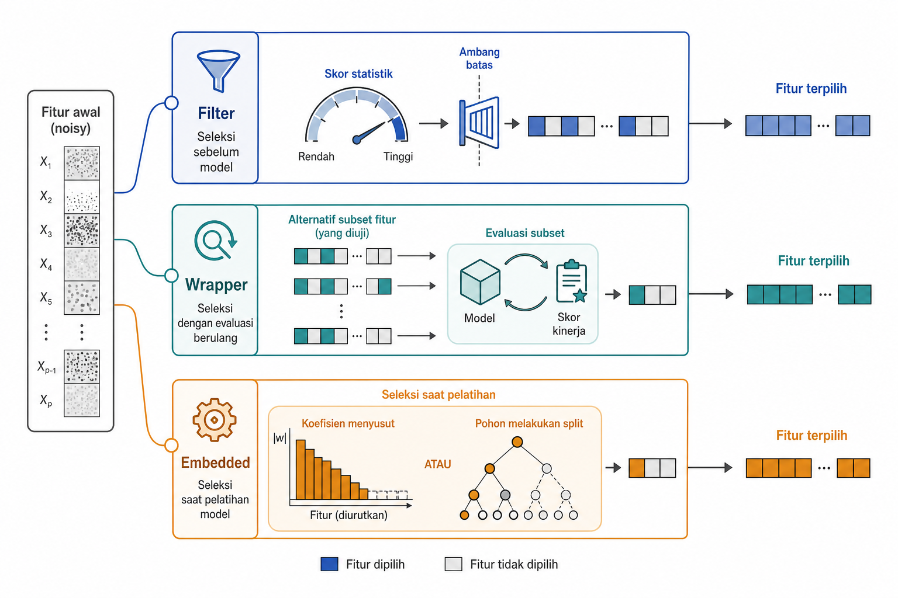
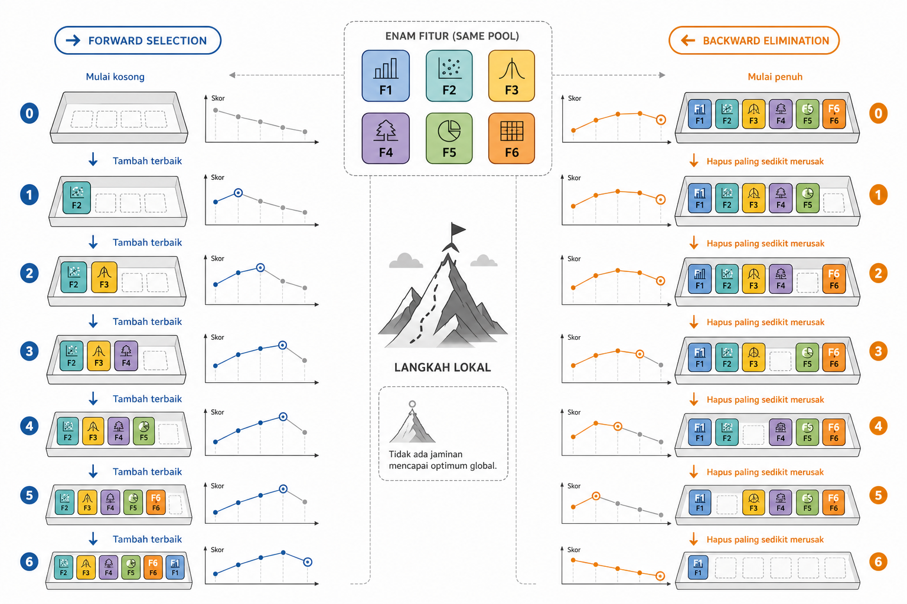
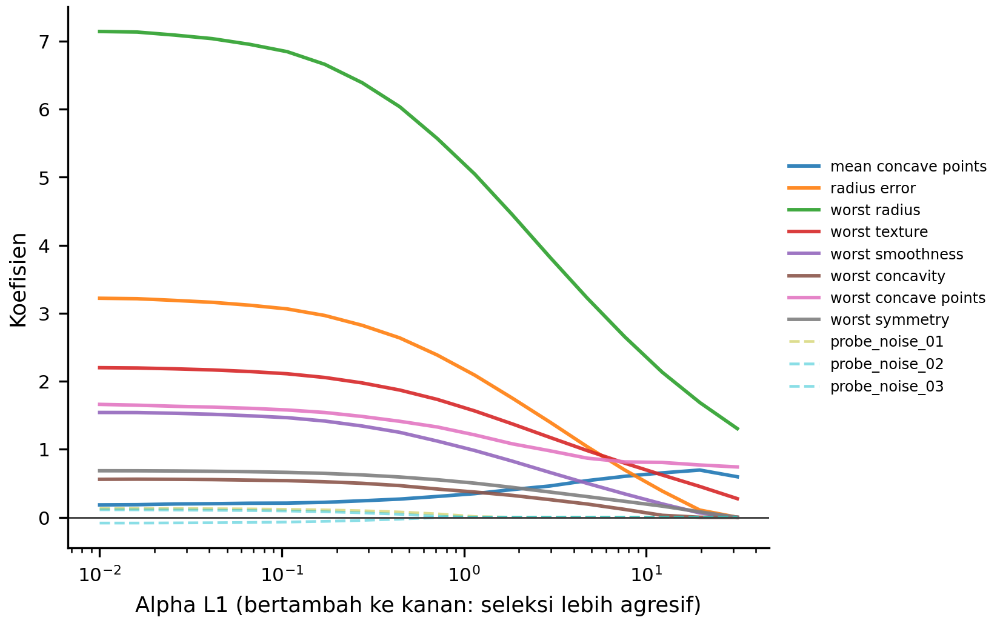
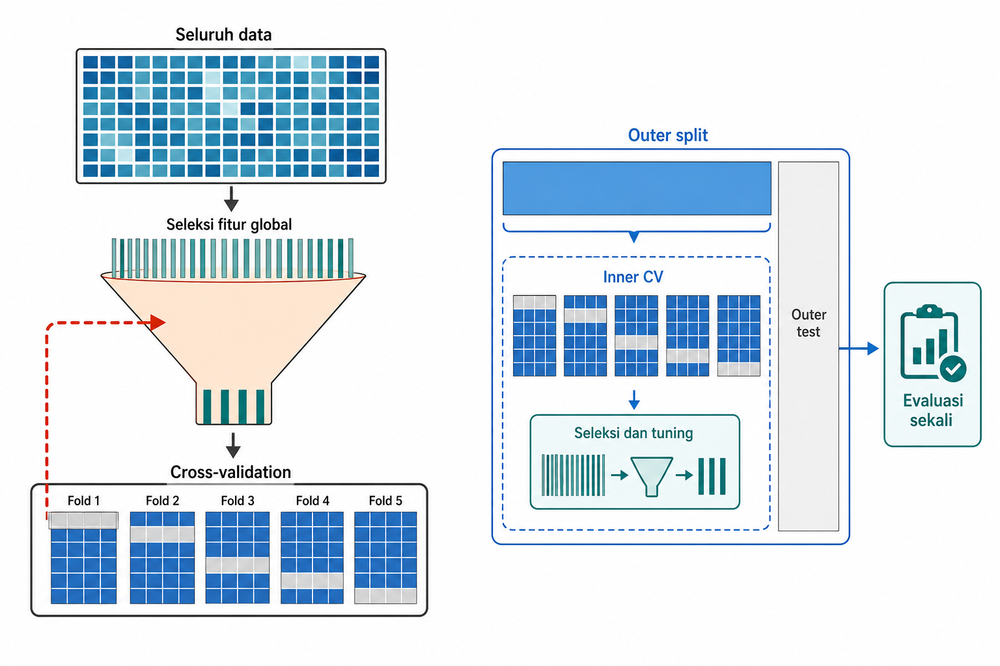

# Seleksi Fitur

Representasi yang terlalu lebar tidak selalu lebih informatif. Banyak kolom yang bergerak bersama karena berasal dari sumber yang sama, sedangkan kolom lain hanya membawa *noise*. Pada data berdimensi tinggi, model lebih mudah menghafal daripada belajar pola yang menggeneralisasi. Pada sistem produksi, setiap fitur yang dipertahankan harus dihitung, dimonitor, dan dijaga definisinya. Karena itu, seleksi fitur diperlukan untuk menyimpan informasi berguna sambil mengurangi *noise*, redundansi, biaya komputasi, dan kesulitan interpretasi.

Tiga keluarga metode dibahas dalam bab ini. Metode filter menilai fitur dengan statistik sebelum model dilatih, cepat tetapi buta terhadap interaksi. Metode wrapper memilih subset dengan melatih dan mengevaluasi model, kuat tetapi mahal. Metode embedded melakukan seleksi selama pelatihan, misalnya melalui penalti L1. Bab ini menguraikan ketiga keluarga tersebut serta menekankan bahwa seleksi fitur harus berada di dalam alur validasi, bukan dilakukan sekali pada seluruh dataset sebelum evaluasi.

## Relevansi, Redundansi, dan *Curse of Dimensionality*

Sebuah fitur disebut relevan jika fitur tersebut membawa informasi yang berguna untuk target pada tugas tertentu. Pada dataset Breast Cancer Wisconsin Diagnostic (WDBC), *worst concave points* atau *worst radius* dapat membantu membedakan diagnosis karena terkait dengan bentuk inti sel. Sebaliknya, fitur *probe-noise* seharusnya tidak konsisten membantu. Relevansi selalu melekat pada tugas, sehingga fitur yang penting untuk satu target bisa tidak berguna untuk target lain.

Redundansi berbeda dari ketidakrelevanan. Fitur redundan bisa relevan, tetapi informasinya sudah diwakili oleh fitur lain. Pada WDBC, radius, perimeter, dan area tidak identik, tetapi ketiganya membawa informasi ukuran sel yang sangat berkaitan. *Mean radius* dan *mean perimeter* dapat sama-sama relevan untuk diagnosis, namun salah satunya mungkin hanya menambah sedikit informasi setelah yang lain masuk. Karena itu, subset fitur perlu dipahami sebagai tim, bukan daftar pemenang satu per satu.

Seleksi fitur yang ideal mencari himpunan dengan relevansi tinggi terhadap target dan redundansi rendah antaranggota (Guyon and Elisseeff 2003). Prinsip ini muncul pada pendekatan seperti minimum-redundancy maximum-relevance, atau mRMR. Intuisinya sederhana. Kita tidak hanya mencari fitur yang kuat sendirian. Kita mencari beberapa fitur yang saling melengkapi.

Dimensi tinggi membuat persoalan tersebut lebih tajam. Semakin banyak fitur, semakin besar risiko *overfitting*, kebutuhan memori, biaya komputasi, dan kesulitan interpretasi. Pada data dengan sampel terbatas, fitur lemah, redundan, atau sengaja dibuat sebagai *probe-noise* dapat mengaburkan sinyal utama. Model mungkin menemukan pola kebetulan yang tidak muncul lagi pada data baru.

*Curse of dimensionality* membuat sampel makin jarang karena volume ruang fitur tumbuh cepat. Jumlah observasi yang dibutuhkan untuk mempertahankan kepadatan data pun dapat meningkat secara eksponensial. Penalaran berbasis jarak ikut memburuk karena tetangga terdekat tidak lagi terasa jauh lebih dekat dibanding titik lain. Seleksi fitur mengurangi sebagian beban ini dengan menghapus dimensi yang tidak perlu. Bab 8 mengambil jalur lain, yaitu mengompresi fitur ke ruang representasi baru.

Lebih sedikit fitur tidak otomatis berarti lebih baik. Menghapus fitur yang benar-benar membawa sinyal dapat merusak performa dan bahkan kewajaran model. Seleksi fitur yang baik bukan tindakan merapikan tabel, melainkan memilih representasi yang lebih stabil dan lebih mudah digeneralisasi. Dari kerangka relevansi dan redundansi ini, metode yang paling mudah dimulai adalah metode yang memberi skor statistik pada fitur.

::: {.pendalaman}

Pendalaman

### Konsentrasi jarak di dimensi tinggi {.pendalaman-title .unnumbered .unlisted}

Ketika dimensi bertambah, selisih antara tetangga terdekat dan terjauh dapat mengecil relatif terhadap jarak itu sendiri. Dengan kata lain, semua titik tampak hampir sama jauhnya. Metode berbasis jarak seperti k-NN, clustering, atau kernel tertentu kehilangan daya pembeda karena struktur kedekatan menjadi kabur. Ini adalah sifat geometri dimensi tinggi, bukan masalah kualitas data saja. Karena itu, menghapus dimensi yang tidak perlu melalui seleksi fitur, atau mengompresinya seperti pada Bab 8, dapat membantu.
:::

## Metode *Filter*

Cara paling murah untuk menyeleksi fitur adalah menilai setiap fitur sebelum model akhir dilatih. Metode *filter* bekerja seperti gerbang awal. Fitur diberi skor, lalu sebagian dipertahankan berdasarkan ambang, peringkat, atau jumlah fitur yang diinginkan. Contohnya adalah *variance threshold*, korelasi, *chi-square*, ANOVA F-test klasifikasi untuk menilai perbedaan rata-rata fitur numerik antar kelas, serta *mutual information*. Untuk target kontinu, `f_regression` menilai asosiasi linear antara fitur numerik dan target; pertanyaannya berbeda dari perbandingan rata-rata antar kelas.

Gambar 7.1 menempatkan *filter* bersama dua keluarga lain. Pada *filter*, statistik menjadi gerbang sebelum model. Pada *wrapper*, model dilatih berulang kali untuk menilai subset. Pada *embedded*, seleksi terjadi sebagai bagian dari pelatihan model.

{#fig-ch07-fig-1}

Statistik yang dipakai harus cocok dengan tipe data dan bentuk hubungan yang dicari. Pearson correlation mengukur asosiasi linear antara dua variabel numerik.

$$r = \dfrac{\sum_i (x_i - \bar{x})(y_i - \bar{y})}{\sqrt{\sum_i (x_i - \bar{x})^2 \sum_i (y_i - \bar{y})^2}}$$

dengan $x_i$ dan $y_i$ sebagai nilai observasi ke-$i$, sedangkan $\bar{x}$ dan $\bar{y}$ adalah rata-ratanya. Korelasi berguna untuk hubungan linear, tetapi dapat gagal pada pola *U-shaped*, hubungan non-linear lain, atau ketika satu *outlier* kuat menarik nilai korelasi.

*Mutual information* mengukur seberapa banyak pengetahuan tentang $X$ mengurangi ketidakpastian tentang $Y$.

$$I(X; Y) = \sum_{x, y} p(x, y) \log \dfrac{p(x, y)}{p(x)\,p(y)}$$

Karena tidak terbatas pada hubungan linear, *mutual information* dapat menangkap ketergantungan yang lebih umum. *Chi-square* membandingkan frekuensi teramati dan frekuensi harapan di bawah asumsi independensi.

$$\chi^2 = \sum_i \dfrac{(O_i - E_i)^2}{E_i}$$

dengan $O_i$ sebagai frekuensi teramati dan $E_i$ sebagai frekuensi harapan. Dalam seleksi fitur, *chi-square* cocok untuk fitur bernilai non-negatif, seperti frekuensi atau *count*, dengan target kategorikal.

Kelebihan *filter* adalah kecepatannya. Metode ini berguna sebagai penyaringan awal pada data berdimensi tinggi, misalnya untuk menghapus fitur yang hampir konstan atau memilih fitur teks paling informatif. Keterbatasannya muncul karena banyak *filter* menilai fitur satu per satu. Dua fitur yang lemah sendiri-sendiri mungkin kuat jika muncul bersama, tetapi interaksi semacam itu dapat terlewat. Dua sensor yang hampir identik dapat sama-sama mendapat skor tinggi dan sama-sama lolos.

Seperti *transformer* lain, *filter* harus dipasang di dalam *fold* pelatihan ketika dipakai untuk evaluasi model. Jika skor fitur dihitung dari seluruh *dataset* sebelum *split*, target pada *fold* validasi ikut memengaruhi pilihan fitur. Skor evaluasi menjadi terlalu optimistis. Dalam praktik modern, *attribution score* dari model pohon cepat, misalnya *mean absolute SHAP*, kadang dipakai sebagai *filter* yang lebih sadar model. Tetap saja, langkah ini merupakan proses seleksi dan harus divalidasi. Jika interaksi dan redundansi menjadi terlalu penting untuk diabaikan, seleksi perlu dibuat lebih dekat dengan performa model.

## Metode *Wrapper*

Metode *wrapper* memilih fitur dengan melatih dan mengevaluasi model pada subset fitur yang berbeda. *Filter* menilai asosiasi setiap fitur dengan target, sedangkan *wrapper* membandingkan subset berdasarkan performa model yang dihasilkan.

Secara ideal, masalahnya dapat ditulis sebagai berikut.

$$\max_{S \subseteq F} \operatorname{Skor}(M, S)$$

dengan $F$ sebagai himpunan semua fitur, $S$ sebagai subset yang dipilih, $M$ sebagai model, dan $\operatorname{Skor}(M, S)$ sebagai performa tervalidasi model memakai subset tersebut. Jika ada $n$ fitur, jumlah subset yang mungkin adalah $2^n$. Pencarian lengkap segera menjadi mustahil ketika $n$ tidak kecil. Karena itu, metode *wrapper* biasanya memakai heuristik *greedy*.

Sequential forward selection mulai dari subset kosong. Pada setiap langkah, metode ini mencoba menambahkan satu fitur yang paling meningkatkan skor. Sequential backward selection mulai dari semua fitur, lalu menghapus satu fitur yang paling sedikit merusak skor. Kedua jalur ini tidak selalu berakhir pada subset yang sama, karena keputusan awal dapat memengaruhi pilihan berikutnya. Karena bersifat *greedy*, metode ini tidak menjamin subset global terbaik.

Gambar 7.2 memperlihatkan dua jalur tersebut pada contoh kecil. Jalur forward tumbuh dari kosong, sedangkan jalur backward menyusut dari set penuh. Di setiap tahap, metode memilih langkah lokal terbaik, bukan menjamin solusi global terbaik.

{#fig-ch07-fig-2}

Recursive feature elimination, atau RFE, mengambil jalur lain. Metode ini melatih model, membaca koefisien atau *feature importance*, menghapus fitur yang dianggap paling lemah, lalu mengulang proses. RFE membutuhkan model yang menyediakan koefisien atau *importance*. Sequential feature selection lebih *model-agnostic* karena hanya membutuhkan skor model pada subset tertentu.

Kelebihan *wrapper* adalah penilaiannya mengikuti model dan metrik yang dipakai. Kemampuannya menangkap interaksi bergantung pada estimator dasar; *wrapper* dengan model linear tanpa fitur interaksi tidak otomatis menemukan hubungan interaktif. Pendekatan ini juga dapat mengurangi redundansi jika model dan metriknya mengenali dua fitur sebagai pengganti. Jika dua fitur hampir saling menyalin, setelah salah satunya masuk ke subset, fitur kedua mungkin tidak lagi menambah skor dan dapat ditinggalkan. Ini berbeda dari *filter* yang sering meloloskan keduanya.

Biayanya adalah komputasi dan risiko *overfitting* terhadap prosedur validasi. Karena model dilatih berkali-kali, *wrapper* mahal pada data besar atau fitur banyak. Pada sampel kecil, subset yang menang bisa saja menang karena kebetulan pada *fold* tertentu. Hasil *wrapper* juga spesifik terhadap model, metrik, dan skema validasi yang dipakai. Fitur yang terpilih untuk model linear belum tentu merupakan fitur terbaik untuk model pohon. Keluarga berikutnya mencoba mengambil sebagian manfaat seleksi yang sadar model tanpa pencarian subset yang terlalu mahal.

## Metode *Embedded*

Metode *embedded* mengintegrasikan seleksi ke dalam pelatihan model. Model menghasilkan sinyal seleksi melalui koefisien, regularisasi, atau *feature importance*, sehingga pendekatannya lebih sadar model daripada *filter* dan biasanya lebih ringan daripada pencarian banyak subset pada *wrapper*.

Contoh pentingnya adalah model dengan regularisasi L1, atau LASSO (Tibshirani 1996). Karena WDBC merupakan tugas klasifikasi biner, tujuan yang sesuai untuk contoh ini adalah regresi logistik berpenalti L1.

$$\min_{w,b} \left[-\dfrac{1}{n}\sum_{i=1}^{n}\left(y_i\log p_i + (1-y_i)\log(1-p_i)\right) + \alpha\lVert w\rVert_1\right],
\qquad p_i = \sigma(w^{\top}x_i+b)$$

dengan $y_i \in \{0,1\}$ sebagai label, $p_i$ sebagai probabilitas kelas positif, $w$ sebagai vektor bobot, $b$ sebagai *intercept*, dan $\alpha$ sebagai pengatur kekuatan penalti. Suku pertama adalah *log loss* klasifikasi, sedangkan suku kedua memberi biaya pada bobot yang tidak nol. Ketika $\alpha$ dinaikkan, sebagian koefisien dapat didorong sampai tepat nol. Pada fitur yang berkorelasi, L1 dapat memilih salah satu fitur pengganti secara tidak stabil; koefisien nol bukan bukti bahwa fitur lain tidak relevan. Karena penalti bergantung pada skala koefisien, standardisasi harus di-*fit* di dalam setiap *fold* pelatihan.

Gambar 7.3 menggunakan dataset Breast Cancer Wisconsin Diagnostic sebagai contoh kerja untuk memperlihatkan lintasan koefisien saat $\alpha$ meningkat. Setiap baris mewakili satu sampel massa payudara dengan ciri numerik yang diperoleh dari citra, dan targetnya membedakan diagnosis ganas dengan jinak. Fitur *probe noise* ditambahkan saat percobaan agar penyusutan koefisien terlihat jelas. Sebagian koefisien menyentuh nol lebih awal, sedangkan yang lain bertahan lebih lama; urutan ini bergantung pada kekuatan regularisasi, skala fitur, dan korelasi antarfitur.

{#fig-ch07-fig-3}

Model pohon dan *ensemble* juga sering memberi *feature importance*. Alur seperti `SelectFromModel` memakai koefisien atau *importance* dari model terlatih untuk memilih fitur. Namun, *importance* tidak netral. Pada model pohon, *importance* dapat bias terhadap fitur berkardinalitas tinggi, fitur dengan banyak titik *split*, atau fitur yang berkorelasi dengan fitur lain. Berbeda dari L1, seleksi berbasis *importance* pohon tidak otomatis menghilangkan redundansi antarfitur dengan cara yang sama. Karena itu, *importance* model sebaiknya diperiksa dengan *permutation importance*, *ablation*, atau evaluasi ulang pada subset yang dipilih.

Tabel 7.1 mengembalikan ketiga keluarga metode ke sumbu perbandingan yang sama. Kolomnya menekankan keputusan praktis tentang kecepatan metode, kemampuan menangkap interaksi, cara menangani redundansi, keterikatan hasil pada model, dan risiko utamanya.

::: {.tabel-buku}

| Keluarga | Kecepatan | Interaksi | Redundansi | Terikat model? | Risiko utama |
| --- | --- | --- | --- | --- | --- |
| Filter | Sangat cepat | Tidak | Tidak | Tidak | Meloloskan duplikat dan membuang fitur interaksi |
| Wrapper | Lambat | Tergantung estimator dasar | Dapat | Ya | *Overfitting* prosedur seleksi dan biaya komputasi |
| Embedded | Cepat-sedang | Sebagian, tergantung model | Dapat; L1 bisa tidak stabil pada fitur berkorelasi | Ya | Bias *importance* dan hasil spesifik-model |

: Perbandingan keluarga metode seleksi {#tbl-ch07-8}

:::

Metode *embedded* sering menjadi kompromi yang menarik karena lebih dekat ke kecepatan *filter*, tetapi lebih sadar model dan dapat menangani sebagian redundansi. Hasilnya tetap mewarisi bias model yang melakukan seleksi. Jika model pemilih tidak sesuai dengan model akhir atau struktur data, subset yang dihasilkan bisa menyesatkan. Karena itu, Tabel 7.1 perlu dibaca bersama prinsip berikutnya. Seleksi harus dinilai melalui validasi yang tidak ikut dipakai untuk memilih fitur, apa pun keluarga metodenya.

::: {.pendalaman}

Pendalaman

### Minimal-optimal vs all-relevant sebagai dua filosofi seleksi {.pendalaman-title .unnumbered .unlisted}

Pendekatan minimal-optimal, seperti LASSO atau mRMR, mencari subset sekecil mungkin yang mempertahankan performa. Ini cocok untuk model produksi yang ringkas. Pendekatan all-relevant berusaha menemukan semua fitur yang membawa sinyal, termasuk fitur yang redundan tetapi bermakna secara ilmiah. Boruta mengikuti filosofi kedua. Metode ini membuat *shadow features* dengan mengacak fitur asli, lalu mempertahankan fitur nyata yang mengalahkan shadow-nya secara statistik. Ide shadow ini berkerabat dengan *probe feature* sebagai pembanding acak, tetapi tujuannya berbeda. Boruta mencari semua sinyal, sementara pembuangan *noise* hanya sebagian dari pekerjaan itu.
:::

## Stabilitas Seleksi dan Validasi Bersarang

Seleksi fitur selalu bergantung pada data (Cawley and Talbot 2010). Jika dilakukan sebelum *train/test split* atau di luar *fold cross-validation*, informasi dari data validasi dapat masuk ke pilihan fitur. Ini bentuk *leakage* yang sering terjadi karena seleksi terasa seperti langkah persiapan biasa. Jika target dipakai untuk memilih fitur, pilihan tersebut sudah dipengaruhi oleh label pada data yang seharusnya menjadi penguji.

Kerusakannya muncul dalam beberapa bentuk. Estimasi performa menjadi terlalu optimistis karena asosiasi target pada data uji ikut terlihat saat seleksi. Objektivitas evaluasi juga hilang karena model secara tidak langsung sudah melihat label uji. Saat produksi, performa dapat runtuh karena fitur yang tampak kuat ternyata hanya cocok dengan kebetulan pada *dataset* penuh.

Jika seleksi fitur dan *tuning* hiperparameter dilakukan bersama, evaluasi sebaiknya memakai *nested validation* atau *test set* yang benar-benar tidak disentuh. *Inner loop* memilih jumlah fitur $k$, kekuatan L1 $\alpha$, atau subset terbaik. *Outer loop* menilai performa pada *fold* yang belum dipakai untuk keputusan tersebut. Bab 2 sudah memperkenalkan *nested cross-validation*. Di bagian ini, prinsipnya diterapkan khusus pada seleksi fitur.

Gambar 7.4 membandingkan alur salah dan benar. Pada alur salah, seleksi dilakukan pada seluruh data sebelum *cross-validation*, sehingga informasi dari *fold* validasi masuk ke tahap seleksi. Pada alur benar, setiap *outer fold* memiliki seleksi dan *tuning* di bagian *train*-nya sendiri, lalu dievaluasi pada bagian *outer test* yang belum disentuh.

{#fig-ch07-fig-4}

Selain performa, stabilitas juga perlu diperhatikan. Seleksi yang stabil memilih fitur serupa di berbagai *fold*, *resample*, periode waktu, atau populasi. Seleksi yang tidak stabil dapat menandakan sinyal lemah, fitur-fitur pengganti yang saling berkorelasi, sampel terlalu kecil, atau seleksi yang terlalu agresif. Kadang fitur individual berganti-ganti, tetapi kelompok sinyalnya tetap sama. Beberapa ukuran aktivitas pengguna, misalnya, dapat saling menggantikan. Model tidak selalu membutuhkan semuanya, tetapi keluarga fitur aktivitas tetap penting.

Stabilitas tidak berarti fitur harus sama persis di semua situasi. Dunia dapat berubah, populasi dapat bergeser, dan fitur yang relevan pada satu periode mungkin melemah pada periode lain. Namun, jika subset berubah drastis hanya karena *fold* berubah sedikit, hasil seleksi perlu dibaca sebagai tidak pasti.

::: {.pendalaman}

Pendalaman

### Mengukur stabilitas seleksi {.pendalaman-title .unnumbered .unlisted}

Stabilitas dapat diukur dengan membandingkan himpunan fitur yang dipilih pada dua fold. Salah satu ukuran sederhana adalah Jaccard index, $J(A, B) = \dfrac{|A \cap B|}{|A \cup B|}$, dengan $A$ dan $B$ sebagai dua himpunan fitur terpilih. Nilai mendekati 1 berarti pilihan sangat mirip, sedangkan nilai mendekati 0 berarti hampir tidak ada irisan. Namun, fitur yang saling berkorelasi dapat menurunkan skor pasangan walaupun kelompok sinyalnya stabil. Pemeriksaan juga perlu mencakup kelompok fitur, bukan hanya nama kolom individual. Stabilitas rendah lebih tepat dibaca sebagai temuan tentang data dan sinyal daripada sebagai kegagalan algoritma semata.
:::

::: {.sintesis-bab}

## Sintesis Bab {.unnumbered .unlisted}

Seleksi fitur adalah keputusan representasi untuk menyederhanakan tanpa membuang sinyal penting. Fitur yang baik tidak hanya relevan terhadap target, tetapi juga tidak terlalu mengulang fitur lain, stabil di bawah evaluasi yang sah, dan layak dipelihara dalam sistem. Pada data berdimensi tinggi, seleksi dapat mengurangi *overfitting*, biaya komputasi, dan kesulitan interpretasi, terutama setelah proses pembentukan fitur seperti pada Bab 6.

Metode *filter* cepat dan berguna sebagai penyaringan awal, tetapi mudah melewatkan interaksi dan meloloskan duplikat. Metode *wrapper* lebih dekat dengan model dan metrik tertentu, tetapi mahal dan rentan *overfitting* prosedural. Metode *embedded* melakukan seleksi selama pelatihan, misalnya melalui L1 atau *importance* model, tetapi mewarisi bias model pemilih. Tabel 7.1 merangkum perbedaan ini sebagai peta keputusan, bukan sebagai peringkat mutlak.

Prinsip terpentingnya adalah validasi. Seleksi fitur harus diperlakukan sebagai proses yang belajar dari data, sehingga ditempatkan di dalam *split*, *fold*, atau *nested validation*. Setelah fitur dipilih, hasilnya perlu diperiksa melalui stabilitas subset, ketersediaan saat inferensi, kewajaran secara domain, dan kontribusinya terhadap tujuan model.
:::

## Bacaan Lanjutan {.bacaan-lanjutan .unnumbered .unlisted}

- scikit-learn --- Feature selection --- <https://scikit-learn.org/stable/modules/feature_selection.html>. Metode filter, wrapper, dan embedded.

- Beyer dkk. (1999), "When Is Nearest Neighbor Meaningful?" --- <https://doi.org/10.1007/3-540-49257-7_15>. Konsentrasi jarak di dimensi tinggi.

- Peng dkk. (2005), mRMR (IEEE TPAMI) --- <https://doi.org/10.1109/TPAMI.2005.159>. Seleksi minimum-redundancy maximum-relevance.

- Nogueira dkk. (2018), Stability of Feature Selection (JMLR) --- <https://jmlr.org/papers/v18/17-514.html>. Mengukur kestabilan hasil seleksi fitur.

- Kursa & Rudnicki (2010), Boruta (JStatSoft) --- <https://doi.org/10.18637/jss.v036.i11>. Wrapper all-relevant berbasis random forest.

## Rujukan {.rujukan .unnumbered .unlisted}

::: {.references}

Cawley, Gavin C., and Nicola L. C. Talbot. 2010. "On over-Fitting in Model Selection and Subsequent Selection Bias in Performance Evaluation." *Journal of Machine Learning Research* 11: 2079--107.

Guyon, Isabelle, and André Elisseeff. 2003. "An Introduction to Variable and Feature Selection." *Journal of Machine Learning Research* 3: 1157--82.

Tibshirani, Robert. 1996. "Regression Shrinkage and Selection via the Lasso." *Journal of the Royal Statistical Society, Series B* 58 (1): 267--88.

:::
