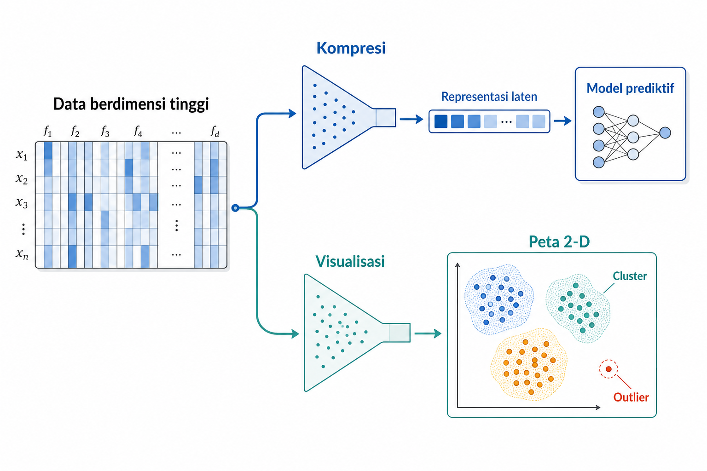
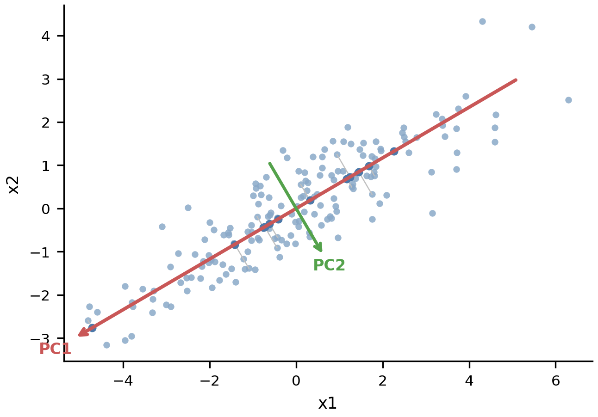
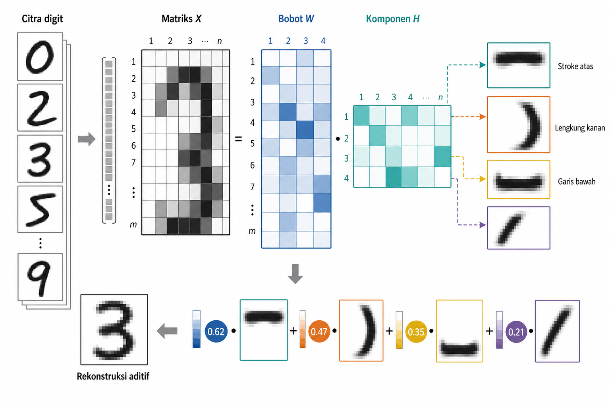
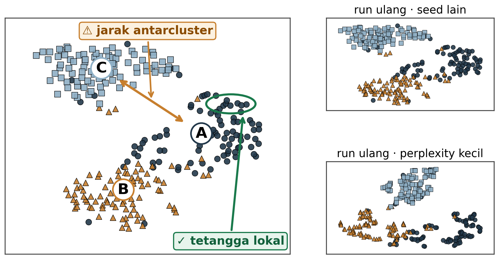
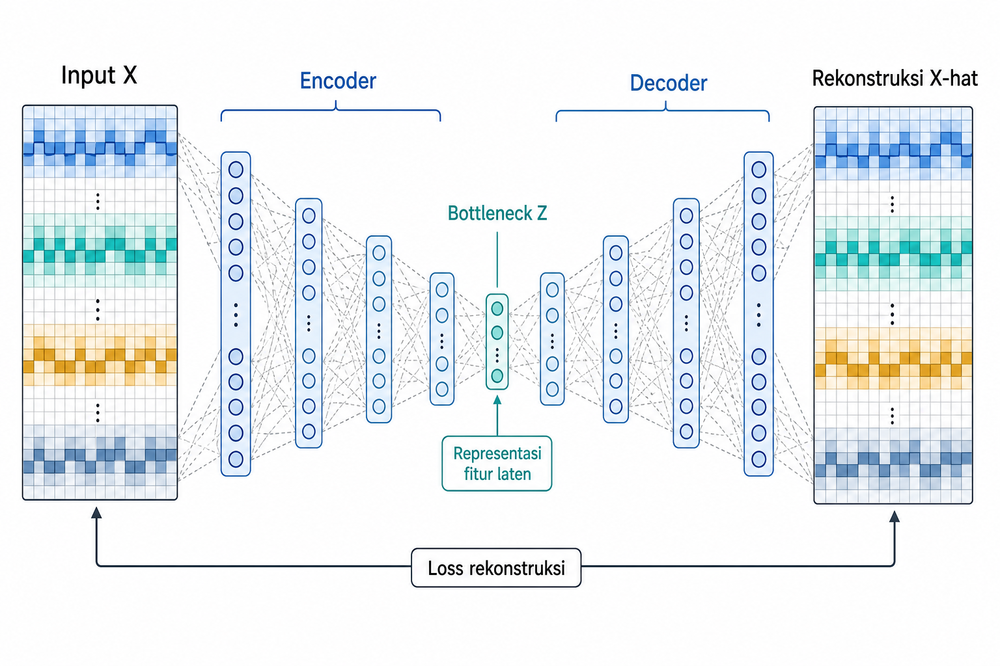

# Reduksi Dimensi dan Representasi Laten

Reduksi dimensi berbeda dari seleksi fitur. Seleksi fitur memilih sebagian kolom asli sehingga nama dan makna kolom tetap dipertahankan. Reduksi dimensi membangun sumbu baru yang mencampur banyak fitur asal. Hasilnya lebih kompak, tetapi biasanya lebih sulit diberi nama fisik. Komponen pertama PCA, komponen pertama NMF, atau dimensi laten autoencoder bukan lagi kolom mentah yang mudah dibaca.

Karena itu, pilihan metode bergantung pada tujuan representasi. Untuk kompresi, fitur laten harus stabil dan dapat diterapkan pada data baru. Untuk visualisasi, peta dua dimensi membantu manusia melihat struktur pengelompokan. Untuk *denoising*, struktur berdimensi rendah diharapkan menyimpan pola utama dan membuang variasi kecil. Bab ini membahas PCA dan SVD, Non-negative Matrix Factorization, manifold learning dengan t-SNE dan UMAP, serta autoencoder sebagai kompresi yang dipelajari. Bab ini juga menguraikan cara menempatkan reduksi di dalam pipeline dengan benar.

## Mengapa Mereduksi Dimensi? Kompresi vs Visualisasi

Secara umum, reduksi dimensi memetakan data berdimensi tinggi ke ruang yang lebih kecil. Notasinya dapat ditulis sebagai berikut.

$$X_{\text{laten}} = f(X)$$

Dengan $X \in \mathbb{R}^{n \times d}$ sebagai matriks data asal, $X_{\text{laten}} \in \mathbb{R}^{n \times k}$ sebagai representasi hasil, dan $k \ll d$. Bab ini membahas cara memilih fungsi $f$ dan jumlah dimensi $k$.

Tujuan pertama adalah kompresi. Contoh kompresi pada bagian ini memakai dataset Optical Digits. Setiap baris mewakili satu citra digit tulisan tangan berukuran 8 x 8 piksel, sehingga 64 intensitas piksel menjadi fitur dan digit 0 sampai 9 menjadi target klasifikasi. Data ini dapat diringkas menjadi sejumlah komponen lebih kecil sebelum klasifikasi angka. Representasi yang lebih kecil dapat mengurangi memori, mempercepat pelatihan, dan kadang membuang *noise*. Jika kompresi dipakai sebagai preprocessing untuk model prediktif, transformasinya harus dapat diterapkan pada data validasi, test, dan inferensi.

Tujuan kedua adalah visualisasi. Data berdimensi tinggi dipetakan ke dua atau tiga dimensi agar manusia dapat melihat kelompok, transisi, *outlier*, atau pola kasar. Pada digit tulisan tangan, *scatter plot* dua dimensi membantu memeriksa apakah angka dengan bentuk mirip, seperti 3 dan 8 atau 4 dan 9, saling mendekat. Namun, peta visual bukan bukti definitif bahwa kelas benar-benar terpisah. Peta tersebut merupakan alat eksplorasi.

Kedua tujuan ini tidak boleh dipertukarkan begitu saja. Peta visual dua dimensi biasanya membuang terlalu banyak variasi untuk menjadi *input* utama model klasifikasi. Sebaliknya, kompresi 10 atau 50 dimensi mungkin berguna untuk model, tetapi tidak bisa diperiksa langsung oleh mata. Denoising dapat menjadi tujuan ketiga ketika representasi berdimensi rendah menyimpan struktur utama dan mengabaikan variasi kecil yang tidak konsisten.

Gambar 8.1 memperlihatkan percabangan tujuan ini. Satu *dataset* berdimensi tinggi dapat masuk ke cabang kompresi, lalu memberi fitur laten ke model. *Dataset* yang sama juga dapat masuk ke cabang visualisasi, lalu menghasilkan *scatter plot* untuk manusia. Keduanya sah, tetapi pertanyaan evaluasinya berbeda.

Secara garis besar, metode pada bab ini dapat dikelompokkan menjadi linear, non-linear, dan metode neural yang mempelajari fungsi kompresi. PCA, SVD, dan NMF membangun kombinasi atau faktor linear. t-SNE dan UMAP membangun peta manifold non-linear, terutama untuk visualisasi. Autoencoder belajar fungsi kompresi melalui jaringan neural. Metode juga dapat dirangkai, misalnya PCA lebih dulu untuk menurunkan dimensi, lalu UMAP untuk visualisasi. Peta tujuan ini mengawali pembahasan dengan metode linear yang paling umum dipakai sebagai *baseline* kompresi, yaitu PCA dan SVD.

## PCA dan SVD

Untuk kompresi linear yang dapat dipakai ulang, PCA dan SVD biasanya menjadi titik awal. Principal Component Analysis, atau PCA (Pearson 1901), mencari arah ortogonal yang menangkap variasi terbesar pada data yang sudah di-*center*. Komponen pertama merupakan arah dengan varians terbesar. Komponen kedua mencari variasi terbesar berikutnya, dengan syarat tegak lurus terhadap komponen pertama. Dengan memilih beberapa komponen teratas, data diproyeksikan ke ruang yang lebih kecil.

Secara komputasional, PCA modern sering dihitung melalui singular value decomposition.

$$X = U \Sigma V^{\top}$$

Dalam rumus tersebut, $X$ adalah data yang sudah di-*center*. Matriks $U$ berisi left singular vectors, $\Sigma$ berisi singular values, dan $V \in \mathbb{R}^{d \times d}$ berisi right singular vectors, yaitu arah komponen utama sebagai kolom-kolom $V$. Singular value bukan varians itu sendiri. Untuk data terpusat dengan $n$ sampel, varians yang dijelaskan komponen ke-$j$ sebanding dengan kuadratnya, yaitu $\sigma_j^2/(n-1)$. Dalam bentuk penuh, $U$ berukuran $n \times n$ dan $\Sigma$ berukuran $n \times d$. Jika $W_k \in \mathbb{R}^{d \times k}$ berisi $k$ komponen teratas, proyeksi data dapat ditulis sebagai berikut.

$$Z = X W_k$$

Matriks $Z$ inilah fitur baru yang dipakai sebagai representasi berdimensi lebih rendah.

Komponen PCA adalah kombinasi linear dari fitur asal. Karena itu, PCA dapat menangkap struktur korelasi. Pada Optical Digits, piksel yang berada di *stroke* yang sama sering bergerak bersama. Bagian atas, tengah, atau bawah angka dapat menyala dalam pola yang berulang. PCA merangkum sebagian variasi bersama tersebut dalam satu atau beberapa komponen. Namun, komponen yang mempunyai varians besar belum tentu paling berguna untuk target prediksi. Varians merupakan ukuran struktur data, bukan ukuran kegunaan prediktif.

Gambar 8.2 menunjukkan intuisi PCA pada data dua dimensi. Arah PC1 mengikuti sumbu awan data yang paling panjang. Jika titik-titik diproyeksikan ke PC1, data dua dimensi menjadi representasi satu dimensi yang mempertahankan variasi terbesar dan membuang variasi tersisa.

Skala fitur sangat berpengaruh. Pada Optical Digits, semua fitur sama-sama intensitas piksel sehingga skala awalnya seragam. Pada *dataset* lain, jika satu fitur memakai satuan rupiah dan fitur lain memakai skala 0 sampai 1, fitur berskala besar dapat mendominasi komponen. Standardisasi tepat ketika tujuan analisis adalah memberi setiap fitur bobot relatif yang sebanding. Jika variasi absolut dalam satuan asal memang bermakna, skala asli dapat dipertahankan. Pilihan ini mengubah matriks yang didekomposisi, sehingga juga mengubah tujuan dan komponen PCA; *scaler* harus di-*fit* bersama PCA di dalam *fold* pelatihan.

Untuk matriks *sparse*, seperti TF-IDF teks, Truncated SVD sering lebih cocok daripada PCA biasa. Alasannya praktis. PCA membutuhkan centering, yaitu mengurangkan mean dari setiap kolom. Pada matriks *sparse*, nol berarti tidak ada kata atau token. Setelah centering, banyak nol berubah menjadi nilai non-nol kecil, sehingga *sparsity* hancur dan memori membengkak. Truncated SVD menghindari centering dan dapat bekerja lebih langsung pada representasi *sparse*.

Pada skala besar, ada variasi komputasi lain. `IncrementalPCA` dapat belajar dari *minibatch* ketika data tidak muat sekaligus di memori. Randomized SVD solver memberi percepatan ketika hanya sedikit komponen teratas yang dibutuhkan dibanding dimensi asal. Apa pun variannya, PCA atau SVD yang dipakai untuk model harus di-*fit* hanya pada data pelatihan, lalu diterapkan ke validasi, *test*, dan inferensi. PCA/SVD kuat sebagai ringkasan linear umum. Metode berikutnya tetap linear, tetapi menambahkan batasan non-negatif agar komponen lebih mudah dibaca sebagai bagian.

Aturan "pertahankan 95% varians" sering dipakai, tetapi aturan tersebut hanya heuristik. Alternatifnya adalah *parallel analysis*, yaitu membandingkan *eigenvalue* data nyata dengan *eigenvalue* dari data acak, atau menjadikan $k$ sebagai hiperparameter *pipeline* yang dipilih melalui performa validasi model hilir. Jika fitur laten dipakai untuk prediksi, kriteria kedua biasanya lebih dapat dipercaya. *Whitening* menskalakan komponen agar masing-masing mempunyai varians satu. Langkah ini dapat membantu *retrieval* atau metode berbasis jarak, tetapi juga menghapus profil varians yang kadang dimanfaatkan model klasifikasi. Karena itu, *whitening* adalah keputusan desain, bukan sakelar default.

## Non-Negative Matrix Factorization

Jika PCA menekankan arah varians terbesar, NMF mengejar bentuk kompresi linear yang lebih mudah dibaca sebagai bagian-bagian aditif. Non-negative matrix factorization, atau NMF (Lee and Seung 1999), memfaktorkan matriks non-negatif menjadi komponen non-negatif. Bentuk umumnya sebagai berikut.

$$X \approx W H$$

Dalam rumus ini, $X \in \mathbb{R}_{+}^{n \times d}$ adalah data asal non-negatif, $W \in \mathbb{R}_{+}^{n \times k}$ adalah aktivasi komponen untuk tiap sampel, dan $H \in \mathbb{R}_{+}^{k \times d}$ adalah kamus komponen. Setiap baris pada $H$ menyatakan satu komponen, sedangkan baris pada $W$ menunjukkan kekuatan kemunculan tiap komponen pada sampel.

Kata "non-negative" penting. Pada PCA, komponen dapat mencampur kontribusi positif dan negatif, sehingga sulit ditafsirkan sebagai "bagian" yang ditambahkan. Pada NMF, komponen hanya dapat ditambahkan. Sebuah gambar digit kemudian tersusun sebagai campuran *stroke* atau pola piksel yang muncul bersama. Interpretasi aditif ini membuat NMF menarik untuk intensitas citra, *document-term matrix*, data *count*, dan data lain yang secara alami tidak negatif.

Gambar 8.3 memperlihatkan contoh digit. Matriks gambar x piksel dipecah menjadi $W$ yang menyatakan gambar x komponen dan $H$ yang menyatakan komponen x piksel. Satu baris komponen dapat dibaca setelah melihat piksel mana yang paling besar pada baris tersebut.

NMF membutuhkan jumlah komponen $k$ sebagai keputusan pemodelan. Jika $k$ terlalu kecil, beberapa pola *stroke* berbeda dipaksa menyatu. Jika $k$ terlalu besar, komponen dapat terpecah menjadi pola kecil yang tidak stabil. Interpretabilitas juga tidak otomatis. Komponen NMF perlu diperiksa dari keterkenalan bagian citra, konsistensinya di beberapa *run* atau sampel, serta manfaat kompresinya bagi tugas hilir.

Karena semua *input* harus non-negatif, NMF tidak cocok langsung untuk data yang sudah di-*center* atau berisi nilai negatif. Metode ini lebih alami untuk *count*, frekuensi, intensitas, atau fitur yang sudah dipastikan non-negatif. Jika tujuan utama adalah kompresi cepat untuk data umum, PCA atau SVD sering lebih sederhana. Jika tujuan adalah representasi aditif yang dapat diperiksa, NMF layak dipertimbangkan. Batas PCA, SVD, dan NMF muncul ketika struktur data tidak dapat dirangkum dengan sumbu linear. Visualisasi sering membutuhkan peta yang mengikuti bentuk lokal data.

Kualitas NMF dapat diukur dengan keluarga divergence yang dipilih melalui $\beta$. Frobenius loss ($\beta = 2$) cocok untuk data numerik non-negatif umum. Kullback-Leibler loss ($\beta = 1$) sering dipakai untuk count atau teks. Itakura-Saito loss ($\beta = 0$) relevan untuk spektrum daya audio dengan rentang dinamis besar. Fungsi objektif NMF tidak memiliki satu optimum global yang mudah dijamin, sehingga inisialisasi penting. NNDSVD sering lebih baik daripada random initialization pada data *sparse*. Untuk skala besar, `MiniBatchNMF` dan penalti L1/L2 dapat membantu efisiensi serta *sparsity* komponen.

## *Manifold Learning* dengan t-SNE dan UMAP

PCA, SVD, dan NMF masih mencari struktur melalui faktor linear. Tidak semua struktur berdimensi rendah bersifat linear. Bayangkan kertas yang digulung menjadi bentuk seperti Swiss roll. Dua titik dapat tampak dekat jika diukur dengan garis lurus menembus ruang kosong, padahal pada permukaan kertas keduanya berjauhan. Sebaliknya, titik yang jauh secara koordinat global dapat dekat jika mengikuti permukaan manifold. Metode seperti t-SNE (Maaten and Hinton 2008) dan UMAP (McInnes et al. 2018) mencoba mempertahankan hubungan tetangga seperti ini ketika data dipetakan ke dua atau tiga dimensi.

t-SNE dan UMAP paling sering dipakai untuk visualisasi. Keduanya berusaha mempertahankan neighborhood, bukan semua jarak global. Artinya, jika dua titik berdekatan pada plot, itu dapat menjadi petunjuk bahwa keduanya mirip menurut struktur lokal. Namun, jarak antarcluster, luas cluster, dan ruang kosong di antara cluster tidak boleh dibaca terlalu harfiah.

Untuk t-SNE, fungsi objektifnya dapat ditulis sebagai berikut.

$$KL(P \parallel Q) = \sum_i \sum_{j \neq i} p_{ij} \log \dfrac{p_{ij}}{q_{ij}}$$

Pada rumus tersebut, $p_{ij}$ adalah probabilitas ketetanggaan titik $i$ dan $j$ di ruang asal, biasanya dibangun dari distribusi Gaussian lokal. Sementara itu, $q_{ij}$ adalah probabilitas ketetanggaan di *embedding*, dengan distribusi Student-t yang berekor berat. Ekor berat ini membantu mengurangi *crowding problem*, yaitu kesulitan menempatkan banyak tetangga berdimensi tinggi ke peta dua dimensi. Penalti KL bersifat asimetris. Memisahkan tetangga sejati mahal, tetapi menempelkan non-tetangga relatif lebih murah. Karena itu, struktur lokal lebih dapat dipercaya daripada struktur global.

Gambar 8.4 berfungsi sebagai panduan baca. Callout yang sah adalah neighborhood lokal dan kemungkinan cluster membership. Callout yang perlu dihindari adalah menyimpulkan bahwa jarak antarcluster berarti derajat perbedaan yang pasti, bahwa cluster besar berarti lebih padat, atau bahwa ruang kosong selalu bermakna.

Jarak antarcluster tidak selalu bermakna karena penempatan cluster jauh atau dekat dapat dipengaruhi parameter dan inisialisasi. Ukuran cluster juga bukan kepadatan data secara langsung. t-SNE dapat menyetarakan *density* secara agresif, sedangkan UMAP mempertahankan lebih banyak informasi kepadatan meskipun tetap tidak sempurna. Varian seperti densMAP tersedia ketika luas cluster perlu lebih bermakna. Hasil akhirnya dapat berubah karena *perplexity*, jumlah tetangga, *preprocessing*, *random state*, dan inisialisasi.

Perbedaan penting lain adalah transductive vs inductive. t-SNE klasik tidak menyediakan transform yang sah untuk titik baru karena peta dibuat untuk *dataset* yang sedang dianalisis. UMAP dapat mentransformasi titik baru dengan batas tertentu, yaitu melalui interpolasi tetangga terdekat dan penyempurnaan numerik, bukan fungsi eksak yang dijamin stabil untuk semua titik baru. Parametric UMAP melangkah lebih jauh dengan melatih encoder neural pada fungsi objektif UMAP, sehingga tersedia pemetaan induktif yang dapat dipakai ulang.

Karena sifat-sifat itu, t-SNE dan UMAP biasanya lebih kuat sebagai alat eksplorasi daripada sebagai representasi utama untuk supervised prediction. Jika representasi dua dimensi dipakai sebagai fitur model, distorsi jarak dan density harus menjadi peringatan besar. Jika yang dibutuhkan adalah pemetaan non-linear yang memang dapat dipakai ulang sebagai fitur, pendekatan berikutnya lebih sesuai, yaitu belajar encoder yang menghasilkan representasi laten.

Inisialisasi dapat memengaruhi susunan global t-SNE dan UMAP. Inisialisasi informatif seperti spectral atau PCA kadang membuat organisasi antarkelompok lebih stabil daripada inisialisasi acak, tetapi tidak memvalidasi jarak global pada peta. Klaim tentang struktur global tetap perlu diperiksa pada ruang asal, beberapa konfigurasi, dan ukuran stabilitas yang sesuai. UMAP sendiri umum memakai spectral initialization. Varian seperti PaCMAP menyeimbangkan pasangan dekat, sedang, dan jauh untuk tata letak global yang lebih baik. Varian yang mempertahankan kepadatan seperti densMAP tersedia ketika luas cluster ingin dibuat lebih bermakna.

## Autoencoder sebagai Kompresi yang Dipelajari

Berbeda dari t-SNE klasik yang terutama membuat peta untuk *dataset* yang sedang dianalisis, autoencoder belajar encoder yang dapat dipakai ulang pada data baru (Hinton and Salakhutdinov 2006). Autoencoder adalah jaringan neural yang belajar merekonstruksi inputnya sendiri. Arsitekturnya terdiri atas encoder, bottleneck laten, dan decoder. Encoder memetakan input ke representasi laten yang lebih kecil. Decoder mencoba membangun kembali input dari representasi itu. Bottleneck membatasi kapasitas, tetapi tidak menjamin bahwa model menyimpan struktur yang berguna atau membuang *noise*. Hasilnya bergantung pada data, arsitektur, regularisasi, dan tujuan pelatihan.

Loss rekonstruksi sederhana dapat ditulis sebagai berikut.

$$\mathcal{L}(X, \hat{X}) = \lVert X - g_{\phi}(f_{\theta}(X)) \rVert^2$$

Dalam rumus tersebut, $f_{\theta}$ adalah encoder dengan parameter $\theta$, $g_{\phi}$ adalah decoder dengan parameter $\phi$, dan $\hat{X} = g_{\phi}(f_{\theta}(X))$ adalah rekonstruksi *input*. Rumus itu menunjukkan contoh *squared-error loss*, bukan pilihan universal. Fungsi *loss* dan arsitektur perlu mengikuti tipe data, misalnya keluaran Bernoulli untuk fitur biner atau objektif yang sesuai untuk data *count*. Untuk *denoising*, *input* yang dirusak dipasangkan dengan target bersih. Apa pun objektifnya, kualitas rekonstruksi dan manfaat representasi pada tugas hilir perlu divalidasi pada data yang tidak dipakai melatih encoder.

Gambar 8.5 memperlihatkan alurnya. Bagian bottleneck, yaitu $Z$, adalah representasi yang dapat dipakai sebagai fitur laten. Jika input berupa window sensor berdimensi tinggi, encoder dapat menghasilkan vektor laten yang lebih kecil. Jika input berupa citra atau sinyal bising, autoencoder dapat dilatih agar rekonstruksinya lebih bersih.

Autoencoder dapat dipakai untuk kompresi, denoising, anomaly detection, atau fitur untuk model hilir. Denoising autoencoder merusak *input* secara sengaja, lalu belajar merekonstruksi versi bersihnya. Sparse autoencoder memberi penalti agar hanya sedikit unit laten aktif per sampel. Variational autoencoder, atau VAE, membuat encoder menghasilkan parameter distribusi sehingga ruang laten lebih halus. Detail VAE berada di luar cakupan bab ini.

Autoencoder adalah contoh jelas representasi yang dipelajari mesin, tetapi masih dalam lingkup bab ini karena representasinya dipelajari dari *dataset* yang sedang dikerjakan. Pendekatan tersebut berbeda dari pretrained representation yang dibahas lebih jauh pada Bab 15. Pada autoencoder di bab ini, analis tetap menentukan arsitektur, ukuran bottleneck, regularisasi, data pelatihan, dan prosedur validasi.

PCA sering menang pada *dataset* kecil, struktur yang hampir linear, atau situasi yang menuntut kecepatan dan interpretabilitas. Autoencoder mulai layak ketika data cukup banyak, struktur non-linear kuat, dan biaya komputasi dapat diterima. Jika autoencoder hanya merekonstruksi *noise* atau *overfit* pada data pelatihan, representasi latennya belum tentu berguna untuk prediksi. Pemakaian representasi reduksi perlu mengikuti tujuan, apakah sebagai fitur model atau alat inspeksi.

## Menggunakan Representasi Reduksi dengan Tepat

Metode reduksi dimensi harus ditempatkan sesuai tujuan. Jika hasil reduksi dipakai sebagai input model prediktif, transformasinya adalah bagian dari pipeline. PCA, SVD, NMF, atau autoencoder tidak boleh di-*fit* pada seluruh data sebelum validasi. Pada PCA, misalnya, arah komponen yang dihitung dari semua data menyerap struktur varians dari test set. Fitur training kemudian secara halus membawa informasi yang seharusnya belum tersedia.

Untuk visualisasi, batasnya berbeda. Plot t-SNE atau UMAP adalah artefak eksplorasi, bukan bukti kausal, bukan bukti cluster final, dan bukan otomatis fitur yang baik untuk model. Koordinat dua dimensi dari t-SNE sebaiknya tidak dipakai sebagai fitur downstream karena jaraknya terdistorsi, density dapat diseimbangkan, dan pada t-SNE klasik tidak ada transform yang valid untuk data baru. UMAP lebih fleksibel karena dapat mentransformasi titik baru, tetapi visualisasi tetap perlu dibaca hati-hati.

Tabel 8.1 merangkum metode utama bab ini. Kolom "Tujuan utama" membantu memilih metode dari kebutuhan, bukan dari popularitas. Kolom "Transform data baru?" penting ketika representasi akan dipakai pada inferensi. Tabel ini dimulai dari tujuan, lalu menunjukkan apakah metode dapat diterapkan ke data baru dan tingkat interpretabilitas yang ditawarkan.

**Tabel 8.1 --- Peta metode reduksi dimensi**

*Tabel lengkap tersedia pada edisi cetak.*

Reduksi dimensi juga mengurangi interpretabilitas. Komponen laten dapat mempercepat model dan menurunkan *noise*, tetapi sering menyulitkan penjelasan karena banyak fitur asal bercampur. Selain itu, kompresi bukan anonimisasi. Representasi laten masih dapat mempertahankan geometri data yang cukup untuk mengidentifikasi pola individu atau membawa atribut proksi. Bab 9 akan membahas kualitas, proxy risk, dan legitimasi fitur dengan lebih sistematis.

Reduksi pada data proyek perlu dibedakan dari penggunaan representasi *pretrained*. PCA, NMF, atau autoencoder yang dilatih pada *dataset* proyek membangun representasi laten dari data tersebut. Embedding dari model besar yang sudah dilatih di luar proyek termasuk representasi transfer dan *pretrained feature extractors*. Pembahasan itu menjadi fokus Bab 15.

Reduksi dimensi membangun ruang baru alih-alih mempertahankan sebagian kolom asli seperti pada seleksi fitur. Metode perlu dipilih berdasarkan tujuannya, baik untuk kompresi model, *denoising*, visualisasi manusia, maupun representasi laten yang dipelajari. Tabel 8.1 dapat dipakai sebagai peta ringkas untuk mencocokkan tujuan tersebut dengan metode yang sesuai.

PCA dan SVD adalah *baseline* linear yang kuat, terutama untuk struktur korelasi dan data *sparse*. NMF berguna ketika input non-negatif dan komponen aditif dapat ditafsirkan. t-SNE dan UMAP membantu eksplorasi visual, tetapi plotnya tidak boleh dibaca terlalu literal. Autoencoder dapat menangkap kompresi non-linear, tetapi membutuhkan data, regularisasi, dan validasi yang lebih serius.

Prinsip praktisnya sama dengan bab-bab sebelumnya. Tujuan menentukan metode, transformasi yang dipakai untuk prediksi harus hidup di dalam *pipeline*, dan representasi yang lebih kecil tetap harus dievaluasi. Dimensi yang lebih rendah bukan jaminan model lebih baik. Itu hanya representasi baru yang masih harus membuktikan manfaatnya.

- scikit-learn --- Decomposition (PCA, NMF, SVD) --- <https://scikit-learn.org/stable/modules/decomposition.html>. Metode reduksi dimensi linear.

- scikit-learn --- Manifold learning (t-SNE) --- <https://scikit-learn.org/stable/modules/manifold.html>. Reduksi nonlinear untuk visualisasi.

- UMAP --- <https://umap-learn.readthedocs.io/>. Proyeksi manifold cepat untuk data besar.

- van der Maaten & Hinton (2008), t-SNE (JMLR) --- <https://www.jmlr.org/papers/v9/vandermaaten08a.html>. Metode t-SNE asli.

- Kobak & Linderman (2021), Nat. Biotechnol. --- <https://doi.org/10.1038/s41587-020-00809-z>. Panduan menafsirkan plot t-SNE/UMAP.

- Horn (1965), parallel analysis --- <https://doi.org/10.1007/BF02289447>. Menentukan jumlah komponen yang dipertahankan.

Hinton, Geoffrey E., and Ruslan R. Salakhutdinov. 2006. "Reducing the Dimensionality of Data with Neural Networks." *Science* 313 (5786): 504--7.

Lee, Daniel D., and H. Sebastian Seung. 1999. "Learning the Parts of Objects by Non-Negative Matrix Factorization." *Nature* 401: 788--91.

Maaten, Laurens van der, and Geoffrey Hinton. 2008. "Visualizing Data Using t-SNE." *Journal of Machine Learning Research* 9: 2579--605.

McInnes, Leland, John Healy, and James Melville. 2018. *UMAP: Uniform Manifold Approximation and Projection for Dimension Reduction*. <https://arxiv.org/abs/1802.03426>.

Pearson, Karl. 1901. "On Lines and Planes of Closest Fit to Systems of Points in Space." *Philosophical Magazine* 2 (11): 559--72.
