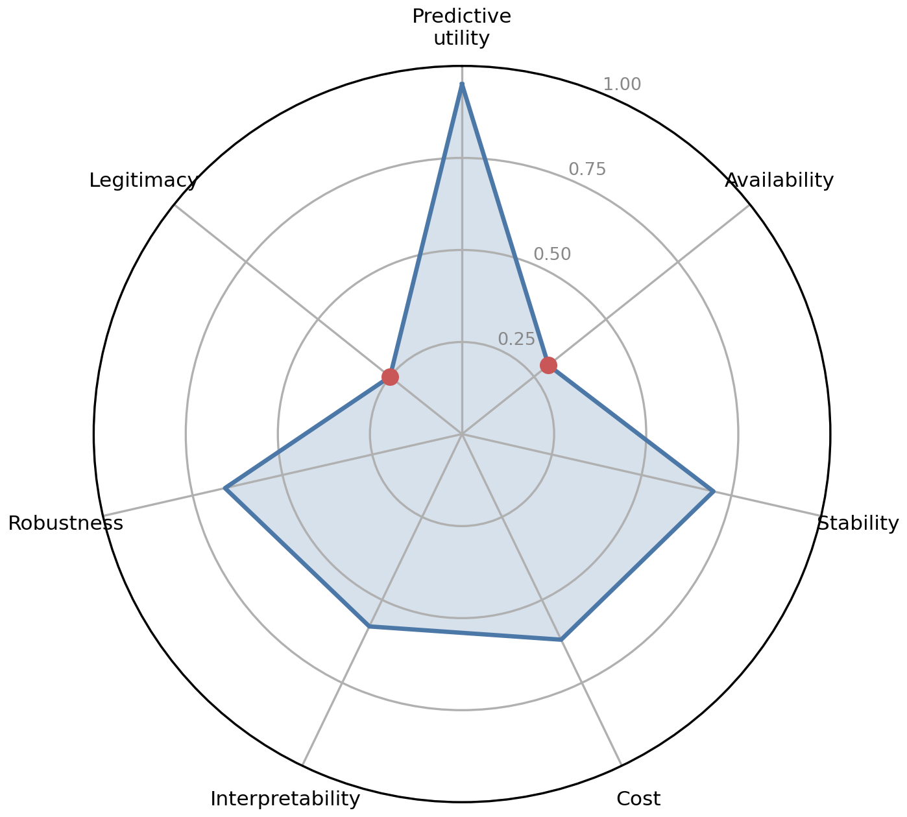
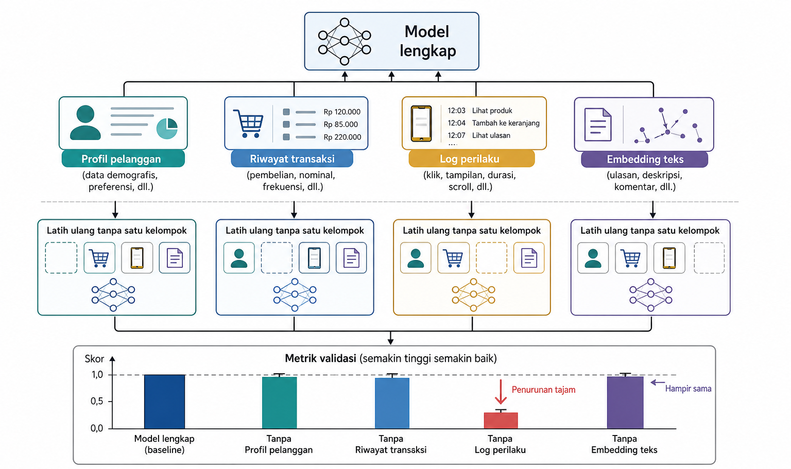
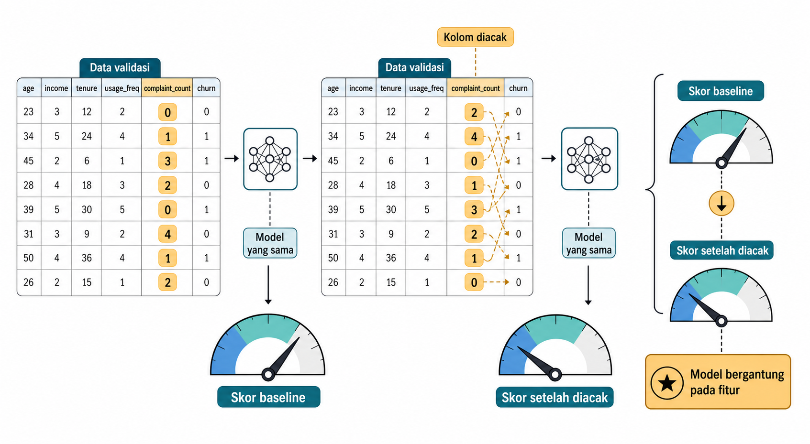
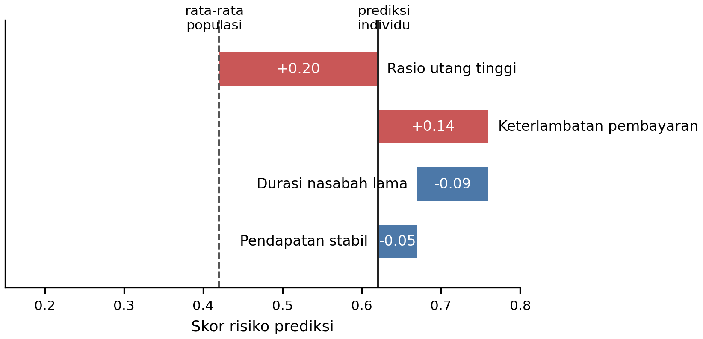
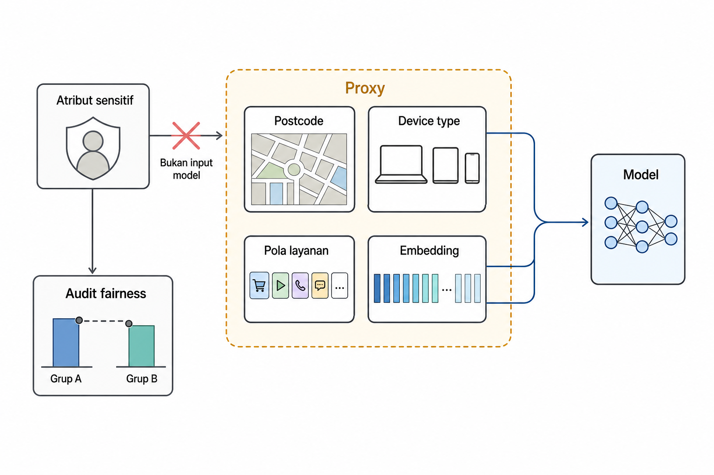

# Evaluasi Kualitas Fitur

Fitur yang menaikkan skor validasi belum tentu baik untuk sistem. Sebuah fitur dapat sangat prediktif tetapi tidak tersedia saat inferensi, atau murah dan stabil tetapi hanya menambah sedikit informasi. Fitur lain dapat menaikkan akurasi karena membawa proksi sensitif atau menyerap masa depan. Kualitas fitur mencakup kegunaan prediktif, ketersediaan, stabilitas, biaya, interpretabilitas, ketahanan, dan legitimasi. Pada produksi, dimensi non-prediktif sering menentukan apakah fitur bertahan.

Bab ini membahas metode untuk menilai kualitas fitur secara menyeluruh. Baseline ditetapkan agar klaim tentang kualitas fitur memiliki konteks. Studi ablasi mengukur kontribusi fitur dengan menambah atau menghapus kelompok fitur. Importance berbasis permutasi (permutation importance) dan importance berbasis model menilai ketergantungan model pada tiap fitur. SHAP memberikan atribusi lokal untuk tiap prediksi. Bab ini menguraikan pentingnya stabilitas importance lintas pelipatan dan waktu, batas antara importance dan kausalitas, penilaian fitur sensitif dan proksinya, serta pendokumentasian keputusan fitur.

## Apa yang Membuat Fitur Baik?

Fitur yang baik tidak berhenti pada ranking importance yang tinggi. Fitur tersebut harus membantu tujuan model di bawah evaluasi yang valid, tersedia ketika dibutuhkan, stabil ketika dunia berubah, dan layak dipelihara. Kadang fitur berimportance rendah tetap berguna untuk monitoring, segmentasi, audit fairness, atau analisis kesalahan. Sebaliknya, fitur berimportance tinggi bisa tidak boleh dipakai karena terlalu mahal, tidak tersedia saat inferensi, atau tidak legitimate.

Tabel 9.1 merangkum tujuh dimensi kualitas fitur. Kolom pertanyaan kunci membantu pembaca mengubah dimensi abstrak menjadi pemeriksaan praktis. Kolom kegagalan menunjukkan bahwa setiap dimensi dapat membuat fitur gagal walaupun metrik model terlihat bagus.

::: {.tabel-buku}

| Dimensi | Pertanyaan kunci | Contoh kegagalan |
| --- | --- | --- |
| Predictive utility | Apakah fitur memperbaiki metrik validasi atau kualitas keputusan? | Skor naik hanya pada train, tidak pada validasi |
| Availability | Apakah fitur tersedia pada waktu inferensi dan sesuai *cutoff*? | Agregat lambat dua detik untuk model fraud milidetik |
| Stability | Apakah distribusi dan kontribusinya stabil lintas waktupopulasi? | Fitur berubah karena sistem pencatatan baru |
| Cost | Berapa biaya komputasi, penyimpanan, akuisisi, dan pemeliharaan? | Fitur mahal dihitung tetapi menambah skor sangat kecil |
| Interpretability | Apakah fitur dapat dijelaskan pada level yang dibutuhkan? | Komponen laten penting tetapi tidak dapat dijelaskan ke auditor |
| Robustness | Apakah fitur tahan terhadap *noise*, missingness, dan shift? | Sensor kecil error membuat skor berubah besar |
| Legitimacy | Apakah fitur sesuai dengan privasi, fairness, consent, dan kebijakan? | Postcode menjadi proxy kuat untuk status sosial-ekonomi |

: Dimensi kualitas fitur {#tbl-ch09-8}

:::

Gambar 9.1 memperlihatkan tesis bab ini dalam bentuk radar. Sebuah fitur dapat sangat tinggi pada *predictive utility*, tetapi rendah pada *availability* dan *legitimacy*. Fitur seperti itu memerlukan keputusan sadar tentang alternatif, cara mengurangi risiko, dan batas penggunaannya.

{#fig-ch09-fig-1}

Kerangka tujuh dimensi ini membuat evaluasi fitur lebih jernih. Pada penelitian awal, pemeriksaan dapat berfokus pada tambahan informasi yang dibawa fitur. Pada sistem yang akan dipakai orang lain, fitur juga harus dapat dihitung tepat waktu, dijelaskan, dimonitor, dan dipertanggungjawabkan. Evaluasi perlu dimulai dari pembanding yang jelas agar pertimbangan tersebut tidak berhenti sebagai daftar kekhawatiran.

::: {.pendalaman}

Pendalaman

### Memantau stabilitas dengan Population Stability Index {.pendalaman-title .unnumbered .unlisted}

Drift distribusi fitur dapat dipantau sebelum label produksi tersedia memakai PSI, dengan rumus $\text{PSI} = \sum_{i=1}^{k} (A_i - E_i) \ln\!\dfrac{A_i}{E_i}$. Dalam hal ini, $A_i$ adalah proporsi bin produksi dan $E_i$ adalah proporsi bin pada data training. Dalam praktik, bin dengan $E_i$ atau $A_i$ nol perlu ditangani dengan penggabungan bin, *smoothing* kecil, atau konvensi khusus yang dipilih secara konsisten. Secara konvensional, nilai di bawah 0,1 sering dibaca stabil, nilai antara 0,1 dan 0,25 sebagai pergeseran moderat yang perlu pemantauan lebih lanjut, sedangkan nilai di atas 0,25 menandai pergeseran besar yang perlu investigasi atau retraining. PSI adalah konvensi monitoring, bukan uji statistik formal. Ambangnya merupakan folklore yang berguna bila dipakai konsisten.
:::

## Menetapkan *Baseline*

Kualitas fitur selalu membutuhkan pembanding. Tanpa *baseline*, kalimat "model ini bagus" tidak memiliki konteks, dan kalimat "fitur ini penting" mudah terdengar lebih kuat daripada buktinya. *Baseline* adalah sistem rujukan yang digunakan untuk menilai apakah fitur baru benar-benar memberi manfaat. *Baseline* dapat berupa prediksi kelas mayoritas, model kecil yang mudah dijelaskan, *feature set* produksi sebelumnya, atau kelompok fitur minimal yang sudah disepakati.

Lantai paling sederhana adalah dummy estimator yang mengabaikan fitur sama sekali. Pada regresi, *baseline* dummy dapat memprediksi rata-rata target training untuk semua sampel.

$$\hat{y}_i = \dfrac{1}{n}\sum_{j=1}^{n} y_j$$

Dalam rumus tersebut, $\hat{y}_i$ adalah prediksi untuk sampel ke-$i$, sedangkan $y_j$ adalah target training. Untuk klasifikasi, strategi kelas mayoritas atau prevalensi kelas memberi pembanding deterministik yang mengabaikan fitur. Strategi `stratified` dan `uniform` pada *DummyClassifier* adalah kontrol acak, bukan prediktor konstan atau satu *floor* deterministik. Regresi dapat memakai *DummyRegressor* yang memprediksi rata-rata atau median target pelatihan. Setiap *feature set* perlu melewati pembanding yang sesuai dengan tugas dan metriknya; kenaikan kecil dari pembanding sederhana tetap perlu ditimbang terhadap biaya sistem.

*Baseline* juga bisa lebih realistis. Model churn dapat dimulai dari fitur profil pelanggan saja, lalu dibandingkan dengan versi yang menambahkan agregat riwayat transaksi. Model deret waktu dapat dibandingkan dengan *baseline* last observed value sebelum memakai lag dan rolling statistics yang lebih kaya. Dalam semua kasus, *baseline* dan kandidat harus memakai split, metrik, dan protokol validasi yang sama.

Setelah kandidat mengalahkan *baseline*, margin peningkatan perlu dibandingkan dengan harga operasionalnya. Fitur yang menaikkan AUC sedikit tetapi membutuhkan *join* mahal, *storage* besar, dan *monitoring* kompleks mungkin tidak layak. Sebaliknya, fitur sederhana yang memberi kenaikan kecil tetapi stabil dan murah dapat sangat berharga. *Baseline* memberi konteks numerik, sedangkan dimensi kualitas pada Tabel 9.1 memberi konteks keputusan. Langkah berikutnya adalah mencari bagian dari *feature set* yang benar-benar memikul kenaikan tersebut.

## *Ablation Study*

Setelah *baseline* memberi lantai pembanding, ablation membantu mencari bagian mana dari *feature set* yang benar-benar memikul kenaikan performa. Ablation mengukur apa yang terjadi ketika satu fitur atau satu kelompok fitur dihapus atau ditambahkan. Tujuannya bukan mencari importance abstrak, melainkan melihat kontribusi fitur dalam model dan protokol evaluasi tertentu. Jika satu kelompok fitur dihapus dan skor validasi turun besar, kelompok itu memikul informasi penting yang tidak bisa digantikan oleh kelompok lain.

Secara formal, penurunan metrik akibat menghapus kelompok $G$ dapat ditulis sebagai berikut.

$$\Delta \mathcal{M}_{G} = \mathcal{M}(F_{\text{all}}) - \mathcal{M}(F_{\text{all}} \setminus G)$$

Dalam rumus tersebut, $\mathcal{M}(F_{\text{all}})$ adalah metrik validasi dengan semua fitur, sedangkan $\mathcal{M}(F_{\text{all}} \setminus G)$ adalah metrik setelah kelompok $G$ dihapus dan model dilatih ulang. Definisi ini mengasumsikan metrik yang lebih tinggi lebih baik, sehingga delta positif berarti kelompok $G$ membantu. Untuk *loss* yang lebih rendah lebih baik, gunakan arah sebaliknya, yaitu $\mathcal{L}(F_{\text{all}} \setminus G)-\mathcal{L}(F_{\text{all}})$.

Ablation kelompok sering lebih bermakna daripada ablation satu kolom. Jika satu fitur berkorelasi kuat dengan fitur lain, menghapus satu kolom saja memungkinkan model memakai penggantinya. Akibatnya, kolom tersebut tampak tidak penting. Jika seluruh kelompok semantik dihapus, misalnya semua agregat riwayat, semua embedding teks, atau semua fitur temporal, model kehilangan semua substitusi dalam kelompok itu. Selain itu, ablation kelompok membutuhkan lebih sedikit pelatihan ulang dibanding menguji ribuan kolom satu per satu.

Protokolnya sederhana. Latih model dengan *feature set* penuh, hapus satu kelompok fitur, latih ulang dengan protokol yang sama, lalu ukur delta pada validasi. Ulangi untuk kelompok lain dan laporkan variasi lintas fold atau periode waktu bila tersedia. Nyatakan apakah hiperparameter dipertahankan atau disetel ulang pada setiap ablasi. Jika penyetelan ulang merupakan bagian dari prosedur, lakukan hanya di dalam data pelatihan atau *inner fold* untuk setiap kandidat; jika hiperparameter dikunci untuk mengisolasi efek penghapusan fitur, laporkan keputusan itu. Jangan hanya memask kolom setelah model dilatih kecuali memang ingin menguji kerusakan pada model yang sudah ada. Untuk menilai kontribusi *feature set*, model perlu dilatih ulang.

Gambar 9.2 memperlihatkan alur ini. Feature set penuh dibagi menjadi kelompok, lalu metrik validasi dibandingkan saat tiap kelompok dihapus. Satu bar yang jatuh tajam menunjukkan kelompok yang load-bearing. Bar yang hampir tidak berubah menunjukkan kandidat penghematan, meskipun bukan bukti bahwa fitur tersebut tidak berguna untuk monitoring atau audit.

{#fig-ch09-fig-2}

Ablation tidak membuktikan sebab-akibat dunia nyata. Ukuran ini hanya mengukur kontribusi prediktif di bawah model, fitur, data, dan evaluasi tertentu. Namun, untuk keputusan rekayasa fitur, ablation sering sangat praktis. Jika ablation menguji kontribusi kelompok dengan melatih ulang model, importance methods memberi lensa yang lebih rinci terhadap fitur atau kolom tertentu.

## *Permutation Importance* dan *Model-Based Importance*

Jika ablation memeriksa kontribusi dengan melatih ulang model tanpa sebagian fitur, permutation importance (Breiman 2001) memeriksa ketergantungan model yang sudah dilatih. Metode ini menilai seberapa banyak performa model turun ketika satu fitur dibuat tidak informatif. Prosedurnya terdiri atas empat langkah. Pertama, ukur skor model pada data validasi. Kedua, acak satu kolom fitur sehingga hubungan fitur itu dengan target rusak, sementara distribusi marginal kolom tetap sama. Ketiga, hitung ulang skor model. Keempat, selisih skor dibaca sebagai seberapa besar model bergantung pada fitur tersebut.

Gambar 9.3 memperlihatkan prosedurnya. Satu kolom pada tabel validasi diacak, kolom lain tetap, lalu gauge skor sebelum dan sesudah dibandingkan. Pengacakan dilakukan pada validasi, bukan train, agar importance mencerminkan kontribusi pada data yang tidak dipakai melatih model.

{#fig-ch09-fig-3}

Permutation importance dapat dipakai pada banyak model karena metode ini memperlakukan model sebagai kotak prediksi. Kelemahannya muncul ketika fitur berkorelasi. Jika "luas lahan" diacak, model mungkin masih memulihkan sinyal dari "luas bangunan", sehingga importance keduanya tampak rendah walaupun kelompok ukuran properti penting.

Model-based importance datang dari estimator itu sendiri. Pada model linear, koefisien dapat memberi petunjuk, terutama jika fitur sudah diskalakan dengan benar. Pada model pohon, impurity-based importance mengakumulasi penurunan impurity dari split yang memakai fitur tertentu. Untuk satu split, penurunan impurity dapat ditulis sebagai berikut.

$$\Delta I = I_{\text{parent}} - \left( \dfrac{N_{\text{kiri}}}{N} I_{\text{kiri}} + \dfrac{N_{\text{kanan}}}{N} I_{\text{kanan}} \right)$$

Dalam rumus tersebut, $I_{\text{parent}}$ adalah impurity node sebelum split, $I_{\text{kiri}}$ dan $I_{\text{kanan}}$ adalah impurity node anak, sedangkan $N_{\text{kiri}}$, $N_{\text{kanan}}$, dan $N$ adalah jumlah sampel. Importance fitur adalah akumulasi penurunan seperti ini pada semua split yang memakai fitur tersebut.

Model-based importance cepat karena tersedia dari proses training. Namun, hasil tersebut membawa bias model. Pada pohon, fitur berkardinalitas tinggi atau fitur mirip ID dapat tampak penting karena memberi banyak peluang split dan memorisasi. Karena itu, importance dari model perlu dibandingkan dengan permutation importance, ablation, atau pemeriksaan domain.

Tabel 9.2 membandingkan beberapa metode penilaian kontribusi fitur. Tabel ini tidak memilih pemenang tunggal, melainkan membantu mencocokkan alat dengan kebutuhan. *Ablation* lebih tepat untuk kontribusi kelompok, *permutation importance* mengukur penurunan skor saat satu kolom dirusak, sedangkan SHAP memberi penjelasan yang lebih rinci tentang perubahan pada prediksi individu.

::: {.tabel-buku}

| Metode | Mengukur apa | Kekuatan | Peringatan |
| --- | --- | --- | --- |
| Impuritymodel-based importance | Kontribusi split atau sinyal internal model | Cepat, tersedia dari estimator | Bias terhadap kardinalitas dan struktur model |
| Linear coefficients | Arah dan besar bobot model linear | Mudah dibaca jika fitur scaled | Tidak sebanding tanpa scaling, sensitif kolinearitas |
| Permutation importance | Penurunan skor saat fitur diacak | Model-agnostic, berbasis validasi | Understate fitur berkorelasi |
| Conditional permutation importance | Kontribusi dengan struktur korelasi dipertahankan | Lebih adil untuk fitur berkorelasi | Lebih kompleks dan tidak selalu tersedia |
| SHAP | Kontribusi lokal dan global pada prediksi model | Diagnostik kaya, arah lokal terlihat | Menjelaskan model, bukan kausalitas |
| Group ablation | Kontribusi kelompok fitur setelah retraining | Cocok untuk fitur berkorelasiembedding | Mahal, hasil tergantung model dan protokol |

: Perbandingan metode penilaian kontribusi fitur {#tbl-ch09-9}

:::

::: {.pendalaman}

Pendalaman

### Fitur berkorelasi dan Conditional Permutation Importance {.pendalaman-title .unnumbered .unlisted}

Marginal shuffling dapat merendahkan importance fitur berkorelasi. Jika "luas lahan" diacak, model dapat mengambil sinyal dari "luas bangunan", sehingga keduanya tampak kurang penting. Conditional permutation importance mengacak fitur dengan mempertahankan struktur yang diberikan oleh fitur-fitur berkorelasi, seolah mengambil nilai dari distribusi kondisionalnya. Metode ini menjawab pertanyaan tentang kontribusi unik suatu fitur setelah mengondisikan fitur lain; metode tersebut bukan koreksi universal untuk permutation importance biasa. Jika CPI tidak tersedia, alternatif praktisnya adalah permutation importance per kelompok atau *group ablation* seperti pada Bagian 9.3.
:::

## SHAP untuk Diagnosis Fitur

Metode importance pada bagian sebelumnya terutama menjawab pertanyaan global tentang fitur mana yang banyak dipakai model di data validasi. SHAP (Lundberg and Lee 2017) menambahkan lensa lokal dengan memberi nilai kontribusi fitur untuk prediksi model menggunakan intuisi Shapley value, melanjutkan garis penjelasan lokal yang sebelumnya dirintis LIME (Ribeiro et al. 2016) melalui pendekatan model pengganti yang sederhana di sekitar satu prediksi. Dalam analogi game theory, prediksi adalah payout, fitur adalah pemain, dan kontribusi sebuah fitur adalah bagian adilnya ketika fitur bergabung dengan berbagai koalisi fitur lain. Rumus kombinatorialnya tidak diperlukan pada bab ini. Sifat yang penting untuk membaca SHAP adalah aditivitas.

Sifat itu dapat ditulis sebagai berikut.

$$f(x) = \bar{f} + \sum_{j} \phi_j(x)$$

Dalam rumus tersebut, $f(x)$ adalah keluaran model untuk sampel $x$, $\bar{f}$ adalah keluaran acuan atau *baseline* model, dan $\phi_j(x)$ adalah kontribusi fitur ke-$j$ untuk sampel tersebut. Aditivitas berlaku pada skala keluaran yang digunakan *explainer*. Untuk model klasifikasi, skala itu dapat berupa *raw margin* atau log-odds, bukan probabilitas, kecuali *explainer* memang dikonfigurasi pada skala probabilitas. Karena itu, skala keluaran harus disebutkan saat nilai SHAP dilaporkan.

SHAP dapat dipakai secara lokal maupun global. Secara lokal, SHAP menjelaskan mengapa satu aplikasi kredit ditolak atau mengapa satu pasien diberi risiko tinggi. Secara global, ringkasan nilai SHAP dapat menunjukkan fitur mana yang sering berkontribusi besar di banyak sampel. Yang menarik, fitur yang sama dapat mendorong prediksi naik pada satu sampel dan turun pada sampel lain. Arah pengaruh bersifat lokal, bukan satu angka global yang selalu berlaku.

Gambar 9.4 menunjukkan contoh lokal. Prediksi dimulai dari rata-rata populasi. Rasio utang tinggi mendorong skor risiko naik, durasi nasabah lama mendorong turun, riwayat keterlambatan mendorong naik lagi. Semua bar dijumlahkan sampai ke prediksi individu.

{#fig-ch09-fig-4}

SHAP berguna untuk diagnosis perilaku model, misalnya apakah fitur yang tinggi importance-nya masuk akal, apakah ada interaksi yang mengejutkan, apakah hubungan tampak monoton ketika seharusnya monoton, atau apakah ada indikasi proxy sensitif. Namun, SHAP menjelaskan model yang sudah dilatih, bukan proses kausal dunia nyata. Jika model belajar dari proxy, SHAP juga akan menjelaskan penggunaan proxy itu.

Biaya komputasi dan asumsi SHAP berbeda antar *explainer* dan keluarga model. *Mean absolute SHAP* pada *dataset* kadang dipakai sebagai kriteria penyaringan fitur, termasuk dalam praktik yang menggabungkannya dengan *shadow features* seperti BorutaShap. Keputusan penyaringan ini tetap bergantung pada pilihan model, *explainer*, dan data validasi yang dipakai. SHAP perlu diperlakukan sebagai alat diagnosis, bukan standar universal. Kontribusi fitur juga perlu diuji ulang pada *fold*, waktu, dan populasi lain sebelum dipakai sebagai dasar tindakan.

## Stabilitas Importance dan Batas Kausalitas

Sebuah ranking importance sebaiknya tidak dipercaya hanya dari satu split. Fitur yang benar-benar berguna biasanya menunjukkan kontribusi yang cukup stabil lintas fold, periode waktu, subpopulasi, atau retraining run. Fitur yang melonjak pada satu eksperimen tetapi hilang pada eksperimen lain mungkin menandakan sinyal lemah, substitusi antarfitur, sampel kecil, drift fitur, atau validasi yang tidak cocok.

Variasi importance fitur $j$ lintas $K$ fold dapat ditulis sebagai berikut.

$$\operatorname{Var}(I_j) = \dfrac{1}{K-1}\sum_{k=1}^{K}\big(I_{j,k} - \bar{I}_j\big)^2$$

Dalam rumus tersebut, $I_{j,k}$ adalah importance fitur $j$ pada fold ke-$k$, dan $\bar{I}_j$ adalah rata-ratanya. Fitur dengan importance sedang tetapi konsisten sering lebih berharga daripada fitur dengan skor spektakuler tetapi sangat berfluktuasi.

Kaveat kedua lebih mendasar. Predictive importance bukan causal effect. Penjualan payung mungkin sangat penting untuk memprediksi kecelakaan lalu lintas. Namun, melarang payung tidak akan mencegah kecelakaan. Hujan menjadi confounder yang memengaruhi keduanya. Model prediksi boleh memanfaatkan korelasi yang stabil, tetapi kebijakan intervensi membutuhkan alasan kausal.

Hal serupa terjadi pada kode departemen rumah sakit yang memprediksi readmission. Fitur itu bisa penting karena menjadi proxy keparahan pasien dan jalur perawatan, bukan karena departemen itu sendiri menyebabkan pasien kembali dirawat. Postcode dapat memprediksi risiko default karena membawa informasi sosial-ekonomi, akses layanan, atau kondisi lingkungan. Dalam prediksi murni, fitur korelasional dapat sah secara prosedural jika tersedia dan legitimate. Begitu pipeline dipakai untuk menentukan intervensi, ranking importance tidak boleh berubah menjadi panduan tindakan.

Karena itu, interpretasi *importance* perlu melibatkan *domain review*. Pemeriksaan domain membedakan apakah fitur merupakan sebab, proksi, artefak pencatatan, jalur *leakage*, atau konsekuensi dari target. Bab ini tidak menggantikan metode kausal, tetapi memberi tanda kapan grafik *importance* tidak cukup dipakai sebagai dasar keputusan. Pemeriksaan tersebut penting karena fitur proxy dapat tampak biasa sambil membawa informasi sensitif atau kebijakan yang tidak boleh dipakai sembarangan.

::: {.pendalaman}

Pendalaman

### Dari prediksi ke intervensi melalui metode kausal {.pendalaman-title .unnumbered .unlisted}

Jika tujuan analisis adalah intervensi, pertanyaannya perlu dirumuskan sebagai estimand kausal dengan *treatment*, *outcome*, populasi, dan horizon yang jelas. Double atau debiased machine learning serta causal forests dapat membantu mengestimasi efek, tetapi keduanya tetap memerlukan asumsi identifikasi, data dengan overlap yang memadai, dan penanganan confounder yang dapat dipertanggungjawabkan. Metode tersebut tidak mengubah *predictive importance* menjadi efek kausal secara otomatis. Pertanyaan tentang akibat perubahan pada suatu tindakan memerlukan desain dan asumsi kausal, bukan sekadar tambahan *importance chart*.
:::

## Informasi Sensitif dan Fitur Proxy

Sebagian fitur tidak boleh dinilai hanya dari kontribusi prediktifnya (Barocas and Selbst 2016). Atribut sensitif dapat bersifat langsung, seperti gender, ras atau etnis, agama, status kesehatan, disabilitas, lokasi presisi, atau kesulitan finansial. Ada juga fitur proxy yang tidak tampak sensitif, tetapi membawa informasi yang sangat berkorelasi dengan atribut sensitif. Contohnya adalah postcode, jenis perangkat, sekolah, pola belanja, bahasa, atau embedding teks dan citra.

Strategi naif yang sering disebut fairness through unawareness adalah menghapus kolom sensitif dan berharap model menjadi fair. Strategi ini gagal ketika proxy tetap ada. Model dapat merekonstruksi keanggotaan kelompok dari fitur lain. Menghapus kolom gender, misalnya, tidak banyak membantu jika kombinasi sekolah, wilayah, bahasa, dan riwayat layanan masih memprediksi gender dengan kuat.

Gambar 9.5 memperlihatkan jalur proxy. Panah langsung dari atribut sensitif ke model dicoret, tetapi jalur tidak langsung melalui postcode, device type, dan embedding masih mengalir. Di jalur audit, atribut sensitif tetap disimpan terpisah untuk pengukuran fairness, bukan sebagai input model.

{#fig-ch09-fig-5}

Menghapus atribut terlindungi terlalu awal dapat membuat bias tidak terukur. Audit memerlukan informasi tentang kelompok yang terkena *error* lebih tinggi, *false positive* lebih besar, atau keputusan lebih buruk. Artinya, atribut sensitif kadang perlu dipertahankan dalam lingkungan evaluasi yang aman, meskipun tidak diberikan ke model sebagai fitur.

Prinsip *data minimization* menuntut penilaian apakah setiap fitur memadai, relevan, dan terbatas pada apa yang diperlukan. "Meningkatkan akurasi" bukan jawaban otomatis bahwa fitur boleh dipakai. Jika fitur mengandung lokasi sangat presisi, data kesehatan, atau sinyal ekonomi sensitif, manfaat prediktifnya harus dibandingkan dengan kebutuhan tugas dan risiko institusional.

Embedding membutuhkan perhatian khusus. Representasi yang dilatih pada populasi luas dapat membawa dialek, umur, gender, wilayah, atau atribut kelompok lain tanpa terlihat pada nama kolom. Proxy seperti ini sulit diaudit karena tidak berbentuk fitur eksplisit. Kewaspadaan ini melanjutkan peringatan Bab 8 bahwa representasi laten yang kompak tetap dapat membawa informasi pribadi atau proksi sensitif. Agar keputusan seperti ini tidak hilang setelah eksperimen selesai, evaluasi fitur perlu ditulis sebagai artefak proyek.

## Mendokumentasikan Keputusan Fitur

Setelah kontribusi, stabilitas, dan risiko proxy diperiksa, keputusan fitur perlu meninggalkan jejak. Tanpa dokumentasi, sebuah kolom seperti `skor_aktivitas_terbobot` dapat hidup bertahun-tahun tanpa ada yang tahu definisinya, sumbernya, alasan pembuatannya, atau batas penggunaannya. Tim baru mengulang eksperimen yang pernah gagal karena tidak ada catatan. Fitur yang dulu valid menjadi usang tanpa ada pemilik yang memeriksa.

Dokumentasi fitur sebaiknya mencatat nama fitur, definisi, sumber tabel, unit, jendela waktu, *cutoff*, transformasi, pemilik, biaya, dan intended use. Catat juga alasan fitur dimasukkan atau dikeluarkan, bukti validasi, hasil ablation atau importance, pemeriksaan leakage, stabilitas, risiko privacy/fairness, serta rencana monitoring.

Beberapa tradisi dokumentasi relevan untuk pekerjaan ini. Datasheets for Datasets menekankan provenance dan konteks pengumpulan data. Model Cards menekankan intended use dan evaluasi terpilah. Data Cards memberi kerangka pelaporan transparansi data yang lebih terstruktur. Untuk buku ini, Lampiran C mengadaptasi semangat tersebut ke granularitas per fitur. Satu fitur perlu mempunyai satu definisi, satu catatan bukti, dan satu daftar risiko.

Di produksi, feature store atau katalog fitur dapat membuat dokumentasi menjadi bagian dari infrastruktur, bukan pekerjaan setelah selesai. Definisi, owner, lineage, freshness, dan metadata ketersediaan disimpan bersama. Bab 17 akan membahas sisi infrastrukturnya. Untuk bab ini, prinsipnya cukup jelas. Fitur yang tidak dapat dijelaskan, dilacak, dan dimonitor belum benar-benar siap menjadi bagian dari sistem.

::: {.sintesis-bab}

## Sintesis Bab {.unnumbered .unlisted}

Kualitas fitur lebih luas daripada *feature importance*. Sebuah fitur perlu berguna secara prediktif, tersedia saat inferensi, stabil, terjangkau, dapat dijelaskan pada tingkat yang diperlukan, tahan terhadap gangguan, dan legitimate. Tabel 9.1 memberi kerangka untuk memeriksa semua dimensi itu sebelum fitur dianggap layak, terutama ketika skor eksperimen tampak menggoda tetapi biaya, latency, atau proxy risk belum diperiksa.

*Baseline* memberi konteks, ablation menguji kontribusi kelompok, permutation dan model-based importance memberi lensa kontribusi, SHAP membantu diagnosis lokal dan global, sedangkan stabilitas menguji apakah temuan itu bertahan. Tabel 9.2 membantu memilih alat sesuai pertanyaan. Namun, semua alat ini menjelaskan kontribusi prediktif, bukan otomatis sebab-akibat.

Fitur juga perlu diperlakukan sebagai bagian dari sistem sosial dan operasional. Proxy sensitif, biaya *latency*, *lineage*, dan dokumentasi dapat menentukan apakah fitur yang tampak kuat benar-benar boleh dipakai. Karena itu, evaluasi kualitas fitur menjadi jembatan antara eksperimen yang berhasil dan sistem yang dapat dipercaya.
:::

## Bacaan Lanjutan {.bacaan-lanjutan .unnumbered .unlisted}

- scikit-learn --- Feature selection --- <https://scikit-learn.org/stable/modules/feature_selection.html>. Menilai relevansi fitur secara terukur.

- scikit-learn --- Permutation importance --- <https://scikit-learn.org/stable/modules/permutation_importance.html>. Pentingnya fitur yang model-agnostik.

- SHAP --- <https://shap.readthedocs.io/>. Atribusi kontribusi fitur berbasis nilai Shapley.

## Rujukan {.rujukan .unnumbered .unlisted}

::: {.references}

Barocas, Solon, and Andrew D. Selbst. 2016. "Big Data's Disparate Impact." *California Law Review* 104: 671--732.

Breiman, Leo. 2001. "Random Forests." *Machine Learning* 45 (1): 5--32.

Lundberg, Scott M., and Su-In Lee. 2017. "A Unified Approach to Interpreting Model Predictions." *Advances in Neural Information Processing Systems (NeurIPS)*.

Ribeiro, Marco Tulio, Sameer Singh, and Carlos Guestrin. 2016. "\"Why Should I Trust You?\": Explaining the Predictions of Any Classifier." *Proceedings of the 22nd ACM SIGKDD International Conference on Knowledge Discovery and Data Mining*.

:::
