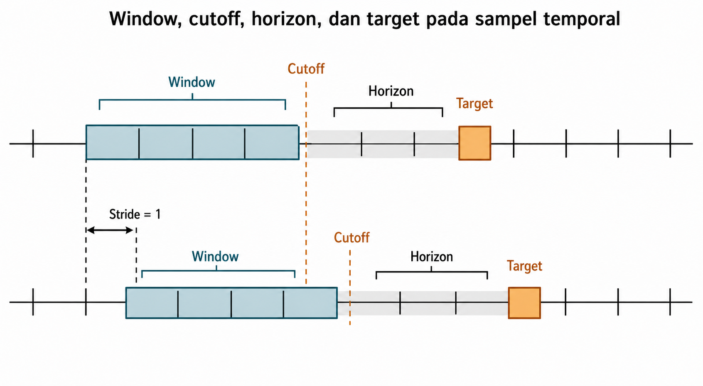
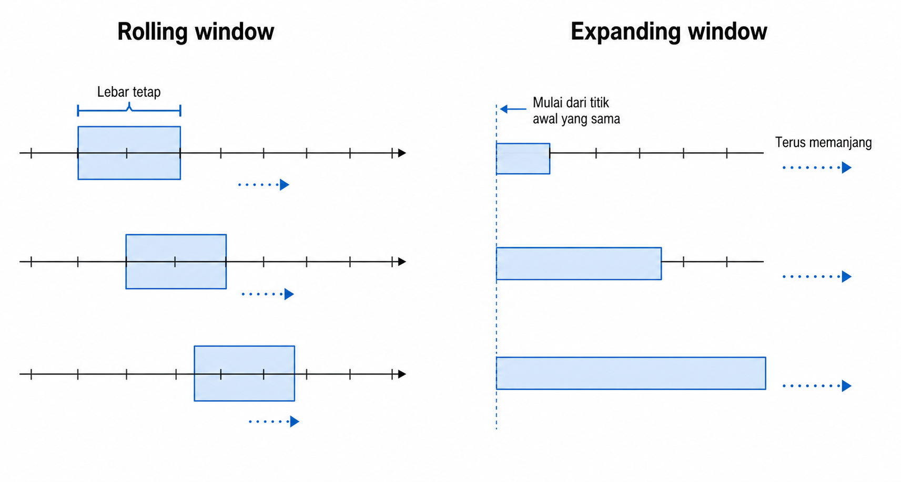
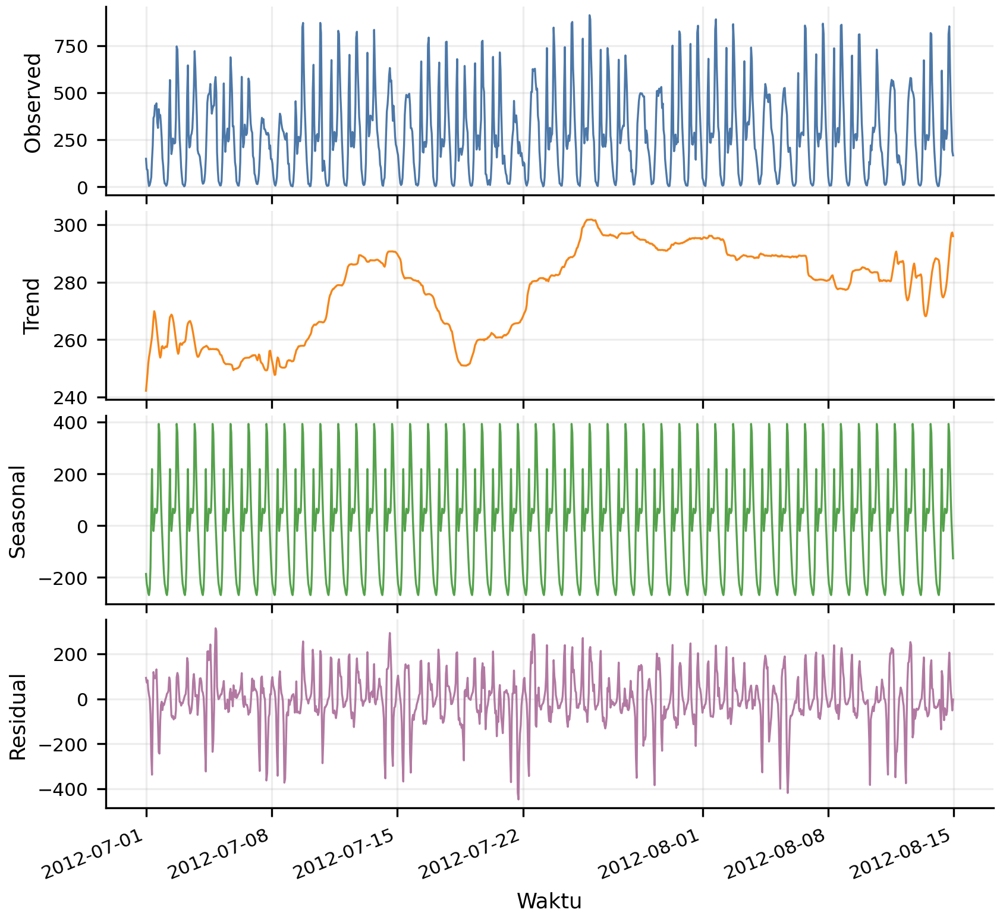
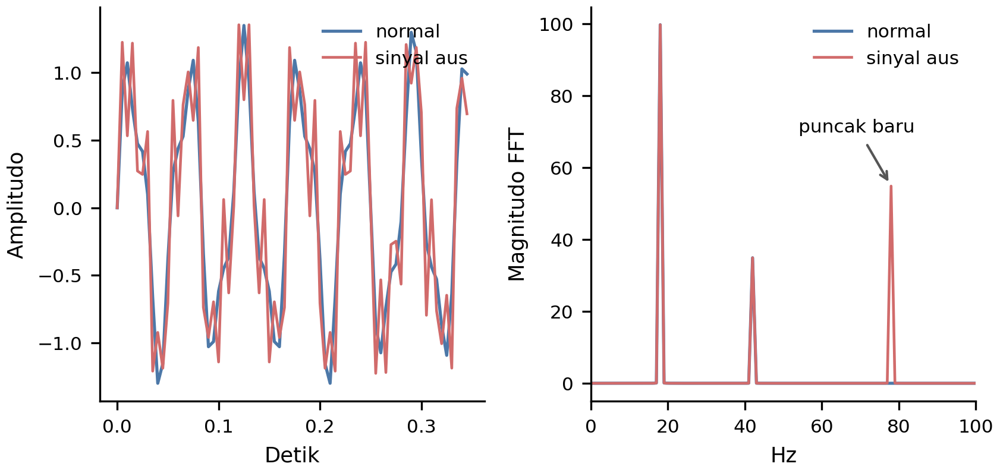

# Deret Waktu dan Data Sensor

Nilai dalam data temporal jarang berdiri sendiri. Peminjaman sepeda pada suatu jam dipengaruhi jam sebelumnya, jam yang sama kemarin, pola hari kerja, cuaca, dan musim. Angka yang tinggi pada akhir pekan dapat biasa saja, sedangkan angka yang sama pada jam sepi menjadi sinyal berbeda. Waktu membuat baris-baris saling bergantung. Karena urutan inheren ini, data temporal juga membawa risiko kebocoran yang khas. Fitur yang tampak sah secara numerik dapat salah karena dihitung dari masa depan. Pemisahan acak dapat mencampur pola masa depan ke dalam pelatihan.

Bab ini membahas representasi deret waktu dan data sensor dengan penekanan pada ketersediaan informasi relatif terhadap waktu prediksi. Pembentukan sampel temporal dibahas melalui lookback, stride, horizon, dan alignment. Fitur lag dan ringkasan bergulir (rolling statistics) membawa masa lalu ke dalam tabel. Differencing, tren, dan musiman memisahkan komponen deret. Fitur domain frekuensi menangkap pola periodik. Bab ini menguraikan validasi temporal, pencegahan kebocoran lihat-masa-depan (look-ahead leakage), dan perbandingan antara fitur tabular buatan tangan dengan masukan sekuensial.

## Membentuk Sampel Temporal dengan *Lookback*, *Stride*, *Horizon*, dan *Alignment*

Langkah teknis pertama adalah menentukan apa yang disebut satu sampel. Pada data temporal, satu sampel biasanya dibentuk dari jendela masa lalu dan dipasangkan dengan target masa depan. Jika nilai pada waktu $t$ adalah $x_t$, input window dapat ditulis sebagai berikut.

$$W_t = [x_{t-L+1}, \dots, x_t]$$

Window ini dipasangkan dengan target $y_{t+H}$. Dalam rumus tersebut, $L$ adalah panjang lookback, yaitu panjang konteks masa lalu yang diberikan ke model, dan $H$ adalah horizon, yaitu jarak prediksi ke masa depan. Pada *cutoff* atau *index time* pukul 10.00, tugas memprediksi $x_t$ berbeda dari memprediksi $x_{t+H}$. Jika nilai final untuk jam 10.00 baru tersedia setelah jam itu berakhir, prediksi $x_{10}$ harus memakai riwayat yang berakhir pada $x_9$; sebaliknya, untuk memprediksi $x_{11}$ setelah $x_{10}$ sudah tersedia, $x_{10}$ boleh masuk ke *lookback*. Karena itu, indeks rumus selalu perlu dibaca bersama waktu ketersediaan dalam protokol penerapan.

Lookback menentukan konteks. Untuk prediksi peminjaman sepeda satu jam ke depan, lookback 24 jam dapat menangkap pola harian. Untuk sensor mesin, lookback 10 menit mungkin cukup untuk menangkap kenaikan getaran sebelum gangguan. Horizon menentukan tujuan prediksi. Horizon satu langkah ke depan berbeda dari memprediksi tujuh hari ke depan atau status kegagalan dalam 30 menit.

Stride menentukan seberapa jauh window bergeser antar sampel. Stride kecil menghasilkan lebih banyak sampel, tetapi sampel-sampel tersebut sangat tumpang tindih. Dua window yang hanya bergeser satu menit dapat berbagi hampir semua nilai mentah. Berbagi observasi historis yang memang tersedia pada kedua *cutoff* bukan otomatis *leakage*, tetapi ketergantungan antarsampel meningkat dan perlu diperhitungkan dalam desain evaluasi pada Bagian 10.5.

Alignment menghubungkan akhir input window, waktu prediksi, horizon, dan target period. Jika prediksi dibuat pada pukul 10.00, semua fitur harus tersedia sebelum atau pada pukul 10.00 sesuai aturan domain. Targetnya mungkin nilai pada pukul 11.00, total kejadian antara 10.00 sampai 12.00, atau status apakah kegagalan terjadi dalam 24 jam berikutnya.

Gambar 10.1 menjadi timeline utama bab ini. Perhatikan garis *cutoff*. Semua yang berada di kiri garis dapat menjadi *input*, sedangkan target berada di kanan. Baris kedua menunjukkan window yang bergeser satu stride.

Causal window hanya memakai masa lalu. Centered window, yang memakai nilai sebelum dan sesudah titik tengah, sah untuk analisis retrospektif seperti smoothing atau imputasi setelah data lengkap tersedia. Namun, centered window tidak sah untuk forecasting karena memakai masa depan relatif terhadap waktu prediksi.

Data sensor dan event log sering tidak tersampel teratur. Irregular sampling dapat ditangani dengan resampling, agregasi, interpolasi, atau model yang memang menerima ketidakteraturan. Jika data diubah menjadi interval tetap, downsampling biasanya memakai agregasi, sedangkan upsampling sering membutuhkan interpolasi. Keputusan ini harus dibuat sebelum fitur dihitung, karena setiap stride hanya bermakna jika jarak waktu antar langkah konsisten. Setelah batas sampel temporal jelas, fitur pertama yang biasanya dibangun adalah fitur yang membawa masa lalu ke dalam bentuk kolom, yaitu lag dan rolling statistics.

## Fitur *Lag* dan *Rolling Statistics*

Setelah satu sampel temporal dibatasi oleh *cutoff*, urutan masa lalu perlu diterjemahkan ke bentuk kolom. Banyak model tabular tidak memiliki konsep urutan. Tanpa penanda mana yang lebih lama dan mana yang lebih baru, urutan waktu hilang. Lag dan rolling statistics mengodekan urutan tersebut menjadi kolom.

Contoh temporal pada bab ini memakai dataset UCI Bike Sharing. Setiap baris pada `hour.csv` mewakili satu jam penyewaan sepeda dengan informasi kalender dan cuaca, sedangkan `cnt` adalah jumlah sepeda yang disewa pada jam tersebut. Struktur ini memungkinkan riwayat permintaan diubah menjadi lag dan ringkasan window.

Lag feature memakai nilai masa lalu sebagai prediktor. Dalam dataset ini, fitur dapat berupa `cnt` satu jam sebelumnya, jam yang sama kemarin, atau minggu lalu. Untuk sensor, fitur dapat berupa pembacaan getaran beberapa detik sebelumnya. Lag mengubah riwayat menjadi referensi eksplisit.

Rolling statistics merangkum window terakhir, misalnya rata-rata, maksimum, minimum, standard deviation, count, slope, atau quantile. Simple moving average dapat ditulis sebagai berikut.

$$SMA_t = \dfrac{1}{w}\sum_{i=0}^{w-1} x_{t-i}$$

Dalam rumus tersebut, $w$ adalah ukuran window. Window pendek bereaksi cepat, tetapi mudah menyerap *noise*. Window panjang lebih stabil, tetapi lambat menangkap perubahan. Ukuran window harus mengikuti skala domain. Untuk permintaan sepeda, skala yang masuk akal bisa jam. Untuk getaran mesin, skala tersebut mungkin menit. Untuk transaksi atau peralatan, skala yang dipakai dapat berupa hari atau siklus operasi.

Expanding statistics melengkapi rolling. Jika rolling memakai rentang tetap yang bergerak, expanding memakai awal tetap dan ujung yang terus tumbuh. Dalam contoh Bike Sharing, expanding mean dapat merangkum level permintaan sejak awal periode pelatihan, tetapi maknanya berubah seiring seri bertambah panjang. Jam pada awal data dan jam jauh setelahnya tidak punya panjang sejarah yang sama.

Tabel 10.1 merangkum keluarga fitur temporal utama. Kolom risiko utama perlu dibaca bersama Gambar 10.1 karena fitur temporal selalu sah atau tidak sah relatif terhadap *cutoff*.

**Tabel 10.1 --- Keluarga fitur temporal**

*Tabel lengkap tersedia pada edisi cetak.*

Gambar 10.2 memperlihatkan perbedaan rolling dan expanding. Rolling window bergerak dengan lebar tetap. Expanding window mulai dari titik awal yang sama dan terus memanjang.

Fitur rolling harus dihitung dengan shift yang benar. Untuk prediksi pada waktu $t$, rolling average tidak boleh memasukkan nilai target pada waktu $t$ atau periode target setelahnya. Kesalahan kecil seperti ini dapat membuat model tampak sangat akurat karena fitur sudah membawa jawabannya.

Banyak lag dapat membengkakkan dimensi dan korelasi antar fitur. Lag 1, 2, 3, ..., 168 mungkin berguna untuk beberapa masalah, tetapi sering lebih stabil jika riwayat diringkas menjadi beberapa statistik window yang bermakna. Alat seperti tsfresh dan aeon dapat menghitung banyak agregat temporal secara sistematis di dalam pipeline, tetapi hasilnya tetap perlu divalidasi seperti fitur turunan lain. Setelah level lokal diringkas, pertanyaan berikutnya adalah apakah model sebaiknya membaca level itu sendiri, atau perubahan, tren, dan pola musiman di baliknya.

## *Differencing*, Tren, dan Musiman

Lag dan rolling membawa level masa lalu ke dalam tabel (Hyndman and Athanasopoulos 2018). Sebagian deret waktu juga perlu dibaca sebagai perubahan daripada sebagai level. Jika penjualan ritel terus naik dari tahun ke tahun, model yang mencoba memprediksi level absolut harus mengikuti skala yang terus bergeser. First differencing menulis perubahan sebagai berikut.

$$y'_t = y_t - y_{t-1}$$

Seasonal differencing memakai jarak musim sebagai berikut.

$$y'_t = y_t - y_{t-m}$$

Dalam rumus kedua, $m$ adalah panjang musim. Untuk data harian dengan pola mingguan, $m = 7$. Untuk data bulanan dengan pola tahunan, $m = 12$.

Motivasi praktisnya kuat, terutama untuk model pohon. Model pohon tidak melakukan extrapolation level di luar rentang split pelatihan dengan mudah. Jika target terus meningkat dan nilai masa depan melampaui maksimum training, model pohon cenderung memprediksi dalam rentang yang pernah dilihat. Differencing mengubah tugas dari "prediksi level yang terus naik" menjadi "prediksi perubahan", yang sering berada dalam rentang lebih stabil.

Stationarity berarti sifat statistik seperti mean, varians, dan autokovariansi tidak terus bergeser sepanjang waktu. Differencing adalah salah satu cara menuju representasi yang lebih stationer. Namun, over-differencing dapat membuang sinyal level yang sebenarnya penting. Karena itu, differencing harus diuji, bukan diterapkan otomatis.

Tren menangkap arah jangka panjang. Seasonality menangkap pola berulang, seperti jam dalam sehari, hari dalam minggu, bulan dalam tahun, musim hujan, atau siklus operasi mesin. Decomposition memisahkan seri teramati menjadi trend, seasonal, dan residual. Metode klasik seperti `seasonal_decompose` membuat pemisahan sederhana, sedangkan STL (*Seasonal-Trend decomposition using Loess*) memakai pendekatan Loess yang lebih fleksibel.

Gambar 10.3 memperlihatkan dekomposisi permintaan sepeda per jam menjadi empat panel, yaitu observed, trend, seasonal, dan residual. Residual sering menjadi bagian yang lebih stationer untuk dimodelkan, sementara trend dan seasonal dapat ditambahkan kembali setelah prediksi.

Decomposition juga harus mengikuti aturan waktu. Dekomposisi klasik dan STL umumnya memakai pemulusan dua sisi, sehingga komponen untuk satu baris historis dapat memanfaatkan titik yang lebih akhir meskipun metode hanya di-*fit* pada bagian pelatihan. Memotong data sebelum *split* saja belum membuat komponen tersebut kausal pada setiap baris. Untuk fitur prediksi, gunakan dekomposisi *trailing* atau kausal, atau estimasikan lalu proyeksikan komponen dari setiap origin prediksi. Jika komponen dihitung dengan pemulusan dua sisi tanpa proyeksi dari origin, perlakukan hasilnya sebagai analisis retrospektif. Pada sensor berfrekuensi tinggi, struktur penting kadang tidak tampak sebagai tren atau musiman di domain waktu, tetapi sebagai pola frekuensi.

## Fitur Domain Frekuensi

Tren dan musiman masih bekerja di domain waktu. Pada beberapa data sensor, informasi utama tidak tampak jelas dari amplitudo waktu mentah, tetapi dari frekuensi yang muncul dan seberapa kuat frekuensi itu. Getaran mesin, accelerometer, ECG, EEG, dan audio sering lebih bermakna ketika dibaca lewat spektrum. Dua sinyal dapat terlihat sama-sama "bergetar", tetapi satu memiliki puncak frekuensi baru yang menandakan aus dini.

FFT mengubah sinyal dari domain waktu ke domain frekuensi. Spektrumnya dapat diringkas menjadi *dominant frequency*, *spectral energy*, *band power*, *spectral centroid*, dan *spectral entropy*. *Spectral centroid* menyatakan pusat massa energi frekuensi. *Spectral entropy* tinggi menunjukkan energi tersebar seperti *noise*, sedangkan entropi rendah menunjukkan energi terkonsentrasi pada pola periodik tertentu.

Dalam predictive maintenance, early bearing wear dapat muncul sebagai pergeseran daya pada pita frekuensi tinggi sebelum total vibration meningkat. Dalam sinyal medis, band power dapat membedakan kondisi fisiologis tertentu. Pada sensor aktivitas, pola frekuensi dapat membedakan berjalan, berlari, dan diam lebih baik daripada nilai amplitudo sesaat.

Gambar 10.4 memperlihatkan satu sinyal getaran semi-sintetis dalam dua pandangan. Panel kiri menampilkan gelombang waktu. Panel kanan menampilkan spektrum frekuensi dengan puncak dominan. Overlay "sinyal aus" menunjukkan puncak frekuensi tinggi baru.

Fitur frekuensi membutuhkan sampling rate, panjang window, dan preprocessing yang tepat. Window terlalu pendek membuat resolusi frekuensi kasar. Sampling terlalu rendah membuat frekuensi tinggi tidak terlihat. Dalam praktik, alat seperti tsfresh dapat menghitung FFT coefficients, Welch spectral density, dan spectral entropy pada rolling window. Aeon menyediakan transformer seperti periodogram atau wavelet dalam pipeline temporal. Bab 12 akan membahas representasi audio seperti spectrogram secara lebih khusus. Apa pun domainnya, fitur temporal yang tampak kuat tetap belum dapat dipercaya sebelum skema validasinya meniru masa depan.

DFT dapat ditulis $X_k = \sum_{n=0}^{N-1} x_n \, e^{-i 2\pi k n / N}$. Rumus ini mengukur seberapa kuat komponen frekuensi ke-$k$ hadir dalam window berisi $N$ sampel. Nilai kompleks $X_k$ membawa amplitude dan phase, sedangkan FFT adalah algoritma cepat untuk menghitungnya. Dalam rekayasa fitur, yang biasanya dipakai bukan seluruh koefisien mentah, melainkan ringkasan spektrum seperti puncak dan band power. Panjang window dan sampling rate menentukan frekuensi mana yang terlihat. Inilah intuisi di balik resolusi frekuensi dan batas Nyquist.

## Validasi Temporal dan *Look-Ahead Leakage*

Setelah fitur temporal dibuat, pertanyaan terpenting kembali ke evaluasi (Bergmeir and Benítez 2012). Jika deployment akan memprediksi masa depan, evaluasi harus meniru masa depan. Data training sebaiknya berasal dari periode lebih awal, sedangkan validasi atau test berasal dari periode lebih baru. Random split dapat mencampur pola masa depan ke training, terutama ketika ada tren, perubahan musiman, kampanye, kerusakan alat, atau pergeseran perilaku pengguna.

Temporal cross-validation punya beberapa bentuk. Expanding-window CV membuat training set bertambah. Model dilatih pada Januari dan divalidasi pada Februari, lalu dilatih pada Januari-Februari dan divalidasi pada Maret. Sliding-window CV menjaga panjang training tetap. Model dilatih pada Januari-Maret dan divalidasi pada April, lalu dilatih pada Februari-April dan divalidasi pada Mei. `TimeSeriesSplit` mengikuti pola expanding dalam bentuk umum.

Ketergantungan tambahan muncul ketika window tumpang tindih. Misalkan lookback 7 hari dan sampel validasi pertama berada di hari 100. Window validasi itu memakai nilai hari 93 sampai 99, sedangkan sampel pelatihan terakhir dapat memakai nilai hari 92 sampai 98. Irisan riwayat ini bukan otomatis *leakage* jika semua nilai tersebut tersedia pada masing-masing *cutoff*. Namun, sampel menjadi sangat berkorelasi, dan batas evaluasi bermasalah bila target pelatihan menjangkau periode validasi, labelnya belum tersedia saat model dilatih, atau protokol penerapan mengharuskan episode yang terpisah.

Gambar 10.5 menunjukkan kebijakan konservatif untuk memisahkan sampel di sekitar batas. *Purge gap* diperlukan ketika jendela target atau waktu ketersediaan label menyeberangi batas, dan dapat diperlebar jika protokol memang mensyaratkan jendela fitur yang tidak beririsan. Irisan *lookback* historis saja tidak selalu mewajibkan *purge*.

Fitur juga tidak boleh memasukkan target-period information. Rolling average untuk memprediksi demand pada jam tertentu tidak boleh memakai nilai demand pada jam itu. Scaling, imputasi, decomposition, dan seleksi fitur juga harus di-*fit* hanya pada periode training dalam fold temporal. Untuk deret waktu berkelompok, evaluasi temporal sesuai ketika penerapan memprediksi masa depan entitas yang sudah dikenal. Tambahkan evaluasi sadar grup ketika tujuan penerapan adalah generalisasi ke pelanggan, mesin, atau grup baru yang tidak muncul dalam pelatihan. Setelah batas evaluasi aman, pilihan representasi berikutnya adalah apakah riwayat ditulis eksplisit sebagai kolom atau diberikan sebagai urutan ke model sekuensial.

Lebar *purge* tidak mempunyai rumus universal. Pada setiap batas, hapus sampel pelatihan yang jendela targetnya memasuki periode validasi atau yang labelnya belum tersedia ketika model seharusnya dilatih. Jika penerapan mensyaratkan episode independen, tambahkan jarak yang memisahkan jendela fitur. Dengan demikian, lebar *purge* bergantung pada panjang jendela target, keterlambatan label, *stride*, dan waktu pelatihan dalam penerapan. `TimeSeriesSplit(gap=...)` menghitung baris sampel, bukan durasi; data dengan waktu tidak teratur memerlukan aturan berbasis *timestamp*. Nilai $L+H$ hanya contoh konservatif ketika sampel teratur, *stride* satu, target berada $H$ langkah di depan, label tersedia pada akhir horizon, dan kebijakan juga melarang irisan jendela fitur. Biayanya adalah berkurangnya sampel, sedangkan manfaatnya adalah batas evaluasi yang sesuai dengan protokol.

## Fitur Eksplisit vs Input Sekuensial

Jika validasi sudah meniru alur waktu yang benar, keputusan berikutnya adalah bentuk representasi. Pendekatan klasik mengubah deret waktu menjadi tabel. Lag, rolling mean, band power, calendar features, dan fitur domain menjadi kolom. Model tabular seperti linear model, random forest, atau gradient boosting kemudian membaca kolom tersebut. Pendekatan ini kuat untuk *dataset* kecil sampai menengah, mudah dibandingkan, dan relatif mudah dijelaskan.

Model sekuensial memakai bentuk input berbeda. Window tidak diratakan menjadi banyak kolom, tetapi dipertahankan sebagai tensor waktu x fitur. RNN, LSTM, CNN temporal, dan Transformer dapat membaca urutan melalui hidden state, convolution, atau attention. Dengan cara ini, sebagian pola temporal dipelajari oleh mekanisme internal model, bukan sepenuhnya ditulis manusia sebagai fitur eksplisit.

Namun, model sekuensial tidak menghapus keputusan rekayasa fitur. Analis tetap menentukan panjang window, horizon, sampling, scaling, target alignment, dan cara menangani missingness. Scaling tetap penting untuk stabilitas gradient. Fitur waktu siklik seperti jam dan hari dalam minggu juga tetap perlu dipikirkan, seperti pada Bab 6.

Tabel 10.2 merangkum perbedaan praktis kedua pendekatan. Keputusan representasinya adalah apakah pola temporal perlu dinyatakan secara eksplisit sebagai kolom atau dipelajari dari urutan mentah.

**Tabel 10.2 --- Fitur eksplisit vs input sekuensial**

*Tabel lengkap tersedia pada edisi cetak.*

Bagian ini adalah salah satu titik jelas antara representasi yang dirancang manusia dan representasi yang dipelajari mesin. Fitur eksplisit menyatakan hipotesis manusia tentang lag, tren, frekuensi, dan kalender. Model sekuensial mencoba belajar sebagian struktur itu dari data. Dalam praktik, fitur eksplisit plus gradient boosting sering menjadi benchmark yang harus dikalahkan sebelum model sekuensial dianggap perlu.

Batas antara dua pendekatan makin kabur. Patch-based Transformer seperti PatchTST memecah seri menjadi patch pendek sebelum attention, mirip gagasan windowing dalam bentuk arsitektur. Time-series foundation model seperti Chronos mulai dipakai secara frozen sebagai feature extractor. Seri mentah dipetakan ke embedding padat, lalu model klasik memakainya sebagai fitur. Nama seperti Lag-Llama dan MOMENT muncul dalam ekosistem yang sama. Untuk sebagian besar masalah tabular berskala kecil-menengah, fitur rekayasa plus gradient boosting tetap benchmark yang harus dikalahkan. Contoh ini adalah peta arah, bukan rekomendasi otomatis.

Pada data temporal, fitur hanya valid relatif terhadap waktu prediksi. Lookback, stride, horizon, target window, dan alignment menentukan sampel belajar sebelum teknik apa pun dipakai. Gambar 10.1 menunjukkan aturan dasarnya. Fitur berada di masa lalu, target berada di masa depan, dan batasnya tidak boleh bocor.

Lag, rolling, expanding, differencing, kalender, dan fitur frekuensi mengubah urutan waktu menjadi representasi yang dapat dipakai model. Tabel 10.1 membantu memilih keluarga fitur sesuai sinyal yang dicari, mulai dari nilai referensi, fluktuasi lokal, akumulasi sejarah, perubahan, ritme kalender, sampai pola frekuensi. Tren dan musiman membantu membedakan level, perubahan, dan pola berulang. Fitur frekuensi berguna ketika sinyal periodik lebih jelas di spektrum daripada di amplitudo mentah.

Validasi temporal adalah penjaga utama bab ini. Random split, jendela target atau ketersediaan label yang melintasi batas evaluasi, transformasi yang di-*fit* pada seluruh seri, dan fitur yang memasukkan periode target dapat membuat model tampak bagus tetapi gagal di masa depan. Setelah validasi aman, Tabel 10.2 merangkum keputusan akhir. Fitur eksplisit memberi *baseline* yang kuat dan mudah diaudit, sedangkan input sekuensial sesuai ketika pola kompleks serta data dan komputasi memadai.

- scikit-learn --- TimeSeriesSplit --- <https://scikit-learn.org/stable/modules/generated/sklearn.model_selection.TimeSeriesSplit.html>. Validasi silang yang menghormati urutan waktu.

- tsfresh (Christ dkk. 2018, Neurocomputing) --- <https://tsfresh.readthedocs.io/>. Ekstraksi fitur deret waktu otomatis.

- TSFEL --- <https://tsfel.readthedocs.io/>. Pustaka ekstraksi fitur deret waktu.

- statsmodels --- Time Series Analysis (STL) --- <https://www.statsmodels.org/stable/tsa.html>. Dekomposisi tren--musiman.

- sktime --- <https://www.sktime.net/>. Kerangka terpadu untuk tugas deret waktu.

- Lag-Llama (Rasul dkk. 2024) --- <https://arxiv.org/abs/2310.02525>. Model fondasi peramalan deret waktu.

- MOMENT (Goswami dkk. 2024) --- <https://arxiv.org/abs/2402.03885>. Model fondasi deret waktu tujuan umum.

Bergmeir, Christoph, and José M. Benítez. 2012. "On the Use of Cross-Validation for Time Series Predictor Evaluation." *Information Sciences* 191: 192--213.

Hyndman, Rob J., and George Athanasopoulos. 2018. *Forecasting: Principles and Practice*. 2nd ed. OTexts.
