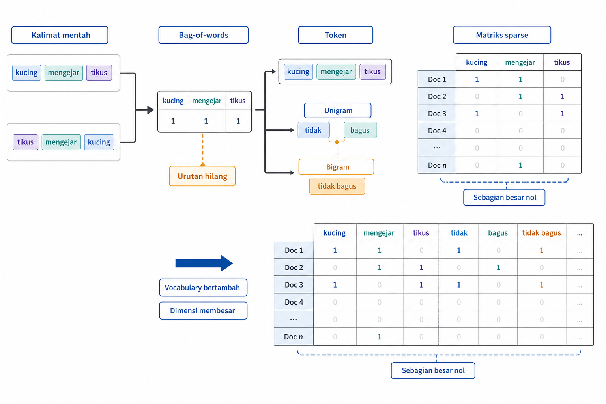
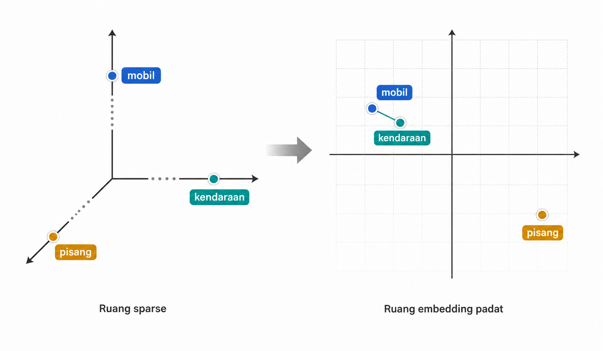
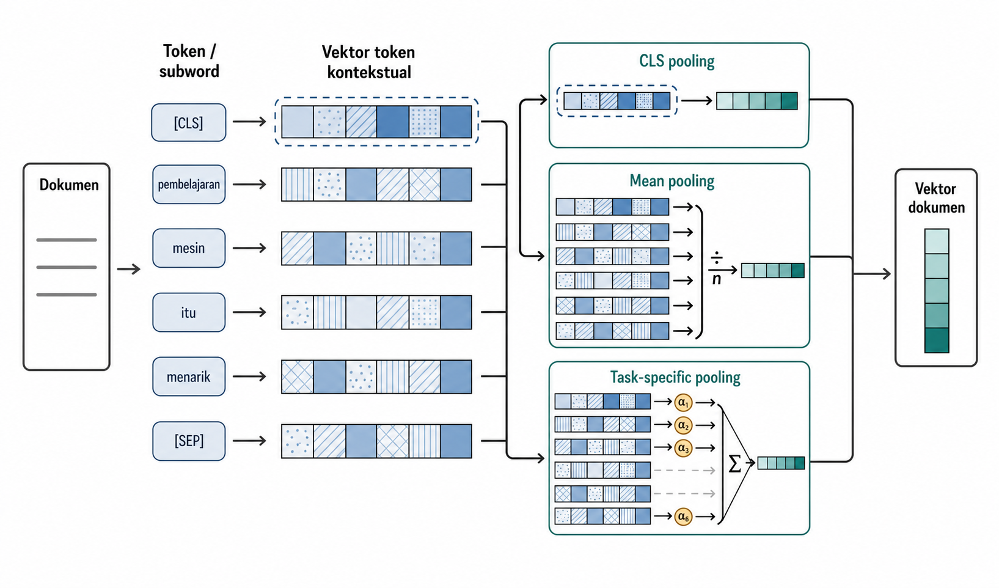
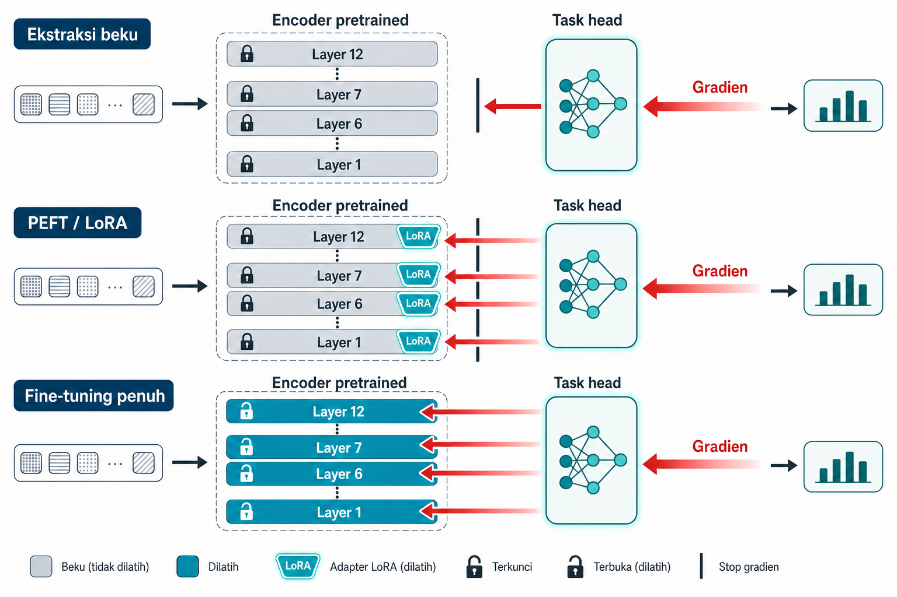

# Teks dan Dokumen

Teks tidak langsung dapat dipakai oleh kebanyakan model pembelajaran mesin. Model menerima token, karakter, dan pola lokal di sekitar kata, bukan makna yang dipahami pembaca manusia. Representasi teks menentukan apa yang dianggap sebagai token, seberapa banyak urutan kata dipertahankan, dan bagaimana kata langka atau konteks ditangani. Representasi klasik menghasilkan representasi yang dirancang manusia, umumnya dalam bentuk fitur *sparse*. *Embedding* dan model bahasa menghasilkan representasi yang dipelajari mesin, umumnya dalam bentuk vektor padat. Keduanya tetap berguna, bergantung pada data, tugas, biaya, dan kebutuhan interpretasi.

Bab ini membahas tangga representasi teks, dimulai dari tokenisasi dan bag-of-words, kemudian pembobotan TF-IDF, word embedding, contextual embedding, sentence dan document embedding, hingga *pretrained language model* sebagai penghasil fitur. Setiap langkah menambah kemampuan menangkap makna, tetapi juga menambah keputusan tentang vocabulary, konteks, penggabungan (pooling), biaya, reproduktibilitas, dan validasi. Bab ini juga menguraikan perbedaan antara membekukan encoder sebagai penghasil fitur dan memperbarui bobotnya melalui fine-tuning.

## Representasi Teks Klasik

Contoh kerja pada bagian ini adalah klasifikasi pesan SMS. Setiap dokumen berupa satu pesan pendek, dan targetnya membedakan spam dari pesan sah atau *ham*. Panjang, ejaan, dan tanda baca tidak seragam. Raw text adalah urutan simbol dengan panjang berbeda. Model tabular klasik membutuhkan vektor numerik berukuran tetap. Langkah pertama adalah tokenization, yaitu memecah teks menjadi unit yang akan dihitung atau diberi representasi. Token dapat berupa kata, subword, karakter, atau *n-gram*.

Word-level tokenization mudah dipahami, tetapi rapuh terhadap kata di luar vocabulary. Kata baru, typo, variasi slang, dan bentuk berimbuhan dapat tidak dikenali. Subword tokenization, seperti Byte-Pair Encoding, memecah kata menjadi potongan yang lebih kecil sehingga kata yang belum pernah muncul tetap dapat dirangkai dari bagian yang dikenal. Jika tokenizer dilatih secara lokal, aturan penggabungannya harus dipelajari hanya di dalam data pelatihan setiap *fold*. Berbeda dari itu, tokenizer yang dikirim bersama encoder *pretrained* adalah artefak tetap: jangan melatih ulang vocabulary atau aturan subword-nya pada korpus proyek, dan gunakan versi yang sama pada pelatihan, validasi, serta inferensi.

Setelah tokenisasi, vectorization mengubah korpus menjadi document-term matrix. Baris adalah dokumen, kolom adalah token atau *n-gram*, dan isi sel adalah hitungan atau bobot. Dalam *bag-of-words*, urutan kata diabaikan. Dokumen $d$ dapat ditulis sebagai vektor berikut.

$$\mathbf{v}_d = [x_1, \dots, x_{|V|}]$$

Dalam vektor ini, $|V|$ adalah ukuran vocabulary, dan $x_i$ adalah jumlah kemunculan token ke-$i$ dalam dokumen $d$. Sebagian besar entri bernilai nol karena satu dokumen hanya memakai sebagian kecil vocabulary.

Kelemahan utama *bag-of-words* adalah buta urutan. Kalimat "kucing mengejar tikus" dan "tikus mengejar kucing" memiliki hitungan kata yang sama, padahal maknanya berbeda. *N-gram* menambahkan urutan lokal. Bigram seperti "tidak bagus" dapat menangkap negasi yang hilang jika "tidak" dan "bagus" hanya dihitung terpisah. Namun, *n-gram* membuat dimensi tumbuh cepat.

Gambar 11.1 memperlihatkan alur klasik. Kalimat mentah dipecah menjadi token atau subword, lalu masuk ke matriks sparse yang sebagian besar berisi nol. Jika *n-gram* ditambahkan, vocabulary bertambah dan matriks makin lebar.

Contoh klasiknya adalah deteksi SMS spam. Token seperti "free", "call", "txt", angka nominal, nomor telepon, atau bigram promosi dapat menjadi fitur. Character n-grams sering membantu karena spam dapat memakai variasi ejaan, kapitalisasi, atau tanda baca untuk menonjol tanpa benar-benar mengubah pesan.

Untuk *bag-of-words* atau vectorizer lokal lain, vocabulary harus dipelajari dari data pelatihan, lalu dipakai ulang untuk validasi, test, dan inferensi. Jika vocabulary lokal dibuat dari seluruh korpus sebelum split, token yang hanya muncul di validasi sudah ikut memengaruhi representasi. Aturan ini tidak berarti tokenizer tetap milik model *pretrained* perlu di-*fit* ulang. Untuk produksi dengan vocabulary sangat besar, `HashingVectorizer` dapat memetakan token langsung ke indeks kolom tanpa menyimpan vocabulary, memakai hashing trick yang sama dengan Bab 4 dan membawa risiko collision yang sama. Setelah hitungan token terbentuk, masalah berikutnya adalah pembobotan. Tidak semua kata yang sering muncul sama informatifnya.

## *TF-IDF*

Hitungan mentah sering terlalu memberi bobot pada kata umum. Dalam korpus SMS berbahasa Inggris, kata fungsi seperti "to", "the", "and", atau "you" dapat muncul sangat sering, tetapi jarang memberi sinyal spam sendirian. Sebaliknya, token seperti "free", "claim", "prize", nomor pendek, atau pola "call now" mungkin muncul lebih jarang, tetapi lebih informatif.

*TF-IDF* (Salton and Buckley 1988) menggabungkan term frequency dan inverse document frequency. Term frequency menyatakan seberapa sering term muncul dalam dokumen.

$$\text{TF}(t, d) = f_{t,d}$$

Inverse document frequency memberi bobot lebih rendah pada term yang muncul di banyak dokumen.

$$\text{IDF}(t) = \log \dfrac{N}{df_t}$$

Dalam rumus IDF, $N$ adalah jumlah dokumen, dan $df_t$ adalah jumlah dokumen yang mengandung term $t$. Bobot akhirnya diperoleh dengan mengalikan keduanya.

$$\text{TF-IDF}(t, d) = \text{TF}(t, d) \times \text{IDF}(t)$$

Implementasi dapat berbeda dalam smoothing dan penskalaan bobot, tetapi idenya sama. Kata yang sering dalam satu dokumen tetapi jarang di seluruh korpus menjadi menonjol.

Kontrasnya sederhana. Kata "you" bisa memiliki TF tinggi dalam banyak pesan, tetapi IDF-nya rendah karena muncul hampir di mana-mana. Token seperti "prize" atau pola nomor tertentu mungkin hanya muncul pada sedikit pesan sehingga mendapat IDF lebih tinggi. IDF hanya mengukur kelangkaan dokumen dan tidak melihat label spam. Hubungan token dengan kelas dipelajari oleh model terawasi atau metode seleksi terawasi, bukan oleh IDF.

*TF-IDF* masih termasuk representasi yang dirancang manusia dan berbentuk *sparse*. Representasi ini sering menjadi *baseline* kuat untuk klasifikasi dokumen, pencarian, dan dataset kecil sampai menengah. Namun, *TF-IDF* tidak memahami sinonim, konteks, atau urutan kata di luar *n-gram*. "Mobil" dan "kendaraan" tetap kolom berbeda. Kata yang sama dalam konteks berbeda tetap dihitung sama.

IDF dipelajari dari korpus pelatihan. Jika *TF-IDF* di-*fit* pada seluruh dokumen sebelum validasi, statistik dokumen validasi ikut menentukan bobot. Ini adalah *leakage* representasi. Seperti transformer lain yang belajar statistik lokal, vectorizer harus hidup di dalam pipeline validasi. Sebaliknya, tokenizer tetap yang menyertai encoder *pretrained* dimuat apa adanya dan tidak di-*fit* pada tiap *fold*. Keterbatasan utama *TF-IDF* tetap sama. Kolom sparse tidak tahu bahwa dua kata dapat berdekatan makna. Bagian berikut memperkenalkan representasi padat yang belajar kedekatan itu dari data.

Sublinear TF mengganti hitungan mentah dengan $1 + \log(\text{TF})$, sehingga kata yang muncul 100 kali tidak otomatis berbobot 100 kali kemunculan tunggal. Dalam `TfidfVectorizer`, ini terkait opsi `sublinear_tf`. BM25 mengembangkan ide tersebut untuk *retrieval* dengan menambahkan penyesuaian panjang dokumen dan saturasi frekuensi term. BM25 tetap menjadi *baseline* leksikal yang kuat dalam sistem pencarian. Pada *hybrid search*, BM25 menyumbang sisi *sparse* yang melengkapi pencarian semantik.

## Pergeseran ke Representasi yang Dipelajari melalui *Word Embedding*

Pada representasi sparse, setiap kata menjadi kolom terpisah. Kata "mobil" dan "kendaraan" tidak berbagi apa pun kecuali keduanya kebetulan muncul di dokumen yang sama. Model harus belajar hubungan tiap kata dengan target hampir dari nol. Ini tidak efisien, terutama ketika kata jarang atau ketika banyak sinonim muncul.

Word embedding memetakan token ke vektor padat yang dipelajari dari data. Alih-alih ribuan atau jutaan kolom sparse, setiap token memiliki vektor berdimensi ratusan. Prinsip dasarnya berangkat dari distributional hypothesis. Kata yang muncul dalam konteks serupa cenderung memiliki makna serupa. Word2Vec (Mikolov et al. 2013) dan GloVe mengoperasionalkan gagasan ini pada korpus besar.

Kedekatan embedding sering diperiksa dengan cosine similarity.

$$\text{sim}(\mathbf{a}, \mathbf{b}) = \dfrac{\mathbf{a} \cdot \mathbf{b}}{\lVert\mathbf{a}\rVert\,\lVert\mathbf{b}\rVert}$$

Dalam rumus tersebut, $\mathbf{a}$ dan $\mathbf{b}$ adalah dua vektor embedding. Nilai mendekati 1 berarti arahnya selaras, nilai mendekati -1 berarti arahnya berlawanan, dan nilai mendekati 0 menunjukkan hubungan yang lemah. Cosine similarity menjadi probe geometri untuk embedding kata, kalimat, dan dokumen.

Gambar 11.2 membandingkan ruang sparse dan dense. Pada ruang sparse, "mobil", "kendaraan", dan "pisang" berada pada sumbu terpisah yang saling ortogonal. Pada proyeksi dense, "mobil" dan "kendaraan" dapat berdekatan karena muncul dalam konteks serupa, sementara "pisang" berada lebih jauh.

Embedding statis memberi satu vektor untuk satu kata atau token, apa pun konteksnya. Ini memperbaiki masalah sinonim, tetapi belum menyelesaikan polisemi. Kata "bisa" sebagai kemampuan dan "bisa" sebagai racun tetap berbagi satu vektor jika memakai embedding statis.

Subword atau token-piece embeddings membantu menghadapi kata jarang, morfologi, dan out-of-vocabulary forms. Namun, embedding tetap belajar dari korpus dan tokenizer tertentu. Untuk teks Indonesia yang penuh slang, singkatan, imbuhan, atau code-switching, kecocokan korpus dan tokenizer sangat penting. Embedding bukan berarti model benar-benar "memahami" bahasa. Representasi ini mengodekan regularitas statistik dan semantik yang dipelajari dari data. Keterbatasan berikutnya adalah konteks. Satu kata dapat berubah makna bergantung kalimatnya.

fastText merepresentasikan kata sebagai jumlah vektor *character n-gram*. Dengan cara ini, bentuk Indonesia yang panjang atau berimbuhan seperti "dipertanggungjawabkan" tetap mewarisi informasi dari potongan katanya, sehingga relevan untuk teks informal dan kaya morfologi. Secara terpisah, *Matryoshka representation learning* melatih embedding agar dimensi awal membawa informasi paling penting. Vektor 1024 dimensi dapat dipotong menjadi 256 dimensi saat inferensi dengan penurunan kualitas yang diharapkan tetap terbatas. Pemotongan ini memberi kompromi langsung antara *storage*, *latency*, dan kualitas representasi.

## *Contextual*, *Sentence*, dan *Document Embedding*

Embedding statis memberi satu representasi untuk satu token. Contextual embedding memberi representasi yang bergantung pada kata di sekitarnya. Kata "bisa" dalam "saya bisa datang" dan "bisa ular itu berbahaya" tidak harus mendapat vektor yang sama. Model seperti BERT (Devlin et al. 2019) menghasilkan representasi token atau subword yang berubah sesuai konteks kalimat.

Banyak tugas membutuhkan satu vektor untuk kalimat atau dokumen, bukan vektor per token. *Sentence* dan *document embedding* memampatkan teks menjadi vektor berukuran tetap untuk klasifikasi, *clustering*, *retrieval*, atau *similarity search*. Pilihan *pooling* menjadi penting. `[CLS]` adalah salah satu kandidat, tetapi kegunaannya sebagai representasi kalimat bergantung pada cara model dilatih dan diadaptasi. Gunakan mekanisme *pooling* yang didokumentasikan untuk model tersebut; untuk kemiripan semantik, model *sentence embedding* yang memang dilatih dengan objektif kesamaan biasanya lebih tepat daripada mengambil `[CLS]` secara otomatis. Pilihan lain mencakup *mean pooling* dan *task-specific pooling*.

Mean pooling naif kadang menghasilkan vektor yang berguna, tetapi operasi ini selalu mengaburkan urutan dan komposisi karena bersifat komutatif terhadap posisi token. Dua kalimat dengan kata serupa tetapi struktur berbeda dapat menjadi terlalu dekat. Itulah sebabnya model seperti Sentence-BERT (Reimers and Gurevych 2019) dilatih khusus agar embedding kalimat memiliki geometri yang lebih cocok untuk similarity dan retrieval.

Gambar 11.3 memperlihatkan alur representasi modern. Dokumen mentah dipecah menjadi token atau subword. Transformer encoder menghasilkan contextual token vectors. Lalu pooling mengubah deretan vektor token menjadi satu vektor kalimat atau dokumen. Langkah pooling ini bukan detail kecil. Pilihan tersebut menentukan informasi apa yang dipertahankan.

Dokumen panjang membutuhkan strategi tambahan. Jika teks melebihi maximum length model, dokumen dapat dipotong, dibagi menjadi chunk, diringkas, atau diproses secara hierarkis. Untuk kumpulan abstrak skripsi, customer complaints, atau laporan medis, keputusan chunking dan pooling dapat sama pentingnya dengan model embedding yang dipilih.

Tabel 11.1 merangkum tangga representasi teks dari *sparse* sampai *contextual*. Makin ke bawah, representasi makin semantik dan kontekstual, tetapi biaya dan ketergantungan pada model juga meningkat. Dua bagian terakhir membandingkan representasi *pretrained* yang dipakai secara beku dengan representasi yang diubah melalui *fine-tuning*.

**Tabel 11.1 --- Tangga representasi teks**

*Tabel lengkap tersedia pada edisi cetak.*

## *Pretrained Language Model* sebagai *Feature Extractor*

Setelah representasi contextual dan document embedding masuk ke peta, pertanyaan praktisnya adalah bagaimana memakainya tanpa melatih model bahasa besar dari awal. *Pretrained language model* dapat dipakai sebagai frozen feature extractor. Teks dimasukkan ke encoder, lalu hidden states atau pooled embedding diambil sebagai fitur. Setelah itu, model hilir yang lebih kecil, seperti logistic regression, SVM, atau gradient boosting, dilatih memakai label lokal. Encoder tidak diubah.

Pola ini adalah transfer. Representasi dipelajari dari korpus besar di luar proyek, lalu dipakai untuk tugas lokal. Keuntungannya ada pada efisiensi. Kita dapat memperoleh fitur semantik yang kuat tanpa melatih seluruh model bahasa. Jika data berlabel sedikit atau komputasi terbatas, frozen extraction sering lebih stabil daripada full fine-tuning.

Keuntungan lain adalah determinisme operasional. Encoder beku memetakan teks identik ke vektor identik selama versi model, tokenizer, pooling, maximum length, penskalaan vektor, dan batching dijaga sama. Ini memudahkan caching, debugging, dan audit. Fitur embedding dapat disimpan, dibandingkan, dan dipakai ulang selama definisinya jelas.

Namun, domain mismatch tetap penting. Model yang dilatih pada teks umum dapat kurang cocok untuk bahasa lokal, jargon kampus, dokumen hukum, catatan medis, OCR yang kotor, atau media sosial. Pada korpus dengan jargon berat, *TF-IDF* sebagai *baseline* yang disetel baik dapat mengalahkan embedding generik yang tidak pernah melihat istilah domain. Encoder yang diadaptasi domain dapat menutup jarak itu, tetapi harus dibuktikan melalui validasi lokal.

Feature extraction harus reproducible. Catat nama model, versi, tokenizer, layer atau pooling rule, maximum length, penskalaan vektor, dan cara batching. Jika salah satu berubah, fitur berubah. Dari sudut pandang Bab 9, embedding hasil ekstraksi adalah fitur yang perlu definisi, lineage, dan monitoring. Jika representasi beku belum cukup menyesuaikan makna domain, keputusan berikutnya adalah apakah bobot model perlu ikut dilatih.

Massive Text Embedding Benchmark, atau MTEB, membandingkan embedding model pada banyak keluarga tugas sehingga pilihan extractor tidak hanya berbasis reputasi. Namun, skornya bersifat agregat. Validasi pada domain sendiri tetap wajib. Ekosistemnya bergerak cepat. Hidden states dari decoder-only LLM makin sering dipakai sebagai extractor, hybrid sparse-dense search menggabungkan lexical exactness dengan generalisasi semantik, dan model distilled menukar sedikit kualitas dengan penghematan inference. Semua ini adalah kandidat yang perlu diuji, bukan jaminan.

## *Fine-Tuning* vs *Feature Extraction*

Jika fitur beku belum cukup menyesuaikan makna domain, sebagian atau seluruh bobot model dapat dibuka. *Feature extraction* membekukan encoder dan melatih model hilir atau *head* dangkal. *Fine-tuning* memperbarui sebagian atau seluruh bobot model *pretrained* memakai data tugas. Perbedaannya juga menyangkut keputusan representasi, yaitu apakah pengetahuan bahasa yang ada sudah cukup atau model perlu diubah agar sesuai dengan domain dan label lokal.

Full fine-tuning dapat menyesuaikan model lebih kuat. Contohnya, kata "positif" dalam sentimen umum sering bernilai baik, tetapi "tumor positif" dalam teks medis berarti kabar buruk. Frozen general embedding mungkin tidak cukup menyesuaikan makna seperti ini. Fine-tuning dapat menggeser representasi agar sesuai dengan label domain, asalkan data dan validasinya memadai.

Namun, *fine-tuning* membutuhkan lebih banyak data, komputasi, dan pengendalian *overfitting*. Jumlah label saja bukan ambang keputusan. Bandingkan ekstraksi beku, PEFT, dan *full fine-tuning* melalui validasi lokal dengan mempertimbangkan ukuran model, pergeseran domain, kualitas dan keseimbangan label, regularisasi, serta anggaran komputasi. *Parameter-efficient adaptation* seperti LoRA dan kerabatnya menjadi pilihan antara karena hanya melatih sebagian kecil parameter tambahan. Metode *few-shot* seperti SetFit juga dapat diuji ketika label terbatas. Detailnya dibahas pada Bab 15.

Gambar 11.4 membandingkan alur gradient. Pada frozen extraction, gradient berhenti di batas encoder. Hanya model hilir yang dilatih. Pada fine-tuning, gradient mengalir sampai bobot encoder. Jalur PEFT berada di tengah karena sebagian adapter kecil dilatih, sedangkan sebagian besar bobot tetap.

Keputusan antara ekstraksi dan fine-tuning bergantung pada ukuran data, domain mismatch, kualitas label, latency, interpretabilitas, komputasi, dan kebutuhan pemeliharaan. Tabel 11.2 merangkum beberapa situasi umum.

**Tabel 11.2 --- Feature extraction vs fine-tuning**

*Tabel lengkap tersedia pada edisi cetak.*

Validasi teks punya kegagalan khas. Vocabulary leakage terjadi ketika vectorizer lokal di-*fit* pada seluruh korpus sebelum split, sehingga token validasi sudah masuk vocabulary dan bobot. Cross-split duplication terjadi ketika artikel sindikasi, review bot, atau dokumen hampir sama tersebar di train dan validasi. Model tampak memahami bahasa, padahal hanya menghafal. Audit duplikat lebih dulu, lalu pilih deduplikasi atau pemisahan grup sesuai protokol penerapan. Pada contoh SMS Spam, teks ternormalisasi dapat dijadikan grup agar pesan duplikat tidak melintasi *split*; korpus lain dapat memerlukan pengelompokan berdasarkan sumber atau penulis, atau pemisahan waktu jika kronologinya memang tersedia.

Jadi, perdebatan utamanya bukan representasi klasik versus modern. Untuk dataset kecil, domain jargon, kebutuhan interpretasi, atau *baseline* cepat, *TF-IDF* dan model linear masih sangat layak. Representasi modern harus mengalahkan *baseline* yang dibangun baik, bukan hanya terlihat lebih canggih.

Benang merah Bab 11 adalah bahwa teks tidak pernah masuk ke model sebagai string mentah yang netral. Teks selalu diterjemahkan menjadi representasi, dan terjemahan itu menentukan apakah model menerima hitungan token, bobot dokumen, kedekatan semantik, konteks, atau makna dokumen secara utuh.

Representasi klasik seperti *bag-of-words*, *n-gram*, dan *TF-IDF* tetap kuat sebagai *baseline* karena sederhana, sparse, dan relatif mudah dijelaskan. Word embedding dan contextual embedding menambahkan geometri semantik dan konteks, tetapi bergantung pada korpus, tokenizer, pooling, dan model yang dipilih. Tabel 11.1 merangkum tangga ini sebagai peta representasi.

Pada ujung modern, *pretrained language model* memperluas pilihan tetapi tidak menghapus keputusan rekayasa fitur. Tabel 11.2 membantu menimbang ukuran data, kesenjangan domain, *latency*, dan kebutuhan interpretasi. Tabel tersebut menunjukkan kapan embedding beku cukup sebagai fitur dan kapan adaptasi bobot layak dibayar. Representasi teks harus dipasang dalam validasi yang benar, dibandingkan dengan *baseline* yang kuat, dan didokumentasikan agar dapat direproduksi.

- scikit-learn --- Text feature extraction --- <https://scikit-learn.org/stable/modules/feature_extraction.html#text-feature-extraction>. Bag-of-words dan TF-IDF.

- Mikolov dkk. (2013), Word2Vec --- <https://arxiv.org/abs/1301.3781>. Embedding kata dari konteks.

- Bojanowski dkk. (2017), fastText --- <https://arxiv.org/abs/1607.04606>. Embedding subword untuk kata langka.

- Devlin dkk. (2019), BERT --- <https://arxiv.org/abs/1810.04805>. Embedding kontekstual dari transformer.

- Reimers & Gurevych (2019), Sentence-BERT --- <https://arxiv.org/abs/1908.10084>. Embedding kalimat untuk kemiripan.

- Robertson & Zaragoza (2009), BM25 --- <https://doi.org/10.1561/1500000019>. Fungsi pemeringkatan pencarian klasik.

- Muennighoff dkk. (2022), MTEB --- <https://arxiv.org/abs/2210.07316>. Tolok ukur embedding teks.

- Tunstall dkk. (2022), SetFit --- <https://arxiv.org/abs/2209.11055>. Fine-tuning few-shot untuk klasifikasi teks.

Devlin, Jacob, Ming-Wei Chang, Kenton Lee, and Kristina Toutanova. 2019. "BERT: Pre-Training of Deep Bidirectional Transformers for Language Understanding." *Proceedings of the 2019 Conference of the North American Chapter of the Association for Computational Linguistics (NAACL-HLT)*.

Mikolov, Tomas, Kai Chen, Greg Corrado, and Jeffrey Dean. 2013. *Efficient Estimation of Word Representations in Vector Space*. <https://arxiv.org/abs/1301.3781>.

Reimers, Nils, and Iryna Gurevych. 2019. "Sentence-BERT: Sentence Embeddings Using Siamese BERT-Networks." *Proceedings of the 2019 Conference on Empirical Methods in Natural Language Processing (EMNLP)*.

Salton, Gerard, and Christopher Buckley. 1988. "Term-Weighting Approaches in Automatic Text Retrieval." *Information Processing & Management* 24 (5): 513--23.
