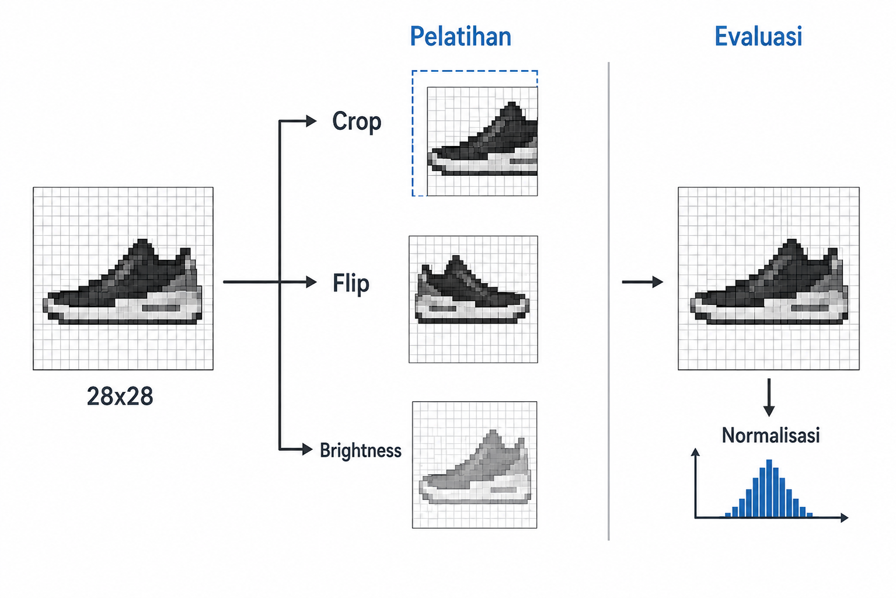
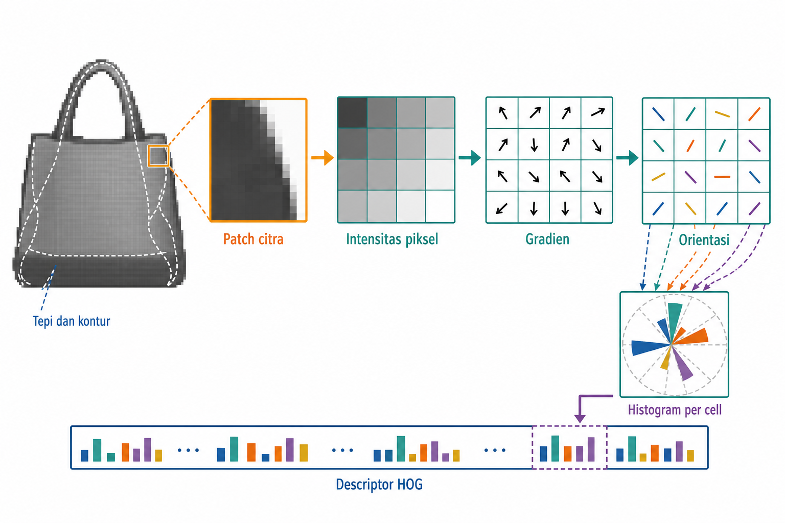
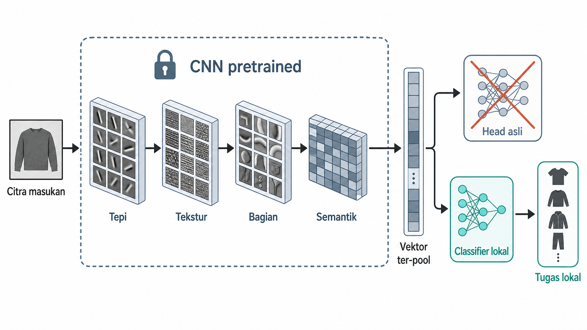
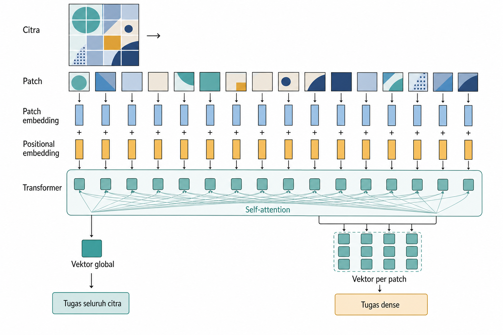
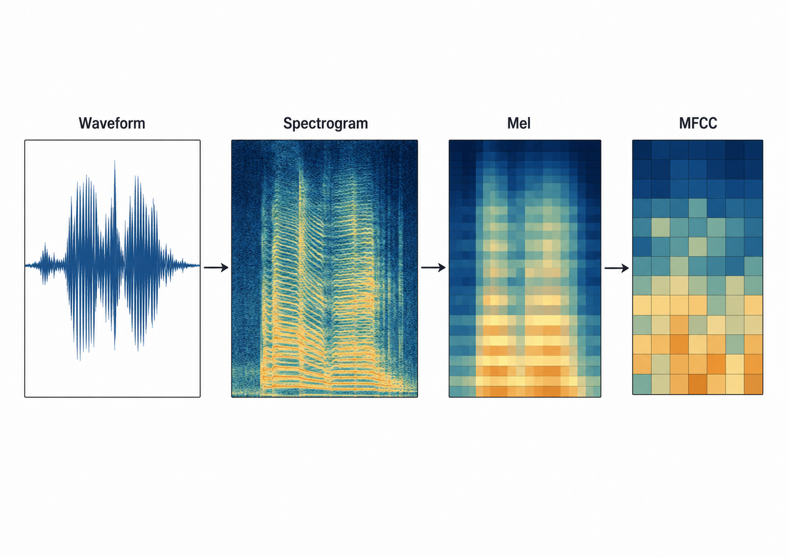

# Citra dan Audio

Sinyal padat seperti gambar dan suara masuk ke model sebagai angka dalam bentuk nilai piksel, amplitudo gelombang, atau spektrum frekuensi. Model tidak menerima pengalaman manusia yang langsung melihat pakaian atau mendengar angka. Struktur yang terasa jelas bagi manusia harus diterjemahkan menjadi representasi yang dapat dipakai model. Inti persoalannya adalah representasi apa yang membuat struktur penting menjadi terlihat oleh model.

Bab ini membahas dua jalur representasi untuk citra dan audio. Jalur pertama adalah representasi yang dirancang manusia, seperti HOG untuk citra serta spectrogram, MFCC, dan chroma untuk audio. Jalur kedua adalah representasi yang dipelajari mesin, seperti CNN, Vision Transformer, dan encoder audio pratelatih yang belajar langsung dari waveform. Bab ini menguraikan penskalaan kanal, augmentasi sebagai keputusan representasi, embedding citra dan audio, serta penggabungan (*pooling*) frame berdurasi variabel menjadi vektor berukuran tetap. Tujuannya memahami kapan suatu representasi cukup dan bagaimana validasinya dijaga tetap jujur.

## Penskalaan Kanal dan Augmentasi Citra

Citra yang tampak utuh bagi manusia masuk ke model sebagai tensor angka. Tahap pertama adalah menyepakati bentuk tensor dan skala nilainya. Citra digital biasanya direpresentasikan dengan dimensi tinggi, lebar, dan kanal. Pada citra RGB, satu piksel mempunyai tiga nilai, yaitu merah, hijau, dan biru. Jika citra berukuran 224 x 224, bentuknya dapat ditulis sebagai 224 x 224 x 3 pada konvensi *channels-last* seperti TensorFlow/Keras, atau 3 x 224 x 224 pada konvensi *channels-first* seperti PyTorch. Nilai piksel sering datang sebagai bilangan 0 sampai 255, lalu diubah menjadi rentang seperti 0 sampai 1 sebelum masuk ke model.

Langkah awal ini tampak administratif, tetapi sebenarnya merupakan bagian dari representasi. Model pretrained biasanya dilatih dengan aturan input tertentu, mulai dari ukuran citra, urutan kanal, rentang nilai, sampai statistik penskalaan. Jika aturan tersebut berubah, angka yang masuk ke lapisan pertama tidak lagi mengikuti asumsi pelatihan model. Akibatnya, fitur yang seharusnya kuat dapat melemah hanya karena input dipersiapkan dengan cara berbeda.

Penskalaan per kanal mengikuti ide standardization dari Bab 3, tetapi diterapkan pada kanal warna. Untuk kanal $c$, nilai piksel $x_c$ dapat ditulis ulang dengan rumus berikut.

$$x_c' = \dfrac{x_c - \mu_c}{\sigma_c}$$

Dalam rumus tersebut, $\mu_c$ adalah rata-rata kanal dan $\sigma_c$ adalah *standard deviation* kanal. Untuk model yang dilatih dari awal, statistik ini dihitung dari *training split* saja. Model *pretrained* menggunakan statistik yang didokumentasikan khusus untuk bobotnya. Sebagai contoh, sebagian bobot *vision pretrained* yang dilatih pada ImageNet mendokumentasikan *mean* RGB \[0.485, 0.456, 0.406\] beserta *standard deviation* tertentu. Angka tersebut tidak berlaku untuk semua model *vision pretrained*. Mengganti statistik bawaan dengan statistik *dataset* lokal juga tidak selalu benar, karena lapisan awal model sudah belajar membaca *input* dengan konvensi lama.

Gambar 12.1 memperlihatkan perbedaan antara jalur pelatihan dan jalur evaluasi. Jalur pelatihan boleh memakai augmentasi acak, sedangkan *preprocessing* validasi dan *test* secara default dibuat deterministik agar evaluasi dapat direproduksi. *Test-time augmentation* yang ditetapkan sebelumnya tetap sah jika transformasi dan aturan penggabungan prediksinya reproducible serta sesuai dengan prosedur *serving*.

Contoh citra pada bab ini memakai Fashion-MNIST. Setiap baris mewakili satu citra pakaian grayscale berukuran 28 x 28 piksel dengan label kelas pakaian. Contoh audio memakai Free Spoken Digit Dataset (FSDD), yang berisi rekaman pendek pengucapan digit 0 sampai 9. Kedua contoh ini menunjukkan bahwa augmentasi hanya sah jika label tetap dapat dipertahankan.

Augmentasi membuat contoh pelatihan baru melalui transformasi yang dianggap tidak mengubah label, misalnya crop, flip, rotasi kecil, color jitter, blur, atau *noise*. Pada Fashion-MNIST, rotasi kecil atau translasi ringan dapat membantu jika label pakaian tetap terbaca. Crop tidak selalu aman. Jika gambar ankle boot dipotong sampai sol atau bentuk utamanya hilang, label lama menjadi meragukan. Pada audio digit FSDD, time shift atau *noise* ringan dapat aman, tetapi transformasi yang memotong awal ucapan dapat menghapus informasi digit.

Dengan kata lain, augmentasi bukan data gratis. Augmentasi adalah pernyataan bahwa label tetap benar di bawah transformasi tertentu. Pernyataan tersebut harus sesuai dengan domain, tugas, dan cara data dipakai saat deployment. Setelah input citra dipersiapkan, pertanyaan berikutnya adalah apakah struktur visual perlu ditulis manusia sebagai *descriptor*, atau dibiarkan dipelajari oleh model.

Selain transformasi yang dipilih manual, AutoAugment dan RandAugment mencari atau memilih kombinasi augmentasi secara otomatis. Augmentasi lintas sampel seperti mixup dan CutMix mencampur dua citra, dan kadang dua label, agar prediksi tidak terlalu bergantung pada satu latar atau pola global. Pendekatan ini menekankan morfologi lokal yang stabil. Namun, setiap augmentasi tetap merupakan asumsi invariance. Flip pada X-ray dada dapat menukar anatomi kiri dan kanan. Kebijakan otomatis pun perlu diperiksa terhadap invariance yang benar-benar berlaku.

## HOG dan Batas Fitur Citra yang Dirancang Manusia

Jika piksel mentah dipakai langsung, perubahan kecil pada posisi, pencahayaan, atau latar dapat mengubah banyak angka sekaligus. Objek yang sama dapat terlihat berbeda hanya karena lampu lebih terang, kamera bergeser sedikit, atau warna pakaian berubah. Karena itu, sebelum *deep learning* menjadi dominan, banyak representasi citra dirancang untuk menangkap struktur yang lebih stabil daripada nilai piksel mentah.

Salah satu contoh penting adalah HOG, atau *histogram of oriented gradients* (Dalal and Triggs 2005). HOG tidak mencoba mengingat warna setiap piksel. Descriptor ini menghitung arah perubahan intensitas lokal, lalu merangkum pola arah tersebut dalam histogram kecil. Secara intuitif, HOG menangkap bentuk seperti tepi vertikal, sudut, kontur, atau siluet. Pada Fashion-MNIST, HOG lebih peduli pada kontur tas, sol sepatu, atau garis kerah daripada nilai piksel mentah satu per satu.

Gradien sederhana pada citra $I$ dapat ditulis sebagai perubahan intensitas di arah horizontal dan vertikal.

$$G_x = I(x{+}1, y) - I(x{-}1, y)$$

$$G_y = I(x, y{+}1) - I(x, y{-}1)$$

Dalam rumus tersebut, $I(x, y)$ adalah intensitas piksel pada posisi $(x, y)$. Nilai $G_x$ dan $G_y$ memberi bahan untuk menghitung besar dan arah perubahan lokal. HOG kemudian mengumpulkan arah-arah itu dalam cell kecil, menormalkannya per block, lalu menggabungkannya menjadi descriptor panjang tetap.

Gambar 12.2 menunjukkan alur ini. Patch citra masuk sebagai intensitas, diubah menjadi panah gradien, diringkas menjadi histogram orientasi per cell, lalu disusun menjadi descriptor HOG.

Fitur seperti HOG, edge descriptor, dan texture descriptor tetap berguna untuk beberapa situasi. Dataset kecil, sistem dengan komputasi terbatas, inspeksi visual sederhana, atau kebutuhan interpretabilitas kadang lebih cocok dengan descriptor yang jelas maknanya. Model klasik seperti SVM atau logistic regression dapat bekerja baik bila descriptor memang menangkap sinyal utama.

Batasnya juga jelas. Parameter seperti cell size, block size, jumlah orientation bins, dan skema penskalaan harus dipilih manusia. Jika tugas berubah dari siluet pakaian grayscale ke foto produk berwarna atau citra medis, descriptor mungkin perlu diatur ulang. Fitur yang dirancang manusia juga sulit membangun hierarki visual yang fleksibel. Tepi perlu menjadi tekstur, tekstur menjadi bagian objek, dan bagian objek menjadi konsep semantik. CNN dan model pretrained muncul untuk membangun hierarki seperti itu langsung dari data.

## CNN sebagai Feature Extractor dan Model Vision Pretrained

CNN belajar fitur visual melalui filter yang digeser di atas citra. Pada lapisan awal, filter sering merespons garis, sudut, kontras warna, dan pola sederhana. Lapisan tengah menggabungkan respons tersebut menjadi tekstur dan bagian objek. Lapisan dalam membawa representasi yang lebih semantik, seperti pola daun sakit, bentuk kendaraan, wajah hewan, atau objek yang lebih utuh.

Operasi dasar convolution dapat ditulis ringkas dengan rumus berikut.

$$\mathbf{Y}_{i,j} = \sum_m \sum_n \mathbf{W}_{m,n} \cdot \mathbf{X}_{i+m,\, j+n}$$

Dalam rumus tersebut, $\mathbf{X}$ adalah input lokal dari citra atau feature map sebelumnya, $\mathbf{W}$ adalah filter kecil yang dipelajari, dan $\mathbf{Y}_{i,j}$ adalah nilai feature map pada posisi $(i,j)$. Rumus ini menggambarkan konvolusi 2-D pada satu kanal. Pada citra RGB, filter sekaligus menjumlahkan ketiga kanal input. Bagian pentingnya bukan rumusnya semata, tetapi ide bahwa filter yang sama dipakai berulang di banyak lokasi. Dengan cara ini, model dapat mengenali pola lokal tanpa harus belajar ulang untuk setiap posisi piksel.

Model vision pretrained memanfaatkan hierarki ini. Kita dapat mengambil ResNet (He et al. 2016), EfficientNet, atau keluarga CNN lain yang sudah dilatih pada dataset besar, membuang atau melewati classification head terakhir, lalu memakai vektor sebelum head sebagai fitur. Fitur itu kemudian masuk ke model hilir seperti linear classifier, SVM, atau gradient boosting.

Gambar 12.3 memperlihatkan pola feature extraction ini. Classification head asli dicoret, sedangkan pooled vector dari lapisan akhir diarahkan ke classifier lokal.

Transfer learning membantu ketika data berlabel lokal terbatas. Untuk Fashion-MNIST, fitur dari model pretrained dapat menjadi *baseline* cepat, tetapi domain mismatch tetap harus diperiksa karena gambar grayscale kecil tidak sama dengan foto natural ImageNet. Citra medis, foto satelit, atau citra mikroskop juga tidak selalu mengikuti distribusi ImageNet. Performa validasi yang jauh di bawah ekspektasi pretrained, atau visualisasi embedding yang mengelompokkan sumber citra alih-alih kelas, merupakan sinyal kuat adanya domain mismatch yang perlu ditangani. Frozen extraction memakai representasi lama apa adanya. Partial atau full fine-tuning mengubah representasi agar lebih cocok dengan label lokal. Logikanya sama dengan keputusan feature extraction vs fine-tuning pada Bab 11 dan Tabel 11.2.

Preprocessing harus mengikuti bobot model. Resize, crop, urutan kanal, dan statistik penskalaan perlu sesuai dokumentasi. Split data juga harus dijaga. Near-duplicate image, frame dari video yang sama, patch dari citra besar yang sama, atau foto subjek yang sama tidak boleh tersebar sembarangan ke train dan test jika deployment menuntut generalisasi ke subjek atau lokasi baru.

Pilihan arsitektur sebaiknya praktis, bukan ideologis. Vision Transformer memang penting, tetapi CNN modern seperti ConvNeXt V2 tetap kompetitif, terutama pada skala data kecil sampai menengah. Pertanyaan yang lebih berguna adalah representasi mana yang bekerja pada domain ini, dengan data, komputasi, dan kebutuhan interpretasi yang tersedia. Salah satu jawaban modern terhadap pertanyaan tersebut adalah memperlakukan citra sebagai embedding, baik untuk seluruh gambar maupun untuk patch kecil di dalamnya.

## Image Embedding dan Patch

Image embedding adalah vektor padat yang mewakili citra, region, atau patch. Jika descriptor handcrafted menulis asumsi manusia secara eksplisit, embedding modern biasanya dipelajari dari data besar. Vektor ini dapat dipakai untuk klasifikasi, retrieval, clustering, anomaly detection, atau pencarian citra mirip.

Vision Transformer membuat jembatan yang sangat dekat dengan Bab 11. Teks dipecah menjadi token, sedangkan citra dipecah menjadi patch. Setiap patch diratakan dan diproyeksikan menjadi token embedding, lalu dilengkapi *positional embedding* atau informasi posisi lain sebelum diproses oleh transformer encoder. Informasi posisi menjaga letak patch dalam grid tetap terbaca. Dengan cara ini, citra tidak lagi hanya diperlakukan sebagai grid piksel, tetapi sebagai urutan potongan visual.

Jumlah patch ditentukan oleh ukuran citra dan ukuran patch.

$$N = \dfrac{H \times W}{P^2}$$

Dalam rumus tersebut, $H$ dan $W$ adalah tinggi dan lebar citra, sedangkan $P$ adalah ukuran sisi patch. Rumus ini mengasumsikan $H$ dan $W$ habis dibagi $P$; jika tidak, citra perlu di-*resize*, di-*pad*, atau di-*crop* sesuai aturan model. Citra 224 x 224 dengan patch 16 x 16 menghasilkan $224 \times 224 / 16^2 = 196$ token patch. Angka ini penting karena *patch size* langsung memengaruhi resolusi lokal dan biaya komputasi.

Gambar 12.4 memperlihatkan alur patch. Citra dibagi menjadi grid, setiap patch menjadi token embedding, lalu transformer menghasilkan dua jenis representasi yang dapat dipakai.

Granularitas embedding merupakan keputusan desain. Untuk klasifikasi satu citra, global image vector, misalnya token CLS atau pooled vector, sering cukup. Untuk segmentation, deteksi, atau pencarian bagian citra, per-patch vectors dapat lebih berguna karena masih menyimpan struktur spasial. Jika patch terlalu besar, detail kecil hilang. Jika patch terlalu kecil, jumlah token dan biaya attention meningkat.

Embedding visual juga tidak otomatis netral. Model dapat belajar latar, watermark, pose, alat perekam, atau bias dataset lain sebagai shortcut. Karena itu, embedding harus dievaluasi berdasarkan tugas, domain, dan failure mode. Retrieval yang tampak bagus secara visual mungkin gagal pada kasus minoritas. Clustering yang rapi mungkin sebenarnya mengelompokkan sumber kamera, bukan objek. Pola keputusan yang sama muncul lagi pada audio. Sinyal mentah dapat ditransformasikan dengan aturan manusia, atau dipelajari oleh encoder modern.

Tiga keluarga sering muncul dalam praktik. Pertama, model image-text contrastive seperti CLIP (Radford et al. 2021) dan penerusnya menghasilkan encoder visual dengan semantik luas karena dilatih menyelaraskan citra dan teks. Kedua, model self-supervised seperti DINOv2 banyak dipakai ketika struktur spasial dan fitur per patch penting. Ketiga, model supervised klasik dari garis ResNet atau EfficientNet tetap kuat pada data kecil. Pelajaran dari Bab 11 tentang MTEB berlaku lagi: reputasi model adalah petunjuk awal, bukan bukti. Uji pada tugas sendiri. Penyelarasan lintas modalitas dibahas lebih penuh pada Bab 14, sedangkan reuse representasi pretrained kembali menjadi tema pada Bab 15.

## Audio dari Waveform, Spectrogram, MFCC, dan Chroma

Pada sisi audio, sinyal yang terdengar sebagai digit lisan pertama-tama hanyalah *waveform*, yaitu amplitudo sebagai fungsi waktu. Setiap saat hanya memuat satu atau beberapa nilai, bergantung pada jumlah kanal. Semua sumber suara sudah tercampur di sana, mulai dari ucapan, musik, langkah kaki, mesin, ruangan, sampai *noise*. Model yang menerima *waveform* mentah harus belajar sendiri struktur frekuensi, ritme, dan pola temporal.

Representasi klasik audio memisahkan sebagian struktur itu sebelum model belajar. Spectrogram menunjukkan bagaimana energi frekuensi berubah terhadap waktu. Hasilnya tampak seperti objek 2-D dengan sumbu waktu, sumbu frekuensi, dan intensitas energi. Ini menjadi salah satu jembatan ke tooling vision, karena spectrogram dapat diproses mirip citra. Namun, spectrogram sebagai citra bukan satu-satunya jalan modern. Representasi tersebut hanya salah satu pilihan yang berguna. Mesin FFT dari Bab 10 adalah dasar teknis di balik transformasi frekuensi ini.

Mel spectrogram mengubah sumbu frekuensi agar lebih dekat dengan persepsi pendengaran manusia. Frekuensi rendah dibedakan lebih halus, sedangkan frekuensi tinggi dipadatkan lebih kasar. Skala mel dapat ditulis dengan rumus berikut.

$$m = 2595 \log_{10}\!\left(1 + \dfrac{f}{700}\right)$$

Dalam rumus tersebut, $f$ adalah frekuensi fisik dalam Hertz, dan $m$ adalah nilai pada skala mel. Rumus ini menunjukkan bahwa mel spectrogram bukan hanya spectrogram biasa. Sumbu frekuensinya sudah dibengkokkan oleh asumsi persepsi.

MFCC, atau *Mel-frequency cepstral coefficients*, melangkah lebih jauh. Representasi ini merangkum bentuk envelope spektral menjadi koefisien yang lebih ringkas setelah mentransformasikan energi per filterbank mel melalui *discrete cosine transform* (DCT). DCT mendekorelasikan energi filterbank mel secara aproksimatif, tetapi tidak menjamin koefisien MFCC tidak berkorelasi secara statistik pada setiap *dataset*. Secara historis, MFCC sangat kuat untuk tugas speech dan tetap berguna pada dataset kecil atau edge deployment yang membutuhkan fitur padat dan murah. Chroma berbeda lagi. Representasi ini merangkum energi ke dua belas pitch class, dengan octave yang dilipat. Karena itu, chroma lebih cocok untuk musik, chord, genre, atau tugas yang bergantung pada harmoni.

Gambar 12.5 merangkum tangga representasi audio. Semakin naik, representasi makin terstruktur oleh asumsi manusia tentang frekuensi, persepsi, dan musik.

Window length, hop length, sampling rate, dan penskalaan amplitudo mengubah representasi. Window pendek memberi resolusi waktu lebih baik tetapi resolusi frekuensi lebih kasar. Window panjang memberi frekuensi lebih rapi tetapi peristiwa singkat dapat melebur. Pada FSDD, fitur MFCC-like dapat cukup kuat untuk membedakan digit lisan bila split menjaga sumber rekaman dengan benar. Untuk musik, chroma membantu membaca hubungan pitch. Untuk mesin atau getaran, spectrogram dan band-energy sering lebih informatif daripada amplitude sesaat.

Semua transformasi ini adalah representasi yang dirancang manusia. Bahkan jika spectrogram kemudian masuk ke CNN, keputusan awal tentang window, hop, mel, MFCC, atau chroma tetap menentukan sinyal apa yang terlihat dan apa yang dibuang. Pilihan berikutnya lebih dekat dengan representasi yang dipelajari mesin, yaitu encoder yang langsung belajar dari waveform.

## Encoder Audio Pretrained Berbasis Raw Waveform

Jika spectrogram dan MFCC menulis asumsi manusia ke dalam fitur, raw-waveform encoder mencoba belajar representasi langsung dari sinyal audio. Model seperti wav2vec 2.0 (Baevski et al. 2020) dan HuBERT belajar dari audio tidak berlabel dalam jumlah besar sebelum diadaptasi ke tugas hilir. Pada speech, pola ini penting karena label transkripsi mahal, sementara audio mentah jauh lebih banyak.

Resep self-supervised learning pada audio dapat dijelaskan sederhana. Model melihat representasi audio yang sebagian segmennya ditutup atau di-*mask*, lalu dilatih memprediksi bagian yang hilang atau unit target tertentu. Dengan latihan seperti ini, model dipaksa menyerap struktur fonetik dan akustik tanpa membutuhkan label manual untuk setiap potongan suara.

Representasi yang dihasilkan dapat dipakai seperti embedding. Hidden states diambil, pooling atau segmentasi dilakukan, lalu classifier hilir dilatih. Untuk pengenalan emosi, speaker verification, diarization, atau klasifikasi ucapan, encoder pretrained dapat mengurangi ketergantungan pada MFCC atau fitur yang dirancang manusia. Namun, encoder seperti ini tidak menghapus keputusan representasi. Kita tetap harus memilih sampling rate, durasi chunk, cara pad atau trim, strategi pooling, bahasa atau domain pretraining, serta apakah encoder dibekukan atau di-fine-tune.

Dokumentasi pipeline audio biasanya menentukan sampling rate yang diharapkan. Jika model mengharapkan 16 kHz, rekaman 44.1 kHz harus di-resample dengan benar. Klip yang terlalu panjang perlu dipotong atau diproses bertahap. Klip yang terlalu pendek perlu padding. Perubahan kecil seperti ini dapat menggeser representasi, sama seperti preprocessing citra dapat menggeser fitur vision pretrained.

Perpindahan ini adalah titik penting menuju representasi yang dipelajari mesin pada audio. Model tidak lagi hanya menerima *spectrogram* yang dirancang manusia, tetapi belajar struktur dari *waveform*. Meski begitu, *compute*, *latency*, dan *domain mismatch* tetap nyata. Untuk *environmental sound*, musik, atau suara mesin, model *pretrained speech* belum tentu pilihan terbaik. Pendekatan berbasis *spectrogram* atau encoder *pretrained* khusus *non-speech* bisa lebih sesuai. Setelah encoder dipilih, rangkaian frame atau *chunk* perlu diubah menjadi representasi berukuran tetap.

Ekosistem audio cukup terspesialisasi. wav2vec 2.0 dan HuBERT kuat dalam garis speech recognition. WavLM sering dipakai untuk berbagai tugas speech sekaligus, seperti pengenalan ucapan, verifikasi pembicara, diarisasi, dan pengenalan emosi, karena dirancang sebagai fondasi speech yang menyeluruh. Hidden states dari encoder Whisper dapat dipakai sebagai fitur speech umum. Untuk environmental audio, nama seperti AudioMAE dan BEATs sering muncul. Untuk musik, MERT adalah salah satu keluarga yang relevan. Nama-nama ini bukan daftar rekomendasi otomatis. Pelajaran Bab 11 tetap berlaku. Cocokkan domain pretraining dengan sinyal sendiri, lalu validasi lokal sebelum percaya leaderboard.

## Audio Embedding dan Agregasi Sepanjang Waktu

Audio jarang memiliki panjang yang rapi. Satu klip dapat berdurasi dua detik, klip lain dua menit. Encoder audio juga sering menghasilkan frame-level vectors setiap beberapa puluh milidetik. Sementara itu, banyak classifier hilir membutuhkan satu vektor ukuran tetap per klip. Karena itu, representasi audio perlu strategi agregasi.

Cara paling sederhana adalah average pooling. Semua frame vector dirata-ratakan menjadi satu clip vector. Ini cocok ketika informasi digit tersebar cukup merata sepanjang klip pendek. Namun, average pooling dapat menghapus bagian penting jika klip didominasi silence. Max pooling menjaga kejadian singkat seperti onset ucapan, tetapi mudah bereaksi terhadap *noise* ekstrem. Attention pooling belajar memilih frame penting, tetapi membutuhkan data dan pelatihan tambahan. Pilihan lain adalah tidak memaksa pooling awal. Sequence model mempertahankan urutan frame agar timing tetap lebih utuh.

Label clip-level juga bisa lemah. Pada FSDD, label digit berlaku untuk satu klip pendek, tetapi silence di awal atau akhir tetap dapat mengencerkan sinyal jika pooling terlalu kasar. Pada audio event yang lebih panjang, masalahnya lebih berat karena peristiwa penting mungkin hanya muncul beberapa detik. Segmentasi atau *chunk-level embedding* membantu ketika lokasi waktu peristiwa penting perlu dipertahankan dan satu vektor global akan mengaburkannya.

Setelah dua jalur citra dan audio itu terlihat, Tabel 12.1 merangkum peta representasi keduanya dalam satu tampilan. Kolom "jenis representasi" membedakan representasi yang dirancang manusia dari representasi yang dipelajari mesin. Kolom batas utama perlu dibaca sebagai peringatan desain, bukan alasan untuk menolak representasi tersebut.

**Tabel 12.1 --- Peta representasi citra dan audio**

*Tabel lengkap tersedia pada edisi cetak.*

Tabel 12.2 berfokus pada keputusan *pooling* temporal audio. Baris-barisnya membantu memilih strategi berdasarkan apakah peristiwa tersebar merata, muncul singkat, atau membutuhkan urutan.

**Tabel 12.2 --- Strategi pooling temporal audio**

*Tabel lengkap tersedia pada edisi cetak.*

Split data audio harus menghormati sumber. Frame atau chunk dari rekaman yang sama tidak boleh tersebar ke train dan test jika deployment menuntut generalisasi ke rekaman baru. Untuk FSDD, rekaman dari pembicara yang sama perlu dijaga tetap di satu sisi split bila tujuan evaluasi adalah generalisasi ke pembicara baru. Jika tidak, embedding dapat tampak kuat hanya karena mengenali suara pembicara, bukan digit.

Benang merah Bab 12 adalah bahwa gambar dan suara tidak pernah hanya file yang netral. Keduanya bermula dari sinyal padat, tetapi representasi yang dipilih menentukan struktur apa yang tampak bagi model. Pada citra, tensor piksel perlu dipersiapkan sesuai aturan model, HOG merangkum gradien yang dirancang manusia, CNN belajar hierarki visual, dan Vision Transformer membaca patch sebagai token. Pada audio, waveform dapat diubah menjadi spectrogram, mel, MFCC, chroma, atau embedding raw-waveform encoder.

Tabel 12.1 memperlihatkan pola umum bab ini. Representasi klasik memberi kontrol dan interpretasi, sedangkan representasi pretrained memberi kekuatan transfer dengan biaya domain match, preprocessing, dan validasi. Tabel 12.2 menambahkan keputusan khas audio. Sinyal berdurasi variabel harus diringkas atau dipertahankan sebagai urutan.

Prinsip akhirnya sederhana. Resize, crop, patch size, window length, hop length, pooling, dan pilihan encoder semuanya adalah keputusan representasi. Keputusan itu harus sesuai dengan tugas, menjaga split tetap jujur, dan diuji terhadap failure mode yang masuk akal untuk domainnya.

- TorchVision --- Models and pre-trained weights --- <https://pytorch.org/vision/stable/models.html>. Backbone citra pralatih siap pakai.

- Dosovitskiy dkk. (2020), Vision Transformer --- <https://arxiv.org/abs/2010.11929>. Transformer untuk citra (ViT).

- librosa --- <https://librosa.org/doc/latest/>. Ekstraksi fitur audio (spektrogram, MFCC).

- Baevski dkk. (2020), wav2vec 2.0 --- <https://arxiv.org/abs/2006.11477>. Representasi audio self-supervised.

- Radford dkk. (2021), CLIP --- <https://arxiv.org/abs/2103.00020>. Embedding citra--teks bersama.

- Oquab dkk. (2023), DINOv2 --- <https://arxiv.org/abs/2304.07193>. Fitur citra self-supervised umum.

- Radford dkk. (2022), Whisper --- <https://arxiv.org/abs/2212.04356>. Model pengenalan wicara robust.

- Zhang dkk. (2017), mixup --- <https://arxiv.org/abs/1710.09412>. Augmentasi interpolasi untuk pelatihan.

Baevski, Alexei, Henry Zhou, Abdelrahman Mohamed, and Michael Auli. 2020. "Wav2vec 2.0: A Framework for Self-Supervised Learning of Speech Representations." *Advances in Neural Information Processing Systems (NeurIPS)*.

Dalal, Navneet, and Bill Triggs. 2005. "Histograms of Oriented Gradients for Human Detection." *IEEE Conference on Computer Vision and Pattern Recognition (CVPR)*.

He, Kaiming, Xiangyu Zhang, Shaoqing Ren, and Jian Sun. 2016. "Deep Residual Learning for Image Recognition." *IEEE Conference on Computer Vision and Pattern Recognition (CVPR)*.

Radford, Alec, Jong Wook Kim, Chris Hallacy, et al. 2021. "Learning Transferable Visual Models from Natural Language Supervision." *Proceedings of the 38th International Conference on Machine Learning (ICML)*.
