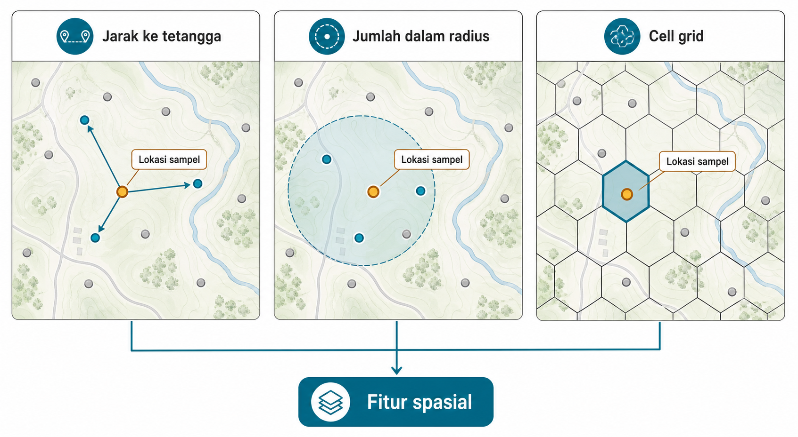
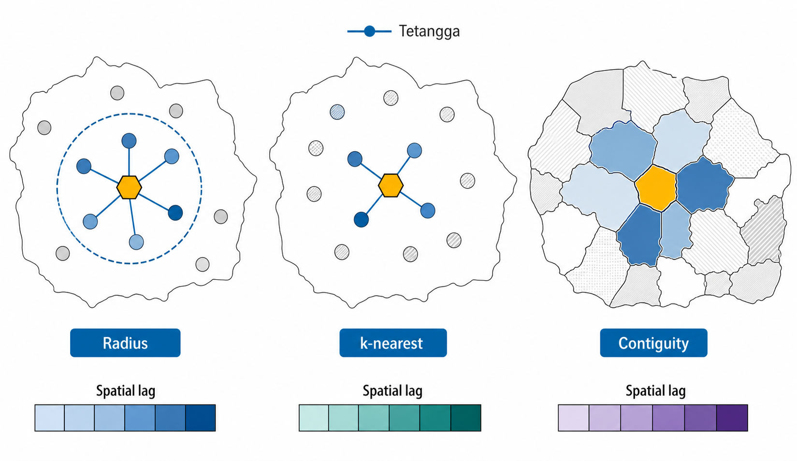
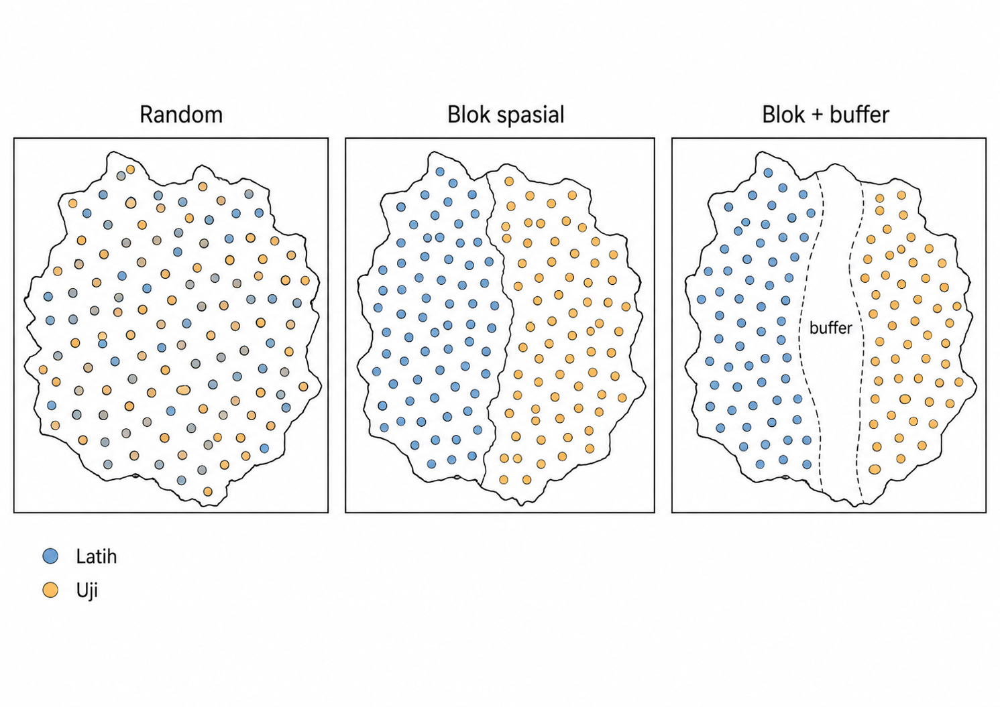
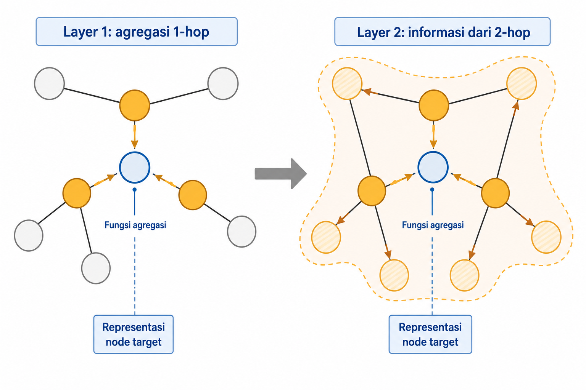
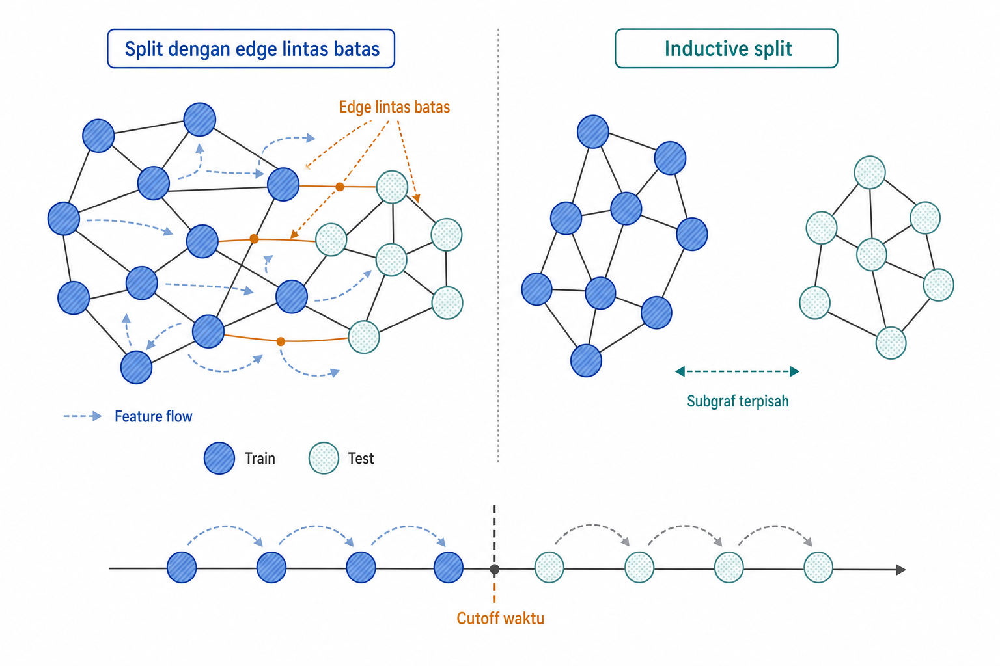

# Data Spasial dan Graf

Sebagian data tidak berdiri sendiri sebagai baris-baris independen. Nilai sebuah observasi dapat bergantung pada letaknya, tetangganya, atau jalur hubungan yang menghubungkannya dengan observasi lain. Dua sampel tanah dengan atribut lokal mirip dapat memiliki konteks berbeda jika tetangganya berbeda. Dua anggota jaringan sosial dengan jumlah hubungan yang sama dapat berperan berbeda jika salah satunya menjadi jembatan antarkomunitas. Pada data seperti ini, hubungan adalah bagian dari representasi.

Bab ini membahas dua keluarga data yang hubungannya membentuk representasi, yaitu data spasial dan graf. Untuk data spasial, pembahasan mencakup transformasi koordinat menjadi fitur jarak, fitur berbasis tetangga (*spatial lag*), autokorelasi spasial, serta kebocoran spasial dan validasi silang berbasis blok. Untuk graf, pembahasan mencakup degree, centrality, clustering, agregasi tetangga, node embedding, serta graph neural network (GNN) sebagai pembelajar representasi. Bab ini menguraikan bahwa pada kedua keluarga data tersebut, hubungan dapat menjadi fitur sekaligus jalur kebocoran bila membawa informasi yang tidak tersedia dalam protokol deployment, sehingga validasi harus mengikuti hubungan yang memang tersedia saat inferensi.

## Koordinat, CRS, Jarak, dan Proximity

Koordinat lebih dari dua kolom angka. Contoh spasial pada bab ini memakai *dataset* Meuse, yang berisi lokasi sampel tanah di dataran banjir Sungai Meuse di Belanda. Setiap baris mewakili satu titik pengambilan sampel dengan koordinat planar dan hasil analisis tanah, termasuk konsentrasi zinc yang digunakan sebagai `log_zinc`. Pada *dataset* ini, jarak antarsampel dapat diperlakukan sebagai jarak metrik di area studi. Pada *dataset* lain, latitude dan longitude bermakna karena berada dalam *coordinate reference system*, atau CRS. Tanpa CRS, angka koordinat tidak menjelaskan cara menghitung jarak, arah, atau area.

Ada dua kegagalan umum ketika latitude dan longitude dipakai mentah seperti fitur tabular biasa. Pertama, model dapat memperlakukan latitude dan longitude sebagai dua angka independen, padahal maknanya muncul sebagai pasangan lokasi. Kedua, satu derajat longitude tidak selalu berarti jarak fisik yang sama. Di dekat ekuator, satu derajat longitude jauh lebih panjang daripada di dekat kutub. Karena itu, Euclidean distance langsung pada derajat dapat menyesatkan.

Untuk geometri lokal, workflow yang umum adalah memulai dari WGS84, lalu memproyeksikan data ke CRS planar metrik yang sesuai dengan wilayah, misalnya zona UTM yang tepat. Setelah itu, jarak, buffer, dan area dapat dihitung dalam satuan meter. Jika area kajian luas atau proyeksi lokal tidak memadai, jarak geodesic atau haversine pada permukaan bumi lebih tepat daripada jarak Euclidean pada derajat.

Fitur spasial yang sering dipakai mencakup koordinat terproyeksi, jarak ke point of interest, keanggotaan wilayah, jumlah objek dalam radius tertentu, dan kepadatan lokal. Pada Meuse, contoh paling langsung adalah koordinat sampel, jarak ke sampel lain, tetangga k-nearest, dan ringkasan kovariat tanah di sekitar titik. Ringkasan `log_zinc` tetangga hanya sah jika pengukuran historis itu benar-benar tersedia saat titik baru diprediksi; ia bukan fitur biasa ketika `log_zinc` yang sama menjadi target yang belum diamati. Pada domain lain, fitur sejenis dapat berupa jarak ke sungai, jalan, fasilitas, atau lokasi layanan terdekat.

Gambar 13.1 menunjukkan tiga cara mengubah satu lokasi menjadi fitur. Lokasi sampel yang sama dapat menghasilkan jarak ke tetangga, jumlah sampel dalam radius, atau keanggotaan cell pada grid.

Hierarchical grid indexing seperti H3 memberi pilihan modern selain jarak langsung dan batas administratif. Bumi dibagi menjadi cell hexagonal pada beberapa resolusi. Koordinat latitude/longitude dapat diubah langsung menjadi ID cell tanpa memerlukan proyeksi, lalu fitur kepadatan, jumlah peristiwa, atau agregat tetangga dihitung per cell. Ini membuat fitur proximity lebih murah dan konsisten, terutama ketika data sangat besar atau *query radius* sering dilakukan.

Namun, grid bukan jawaban universal. Resolusi cell menentukan apakah detail lokal terlihat atau justru melebur. Batas cell juga tetap buatan. Seperti semua representasi, grid indexing mengubah pertanyaan spasial menjadi bentuk yang lebih mudah dipakai model, tetapi membawa asumsi tentang skala. Setelah posisi menjadi fitur, lingkungan sekitar mulai ikut dihitung melalui tetangga, kepadatan, dan pola kemiripan lokal.

## Fitur Tetangga dan Autokorelasi Spasial

Tobler's first law of geography sering diringkas dengan kalimat sederhana. Semua hal saling berhubungan, tetapi hal yang berdekatan biasanya lebih berhubungan. Kalimat itu menjadi dasar banyak fitur spasial. Pada Meuse, sampel tanah yang berdekatan cenderung memiliki `log_zinc` yang lebih mirip daripada sampel jauh. Jika pola seperti ini ada, koordinat dan tetangga tidak lagi menjadi metadata sampingan. Keduanya menjadi informasi prediktif.

Neighborhood features merangkum objek atau observasi di sekitar lokasi. Bentuknya dapat berupa jumlah sampel dalam radius, rata-rata nilai tetangga, jarak ke tetangga terdekat, local rate, atau agregat berdasarkan grid dan wilayah. Fitur seperti ini memberi model tabular konteks geografis yang tidak terlihat dari koordinat mentah.

Workhorse pentingnya adalah *spatial lag*, yaitu rata-rata berbobot dari nilai tetangga.

$$y_{\text{lag},i} = \sum_{j} w_{ij}\, y_j$$

Dalam rumus tersebut, $y_{\text{lag},i}$ adalah fitur *spatial lag* untuk lokasi $i$, $y_j$ adalah nilai pada lokasi tetangga $j$, dan $w_{ij}$ adalah bobot hubungan dari $i$ ke $j$. Jika bobot dibuat row-standardized, maka $\sum_j w_{ij} = 1$, sehingga *spatial lag* menjadi rata-rata tetangga. Matriks bobot $W$ menentukan siapa tetangga dan seberapa kuat pengaruhnya.

Definisi tetangga adalah keputusan representasi. Distance band memasukkan semua titik dalam radius $r$ kilometer. k-nearest neighbors memberi setiap lokasi jumlah tetangga yang sama, berguna ketika kepadatan titik tidak merata. Contiguity memakai wilayah yang berbatasan langsung, misalnya kecamatan yang saling menyentuh. Travel time atau network distance dapat lebih sesuai ketika akses mengikuti jalan, sungai, atau jaringan transportasi, bukan garis lurus.

Gambar 13.2 memperlihatkan bagaimana satu lokasi dapat memiliki tetangga berbeda di bawah tiga skema bobot. *Spatial lag* yang dihasilkan pun dapat berbeda, walaupun titik targetnya sama.

Spatial autocorrelation berarti nilai pada lokasi berdekatan lebih mirip daripada nilai pada lokasi jauh. Moran's I adalah ukuran global yang sering dipakai untuk memeriksa pola ini. Local indicators dapat menemukan klaster lokal atau outlier spasial. Fitur tetangga dapat meningkatkan prediksi, tetapi juga dapat memperkuat pola historis, bias pengukuran, atau efek kebijakan. Batas administratif, misalnya, sering mencerminkan keputusan manusia dan dapat menjadi proxy untuk layanan, aturan, atau ketimpangan lama.

Satu risiko perlu disebut sejak awal. *Spatial lag* yang memakai nilai target tetangga hanya sah bila nilai tetangga itu memang sudah diketahui pada waktu prediksi. Jika `log_zinc` dari titik validasi ikut memengaruhi fitur *training* atau fitur titik validasi lain melalui tetangga, label tersembunyi melintasi batas *split* dan evaluasi menjadi bocor. Risiko ini menjadi lebih konkret pada *spatial cross-validation* (Roberts et al. 2017).

Local Moran's I dapat mengelompokkan lokasi ke empat kuadran relatif terhadap lingkungan sekitarnya. High-High menandai hot spot, Low-Low menandai cold spot, sedangkan High-Low dan Low-High menandai outlier spasial. Kuadran LISA dapat menjadi fitur jika dihitung dari kovariat non-target yang tersedia. Jika LISA dihitung dari `log_zinc` yang sedang diprediksi, kuadrannya bukan fitur inferensi biasa; hanya label historis yang benar-benar sudah ada pada waktu prediksi yang boleh berkontribusi. Aturan *split* pada Bagian 13.3 tetap berlaku.

## Spatial Leakage dan Spatial Cross-Validation

Random split sering tampak wajar pada data tabular, tetapi dapat terlalu optimistis bila deployment menuntut generalisasi ke wilayah baru. Jika train dan test saling berdekatan, test point mungkin dikelilingi training point yang hampir sama. Dalam kondisi autokorelasi kuat, model dapat menebak test point dari konteks tetangganya. Skor validasi itu dapat sah untuk prediksi titik baru di wilayah yang sama, tetapi tidak membuktikan bahwa pola dapat dibawa ke blok ruang baru.

Kedekatan observasi di dua sisi *split* bukan otomatis *leakage*. Kebocoran terjadi ketika label tersembunyi, atribut masa depan, atau konteks yang tidak akan tersedia saat deployment ikut menyeberangi batas evaluasi. Pada Meuse, *random split* dapat membuat titik uji dikelilingi titik latih dengan konteks `log_zinc` sangat mirip; hal ini terutama menciptakan ketidakcocokan evaluasi jika klaim akhirnya adalah generalisasi ke blok ruang baru. Pada citra spasial yang lebih rapat, piksel atau patch bersebelahan juga perlu dikelompokkan jika deployment tidak akan menyediakan konteks yang saling tumpang tindih itu.

Moran's I membantu menjelaskan kapan risiko ini besar.

$$I = \dfrac{n}{W_{\Sigma}} \cdot \dfrac{\sum_i \sum_j w_{ij}(x_i - \bar{x})(x_j - \bar{x})}{\sum_i (x_i - \bar{x})^2}$$

Dalam rumus tersebut, $n$ adalah jumlah observasi, $w_{ij}$ adalah bobot spasial, $W_{\Sigma}$ adalah total semua bobot, $x_i$ adalah nilai pada lokasi $i$, dan $\bar{x}$ adalah rata-ratanya. Nilai $I$ yang kuat positif berarti tetangga cenderung mirip. Dalam kondisi seperti itu, *random split* mudah memberi rasa aman palsu jika deployment sebenarnya menuntut generalisasi ke wilayah baru.

Validasi spasial harus mengikuti pertanyaan deployment. Jika model akan memprediksi titik baru di wilayah yang sama, *split* dapat lebih longgar; hindari duplikat dan pastikan konteks tetangga yang dipakai evaluasi juga akan tersedia saat inferensi. Jika model akan dipakai di wilayah baru, gunakan *spatial block*, *leave-region-out*, atau *leave-location-out*. Jika deployment mensyaratkan jarak minimum dari wilayah terukur, *buffered split* membuang *training point* dalam jarak tertentu dari batas *test block* untuk meniru kondisi tersebut.

Gambar 13.3 membandingkan tiga split. Panel random memperlihatkan train dan test bercampur. Panel block memisahkan wilayah. Panel buffered block menambahkan strip kosong di sekitar batas.

Fitur spasial juga harus dibangun di dalam batas *split*. Jika agregat memakai label atau outcome tetangga, hitung hanya dari label historis yang sah untuk *fold* tersebut dan memang akan tersedia saat inferensi. Jika deployment bersifat time-space, *split* perlu menghormati waktu sekaligus lokasi. Model dilatih pada periode dan wilayah yang tersedia sebelum prediksi, lalu diuji pada masa depan atau wilayah baru sesuai tujuan. Pola yang sama akan muncul pada graf. Hubungan membantu prediksi, tetapi informasi yang tidak tersedia dan mengalir melalui hubungan dapat membuat evaluasi terlalu mudah.

## Degree, Centrality, dan Clustering pada Graf

Pelajaran dari bagian spasial tidak berhenti pada koordinat. Ada banyak data yang hubungannya tidak berbentuk jarak geografis, melainkan edge eksplisit. Graf merepresentasikan entitas sebagai *node* dan hubungan sebagai *edge*.

Contoh graf pada bab ini memakai Zachary Karate Club. Setiap *node* adalah anggota klub, setiap *edge* adalah hubungan sosial, dan pemisahan klub menjadi dua faksi dapat dipakai sebagai label. Pada dataset lain, artikel ilmiah dapat menjadi node dengan sitasi sebagai edge, atau persimpangan jalan menjadi node dengan ruas jalan sebagai edge. Begitu data ditulis sebagai graf, fitur tidak hanya berasal dari atribut node, tetapi juga dari posisi node dalam jaringan.

Degree menghitung jumlah koneksi langsung. Pada graf berbobot, *weighted degree* menjumlahkan bobot edge. Pada graf berarah, *in-degree* dan *out-degree* memberi makna berbeda. *In-degree* dapat menandakan popularitas atau banyaknya rujukan masuk, sedangkan *out-degree* dapat menandakan aktivitas atau banyaknya hubungan keluar.

Degree centrality menormalkan degree agar lebih mudah dibandingkan antar graf.

$$C_d(v) = \dfrac{\deg(v)}{N - 1}$$

Dalam rumus tersebut, $\deg(v)$ adalah degree node $v$, dan $N - 1$ adalah jumlah koneksi maksimum yang mungkin ke node lain. Nilai ini tetap sederhana, tetapi sering menjadi *baseline* kuat untuk membaca posisi node.

Centrality lain mengukur "penting" dengan definisi berbeda. Betweenness melihat node yang sering berada di jalur terpendek antar node lain. Closeness melihat kedekatan rata-rata ke seluruh graf. PageRank atau *eigenvector centrality* memberi nilai tinggi pada node yang terhubung ke node penting. Clustering coefficient mengukur seberapa rapat tetangga sebuah node saling terhubung. Nilai tinggi menunjukkan keanggotaan dalam *clique* atau komunitas lokal yang rapat.

Tabel 13.1 merangkum ukuran-ukuran ini. Kolom kedua menunjukkan bahwa "penting" dapat berarti banyak hal, bukan ranking universal.

**Tabel 13.1 --- Ukuran sentralitas dan makna pentingnya**

*Tabel lengkap tersedia pada edisi cetak.*

Fitur-fitur ini adalah representasi yang dirancang manusia. Kita memilih ukuran, menghitungnya dari struktur graf, lalu menambahkannya ke tabel node atau edge. Pada Karate Club, degree, betweenness, dan clustering coefficient membantu membedakan anggota yang berada di pusat faksi, anggota yang lebih periferal, dan anggota yang menjembatani komunitas. Pada domain lain, ukuran serupa dapat dipakai untuk citation network, road network, atau deteksi anomali struktural.

Tidak ada centrality yang selalu terbaik. Ukuran yang tepat bergantung pada pertanyaan yang diajukan, apakah popularitas, perantara, jangkauan cepat, reputasi dari node penting, atau keanggotaan komunitas rapat. Setelah posisi node diringkas, fitur graf biasanya bergerak satu langkah lebih jauh. Yang dihitung bukan hanya posisi node itu sendiri, tetapi juga atribut tetangga dan jalur di sekitarnya.

## Agregasi Tetangga dan Fitur Berbasis Jalur

Setelah ukuran struktural dasar, fitur dapat dibuat dari tetangga. Neighborhood aggregation merangkum atribut node yang berhubungan langsung, misalnya rata-rata atribut tetangga, jumlah tipe tetangga, maksimum skor tetangga, atau proporsi tetangga dalam kategori tertentu. Alasannya praktis. Setiap node dapat memiliki jumlah tetangga berbeda, sedangkan model tabular membutuhkan vektor fitur ukuran tetap.

Formula sederhana untuk neighbor mean adalah sebagai berikut.

$$h_v = \dfrac{1}{|\mathcal{N}(v)|} \sum_{u \in \mathcal{N}(v)} x_u$$

Dalam rumus tersebut, $\mathcal{N}(v)$ adalah himpunan tetangga node $v$, $x_u$ adalah atribut node tetangga $u$, dan $h_v$ adalah hasil agregasi untuk node $v$. Bentuknya sengaja mirip dengan *spatial lag* pada Bagian 13.2. Bedanya, *spatial lag* memakai kedekatan geografis, sedangkan graph aggregation memakai kedekatan topologis.

Pada Karate Club, fitur agregasi dapat berupa rata-rata *degree* tetangga, jumlah *common neighbors* antara dua anggota, atau ringkasan atribut non-target yang sudah tersedia. Proporsi tetangga pada suatu faksi tidak boleh dipakai sebagai fitur biasa ketika faksi itu sendiri menjadi target, kecuali label historis tersebut benar-benar tersedia pada saat prediksi. Pada domain lain, agregasi tetangga dapat menghitung perangkat bersama, *short path*, atau rata-rata atribut dalam lingkar hubungan, asalkan *edge* dan atributnya sudah ada sebelum *cutoff* prediksi dan tidak membawa label tersembunyi melintasi *split*.

Fitur berbasis jalur memperluas ide tetangga langsung. Shortest path distance mengukur jarak jaringan. Reachability melihat apakah dua node terhubung. Common neighbors dan Jaccard overlap mengukur seberapa banyak tetangga bersama. Adamic-Adar memberi bobot lebih besar pada tetangga bersama yang jarang, karena berbagi node langka lebih informatif daripada berbagi hub besar yang terhubung ke semua orang. Random-walk proximity menilai kedekatan berdasarkan peluang kunjungan sepanjang jalan acak.

Agregasi dan fitur jalur harus memperhatikan arah edge, bobot, waktu, dan observabilitas. Edge yang terbentuk setelah tanggal prediksi tidak boleh dipakai untuk fitur masa lalu. Label tetangga juga berbahaya jika label itu belum tersedia saat deployment. Dengan kata lain, rekayasa fitur graf mengikuti aturan yang sama dengan fitur temporal dan spasial. Fitur harus tersedia pada waktu prediksi dan di dalam *split* yang sah.

Agregasi manual ini membuka dua jalan. Jalan pertama adalah mempelajari embedding node dari pola jalan dan kedekatan dalam graf. Jalan kedua, yang muncul setelahnya, adalah *message passing* pada GNN, ketika transformasi dan kombinasi tetangga tidak lagi ditentukan sepenuhnya oleh manusia.

## Node Embedding

Jalan pertama dari agregasi manual adalah mempelajari kedekatan graf sebagai geometri vektor. Node embedding memetakan node graf ke vektor padat. Secara ringkas, pemetaan tersebut dapat ditulis sebagai berikut.

$$f(v) \to \mathbf{z}_v \in \mathbb{R}^d$$

Dalam rumus tersebut, $v$ adalah node, $\mathbf{z}_v$ adalah embedding node tersebut, dan $d$ adalah dimensi vektor. Tujuannya adalah menempatkan node yang memiliki pola graf serupa di posisi vektor yang berdekatan.

Salah satu garis awal yang penting adalah DeepWalk. Idenya meminjam Word2Vec dari teks. Jika kalimat dapat menghasilkan urutan kata, graf dapat menghasilkan urutan node melalui *random walk*. Node yang sering muncul berdekatan dalam *walk* dianggap memiliki hubungan konteks, lalu embedding dipelajari dengan objective mirip *skip-gram*. node2vec (Grover and Leskovec 2016) memperhalus ide ini dengan *biased random walks*, sehingga *walk* dapat diarahkan untuk menangkap komunitas lokal atau peran struktural.

Embedding node dapat dipakai untuk node classification, link prediction, clustering, dan recommendation. Pada Karate Club, anggota yang sering berada dekat dalam *random walk* cenderung mendapat vektor yang dekat, sehingga komunitas sosial dapat muncul sebagai struktur embedding. Dalam citation network atau recommendation graph, prinsip yang sama dipakai pada paper, user, atau item.

Batasnya penting. Banyak embedding berbasis *walk* bersifat *transductive*. Vektor dipelajari untuk node dalam graf tertentu. Jika ada node baru setelah model dibuat, embedding-nya tidak selalu tersedia tanpa menjalankan ulang proses atau memakai mekanisme tambahan. Batas kedua, *walk-based embedding* terutama melihat topology. Jika graf sitasi memiliki abstrak paper yang sangat informatif, node2vec tidak membacanya kecuali atribut itu dimasukkan melalui metode lain.

Dua batas ini menjelaskan mengapa desain *inductive* seperti GraphSAGE dan GNN menjadi penting. Kita tidak hanya ingin memetakan node lama dalam graf tetap, tetapi juga ingin menghasilkan representasi untuk node baru dengan atribut dan tetangga yang tersedia. Pada GNN, agregasi tetangga tidak hanya menjadi fitur manual, tetapi menjadi operasi yang dipelajari.

Pada node2vec, langkah *walk* berikutnya dapat ditulis $P(c_i = x \mid c_{i-1} = v) = \pi_{vx} / Z$, dengan $\pi_{vx}$ sebagai bobot mentah dan $Z$ sebagai konstanta penyesuaian. Parameter *return* $p$ yang rendah membuat *walk* cenderung tetap lokal, mirip BFS, sehingga embedding menangkap komunitas atau *homophily*. Parameter *in-out* $q$ yang rendah mendorong *walk* bergerak keluar, mirip DFS, sehingga embedding menangkap peran struktural seperti *bridge node*. Kedua parameter tersebut menentukan jenis kemiripan yang dikodekan geometri, mengulang pelajaran Tabel 13.1 bahwa "penting" dan "mirip" adalah keputusan desain.

## GNN sebagai Pembelajar Representasi

Jalan kedua mengambil ide agregasi tetangga lebih jauh. Graph neural network, atau GNN, belajar representasi node, edge, atau seluruh graf dengan menyebarkan informasi melalui hubungan graf. Intuisinya dekat dengan Bagian 13.5. Setiap node memperbarui representasinya memakai fitur sendiri dan pesan dari tetangga. Bedanya, pada GNN transformasi dan kombinasi itu dipelajari dari data.

Satu layer memperluas konteks satu hop. Layer pertama membuat node melihat tetangga langsung. Layer kedua membuatnya melihat tetangga dari tetangga. Dengan beberapa layer, representasi node mengandung informasi lokal yang makin luas. Vektor keluaran dapat dipakai sebagai fitur untuk model tabular, atau seluruh GNN dilatih end-to-end untuk tugas tertentu.

Salah satu bentuk update bergaya GCN (Kipf and Welling 2017)/GraphSAGE dapat ditulis sebagai berikut.

$$\mathbf{h}_v^{(k)} = \sigma\!\left( \mathbf{W}^{(k)} \sum_{u \in \mathcal{N}(v)} \frac{\mathbf{h}_u^{(k-1)}}{|\mathcal{N}(v)|} + \mathbf{B}^{(k)}\, \mathbf{h}_v^{(k-1)} \right)$$

Dalam rumus tersebut, $\mathbf{h}_v^{(k)}$ adalah representasi node $v$ pada layer ke-$k$, $\mathcal{N}(v)$ adalah tetangga $v$, dan $\mathbf{h}_u^{(k-1)}$ adalah representasi tetangga pada layer sebelumnya. Matriks $\mathbf{W}^{(k)}$ mentransformasi rata-rata pesan tetangga, sedangkan $\mathbf{B}^{(k)}$ mentransformasi representasi node itu sendiri. Fungsi $\sigma$ menambahkan nonlinearitas. Dibanding formula neighbor mean pada Bagian 13.5, GNN menambahkan bobot yang dipelajari dan komposisi berlapis.

Gambar 13.4 memperlihatkan *message passing*. Node target menerima vektor dari tetangga, mengagregasikannya, melewati learned transformation, lalu menghasilkan representasi baru. Frame kedua menunjukkan bahwa layer kedua memperluas receptive field sampai dua hop.

GNN berguna ketika struktur dan atribut sama-sama penting. Pada node classification, atribut node dan tetangga membantu menentukan label. Pada link prediction, representasi dua node dapat dipakai untuk menilai kemungkinan edge. Pada graph classification, seluruh graf diringkas menjadi vektor, misalnya molekul dengan atom sebagai node, bond sebagai edge, dan toxicity sebagai target.

Tabel 13.2 menempatkan GNN bersama representasi graf lain. Kolom "simpul baru" penting karena tidak semua pendekatan mudah dipakai pada deployment *inductive*.

**Tabel 13.2 --- Tangga representasi graf**

*Tabel lengkap tersedia pada edisi cetak.*

GNN adalah titik jelas representasi yang dipelajari mesin pada graf. Namun, risikonya nyata, termasuk *over-smoothing*, scalability, bias dalam struktur graf, serta *leakage* melalui label, *edge*, atau atribut yang tidak tersedia dalam protokol deployment. Karena itu, pembahasan graf perlu ditutup dengan validasi.

GAT memakai attention agar tetangga tidak diberi bobot sama rata. GraphSAGE mengambil sampel dan mengagregasi neighborhood sehingga lebih cocok untuk node baru dalam setting *inductive*. Graf heterogen memerlukan varian yang membedakan tipe relasi, seperti keluarga R-GCN. Batas praktisnya juga perlu diingat. *Over-smoothing* membuat terlalu banyak layer mengarahkan node ke vektor yang makin mirip. *Over-squashing* terjadi ketika informasi jarak jauh dipaksa melewati bottleneck struktural yang sempit. Secara ekspresivitas, banyak *message-passing* GNN berbagi batas dengan Weisfeiler-Lehman graph-isomorphism test. Cukup kenali nama batas ini sebagai peringatan, bukan teori yang perlu dibuktikan pada bagian ini.

## Leakage pada Graf

Semua representasi graf sebelumnya mengambil kekuatan dari hubungan. Karena itu, validasinya harus mengikuti protokol penggunaan hubungan tersebut. Graf merusak asumsi bahwa sampel adalah baris independen, tetapi *edge* antara node *train* dan *test* bukan otomatis *leakage*. Pada tugas *transductive* dalam graf tetap, fitur node uji dan *edge* lintas batas boleh dipakai jika keduanya memang diketahui saat inferensi. Evaluasi tercemar ketika label uji, *edge* masa depan, atribut yang belum tersedia, atau informasi lain di luar protokol deployment mengalir melalui struktur graf.

Ada dua rezim evaluasi yang perlu dibedakan. Pada *setting transductive*, graf, fitur node uji, dan *edge* yang tersedia dapat terlihat saat pelatihan, tetapi label uji tetap disembunyikan. Ini sah untuk tugas melabeli node dalam graf tetap yang strukturnya memang sudah diketahui. Pada *setting inductive*, model dievaluasi pada node atau graf yang tidak dipakai untuk mempelajari parameter. Rezim *inductive* tidak selalu memerlukan subgraf yang sepenuhnya terputus: *edge* dari node baru ke graf lama boleh digunakan jika hubungan itu tersedia saat inferensi. Subgraf terpisah diperlukan ketika deployment memang menuju graf atau komunitas baru yang tidak terhubung.

Link prediction punya jebakan tambahan. *Negative samples* harus diambil terpisah per split. Future edges tidak boleh dipakai untuk membangun graf training jika tugasnya memprediksi edge masa depan. Pada temporal graph, split perlu time-aware. Model dilatih dari edge dan node sebelum *cutoff*, lalu diuji pada target setelah *cutoff*. Citation graph, misalnya, tidak boleh memakai sitasi masa depan saat memprediksi status paper pada tanggal publikasi. Social graph juga tidak boleh memakai friendship edge yang terbentuk setelah tanggal prediksi.

Gambar 13.5 menunjukkan *node split* pada graf yang masih terhubung dan satu varian *inductive split* yang lebih ketat. Panel pertama masih memiliki *edge* melintasi batas. Panel kedua memutus subgraph untuk meniru deployment ke graf atau komunitas terpisah; pemutusan ini bukan syarat universal bagi semua tugas *inductive*.

Mitigasi mengikuti rezim evaluasi. Potong *cross-partition edges* hanya ketika hubungan itu tidak akan tersedia saat inferensi atau ketika deployment menuntut subgraf terpisah. Dalam rezim *transductive*, fitur, *random walk*, dan *message passing* boleh memakai graf yang tersedia, tetapi tidak boleh menerima label uji, *edge* masa depan, atau atribut yang belum diketahui. Untuk GNN maupun fitur manual seperti degree, centrality, dan agregasi tetangga, adjacency yang dipakai harus sesuai dengan graf yang benar-benar tersedia dalam protokol deployment.

Contoh *fraud* memperjelas perbedaan protokol. *Random node split* yang memakai *transaction links* yang sudah tersedia mengukur tugas *transductive* pada jaringan yang sama. Skor itu tidak boleh diklaim sebagai bukti performa pada jaringan baru tanpa hubungan tersebut. Kebocoran yang sebenarnya muncul jika label node uji, transaksi masa depan, atau atribut yang belum tersedia ikut mengalir. Strategi *split* perlu ditetapkan sejak awal, apakah tugasnya memprediksi label node baru, *edge* yang belum terlihat, graf baru, atau evolusi graf di masa depan. Keputusan tersebut menentukan representasi dalam Tabel 13.2 yang dapat dipakai dengan jujur.

Data spasial dan graf mengajarkan prinsip yang sama. Hubungan adalah fitur dan dapat menjadi jalur kebocoran ketika membawa informasi yang tidak tersedia saat inferensi. Pada data spasial, hubungan muncul sebagai jarak, radius, ketetanggaan, grid cell, *spatial lag*, dan autokorelasi. Pada graf, hubungan muncul sebagai degree, centrality, clustering, agregasi tetangga, path similarity, node embedding, dan *message passing*.

Namun, fitur relasional selalu membawa risiko evaluasi. *Random split* dapat terlalu optimistis jika deployment menuntut wilayah atau graf baru tetapi evaluasi tetap menyediakan konteks tetangga dari wilayah atau graf yang sama. Kebocoran terjadi ketika label tersembunyi, *edge* masa depan, atau atribut yang belum tersedia ikut membangun fitur. *Spatial block*, buffer, *group split*, *temporal split*, dan *inductive graph split* adalah pilihan yang dipakai sesuai bentuk deployment, bukan kewajiban universal untuk setiap hubungan.

Tabel 13.1 membantu membaca berbagai arti "penting" pada graf, sedangkan Tabel 13.2 merangkum tangga representasi dari metrik manual sampai GNN. Pilihan terbaik bergantung pada tugas, atribut, skala graf, kebutuhan interpretasi, dan jenis generalisasi yang diinginkan. Jika hubungan membentuk data, maka representasi dan validasi harus dibangun dengan hubungan itu di pusat keputusan.

- GeoPandas --- <https://geopandas.org/>. Struktur data dan operasi geospasial di Python.

- PySAL --- <https://pysal.org/>. Analisis spasial, bobot, dan autokorelasi.

- esda --- Exploratory Spatial Data Analysis --- <https://pysal.org/esda/>. Moran's I global dan lokal.

- PyTorch Geometric --- <https://pytorch-geometric.readthedocs.io/>. Pustaka graph neural network.

- Perozzi dkk. (2014), DeepWalk --- <https://arxiv.org/abs/1403.6652>. Embedding node berbasis random walk.

- Hamilton dkk. (2017), GraphSAGE --- <https://arxiv.org/abs/1706.02216>. Agregasi tetangga yang induktif.

Grover, Aditya, and Jure Leskovec. 2016. "Node2vec: Scalable Feature Learning for Networks." *Proceedings of the 22nd ACM SIGKDD International Conference on Knowledge Discovery and Data Mining*. <https://arxiv.org/abs/1607.00653>.

Kipf, Thomas N., and Max Welling. 2017. "Semi-Supervised Classification with Graph Convolutional Networks." *International Conference on Learning Representations (ICLR)*. <https://arxiv.org/abs/1609.02907>.

Roberts, David R., Volker Bahn, Simone Ciuti, et al. 2017. "Cross-Validation Strategies for Data with Temporal, Spatial, Hierarchical, or Phylogenetic Structure." *Ecography* 40 (8): 913--29. <https://doi.org/10.1111/ecog.02881>.
