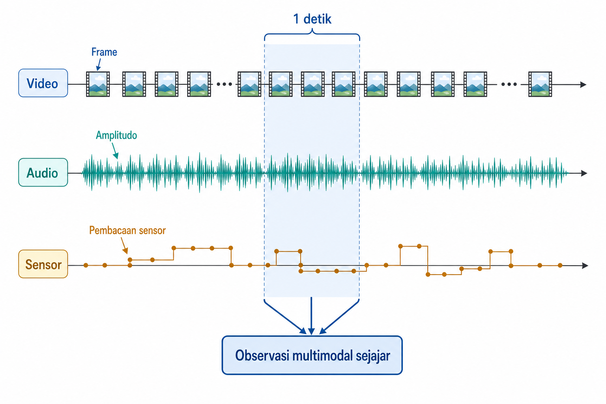
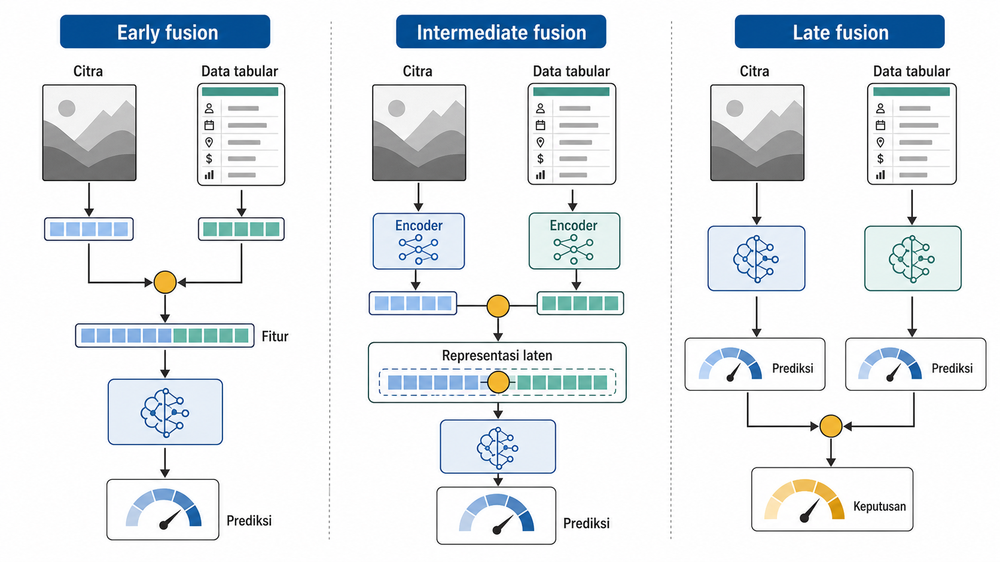
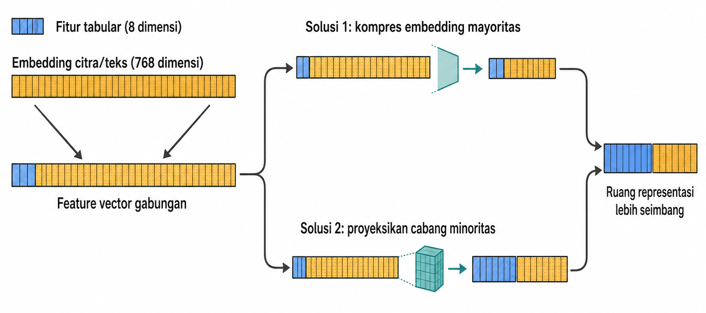
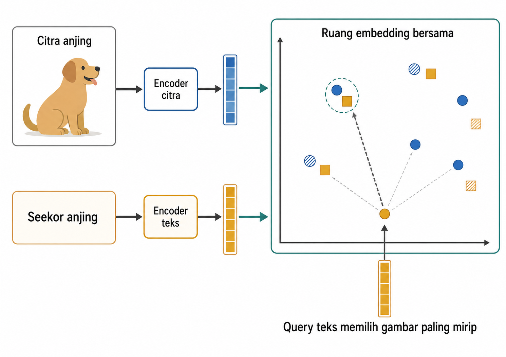

# Data Multimodal

Data multimodal menggabungkan dua atau lebih modalitas, seperti tabular, teks, citra, audio, atau lokasi, yang semuanya menggambarkan entitas yang sama. Tantangannya bukan menumpuk fitur sebanyak mungkin. Setiap modalitas memiliki kelengkapan, *noise*, dan representasi yang berbeda. Jika potongan-potongan itu disatukan pada entitas atau skala yang salah, model menerima contoh belajar yang rusak. Karena itu, langkah pertama adalah memastikan semua potongan data merujuk ke unit yang sama. Setelah itu, representasi digabung, diseimbangkan, dan dibuat tahan terhadap modalitas yang hilang.

Bab ini membahas strategi penggabungan (fusion) pada tingkat fitur awal, tingkat menengah, dan tingkat keputusan (Baltrušaitis et al. 2019). Konkatenasi fitur dibahas bersama masalah ketimpangan dimensi antar modalitas. Strategi penanganan modalitas yang hilang saat produksi, ruang embedding bersama (joint embedding) untuk perbandingan lintas modalitas, dan model multimodal pratelatih dibahas sebagai pilihan yang tersedia. Bab ini menguraikan bahwa keberhasilan multimodal berangkat dari mempertemukan modalitas pada unit yang benar.

## Apa Itu Data Multimodal? *Alignment* dan Sinkronisasi Waktu

Pada tabel biasa, struktur baris membuat kolom otomatis sejajar. Contoh kerja pada bab ini memakai Open Food Facts, kumpulan catatan produk makanan yang menggabungkan nama produk, daftar bahan, kategori, nutrisi, dan thumbnail. Setiap baris mewakili satu produk makanan, sedangkan Nutri-Score dapat dipakai untuk membangun target ringkas. Pada data multimodal, "baris" seperti itu harus dibangun dan diaudit. Foto produk harus dipasangkan dengan produk yang benar, bukan produk lain; teks bahan harus berasal dari kemasan yang sama, bukan hasil gabungan dari item serupa.

*Alignment* menjawab pertanyaan: potongan dari modalitas berbeda mana yang merujuk pada entitas, peristiwa, atau interval waktu yang sama? Jika teks bahan atau kategori dipasangkan dengan foto produk yang salah, sampel belajar menjadi bising. Jika sinyal masa depan dipasangkan dengan prediksi masa lalu, masalahnya lebih parah: *leakage*.

Untuk *stream*, sinkronisasi waktu menjadi pusat. Video dapat memiliki 30 *frame* per detik, sedangkan audio memiliki 44.100 *sample* per detik. Jika unit observasi adalah satu detik, satu contoh belajar dapat memuat 30 *frame* video, 44.100 *sample* audio, dan beberapa pembacaan sensor. Gagasan *window* dari Bab 10 dapat diperluas lintas modalitas.

$$W_{\tau} = \{ (x_k^{(m)}, t_k) \mid \tau \le t_k < \tau + \Delta t \}$$

Dalam rumus tersebut, $W_{\tau}$ adalah *window* yang dimulai pada waktu $\tau$, $\Delta t$ adalah lebarnya, $x_k^{(m)}$ adalah titik data ke-$k$ dari modalitas $m$, dan $t_k$ adalah *timestamp*-nya. Satu unit observasi mengumpulkan semua titik dari berbagai modalitas yang jatuh di dalam *window* tersebut.

Gambar 14.1 memperlihatkan tiga timeline dengan kepadatan berbeda. Window satu detik memotong video, audio, dan sensor menjadi satu blok observasi yang sejajar.

{#fig-ch14-fig-1}

Sample unit dari Bab 1 tetap menjadi keputusan awal. Pada contoh Open Food Facts di bab ini, unitnya adalah produk makanan; target ringkasnya dibangun dari Nutri-Score, dan modalitas yang digabung adalah nutrisi tabular, teks, dan thumbnail. Split juga harus menjaga integritas entitas: semua modalitas dari satu produk berada di sisi split yang sama. Jika teks produk berada di training tetapi gambarnya berada di test, model dapat mengenali entitas melintasi batas split.

Contoh Open Food Facts ini sengaja memakai label turunan: `nutri_good` dibentuk dari Nutri-Score, sedangkan cabang nutrisi tabular memuat bidang-bidang yang secara substansial menentukan Nutri-Score. Karena itu, nutrisi tabular merupakan *near-label signal*, yaitu sinyal yang sangat dekat dengan definisi label, sehingga performanya yang kuat memang diharapkan. Contoh ini dipakai untuk mengajarkan label turunan; hasilnya bukan bukti bahwa fitur nutrisi atau *fusion* selalu dominan pada tugas lain, dan *fusion* sendiri tidak otomatis lebih baik.

Sebagian model *vision-language* modern mulai menyerap sebagian *alignment* temporal ke dalam arsitektur, misalnya dengan menangani *frame rate* yang bervariasi. Itu adalah tren penting, tetapi tidak menghapus pertanyaan dasar bab ini. Kita tetap harus mendefinisikan unit observasi, batas waktu, dan integritas entitas sebelum fitur multimodal dapat dipercaya. Setelah potongan data sudah sejajar, keputusan berikutnya adalah titik pertemuan antar modalitas: apakah digabung sebelum model, di dalam model, atau setelah model membuat prediksi.

## Strategi *Fusion*: Early, Intermediate, Late, serta Tingkat Fitur vs. Keputusan

Setelah modalitas disejajarkan, titik penggabungannya perlu ditentukan. *Fusion* bukan satu teknik tunggal, melainkan keputusan tentang pertemuan antarrepresentasi sebelum model, di dalam model, atau setelah model menghasilkan prediksi.

*Early fusion* menggabungkan fitur mentah atau fitur rendah sebelum masuk ke model utama. Pada Open Food Facts, fitur nutrisi dapat digabung dengan fitur teks bahan atau embedding thumbnail, lalu satu model membaca semuanya. Pendekatan ini sederhana dan memungkinkan model mempelajari interaksi langsung antarfitur. Namun, ia sensitif terhadap skala, *missing modality*, dan ketimpangan dimensi. Masalah itu menjadi fokus Bagian 14.3.

*Intermediate fusion* menggabungkan representasi laten di dalam arsitektur. Setiap modalitas dapat memiliki *encoder* sendiri: teks masuk ke *text encoder*, citra masuk ke *image encoder*, audio masuk ke *audio encoder*. *Embedding* yang dihasilkan bertemu di *hidden layer*. Ini memungkinkan interaksi lebih kaya, tetapi membutuhkan lebih banyak data, komputasi, dan desain model.

*Late fusion* menggabungkan prediksi atau keputusan dari model yang berbeda. Misalnya, model nutrisi memberi probabilitas tinggi untuk produk bernutrisi baik, sedangkan model gambar memberi sinyal lemah dari thumbnail; *ensemble* merata-ratakan atau menimbang dua probabilitas itu. Representasinya tidak dicampur. Yang digabung adalah output. *Late fusion* modular dan lebih tahan ketika satu modalitas hilang, tetapi dapat kehilangan interaksi lintas modalitas yang hanya terlihat jika fitur bertemu lebih awal. Secara konseptual, *early fusion* dan *intermediate fusion* bekerja pada tingkat representasi (*feature-level fusion*), sedangkan *late fusion* bekerja pada tingkat keputusan (*decision-level fusion*).

Gambar 14.2 menunjukkan tiga titik gabung itu pada dua modalitas yang sama. Perhatikan bahwa yang berubah bukan hanya diagramnya, tetapi juga jenis interaksi yang mungkin dipelajari.

{#fig-ch14-fig-2}

Tabel 14.1 merangkum pilihan *fusion*. Barisnya bergerak dari pendekatan paling sederhana sampai paling fleksibel, bukan membentuk *ranking*. Kolom risiko menunjukkan pengujian yang perlu didahulukan. *Early fusion* menuntut kontrol skala dan dimensi, *intermediate fusion* menuntut data dan desain, sedangkan *late fusion* menuntut aturan penggabungan prediksi. Pilihan yang tepat bergantung pada ukuran data, biaya, *missingness*, dan kebutuhan interaksi.

::: {.tabel-buku}

| Strategi | Apa yang digabung | Kekuatan | Risiko | Penggunaan khas |
| --- | --- | --- | --- | --- |
| *Early fusion* | Vektor fitur | Interaksi lintas modalitas dipelajari langsung | Ketimpangan dimensiskala, rapuh pada modalitas hilang | Tabular + *embedding* sederhana |
| *Intermediate fusion* | Representasi laten | Interaksi kaya di dalam model | Butuh datakomputasi dan desain arsitektur | *Deep learning* multimodal |
| *Late fusion* | Prediksi atau keputusan | Modular, tahan modalitas hilang | Kehilangan sebagian interaksi lintas modalitas | *Ensemble* model per modalitas |

: Strategi fusi multimodal {#tbl-ch14-8}

:::

Ada juga arsitektur *frontier* seperti *latent bottleneck* ala Perceiver, yang melewatkan berbagai *input* melalui sekumpulan *latent vectors* tetap. Gagasan itu memisahkan kedalaman model dari panjang *input*. Dalam rekayasa fitur praktis, keputusan dasarnya tetap menyangkut titik pertemuan modalitas, bentuk representasinya, dan konsekuensi bagi validasi.

## Konkatenasi Fitur dan Keseimbangan Dimensi

Bentuk *early fusion* yang paling mudah adalah konkatenasi: letakkan vektor fitur dari beberapa modalitas berdampingan (Ngiam et al. 2011). Secara notasi:

$$\mathbf{x}_{\text{gabungan}} = [\, \mathbf{x}_{\text{tab}} \oplus \mathbf{x}_{\text{teks}} \oplus \mathbf{x}_{\text{citra}} \,] \in \mathbb{R}^{d_{\text{tab}} + d_{\text{teks}} + d_{\text{citra}}}$$

Dalam rumus tersebut, $\oplus$ berarti konkatenasi. Masalahnya terlihat langsung dari dimensi $d_{\text{tab}}$, $d_{\text{teks}}$, dan $d_{\text{citra}}$. Jika *image embedding* berdimensi 2048 digabung dengan 10 fitur tabular, lebih dari 99% dimensi berasal dari citra. Jika *text embedding* berdimensi 768 digabung dengan 20 fitur transaksi, cabang teks mendominasi jumlah koordinat.

Jumlah dimensi dapat berkontribusi pada dominasi modalitas, tetapi tidak menjaminnya. Pada model berbasis jarak, banyak koordinat dari satu cabang dapat mengendalikan *proximity* jika skala dan normalisasinya tidak ditata. Pada model *gradient-based*, pengaruh tiap cabang juga bergantung pada arsitektur, normalisasi, regularisasi, penskalaan, dan kekuatan sinyal tugas. Cabang berdimensi kecil tetap dapat dominan bila sinyalnya jauh lebih kuat. Ini adalah pelajaran Bab 3 pada skala *fusion*.

Penskalaan fitur perlu dilakukan dengan hati-hati dan tetap di dalam *pipeline* validasi. Setiap transformasi per modalitas, seperti standardisasi, PCA, atau proyeksi, harus di-*fit* pada data latih saja, lalu di-*transform* ke kedua split, persis seperti prinsip Bab 2. Namun, penskalaan saja tidak selalu cukup. Dua strategi umum adalah mengecilkan mayoritas atau mengangkat minoritas. Mengecilkan mayoritas dapat dilakukan dengan *dimensionality reduction*, *pooling*, atau *feature selection*. TruncatedSVD cocok untuk representasi berdimensi tinggi yang jarang, misalnya *TF-IDF* dari Bab 11. Untuk *embedding* padat seperti keluaran BERT atau ResNet, PCA/SVD, proyeksi yang dipelajari (*learned projection*), dan *feature selection* adalah pilihan yang perlu dibandingkan dalam validasi; proyeksi yang dipelajari tidak otomatis lebih aman. Mengangkat minoritas dapat dilakukan dengan *learned embedding layer* kecil yang memetakan fitur tabular ke lebar yang lebih sebanding.

Gambar 14.3 menggambarkan ketimpangan itu secara visual. *Sliver* fitur tabular dapat tenggelam di samping blok *embedding* yang sangat panjang; dua solusi dasarnya adalah memampatkan blok besar atau memperlebar cabang kecil.

{#fig-ch14-fig-3}

Pertanyaan evaluasinya sederhana: apakah setiap modalitas menambah nilai? Bab 9 memberi alatnya, yaitu *ablation* per kelompok fitur. Pada Open Food Facts, latih model dengan nutrisi saja, teks saja, gambar saja, dan gabungan. Jika gabungan tidak mengalahkan cabang terbaik secara stabil, *fusion* mungkin hanya menambah kompleksitas. Setelah dimensi dibuat seimbang, asumsi berikutnya adalah semua cabang tersedia. Pada sistem nyata, asumsi itu sering patah.

::: {.pendalaman}

Pendalaman

### Jembatan yang dipelajari: *cross-attention* menggantikan konkatenasi {.pendalaman-title .unnumbered .unlisted}

Sistem multimodal modern makin sering mengganti konkatenasi buta dengan jembatan yang dipelajari. *Cross-attention* $\text{Attention}(Q, K, V) = \operatorname{softmax}\!\big(QK^{\top}/\sqrt{d_k}\big)V$ membuat satu modalitas, misalnya instruksi teks sebagai *query* $Q$, menarik fitur relevan dari modalitas lain, misalnya region citra sebagai *keys* $K$ dan *values* $V$. BLIP-2 memakai Q-Former sebagai jembatan kecil antara *image encoder* beku dan LLM beku. Untuk proyek tabular berskala biasa, konkatenasi yang diseimbangkan tetap *baseline* jujur yang perlu dikalahkan.
:::

## Menangani Modalitas yang Hilang

Keseimbangan dimensi mengandaikan setiap cabang representasi hadir. Pada produksi, tidak semua sampel memiliki semua modalitas. Product listing dapat tidak memiliki gambar, teks bahan dapat kosong, atau nutrisi tabular dapat tidak lengkap. Pada domain lain, sensor bisa offline selama beberapa menit, audio dapat rusak, video gelap, atau teks kosong.

*Missing modality* berbeda dari *missing value* dalam satu tabel. Jika satu angka hilang, kita dapat memakai strategi seperti indikator dan imputasi sebagaimana Bab 5. Jika seluruh *image embedding* atau *audio branch* hilang, kita kehilangan satu representasi lengkap. Mengisi seluruh *embedding* dengan rata-rata dataset sering hanya menciptakan titik buatan yang dapat dimanfaatkan model sebagai jalan pintas, bukan informasi asli tentang sampel tersebut.

Strategi bergantung pada desain *fusion*. Pada *early fusion*, salah satu opsi adalah vektor nol ditambah indikator *missing*. Mask eksplisit atau *learned missing token* merupakan alternatif ketika arsitektur mendukungnya. Vektor nol hanyalah placeholder numerik, bukan padanan literal "citra hitam" atau "audio diam"; model perlu memperoleh penanda yang membedakannya dari nilai nol yang sah. Pada *late fusion*, cabang yang hilang dapat dilewati, lalu prediksi dari cabang lain tetap dipakai. Pada pelatihan, *modality dropout* dapat menyembunyikan modalitas secara acak agar model belajar bertahan dengan input parsial. Jika *encoder* sudah diselaraskan dalam *shared space*, modalitas yang tersisa kadang dapat menjadi substitusi kasar bagi modalitas yang hilang, tetapi kecukupannya harus divalidasi untuk tugas tersebut.

Tabel 14.2 merangkum strategi ini. Kolom "cocok dengan fusi" penting karena solusi untuk *early fusion* tidak selalu cocok untuk *late fusion*.

::: {.tabel-buku}

| Strategi | Mekanisme | Cocok dengan fusi | Perhatian |
| --- | --- | --- | --- |
| Vektor nol + indikator | Isi cabang kosong dengan nol dan tandai absennya modalitas | *Early fusion* | Salah satu opsi; nol bukan citra hitam atau audio hening |
| Mask atau *learned missing token* | Tandai cabang hilang melalui mekanisme arsitektur | Earlyintermediate fusion | Perlu dilatih pada pola *missingness* yang relevan |
| Lewati cabang | Pakai prediksi dari cabang yang tersedia | *Late fusion* | Perlu aturan agregasi untuk input parsial |
| *Modality dropout* saat pelatihan | Sembunyikan modalitas acak selama pelatihan | Intermediateearly fusion | *Dropout* harus menyerupai *missingness* nyata |
| Substitusi ruang bersama | Pakai *embedding* modalitas tersisa dalam *shared space* | *Joint embedding* | Hanya masuk akal bila ruang benar-benar selaras |
| Model terpisah per subset modalitas | Latih model untuk kombinasi modalitas tertentu | Semua | Kompleksitas pemeliharaan meningkat |

: Strategi modalitas hilang {#tbl-ch14-9}

:::

Pola missingness sendiri dapat informatif atau bias. Produk tanpa gambar bisa berasal dari sumber data tertentu, kategori tertentu, atau item yang belum lengkap proses unggahnya. Teks bahan yang kosong tidak sama dengan bahan yang memang sederhana. Karena itu, dropping semua sampel tidak lengkap jarang menjadi default yang baik. Sistem harus mendefinisikan perilaku untuk input parsial sebelum deployment.

Aturan split dari Bagian 14.1 juga berlaku di sini. Semua modalitas milik satu entitas harus berada di sisi split yang sama, termasuk modalitas yang hilang. Jika tidak, model dapat belajar mengenali entitas melalui cabang lain dan membuat evaluasi tampak lebih kuat daripada kenyataannya. Salah satu cara menangani modalitas hilang adalah shared space substitution; untuk memahami kapan itu masuk akal, kita perlu melihat bagaimana ruang bersama lintas modalitas dipelajari.

## *Cross-Modal* dan *Joint Embedding*

Concatenation menggabungkan fitur dari beberapa modalitas, tetapi tidak membuat piksel dan kata menjadi sebanding secara langsung. Nilai piksel, word frequency, dan audio frame tidak memiliki korespondensi matematis alami. Agar teks "sepatu merah" dekat dengan gambar sepatu merah, ruang bersama itu harus dipelajari dari pasangan data.

*Cross-modal* atau *joint embedding* memetakan modalitas berbeda ke ruang vektor yang sama. Pada pelatihan bergaya CLIP (Radford et al. 2021), *image encoder* dan *text encoder* dilatih memakai pasangan *image-text*. Pasangan yang cocok ditarik mendekat, sedangkan pasangan acak didorong menjauh. Dengan demikian, citra dan teks yang merujuk pada objek atau konsep serupa berada dekat dalam *embedding space*.

Secara notasi, dua encoder dapat ditulis:

$$\mathbf{z}_{\text{img}} = f_{\theta}(\mathbf{x}_{\text{img}})$$

$$\mathbf{z}_{\text{teks}} = g_{\phi}(\mathbf{x}_{\text{teks}})$$

Encoder citra $f_{\theta}$ dan encoder teks $g_{\phi}$ memproyeksikan input ke ruang $\mathbb{R}^d$ yang sama. Kedekatan dapat dibandingkan dengan cosine similarity, seperti formula yang sudah dipakai pada Bab 11.

Pada model bergaya CLIP, *embedding* dinormalisasi L2 ketika *dot product* dipakai untuk merepresentasikan cosine similarity. Tanpa normalisasi itu, *dot product* juga dipengaruhi magnitudo vektor.

Gambar 14.4 memperlihatkan arsitektur dual encoder. Image encoder dan text encoder terpisah, tetapi keluarannya hidup di satu ruang. Query teks dapat menarik gambar yang paling dekat.

{#fig-ch14-fig-4}

*Joint embedding* mendukung *retrieval*, *zero-shot classification*, *matching*, *clustering*, dan *multimodal search*. Dalam e-commerce, pengguna dapat mencari gambar produk dengan *query* teks. Dalam arsip bukti, deskripsi tekstual dapat dipakai untuk menemukan citra atau audio yang relevan. *Retrieval* teks-ke-audio memerlukan model yang memang diselaraskan pada pasangan audio-teks; encoder citra-teks tidak otomatis menyediakan keselarasan itu. Evaluasinya pun *retrieval-shaped*: *recall@k* menanyakan apakah pasangan benar muncul dalam k kandidat teratas, sedangkan *nDCG* menilai kualitas *ranking*. Metrik ini menggantikan akurasi klasifikasi biasa karena tugasnya adalah *retrieval*, bukan klasifikasi label tunggal.

Namun, kedekatan *embedding* bukan kebenaran mutlak. Ruang itu mencerminkan data pelatihan, kualitas *pairing*, *objective*, dan bias dataset. Jika pasangan data buruk, model belajar asosiasi buruk. Jika dataset kurang mewakili bahasa, budaya, atau domain tertentu, *similarity* dapat menjadi tidak adil atau tidak relevan. Setelah ruang bersama terbukti berguna, langkah praktis berikutnya adalah memakai model *pretrained* yang sudah membawa ruang semacam itu sebagai fitur siap pakai.

::: {.pendalaman}

Pendalaman

### *Contrastive loss*, mesin yang menyejajarkan ruang {.pendalaman-title .unnumbered .unlisted}

Untuk *batch* berisi $N$ pasangan, salah satu arah *objective* dapat ditulis $\mathcal{L} = -\frac{1}{N} \sum_{i} \log \dfrac{\exp(\mathbf{v}_i \cdot \mathbf{t}_i / \tau)}{\sum_{j} \exp(\mathbf{v}_i \cdot \mathbf{t}_j / \tau)}$. Dalam rumus tersebut, $\mathbf{v}_i$ adalah *image embedding*, $\mathbf{t}_i$ adalah *caption embedding* pasangannya, dan $\tau$ adalah *temperature* yang mengatur ketajaman pemisahan. Setiap citra dilatih agar paling dekat dengan *caption* miliknya sendiri di antara *caption* lain dalam *batch*. Dalam praktik CLIP, *loss* ini simetris dan dihitung juga dari arah teks ke citra, sehingga kedua arah *retrieval* terlatih. Keselarasan kontrasif mendukung *retrieval*, tetapi tidak menjamin satu modalitas dapat menggantikan informasi khusus yang hilang dari modalitas lain; substitusi harus diuji pada tugas dan pola *missingness* yang nyata.
:::

## Multimodal *Pretrained* Model

Jika ruang bersama sudah menjadi alat praktis, model multimodal *pretrained* menawarkan encoder yang dapat dipakai ulang lintas modalitas. CLIP adalah contoh inti untuk *image-text*. ImageBind memperluas ide *shared embedding* ke lebih banyak modalitas. Model seperti ini dapat dipakai sebagai *frozen feature extractor*, *retrieval model*, atau komponen dalam sistem yang lebih besar.

Salah satu kemampuan yang membuatnya terkenal adalah *zero-shot classification*. Untuk mengklasifikasikan citra tanpa pelatihan khusus pada tugas itu, kita dapat membuat beberapa *prompt* teks kandidat, misalnya "foto sepatu", "foto tas", atau "foto jam tangan". Citra dan semua *prompt* di-*embed* ke ruang bersama, lalu label dipilih dari *prompt* yang paling dekat. Dengan cara ini, klasifikasi berubah menjadi *retrieval* dalam *joint space*.

Kekuatan *pretrained representation* tidak menghapus pekerjaan rekayasa fitur. *Alignment* masih perlu jelas: citra mana dengan teks mana, frame mana dengan audio mana, entitas mana dengan metadata mana. *Domain shift* tetap perlu diuji. Jika model dilatih pada data web umum, ia belum tentu adil atau akurat untuk citra medis, bahasa lokal, produk niche, atau data internal lembaga. *Privacy* dan *fairness* juga semakin penting karena model besar dapat membawa asosiasi dari data *pretraining* yang tidak kita lihat langsung.

Reproducibility membutuhkan pencatatan yang lebih rinci. Nama model, versi, lisensi, *preprocessing*, *prompt text*, cara *pooling*, penskalaan *embedding*, dan *metric similarity* semuanya bagian dari definisi fitur. Untuk *zero-shot*, *prompt wording* sendiri adalah keputusan rekayasa fitur. "foto sepatu" dan "gambar produk sepatu" dapat memberi *ranking* berbeda, sehingga *prompt* harus dicatat dan dievaluasi seperti fitur lain.

::: {.pendalaman}

Pendalaman

### Dari ekstraktor beku ke *vision-language model* {.pendalaman-title .unnumbered .unlisted}

*Frontier model* tidak selalu melatih ulang *encoder* besar. BLIP-2, misalnya, memakai Q-Former sebagai jembatan yang belajar mengambil fitur visual relevan di antara *image encoder* beku dan LLM beku. Model *vision-language* yang lebih baru dapat mengonsumsi citra dan teks bersama, lalu menghasilkan representasi yang lebih mengikuti tugas daripada satu vektor tetap. Dalam lensa rekayasa fitur buku ini, sistem seperti itu tetap dapat dibaca sebagai *extractor* dengan *query* yang bisa diarahkan. Tugas *reproducibility* justru bertambah: versi model, *prompt*, *preprocessing*, dan penskalaan harus dicatat lebih ketat. Bab 15 melanjutkan cerita umum tentang *pretrained representation*, sedangkan Bab 16 membahas sisi *automation*.
:::

::: {.sintesis-bab}

## Sintesis Bab {.unnumbered .unlisted}

Data multimodal berhasil bukan karena semua modalitas dimasukkan sekaligus, tetapi karena modalitas dipertemukan pada unit yang benar. *Alignment* menentukan entitas, waktu, dan event yang sama. *Fusion* menentukan apakah representasi bertemu sebelum model, di dalam model, atau setelah prediksi. Keseimbangan dimensi menentukan apakah satu modalitas menenggelamkan yang lain.

Tabel 14.1 memberi peta strategi *fusion*: gabungkan fitur, representasi laten, atau keputusan sesuai kebutuhan interaksi dan ketahanan sistem. Tabel 14.2 membantu merancang perilaku ketika modalitas hilang, bukan setelah sistem telanjur berjalan. Keduanya perlu dibaca bersama prinsip validasi: semua modalitas satu entitas harus tetap dalam sisi split yang sama, dan fitur masa depan tidak boleh dipasangkan dengan prediksi masa lalu.

*Joint embedding* dan model multimodal *pretrained* menggeser sebagian pekerjaan representasi ke *encoder* besar, tetapi tidak menghapus keputusan manusia. *Prompt*, *preprocessing*, versi model, *similarity metric*, *domain shift*, dan *fairness* tetap bagian dari rekayasa fitur. Inti bab ini sederhana: buat modalitas bertemu pada waktu, skala, dan batas validasi yang tepat.
:::

## Bacaan Lanjutan {.bacaan-lanjutan .unnumbered .unlisted}

- Baltrušaitis dkk. (2017), Multimodal ML: A Survey --- <https://arxiv.org/abs/1705.09406>. Taksonomi tantangan pembelajaran multimodal.

- Vaswani dkk. (2017), Attention Is All You Need --- <https://arxiv.org/abs/1706.03762>. Arsitektur transformer.

- Radford dkk. (2021), CLIP --- <https://arxiv.org/abs/2103.00020>. Penyelarasan citra--teks kontrastif.

- Jaegle dkk. (2021), Perceiver IO --- <https://arxiv.org/abs/2107.14795>. Arsitektur untuk masukan multimodal.

- Li dkk. (2023), BLIP-2 --- <https://arxiv.org/abs/2301.12597>. Menjembatani encoder citra dan LLM.

- Girdhar dkk. (2023), ImageBind --- <https://arxiv.org/abs/2305.05665>. Ruang embedding bersama enam modalitas.

## Rujukan {.rujukan .unnumbered .unlisted}

::: {.references}

Baltrušaitis, Tadas, Chaitanya Ahuja, and Louis-Philippe Morency. 2019. "Multimodal Machine Learning: A Survey and Taxonomy." *IEEE Transactions on Pattern Analysis and Machine Intelligence* 41 (2): 423--43.

Ngiam, Jiquan, Aditya Khosla, Mingyu Kim, Juhan Nam, Honglak Lee, and Andrew Y. Ng. 2011. "Multimodal Deep Learning." *Proceedings of the 28th International Conference on Machine Learning (ICML)*.

Radford, Alec, Jong Wook Kim, Chris Hallacy, et al. 2021. "Learning Transferable Visual Models from Natural Language Supervision." *Proceedings of the 38th International Conference on Machine Learning (ICML)*.

:::
