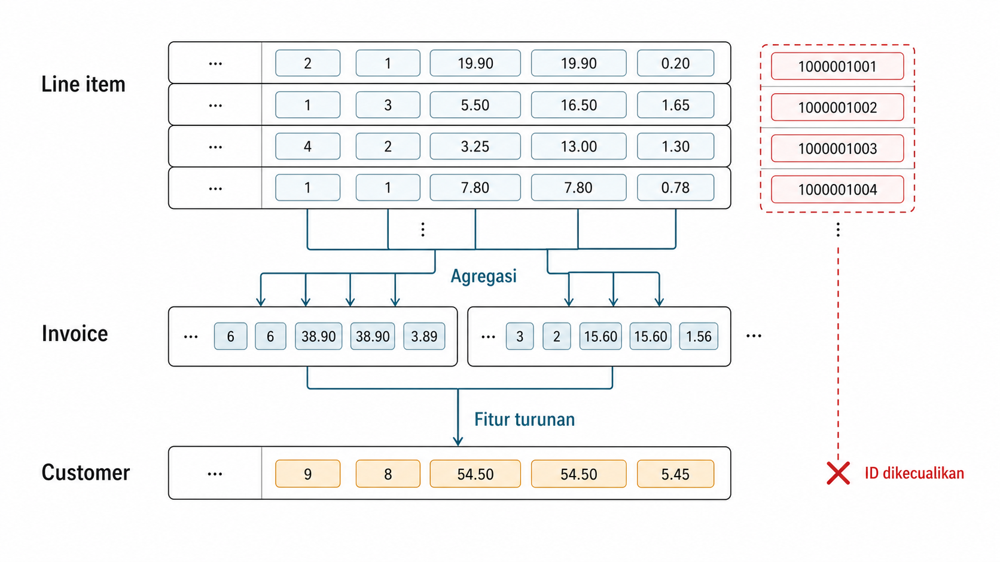
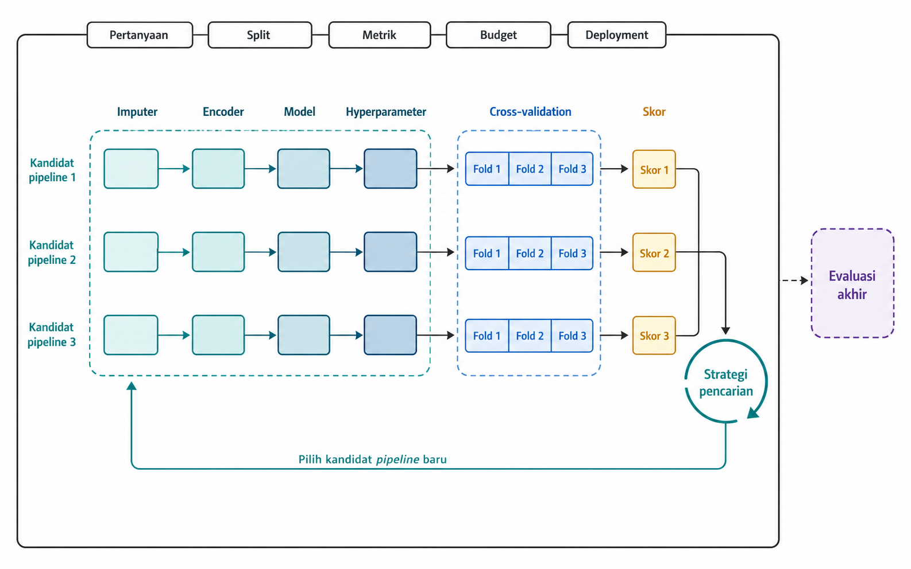
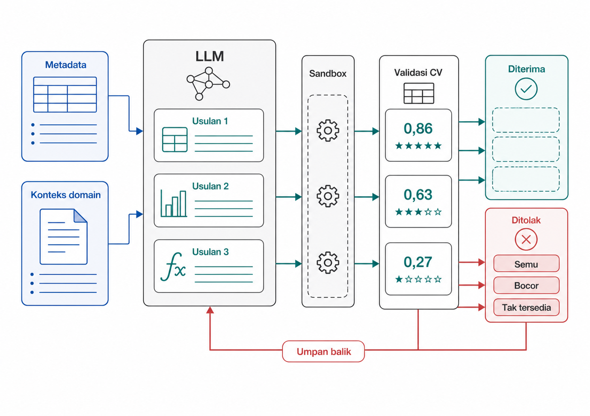
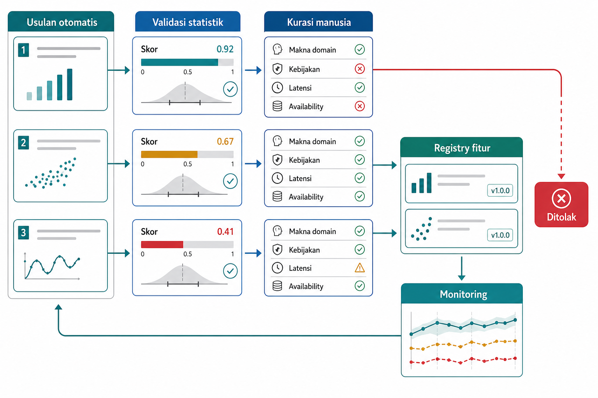

# Rekayasa Fitur Otomatis dan Kolaborasi Manusia-AI

Rekayasa fitur otomatis berbeda dari representasi yang dipelajari mesin. Pada otomasi, manusia masih menentukan skema data, operasi primitif yang boleh dipakai, batas waktu, metrik evaluasi, dan kriteria penerimaan. Mesin memperluas ruang kandidat, tetapi tidak menggantikan keputusan desain. Otomasi dapat mempercepat pembentukan fitur dari tabel relasional dan log peristiwa, tetapi juga dapat mempercepat kesalahan jika kandidat tidak dikurasi. Fitur yang tampak kuat secara numerik dapat ditolak karena tidak tersedia pada waktu prediksi, terlalu mahal dihitung, atau membawa kebocoran.

Bab ini membahas tiga keluarga otomasi. Deep Feature Synthesis menyusun fitur dari tabel relasional dengan pengendali *cutoff* dan kedalaman maksimum. AutoML mencari pipeline, model, dan hyperparameter secara otomatis. Model bahasa generatif mengusulkan fitur semantik dari metadata domain. Bab ini menguraikan bahwa keterampilan yang bertahan adalah merancang ruang pencarian, memasang batas, membaca hasil, dan mengkurasi kandidat. Otomasi memperbesar ruang kandidat, bukan menghapus tanggung jawab desain.

## Deep Feature Synthesis dan Ruang Pencarian Fitur

Contoh kerja pertama pada bab ini memakai Online Retail, yaitu catatan transaksi sebuah toko *online*. Setiap baris mencatat satu item dalam *invoice*, dengan identitas pelanggan, waktu transaksi, jumlah barang, dan harga unit. Struktur relasional ini membuat fitur dapat diringkas dari transaksi ke pelanggan.

Contoh ini paling langsung masuk ke keluarga pertama: fitur relasional yang disusun dari transaksi ke pelanggan. Deep Feature Synthesis, atau DFS (Kanter and Veeramachaneni 2015), menghasilkan fitur dengan menyusun primitive di atas data relasional dan temporal. Dalam ekosistem seperti Featuretools, beberapa tabel dipetakan ke dalam EntitySet: pada Online Retail, entitas dapat berupa pelanggan, invoice, dan baris item. Relasi antar tabel menentukan bagaimana informasi anak diringkas ke entitas induk.

Aggregation primitives merangkum banyak record anak menjadi satu nilai untuk entitas induk. Contohnya, jumlah invoice per pelanggan, total nilai pembelian, rata-rata nilai invoice, jumlah stok unik, atau jumlah invoice dalam 90 hari terakhir. Transform primitives mengubah nilai dalam konteks satu entitas atau waktu, seperti mengambil bulan dari `InvoiceDate` atau menghitung selisih hari sejak pembelian terakhir.

Kekuatan DFS muncul ketika primitive ditumpuk. Kolom mentah dapat dibaca sebagai depth 0. Pada depth 1, sistem dapat menghasilkan `SUM(line_items.gross_value)` per pelanggan. Pada depth 2, hasil per pelanggan itu dapat diringkas lagi ke level negara atau cohort, misalnya `MEAN(SUM(line_items.gross_value))` per `Country`. Secara umum:

$$h^{(d)} = \phi\big(h^{(d-1)}\big)$$

Dalam rumus tersebut, $h^{(d)}$ adalah fitur pada *depth* $d$, dan $\phi$ adalah *primitive* yang diterapkan pada fitur *depth* sebelumnya. Notasi $\phi$ mewakili satu *primitive* pada satu lintasan fitur. Dalam praktiknya, DFS menerapkan banyak *primitive* berbeda secara paralel pada setiap *depth*, sehingga jumlah fitur bertambah dengan cepat. Rekursi ini menjadi sumber kekuatan sekaligus sumber ledakan.

Gambar 16.1 memperlihatkan entity tree sederhana. Primitive bergerak naik dari baris item ke invoice, lalu ke pelanggan atau negara. Cabang tertentu perlu ditutup jika kolomnya tidak bermakna untuk operasi matematis.

{#fig-ch16-fig-1}

DFS membutuhkan schema, relasi antar tabel, target dataframe, time index, *cutoff*, daftar primitive, dan maximum depth. Tanpa itu, mesin tidak tahu apa yang sah. Ia juga tidak punya akal domain. Jika sebuah kolom bertipe numerik, sistem dapat saja menghitung rata-rata kode pos atau maksimum nomor telepon. Angka itu valid secara komputasi, tetapi tidak bermakna sebagai fitur.

Karena itu, ruang pencarian harus diberi rem. Pertama, batasi depth agar fitur tidak meledak jumlahnya. Kedua, exclude variable yang tidak boleh diperlakukan sebagai angka, seperti ID, nomor telepon, atau kode administratif. Ketiga, tegakkan *cutoff* agar hanya histori sebelum waktu prediksi yang dipakai. Aturan point-in-time dari Bab 6 tetap berlaku. Automation dengan *cutoff* yang salah tidak mengurangi leakage; ia hanya menghasilkan leakage lebih cepat. DFS memperlihatkan otomasi pada level fitur relasional; langkah berikutnya memperluas pencarian ke seluruh pipeline preprocessing dan model.

## AutoML dan Pipeline Fitur Otomatis

Jika DFS fokus pada pembentukan fitur dari skema relasional, AutoML (Feurer et al. 2015) mencari pipeline yang lebih luas. Objek yang dicari bisa mencakup imputation, encoding, feature transformation, model selection, hyperparameter, ensembling, dan kadang feature selection. Satu kandidat pipeline dapat memakai median imputation, target encoding, dan gradient boosting. Kandidat lain dapat memakai k-NN imputation, scaling, dan SVM. Ribuan rakitan seperti ini dibandingkan melalui validasi.

Nilai AutoML adalah mengurangi pekerjaan pencarian rutin dan memberi baseline kuat (Erickson et al. 2020). Sistem AutoML yang dirancang baik dapat menjaga transformasi tetap di dalam *fold* jika strategi *split* dan *pipeline* dikonfigurasi dengan benar. AutoML tidak otomatis menjamin pemisahan temporal atau grup yang sesuai deployment. Kemampuan menjaga batas *fold* itu bagian dari nilai teknisnya, bukan hanya kenyamanan.

Namun, AutoML tetap bekerja di bawah batas yang diberikan manusia. Prediction question, unit, split strategy, metric, time budget, fairness constraint, privacy constraint, dan deployment requirement harus ditentukan lebih dulu. Jika split bocor, AutoML akan mengoptimalkan kebocoran itu dengan sangat rajin.

Gambar 16.2 menunjukkan loop pencarian AutoML. Kandidat pipeline dirakit dari menu komponen, dievaluasi dengan cross-validation, lalu skor memberi sinyal ke strategi pencarian untuk memilih kandidat berikutnya.

{#fig-ch16-fig-2}

Risikonya ada dua. Pertama, *spurious search hits*. Jika ribuan *pipeline* dicoba pada *fold* yang sama, sebagian dapat cocok dengan skor validasi karena kebetulan, bukan karena generalisasi. Skor inner-CV boleh memandu pencarian, tetapi tidak boleh dilaporkan sebagai estimasi performa final yang tidak bias. Gunakan *nested cross-validation* atau *final holdout* yang dikunci dan tidak ikut memandu pencarian untuk estimasi akhir. Ini versi industri dari peringatan Bab 2 tentang *fishing*. Kedua, *semantic blindness*. Sistem dapat memilih transformasi yang kuat secara statistik tetapi salah makna, misalnya memperlakukan *missing sensor value* sebagai *noise* padahal mesin memang sengaja dimatikan.

AutoML juga dapat membakar compute budget, menghasilkan pipeline yang sulit dijelaskan, atau memilih ensemble yang mahal dipelihara. Ketika skor sudah plateau, menambah jam pencarian sering tidak membantu. Bottleneck biasanya pindah ke kualitas data, definisi target, atau representasi. Di titik itu, manusia perlu kembali merancang fitur, bukan hanya memperpanjang search. Salah satu bentuk rancangan baru adalah meminta LLM mengusulkan fitur yang lebih semantik daripada sekadar kombinasi primitive atau pipeline.

::: {.pendalaman}

Pendalaman

### Optimasi Bayesian di balik pencarian pipeline {.pendalaman-title .unnumbered .unlisted}

Daripada mencoba semua konfigurasi atau memilih acak, banyak AutoML framework memodelkan landscape skor melalui Gaussian process surrogate dan memilih konfigurasi berikutnya dengan acquisition function. Posterior dari surrogate memberikan distribusi prediktif $f(x)$, bukan sekadar satu nilai, sehingga ketidakpastian turut diperhitungkan. Salah satu acquisition function yang umum adalah Expected Improvement: $EI(x) = \mathbb{E}\big[\max(f(x) - f(x^{+}),\ 0)\big]$. Di sini $x$ adalah konfigurasi kandidat, $f(x)$ adalah variabel acak dari posterior surrogate yang menyatakan skor yang diperkirakan beserta ketidakpastiannya, dan $f(x^{+})$ adalah skor terbaik sejauh ini. Intuisinya, sistem menyeimbangkan eksplorasi wilayah yang belum pasti dengan eksploitasi wilayah yang tampak menjanjikan. Gagasan ini juga muncul pada hyperparameter tuning umum.
:::

## GenAI untuk Usulan Fitur dan Risiko Fitur Semu

Ketika DFS dan AutoML mulai dibatasi oleh primitive serta menu pipeline, GenAI atau LLM menambahkan sesuatu yang tidak dimiliki keduanya: kemampuan memakai makna bahasa. Jika metadata menyebut `InvoiceDate`, `Quantity`, `UnitPrice`, dan `CustomerID`, LLM dapat mengusulkan recency, nilai pembelian, atau frekuensi invoice. DFS mungkin hanya melihat kolom numerik dan mencoba kombinasi primitive. AutoML mungkin hanya mencoba transformasi pipeline. LLM dapat membaca nama kolom, deskripsi, dan konteks domain, lalu mengusulkan fitur semantik.

CAAFE adalah contoh pendekatan *context-aware* yang memakai LLM untuk mengotomatisasi usulan rekayasa fitur pada data tabular. Salah satu pilihan implementasinya adalah memakai metadata seperti nama kolom, tipe, deskripsi, dan ringkasan konteks, bukan baris mentah. Pilihan ini dapat membatasi paparan data sensitif, tetapi bukan jaminan inheren CAAFE: metadata dan ringkasan pun dapat memuat informasi sensitif, sehingga kontrol akses, redaksi, dan kebijakan pengiriman data tetap diperlukan.

Janji utamanya adalah ideasi. LLM dapat mengusulkan rasio, recency feature, interaction, grouping, atau transformasi domain yang tidak ada dalam primitive library. Pada Online Retail, ia dapat mengusulkan jarak waktu sejak invoice terakhir, rata-rata nilai per item, proporsi return, variasi stok yang dibeli, atau fitur kalender dari bulan invoice.

Risikonya seimbang besar. LLM belajar dari co-occurrence tekstual di corpus, bukan dari sinyal statistik dalam dataset kita. Rasio yang terdengar ilmiah dapat tidak berkorelasi dengan target. Transformasi yang tampak cerdas dapat memakai tanggal setelah outcome, kategori turunan dari target, atau proxy sensitif. Kode yang dihasilkan dapat salah, mahal dihitung, atau sulit dipelihara. Jalankan kode transformasi dalam *sandbox* dengan dependensi yang dibatasi, lalu uji dan tinjau sebelum menyentuh data nyata. Karena itu, usulan LLM adalah kandidat, bukan fakta.

Gambar 16.3 memperlihatkan loop proposal. Metadata masuk ke LLM, usulan fitur dieksekusi dan dievaluasi, lalu hasilnya memberi umpan balik ke putaran prompt berikutnya. Kandidat yang semu, bocor, atau tidak tersedia masuk ke reject bin.

{#fig-ch16-fig-3}

Tabel 16.1 membandingkan tiga keluarga otomasi fitur. Gunakan tabel ini untuk membaca apa yang sebenarnya diotomasi dan apa yang tetap harus disediakan manusia.

::: {.tabel-buku}

| Keluarga | Apa yang diotomasi | Butuh dari manusia | Risiko khas |
| --- | --- | --- | --- |
| DFS | Komposisi primitive atas skema relasional | Skema, primitive, *cutoff*, depth | Ledakan fitur, leakage temporal |
| AutoML | Pencarian pipeline preprocessing dan model | Pertanyaan, split, metric, anggaran | Spurious hits, pipeline sulit dirawat |
| GenAILLM | Usulan fitur semantik dan kode | Konteks domain, gerbang validasi | Fitur semu, kode invalid, proxy sensitif |

: Tiga keluarga otomasi fitur {#tbl-ch16-7}

:::

Setiap fitur usulan perlu diperiksa availability, leakage, correctness, cost, dan dampak kebijakan. Sistem baru kadang menambahkan reasoning trace pada setiap transformasi agar manusia dapat membaca rationale, bukan hanya skor. Tetapi rationale pun harus diaudit; kalimat yang masuk akal belum tentu fitur yang sah. Karena itu, putaran proposal harus berakhir pada workflow human-in-the-loop, bukan pada penerimaan otomatis.

::: {.pendalaman}

Pendalaman

### LLM sebagai pengoptimal evolusioner {.pendalaman-title .unnumbered .unlisted}

Arah riset terbaru memperlakukan rekayasa fitur sebagai *program search*. LLM mengusulkan *script* transformasi, evaluator menjalankannya, lalu nilai marginalnya diukur dengan delta-CV: $\text{Fitness}(f) = \text{CV}(\mathcal{M},\ X \cup \{f\},\ Y) - \text{CV}(\mathcal{M},\ X,\ Y)$, dengan $\mathcal{M}$ sebagai model baseline, $X$ sebagai kumpulan fitur saat ini, $Y$ sebagai target, dan $\text{CV}(\cdot)$ sebagai skor validasi silang. Skor itu kembali ke konteks LLM, sehingga putaran berikutnya dapat memutasi dan menggabungkan program yang lebih baik. Polanya mirip *genetic algorithm* dengan LLM sebagai *mutation operator*. Namun, *quality control* utama tetap pada *fitness gate*; LLM hanya memperlebar *funnel* kandidat.
:::

## Human-in-the-Loop: Validasi dan Kurasi Fitur Usulan Mesin

Setelah tiga keluarga otomasi terlihat, bagian pentingnya adalah gerbang penerimaan. Rekayasa fitur *human-in-the-loop* (Amershi et al. 2014) berarti manusia tidak hanya hadir di akhir untuk membaca *leaderboard*. Manusia mendefinisikan ruang kerja sejak awal: unit, target, *cutoff*, *split*, metrik, operator yang diizinkan, batas *latency*, dan fitur yang dilarang. Mesin kemudian mengeksplorasi kandidat dalam koridor itu. Manusia kembali sebagai kurator, membaca skor sekaligus alasan, risiko, dan kelayakan operasional.

Workflow yang baik dimulai dari definisi task. Setelah itu, kandidat fitur dibuat secara otomatis oleh DFS, AutoML, LLM, atau kombinasi. Kandidat pertama disaring secara keras: bocor, tidak tersedia, mahal dihitung, melanggar kebijakan, atau tidak masuk akal secara semantik. Kandidat yang lolos diuji dengan ablation, stability check, dan validasi yang sesuai split. Fitur yang diterima dan ditolak sama-sama didokumentasikan, karena keputusan penolakan sering sama pentingnya dengan keputusan penerimaan.

Tabel 16.2 merangkum pembagian peran manusia dan mesin. Baris-barisnya menunjukkan bahwa mesin paling kuat pada eksplorasi dan ranking, sedangkan manusia memegang definisi, batas, kurasi, dan tanggung jawab. Gunakan tabel ini sebagai audit sederhana: jika sebuah tahap penting tidak punya pemilik manusia, workflow otomasi belum aman.

::: {.tabel-buku}

| Tahap | Manusia | Mesin |
| --- | --- | --- |
| Definisi masalah | Menentukan unit, target, *cutoff*, metric | - |
| Ruang pencarian | Menetapkan batasan, primitive, DSL | Mengeksekusi aturan yang diizinkan |
| Eksplorasi dan pengujian | Menyediakan split dan kriteria | Membuat kandidat, CV, ranking |
| Kurasi | Menilai kelayakan semantik, kepatuhan, latency | Menyajikan skor dan trace |
| Dokumentasi dan monitoring | Mengelola siklus hidup fitur: keputusan penerimaan, pemilik, pemantauan drift | Menghasilkan log, laporan, alert; mendeteksi anomali |

: Pembagian peran manusia-mesin {#tbl-ch16-8}

:::

Gambar 16.4 menggambarkan gerbang kerja tersebut. Perhatikan dua gate: statistical validation dan human curation. Fitur yang lulus skor tetapi gagal kebijakan tetap ditolak.

{#fig-ch16-fig-4}

Apa yang hanya dapat ditangkap kurator? Pertama, fitur yang sangat kuat tetapi tidak punya dasar rasional, sehingga kemungkinan spurious. Kedua, fitur yang lolos pemeriksaan row-level tetapi mustahil dihitung dalam latency produksi. Ketiga, fitur yang secara statistik membantu tetapi merekonstruksi protected attribute melalui proxy, seperti pelajaran Bab 9.

Pada audit Online Retail, automated synthesis menghasilkan banyak kandidat. Beberapa tampak sangat dominan karena sebenarnya membaca masa depan, misalnya hitungan invoice positif dalam 60 hari setelah *cutoff* atau nilai belanja masa depan. Kandidat lain seperti `CustomerID` bisa dihitung, tetapi tidak bermakna sebagai angka yang boleh dirata-ratakan atau dibandingkan jaraknya. Fitness function melihat skor tinggi; manusia melihat temporal leak atau semantic misuse. Perbaikannya bukan sekadar membuang satu fitur, tetapi menutup keluarga fitur serupa dan memperketat konfigurasi *cutoff*.

Inilah batas dan kekuatan kolaborasi manusia-AI. Automation tetap berada di wilayah representasi yang dirancang manusia ketika manusia menentukan primitive, constraint, DSL, dan acceptance rule. Mesin memperluas pencarian; manusia menjaga makna, ketersediaan, kebijakan, dan deployment. Bab 17 menutup buku dengan prinsip yang lebih umum: alat boleh berubah, tetapi pipeline dan evaluasi harus tetap dirancang dengan disiplin.

::: {.sintesis-bab}

## Sintesis Bab {.unnumbered .unlisted}

Benang merah Bab 16 adalah bahwa rekayasa fitur otomatis memperbesar ruang kandidat, bukan menghapus tanggung jawab desain. DFS menyusun primitive pada skema relasional, AutoML mencari pipeline di bawah metric dan split yang diberikan, sedangkan GenAI mengusulkan fitur semantik dari metadata dan konteks. Tabel 16.1 membantu membedakan apa yang diotomasi oleh masing-masing keluarga.

Risiko utamanya juga berbeda: ledakan fitur dan leakage temporal pada DFS, spurious search hits dan pipeline sulit dirawat pada AutoML, serta fitur semu, kode invalid, dan proxy sensitif pada LLM. Tabel 16.2 merangkum pembagian kerja yang sehat: manusia mendesain koridor dan mengurasi, mesin mengeksplorasi dan meranking. Dua tabel itu perlu dibaca bersama: keluarga otomasi menentukan kandidat yang muncul, sedangkan pembagian peran menentukan siapa yang boleh menerimanya.

Pesan bab ini sederhana. Otomasi yang baik bukan "sekali klik lalu selesai", melainkan kolaborasi yang diberi batas. Semakin kuat mesin menghasilkan kandidat, semakin penting manusia mendefinisikan masalah, split, *cutoff*, metric, dan acceptance rule.
:::

## Bacaan Lanjutan {.bacaan-lanjutan .unnumbered .unlisted}

- Featuretools (Kanter & Veeramachaneni 2015, DSAA) --- <https://featuretools.alteryx.com/>. Deep Feature Synthesis otomatis.

- auto-sklearn (Feurer dkk. 2015) --- <https://automl.github.io/auto-sklearn/>. AutoML termasuk praproses fitur.

- CAAFE (Hollmann dkk. 2023) --- <https://arxiv.org/abs/2305.03403>. Rekayasa fitur berbantuan LLM yang context-aware.

- LLM-FE (Abhyankar dkk. 2025) --- <https://arxiv.org/abs/2503.14434>. Fitur yang diusulkan LLM dengan evaluasi terukur.

- scikit-learn --- Common Pitfalls --- <https://scikit-learn.org/stable/common_pitfalls.html>. Menjaga fitting per-fold pada pipeline otomatis.

- Shahriari dkk. (2016), Bayesian Optimization (Proc. IEEE) --- <https://doi.org/10.1109/JPROC.2015.2494218>. Dasar optimisasi hiperparameter.

## Rujukan {.rujukan .unnumbered .unlisted}

::: {.references}

Amershi, Saleema, Maya Cakmak, W. Bradley Knox, and Todd Kulesza. 2014. "Power to the People: The Role of Humans in Interactive Machine Learning." *AI Magazine* 35 (4): 105--20.

Erickson, Nick, Jonas Mueller, Alexander Shirkov, et al. 2020. *AutoGluon-Tabular: Robust and Accurate AutoML for Structured Data*. <https://arxiv.org/abs/2003.06505>.

Feurer, Matthias, Aaron Klein, Katharina Eggensperger, Jost Springenberg, Manuel Blum, and Frank Hutter. 2015. "Efficient and Robust Automated Machine Learning." *Advances in Neural Information Processing Systems (NeurIPS)*.

Kanter, James Max, and Kalyan Veeramachaneni. 2015. "Deep Feature Synthesis: Towards Automating Data Science Endeavors." *IEEE International Conference on Data Science and Advanced Analytics (DSAA)*. <https://doi.org/10.1109/DSAA.2015.7344858>.

:::
