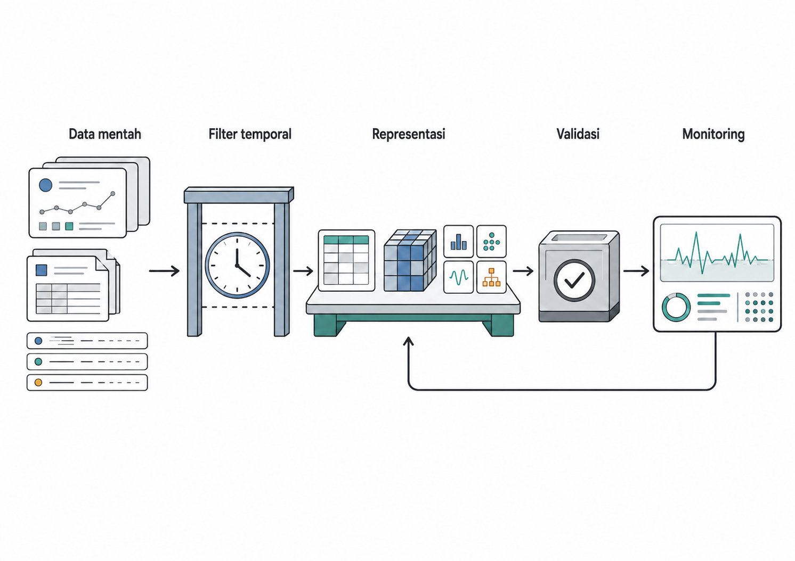
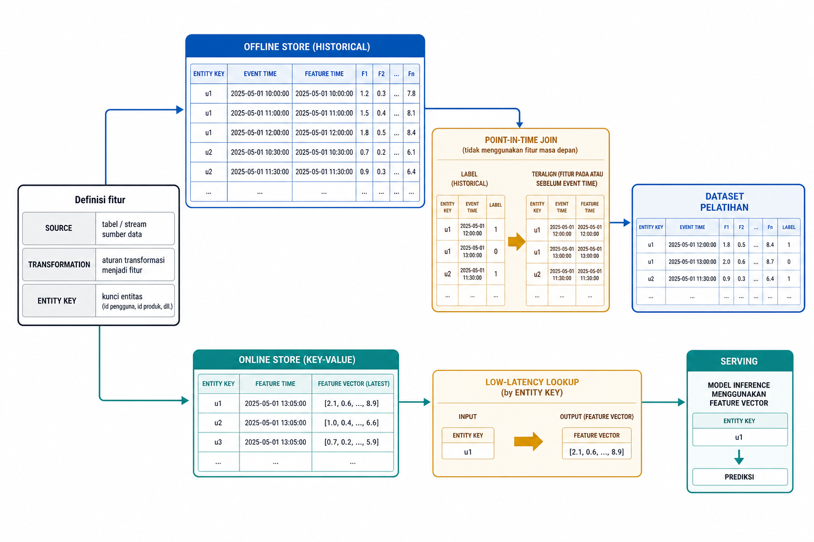
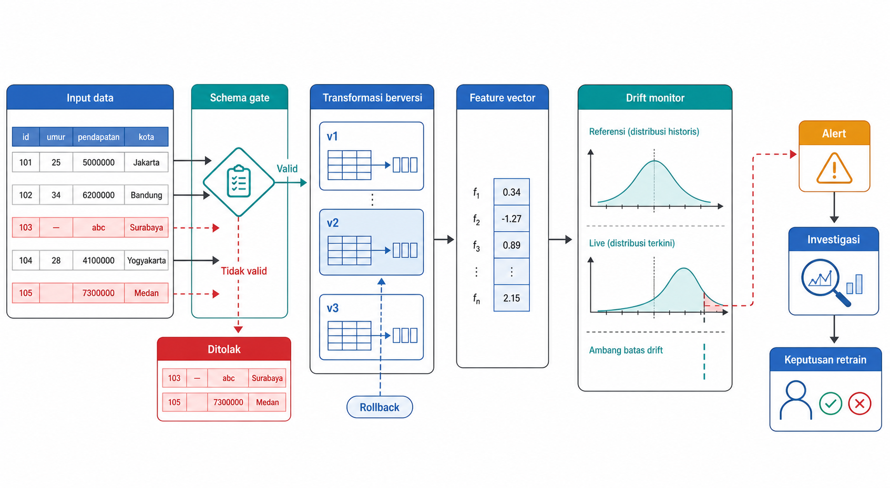
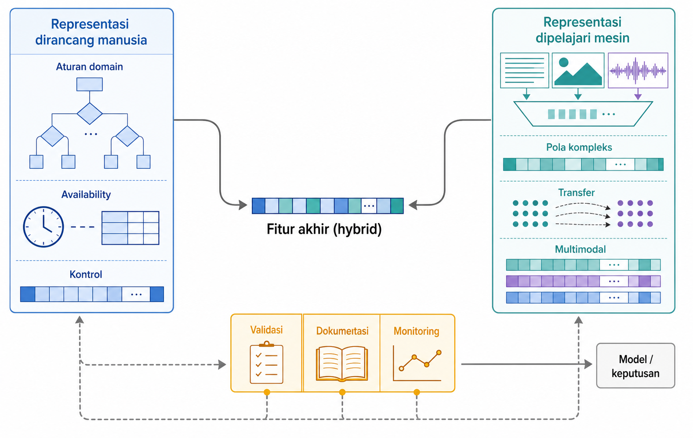

# Sintesis: Merancang Pipeline dan Prinsip yang Bertahan Lama

Rekayasa fitur sering tampak seperti kumpulan teknik yang terpisah, mulai dari penskalaan, pengodean, lag, embedding, centrality graf, hingga AutoML. Setelah enam belas bab, gambaran yang lebih penting seharusnya terlihat. Fitur adalah keputusan representasi yang hidup di dalam pipeline. Keputusan itu harus cocok dengan tujuan prediksi, tersedia pada waktu prediksi, mengikuti pemisahan data, dapat dipelihara, dan terbukti membantu melalui validasi.

Bab penutup ini mengubah isi buku menjadi kerangka kerja, dimulai dari pertanyaan paling awal, yaitu apa yang akan diprediksi dan kapan informasi tersedia, menuju pertanyaan operasional tentang konsistensi pelatihan-inferensi, validasi skema, versioning, dan pemantauan perubahan data (drift). Peta keputusan representasi, kebocoran, dan validasi lintas tipe data disajikan sebagai rujukan cepat. Bab ini menguraikan dua prinsip penutup, yaitu mulai dari masalah, ketersediaan, dan pemisahan data sebelum membuat fitur, serta validasi mengalahkan jumlah fitur.

## Kerangka Desain: dari Tujuan Prediksi ke *Pipeline* Final

Proyek rekayasa fitur yang baik tidak dimulai dari teknik favorit. Ia dimulai dari tujuan prediksi. Apa keputusan yang akan dibantu model? Apa konsekuensi salah prediksi? Kapan prediksi dibuat? Data apa yang benar-benar tersedia pada waktu itu?

Empat definisi menjadi tulang punggung masalah sebelum satu baris transformasi dibuat: unit analisis, target, horizon, dan *cutoff*. Unit menjawab satu baris mewakili apa: pelanggan per bulan, transaksi, sesi pemeriksaan, produk per minggu, atau node dalam graf. Target menjawab apa yang diprediksi. Horizon menjawab seberapa jauh ke depan. *Cutoff* menjawab batas informasi yang sah sebelum prediksi.

Kesalahan di tahap ini tidak dapat diperbaiki oleh fitur yang canggih. Jika target salah dirumuskan, model mengoptimalkan masalah yang salah. Jika *cutoff* kabur, leakage masuk lewat pintu belakang. Jika unit terlalu kasar atau terlalu halus, fitur menjadi tidak stabil.

Setelah itu, pilih *split* yang meniru deployment. *Random split* cocok ketika baris dapat dipertukarkan di bawah protokol penggunaan. Entitas berulang bukan otomatis *leakage*: untuk memprediksi masa depan pelanggan yang sudah dikenal, gunakan evaluasi temporal dan fitur *point-in-time*; gunakan *group split* jika deployment menuntut generalisasi ke pelanggan baru. Demikian pula, kedekatan lokasi atau *edge* lintas *train-test* tidak otomatis bocor. Gunakan *spatial block*, buffer, evaluasi *transductive*, *inductive split*, atau *temporal graph split* sesuai lokasi, hubungan, dan informasi yang benar-benar tersedia saat inferensi. Pada masalah nyata, *split* bisa *hybrid*.

Baru setelah itu kita memilih sumber fitur dan struktur representasi: tabular, sequence, teks, citra, audio, spasial, graf, atau multimodal. Dari struktur itu muncul transformasi yang sesuai: *scaling*, *encoding*, *derived features*, *selection*, *dimensionality reduction*, *embeddings*, *pretrained encoders*, atau *automated feature proposals*. *Baseline* harus hadir sebelum kompleksitas bertambah.

Gambar 17.1 merangkum seluruh kerangka buku sebagai satu band desain. Diagram ini dapat dibaca sebagai checklist awal setiap proyek.

{#fig-ch17-fig-1}

Contoh mikro: sistem credit approval. Tujuannya memperkirakan default risk. Unitnya satu loan application. Targetnya default dalam 12 bulan. *Split*-nya temporal berdasarkan tanggal aplikasi. Hanya setelah ini agregat histori pembayaran, rasio pendapatan, dan fitur perilaku diuji terhadap *baseline* logistic regression. Urutan ini tampak sederhana, tetapi ia mencegah banyak kesalahan yang tidak terlihat jika proyek dimulai dari teknik.

*Pipeline* final harus mereproduksi transformasi pelatihan pada *inference*. Ia menyimpan *fitted state*, urutan transformasi, daftar fitur, versi encoder, dan keputusan *cutoff*. Dokumentasi bukan pekerjaan administratif belakangan; ia adalah cara agar representasi dapat dipercaya ulang. Kerangka desain ini baru kuat jika definisi yang sama bertahan saat model masuk ke *inference*.

## Konsistensi Training-Inference dan Training-Serving Skew

Kerangka desain baru sah jika definisi yang dibuat saat pelatihan bertahan saat model melayani prediksi (Sculley et al. 2015). *Training-inference consistency* berarti definisi fitur dan logika transformasi sama saat pelatihan, validasi, dan *serving*. Ini kontrak Bab 2, tetapi pada skala sistem. Jika pelatihan memakai satu cara menghitung fitur dan produksi memakai cara lain, model tidak lagi melihat distribusi yang sama.

*Training-serving skew* sering muncul diam-diam. *Reimplementation drift* terjadi ketika logika eksperimen di Python ditulis ulang di backend lain dengan aturan rounding, null handling, atau timezone yang berbeda. *Live recomputation* terjadi ketika produksi menghitung ulang statistik dari *streaming* data, padahal pelatihan memakai statistik beku dari *training split*. Tidak selalu ada error log. Prediksi hanya menurun diam-diam.

*Fitted transformation* harus menyimpan state: rata-rata dan standard deviation scaler, nilai imputasi, kategori encoder, *vocabulary*, *selected features*, version model, version tokenizer, dan version *embedding*. *Feature availability* juga tidak bisa ditawar. Jika fitur hanya ada setelah keputusan dibuat, fitur itu invalid meskipun sangat prediktif.

Gambar 17.2 memperlihatkan pola *feature store*. Definisi fitur berada di pusat, lalu mengalir ke *offline store* untuk pelatihan historis dan *online store* untuk *serving* rendah latency.

{#fig-ch17-fig-2}

Pada skala kecil, *pipeline* yang diserialisasi dengan baik sudah mewakili gagasan yang sama: satu definisi, satu urutan transformasi, satu state yang dipakai ulang. Pada skala besar, definisi fitur dipusatkan agar tim pelatihan dan tim backend tidak menghitung fitur dengan logika berbeda.

Contohnya sederhana. Pelatihan memakai CSV yang sudah dibersihkan, tetapi produksi membaca database live dengan kode *missing value* yang berbeda. *Text vectorizer* di-*fit* pada korpus pelatihan, lalu *vocabulary* dan IDF yang sama harus dipakai ulang di produksi. Istilah "korpus lengkap" dalam konteks ini hanya boleh berarti seluruh korpus pelatihan yang sah, bukan validasi atau *test*. Kedua kasus ini bukan masalah model; ini masalah representasi yang tidak konsisten. Konsistensi juga perlu dijaga setelah sistem berjalan, melalui *schema validation*, *versioning*, dan *drift monitoring*.

::: {.pendalaman}

Pendalaman

### *Feature store*: satu definisi, dua mesin {.pendalaman-title .unnumbered .unlisted}

*Feature store* memusatkan definisi fitur dan membagi penyimpanan menjadi *offline store* untuk histori skala warehouse dan *online store* untuk *inference* rendah latency. Dua jaminan utamanya adalah *point-in-time-correct historical joins*, yaitu aturan *cutoff* Bab 1 dan Bab 6 yang dilembagakan, serta satu *serving interface* agar tim backend tidak mengimplementasikan ulang logika fitur. Untuk proyek kelas atau riset kecil, *pipeline* yang disimpan rapi adalah versi sederhana dari prinsip yang sama: definisi fitur tidak boleh bercabang diam-diam.
:::

## Schema Validation, Versioning, dan Drift

Konsistensi tidak cukup dijaga sekali saat model dikirim. *Pipeline* yang baik perlu gerbang produksi (Breck et al. 2017). *Schema validation* memeriksa apakah data masuk memiliki kolom, tipe, rentang, kategori, pola *missingness*, dan hubungan yang diharapkan. Tooling seperti TFDV, Great Expectations, atau pemeriksaan runtime bergaya Pandera berada dalam keluarga ini. Jika input melanggar kontrak, sistem sebaiknya memberi alert atau menolak *batch*, bukan diam-diam mengubah data menjadi bentuk yang salah.

*Transformation versioning* mencatat logika fitur, *fitted parameters*, model atau encoder version, dan data contract yang menghasilkan feature set. Nilai operasionalnya adalah rollback. Jika prediksi produksi tiba-tiba menyimpang, tim dapat kembali ke versi *pipeline* fitur terakhir yang stabil sambil menyelidiki penyebab. Tooling bergaya DVC mengikat code, data, dan model checkpoint agar perubahan dapat ditelusuri.

*Data drift* atau *covariate drift* berarti $P(X)$ berubah, sedangkan *concept drift* (Gama et al. 2014) berarti $P(Y\mid X)$ berubah. *Population shift* menamai perubahan komposisi populasi; dampaknya dapat terlihat sebagai perubahan $P(X)$ atau prevalensi label $P(Y)$ dan tidak otomatis berarti *concept drift*. Jika sensor baru mengganti rentang nilai, itu mungkin *data drift* mekanis. Jika komposisi pelanggan berubah setelah kebijakan baru, itu dapat menjadi *population shift*. Jika hubungan perilaku dengan target atau definisi target berubah, pemeriksaannya lebih mendasar.

Bab 9 sudah membahas PSI; di sini cukup diingat bahwa nilai besar, misalnya konvensi investigasi di atas 0,25, memicu pemeriksaan, bukan keputusan otomatis. Untuk *drift* multivariat pada fitur kontinu, ukuran jarak seperti *Wasserstein distance* dapat dipakai. Monitoring harus memprioritaskan fitur penting dan rapuh, bukan semua statistik dengan bobot sama.

Gambar 17.3 merangkum tiga *guardrail*. *Schema gate* menolak input cacat, *versioned transformation layer* menjaga rollback, dan *drift monitor* memberi alert yang harus diselidiki.

{#fig-ch17-fig-3}

Respons terhadap *drift* harus bertahap. Pertama, bedakan sebab mekanis dari perubahan populasi organik: sensor rusak, sync gagal, kategori baru, atau format input berubah. Teks masukan pengguna juga dapat berubah setelah kebijakan baru atau migrasi platform, misalnya formulir *online* yang diganti formatnya. Kedua, jika perubahan organik terbukti melewati toleransi dan memengaruhi performa, jadwalkan retraining dengan data terbaru. Jangan mematikan model otomatis hanya karena satu alert *drift* menyala. Dengan *guardrail* ini, kita dapat kembali ke pertanyaan desain: representasi apa yang wajar untuk tipe data dan batas operasional tertentu?

::: {.pendalaman}

Pendalaman

### Memantau performa tanpa label: estimasi berbasis keyakinan {.pendalaman-title .unnumbered .unlisted}

Masalah monitoring paling sulit adalah label produksi sering terlambat minggu atau bulan. Estimator modern mencoba memprediksi dampak performa dari *drift* yang terlihat, memakai distribusi input dan *confidence* model sebelum label tiba. *Confidence-based performance estimation* dan *direct loss estimation*, misalnya, memperkirakan apakah AUC atau loss sedang memburuk. Ini estimasi dengan asumsi, bukan pengukuran; salah satu asumsi pentingnya adalah *concept drift* tidak dominan. Nilainya adalah peringatan dini. Evaluasi berbasis label tetap menjadi penyelesaian akhir ketika ground truth tiba.
:::

## Peta Rute Lintas Tipe Data

Sebelum memilih modalitas, cabang pertama sering bersifat operasional: *batch* atau *streaming*. Agregat histori satu bulan mungkin wajar untuk scoring malam hari, tetapi mustahil untuk *serving* milidetik jika data harus dihitung ulang live. *Latency*, *freshness*, dan biaya sering memangkas menu fitur sebelum teknik dipilih.

Peta rute pada bagian ini melengkapi peta operasi yang sudah dibangun sejak awal buku. Bab 3-9 membantu menjawab apa yang dilakukan terhadap fitur: *scaling*, *encoding*, imputasi, agregasi, seleksi, reduksi, dan evaluasi. Bagian ini membantu menjawab bentuk data apa yang sedang dihadapi: tabular, deret waktu, teks, citra, audio, spasial, graf, atau multimodal. Dalam proyek nyata, dua peta ini dipakai bersama.

Setelah itu, cocokkan representasi dengan tipe data, model, ukuran data, interpretabilitas, compute, dan deployment constraint. Tabel 17.1 adalah router lintas bab. Ia tidak memilihkan model secara otomatis, tetapi membantu pembaca bertanya: representasi awal apa yang wajar, *leakage* apa yang paling mungkin, dan kapan representasi yang dipelajari mesin layak dicoba? Bacalah tabel ini dari kiri ke kanan: mulai dari situasi data, pilih representasi awal yang tidak berlebihan, lalu cek risiko evaluasi sebelum mencoba representasi yang lebih kompleks atau lebih bergantung pada pembelajaran mesin.

::: {.tabel-buku}

| Situasi data | Representasi awal yang wajar | Risiko leakage utama | Catatan evaluasi | Kapan representasi dipelajari membantu |
| --- | --- | --- | --- | --- |
| Tabular klasik | Numericcategorical *encoding*, *missing indicators*, *derived features* | *Preprocessing* di-*fit* sebelum *split*, *target leakage* | *Baseline* sederhana dan *ablation* kelompok fitur | Jika *row embedding* diperlukan atau data sangat besar |
| Deret waktusensor | Window, lag, rolling, differencing, frequency features | *Look-ahead*, target-window overlap, label belum tersedia | *Temporal split*; gap hanya jika overlapavailability memerlukannya | Jika pola sekuensial kompleks dan data cukup |
| Teks | *TF-IDF baseline*, *embedding*, *frozen extractor* | *Vocabulary* atau IDF di-*fit* pada seluruh corpus | Bandingkan *baseline sparse* dan *embedding* | Jika semantik, sinonim, dan konteks penting |
| Citraaudio | Penskalaan input, augmentasi, HOGspectrogram, *pretrained encoder* | Near duplicate, source *leakage*, augmentation invalid | *Source-aware* atau *group split* | Jika data visualaudio kaya dan label terbatas |
| Spasial | Jarak, region, proximity count, spatial lag | Label tetangga atau konteks ruang yang tidak tersedia; klaim wilayah baru dari *random split* | *Spatial block*buffer untuk wilayah baru; split lokal bila sesuai deployment | Jika *encoder* spasial pada citrageometri besar diperlukan, atau jika hubungan spasial kompleks memerlukan representasi yang dipelajari dari koordinat |
| Graf | Degree, centrality, aggregation, *node embedding* | Label tersembunyi, *future edge*, atau atribut yang tidak tersedia | *Transductive*, *inductive*, atau temporal sesuai protokol deployment | Jika struktur graf memberikan informasi prediktif yang sulit ditangkap oleh fitur *centrality* dan agregasi manual, misalnya melalui *node embedding* atau *message passing* pada GNN |
| Multimodal | *Alignment*, *fusion*, *missing-modality strategy* | Modalitas satu entitas terpisah antar-*split*, *future modality* | Groupentity split, *ablation* per modalitas | Jika *shared embedding* atau *fusion* yang dipelajari menambah nilai |

: Peta rute lintas tipe data {#tbl-ch17-6}

:::

Dua skenario menunjukkan cara membaca router. Pada retail demand forecasting, unitnya store x product x week. *Split* temporal menahan minggu terakhir sebagai test. Fitur rolling dihitung dari minggu $T{-}4$ sampai $T{-}1$, bukan minggu target. Risiko utamanya *look-ahead leakage*. Representasi sekuensial mungkin dicoba jika *baseline* lag dan rolling tidak cukup.

Pada multimodal medical severity, unitnya satu sesi pemeriksaan. X-ray masuk lewat *frozen CNN embedding*, dengan catatan bahwa encoder *pretrained* dari citra alami tidak selalu cocok untuk citra medis; verifikasi *domain fit* tetap diperlukan. *Lab features* diimputasi dan diberi *robust scaling*. Jika deployment menuntut generalisasi ke pasien baru, gunakan *patient-level group split* agar pasien yang sama tidak muncul di *train* dan *test*. Di domain seperti ini, auditability dapat membatasi penggunaan *black-box embeddings*, walaupun benchmark terlihat kuat. Pada credit dan health, governance dapat menjadi veto desain, bukan catatan tambahan. Dari router ini, prinsip akhirnya dapat diringkas menjadi dua kelompok: mulai dari masalah dan *split*, lalu buktikan bahwa representasi yang dipilih benar-benar bernilai.

## Prinsip I: Mulai dari Masalah, Ketersediaan, dan *Split*

Setelah router lintas tipe data memberi peta pilihan, prinsip payung pertama mengembalikan proyek ke awal: mulai dari masalah prediksi, bukan teknik favorit. Unit, target, horizon, *cutoff*, dan *split* harus jelas sebelum fitur dibuat. Jika pertanyaan salah, model yang akurat pun tidak membantu keputusan yang benar. Tiga subprinsip berikutnya merinci ketersediaan, batas *split*, dan tata kelola di bawah prinsip payung ini.

Subprinsip ketersediaan: fitur hanya valid jika tersedia saat prediksi. Availability tidak hanya berarti kolom itu ada di suatu tabel. Ia juga berarti segar, cukup cepat, dan sah untuk dipakai pada waktu keputusan. "Waktu login terakhir" yang disinkronkan malam hari dapat stale pada siang hari. Agregat yang butuh query mahal mungkin tersedia secara teoritis tetapi gagal latency produksi.

Subprinsip batas *split*: setiap transformasi atau statistik yang dipelajari dalam evaluasi terawasi harus mengikuti *split*. Bentuk finalnya singkat: *estimate on train, freeze, apply everywhere else*. Scaler, imputer, encoder yang dilatih lokal, *vocabulary*, *selected features*, PCA, dan threshold dipelajari dari sisi pelatihan yang sah, lalu diterapkan ke validasi, *test*, dan inferensi. *Retrieval index* berbeda dari transformasi tersebut: indeks boleh memuat korpus apa pun yang memang tersedia saat inferensi, termasuk item tak berlabel di luar *training split*, tetapi tidak boleh memuat dokumen masa depan atau metadata yang belum tersedia dalam protokol deployment.

Subprinsip tata kelola: privacy, proxy, dan data minimization adalah bagian dari kualitas fitur. Menghapus kolom sensitif tidak cukup jika postcode, delivery route, sekolah, atau perangkat dapat merekonstruksi atribut yang sama. Akurasi tidak otomatis membenarkan fitur. Jika sebuah fitur berisiko merugikan kelompok tertentu, menambah skor bukan akhir argumen; itu awal governance.

Contoh yang tampak kecil sering paling berbahaya. Fitur yang sangat prediktif tetapi tiba setelah keputusan harus ditolak. Fitur atribut kependudukan atau proxy-nya mungkin meningkatkan ranking model, tetapi memerlukan aturan penggunaan yang jelas, dokumentasi, dan kadang penolakan. Feature importance tinggi tidak sama dengan legitimasi.

Prinsip-prinsip ini terdengar sederhana karena diulang sepanjang buku. Justru karena sederhana, mereka mudah dilanggar ketika proyek mengejar skor. Dalam praktik, banyak kegagalan model bukan karena algoritmanya kurang modern, tetapi karena *cutoff* salah, *split* bocor, fitur tidak tersedia, atau transformasi tidak sama antara pelatihan dan *inference*. Kelompok prinsip berikutnya menutup sisi lain: bagaimana menilai jumlah fitur, kompleksitas, dan kombinasi representasi.

## Prinsip II: Validasi, Kombinasi Representasi, dan Jalan ke Depan

Setelah masalah dan *split* dikunci, prinsip payung kedua menahan godaan menambah fitur tanpa bukti. Lebih banyak fitur tidak otomatis lebih baik. Fitur tambahan dapat menambah *noise*, *leakage*, biaya, latency, dan risiko kebijakan. Validasi mengalahkan jumlah fitur. Setiap fitur kompleks atau representasi yang dipelajari mesin harus membayar tempatnya dengan bukti: peningkatan stabil terhadap *baseline*, ketersediaan yang jelas, biaya yang masuk akal, dan risiko yang dapat diterima.

Representasi yang dirancang manusia dan representasi yang dipelajari mesin bukan lawan. Bentuk hybrid dari Bab 15, $\mathbf{x}_{\text{final}} = [\phi_{\text{learned}} \parallel \phi_{\text{designed}}]$, dapat dibaca sebagai simbol penutup buku. Di sini $\phi_{\text{learned}}$ adalah vektor fitur dari representasi yang dipelajari mesin, $\phi_{\text{designed}}$ dari representasi yang dirancang manusia, dan $\parallel$ menyatakan operasi penggabungan vektor menjadi satu vektor fitur akhir $\mathbf{x}_{\text{final}}$. Mesin mengekstrak pola yang sulit dienumerasi manusia; fitur yang dirancang manusia mengikat model pada logika domain, batas waktu, dan pengetahuan yang jelas.

Automation juga bukan pengganti judgment. Bab 16 memberi rumus sosialnya: machine proposes, human disposes. Mesin memperluas kandidat, menjalankan evaluasi, dan memberi ranking. Manusia mendefinisikan target, *cutoff*, constraint, metric, dan alasan penerimaan. Tanpa dokumentasi, keputusan itu hilang; tanpa monitoring, keputusan itu membusuk.

Gambar 17.4 menutup sumbu buku. Di kiri ada representasi yang dirancang manusia, di kanan representasi yang dipelajari mesin. Keduanya dipertemukan oleh validasi dan dokumentasi.

{#fig-ch17-fig-4}

Tabel 17.2 adalah checklist akhir. Ia dirancang untuk dibaca sebelum proyek dimulai, saat feature review, dan sebelum model masuk produksi. Setiap baris memaksa satu pertanyaan yang harus bisa dijawab dengan bukti, bukan rasa yakin.

::: {.tabel-buku}

| Prinsip | Pertanyaan yang harus bisa dijawab |
| --- | --- |
| Mulai dari masalah | Apa unit, target, horizon, dan *cutoff*? |
| Ketersediaan | Apakah fitur ini ada, segar, dan cukup cepat saat prediksi? |
| Transformasi mengikuti *split* | Di mana transformasi ini di-fit, kapan dibekukan, dan ke mana diterapkan? |
| Kualitas melampaui importance | Apakah fitur tersedia, stabil, terjangkau, dan sah? |
| Validasi mengalahkan jumlah fitur | Apa *baseline*-nya, dan apa bukti fitur ini menambah nilai? |
| Privasi dan proxy | Siapa yang bisa dirugikan, dan lewat jalur proxy apa? |
| Dokumentasi dan monitoring | Siapa pemilik fitur, versinya apa, dan bagaimana kita tahu ia masih bekerja? |

: Daftar periksa prinsip yang bertahan lama {#tbl-ch17-7}

:::

Dokumentasi membuat rekayasa fitur tahan lama: definisi, sumber, *cutoff*, risiko, versi, pemilik, dan monitor. Tanpa itu, fitur yang bagus hari ini menjadi hutang teknis besok. Dengan itu, fitur dapat dievaluasi ulang ketika data berubah, model berganti, atau aturan bisnis bergerak.

Jalan ke depan bersifat hybrid. Manusia merumuskan masalah, memilih batas, dan menilai konsekuensi. Mesin belajar representasi, mengusulkan kandidat, dan mempercepat pencarian. *Pipeline* yang baik menyatukan keduanya di bawah validasi yang jujur. Dengan bahasa Bab 1, pekerjaan ini tetap tentang merancang $\phi(x_{\text{raw}})$: transformasi dari data mentah ke representasi yang sah, berguna, dan dapat dipelihara. Setiap proyek ML/DL seharusnya dapat menjawab: representasi apa yang kita pilih, mengapa, dan bagaimana kita tahu ia bekerja?

## Bacaan Lanjutan {.bacaan-lanjutan .unnumbered .unlisted}

- scikit-learn --- Common Pitfalls & Pipelines --- <https://scikit-learn.org/stable/common_pitfalls.html>. Disiplin pipeline untuk produksi.

- Sculley dkk. (2015), Hidden Technical Debt in ML Systems (NeurIPS) --- <https://papers.nips.cc/paper/2015/hash/86df7dcfd896fcaf2674f757a2463eba-Abstract.html>. Sumber sintesis utama untuk utang teknis ML.

- Gebru dkk. (2021), Datasheets for Datasets --- <https://arxiv.org/abs/1803.09010>. Dokumentasi asal dan batasan data.

- TensorFlow Data Validation --- <https://www.tensorflow.org/tfx/data_validation>. Validasi skema dan deteksi drift.

- Great Expectations --- <https://greatexpectations.io/>. Uji kualitas data sebagai kode.

- Evidently AI --- <https://docs.evidentlyai.com/>. Pemantauan drift data dan model.

- Feast --- <https://docs.feast.dev/>. Feature store: konsistensi latih--saji.

- ICO --- Data minimisation --- <https://ico.org.uk/for-organisations/uk-gdpr-guidance-and-resources/data-protection-principles/a-guide-to-the-data-protection-principles/the-principles/data-minimisation/>. Prinsip minimisasi data (privasi).

## Rujukan {.rujukan .unnumbered .unlisted}

::: {.references}

Breck, Eric, Shanqing Cai, Eric Nielsen, Michael Salib, and D. Sculley. 2017. "The ML Test Score: A Rubric for ML Production Readiness and Technical Debt Reduction." *IEEE International Conference on Big Data*.

Gama, João, Indrė Žliobaitė, Albert Bifet, Mykola Pechenizkiy, and Abdelhamid Bouchachia. 2014. "A Survey on Concept Drift Adaptation." *ACM Computing Surveys* 46 (4): 1--37.

Sculley, D., Gary Holt, Daniel Golovin, et al. 2015. "Hidden Technical Debt in Machine Learning Systems." *Advances in Neural Information Processing Systems (NeurIPS)*.

:::
